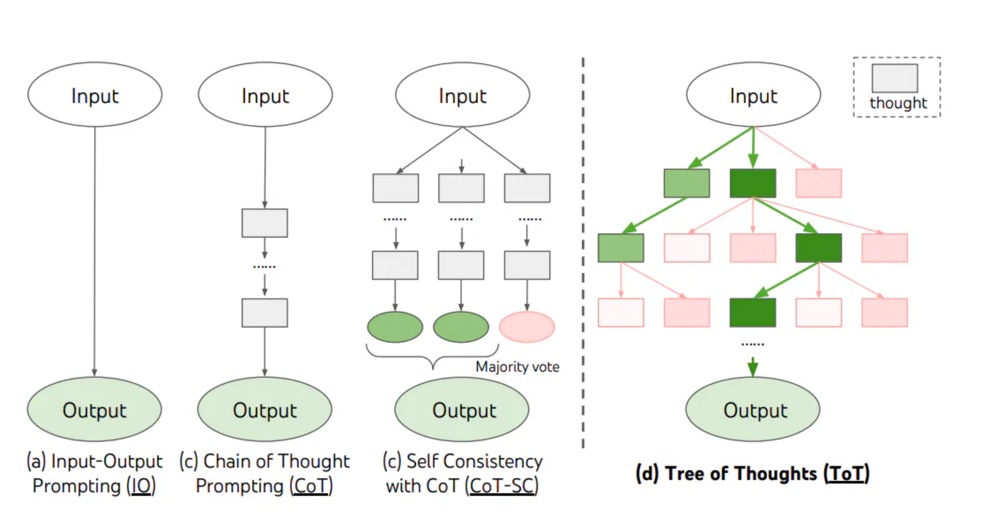
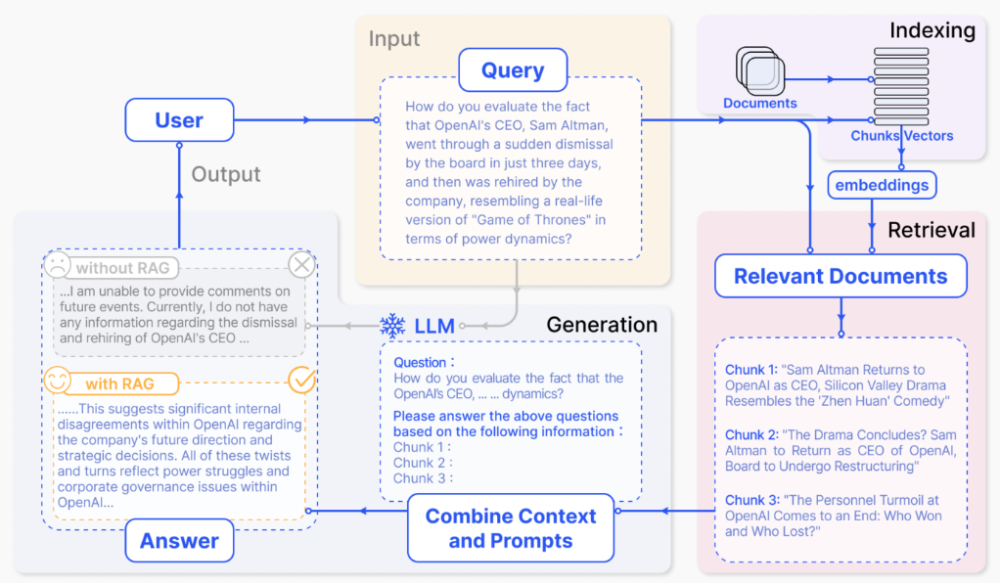
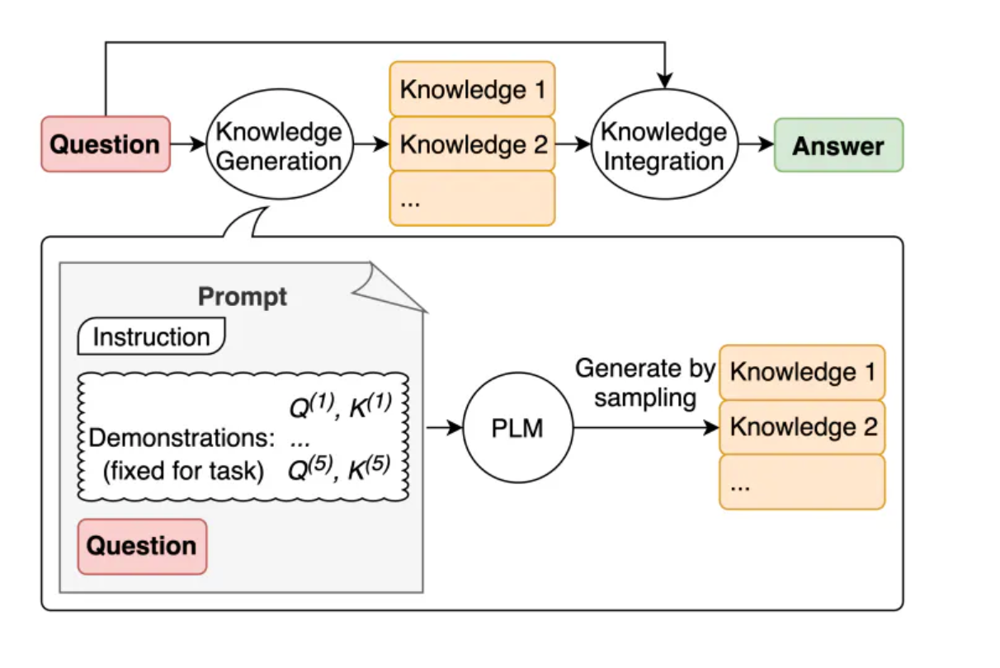
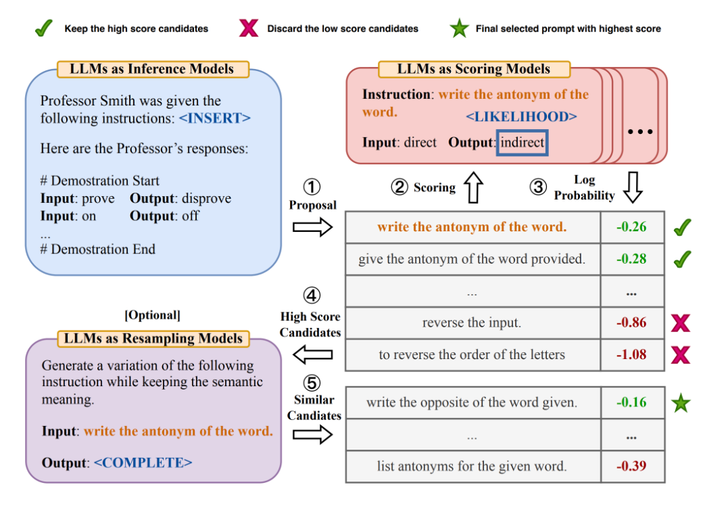
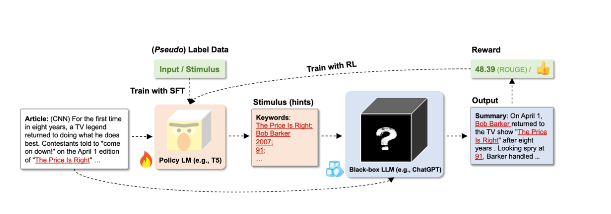
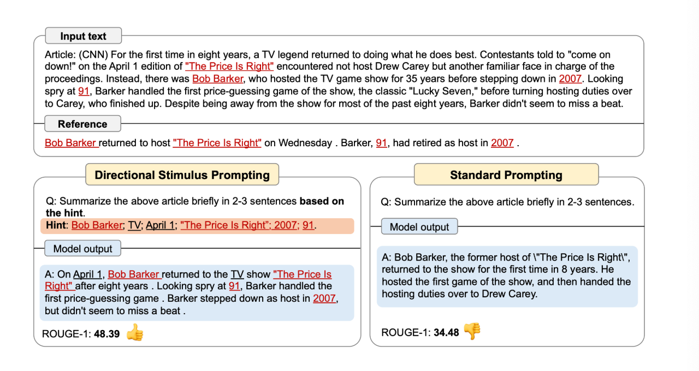

# Prompt Engineering

> https://www.aneasystone.com/archives/2024/01/prompt-engineering-notes.html

## Basic Rules

- Start from simple prompt
- Use instruction
- Remove unspecific description
- Give concrete output format by example
- Avoid saying what not to do, but rather what to do
- Role Prompting

## Basic Methods

- Prompt Framework

- Zero-shot Prompting vs. Few-shot Prompting

- Instruction Prompting

## CoT

- CoT (Chain of Thought)
    - Few-Shot-CoT
    - Zero-Shot-CoT (simply adding "Let's think step by step")

- Self-Consistency
    - one improved version of CoT
    - Sample a diverse set of reasoning paths
    - Marginalize out reasoning paths to aggregate final answers
- LtM (Least-to-Most Prompting)
    - one improved version of CoT
    - intended to address the issue of insufficient generalization ability in CoT
    - Problem Reducing -> Sequentially Solve Subquestions
- ToT (Tree of Thoughts)
    - 
- Step-Back Prompting
    - Abstraction first to find the basic principles or concepts behind the problem -> Reasoning with the principles

## RAG

General-purpose language models still have certain limitations when handling knowledge-intensive tasks, such as delayed knowledge updates, generation of false information, and references to non-existent sources, which is what we refer to as hallucination.

RAG (Retrieval Augment Generation) serves as one of the methods to deal with such hallucination problem.

## Generated Knowledge Prompting

No need to integrate outer knowledge, GKP generate knowledge from LLM with few-shot, and integrate it with the original question as the new augmented prompt

## APE

APE (Automatic Prompt Engineer): Using LLM to automatically generate, evaluate, and optimize prompts

The main processes are:

1. Proposal
2. Scorling
3. Resampling

And the APE author find a better instrcution than human-designed zero-shot CoT instrcution "Let's think step by step" -> "Let's work this out in a step by step way to be sure we have the right answer"

## Active Prompting

Also can be thought as a enhanced-version of CoT. Four core Steps are:

- Uncertainty Estimation: Let LLM answers k times for each problem in the problem sets. And evaluate uncertainty of each problem
- Selection: rank uncertainty for each problem and select most uncertain questions
- Annotation: Manual annotate answers for those not-so-easy problem for LLM
- Inference: Choose these annotated problem-answer group as exemplars to serve as few-shot prompt. These few-shot exempalrs will help improving inference ability of LLM

## DSP

Main idea of DSP (Directional Stimulus Prompting) : Train an adjustable Policy LM to generate keywords or other prompt information, and combine them with user input as the input of downstream LLM.

It can achieve better results in content summarization or content creation tasks.

The following image is an example from the paper, comparing the differences between ordinary prompts and targeted stimulus prompts:

