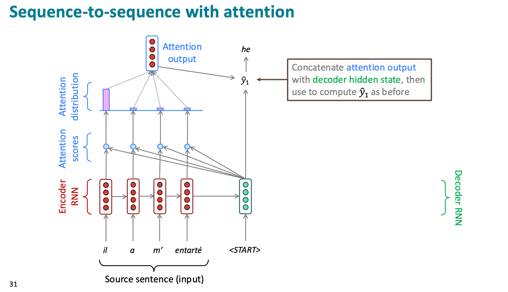
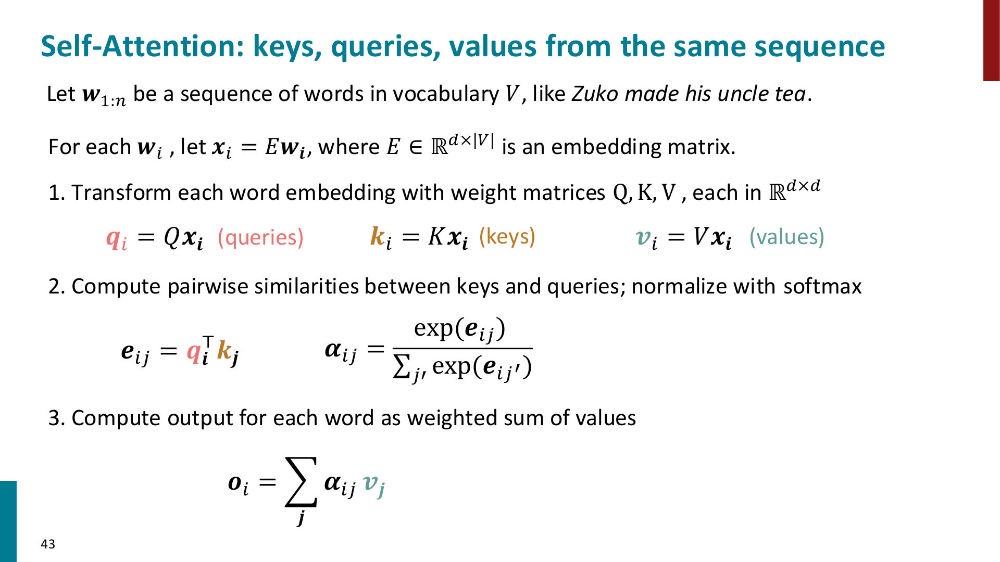
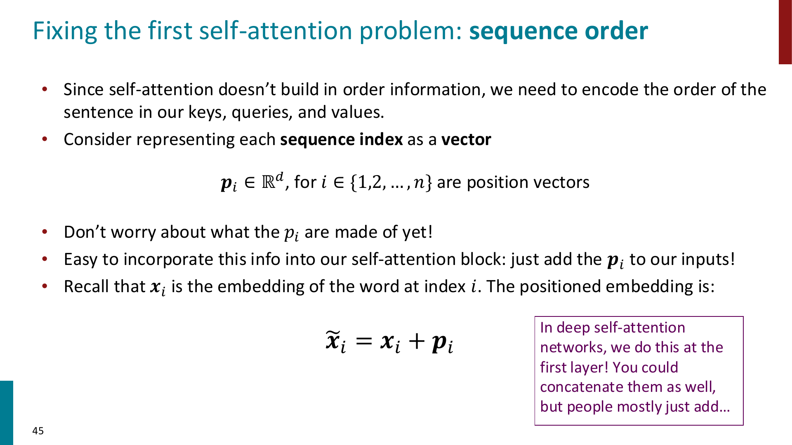
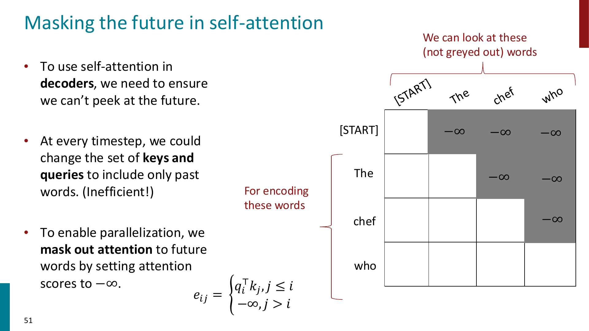
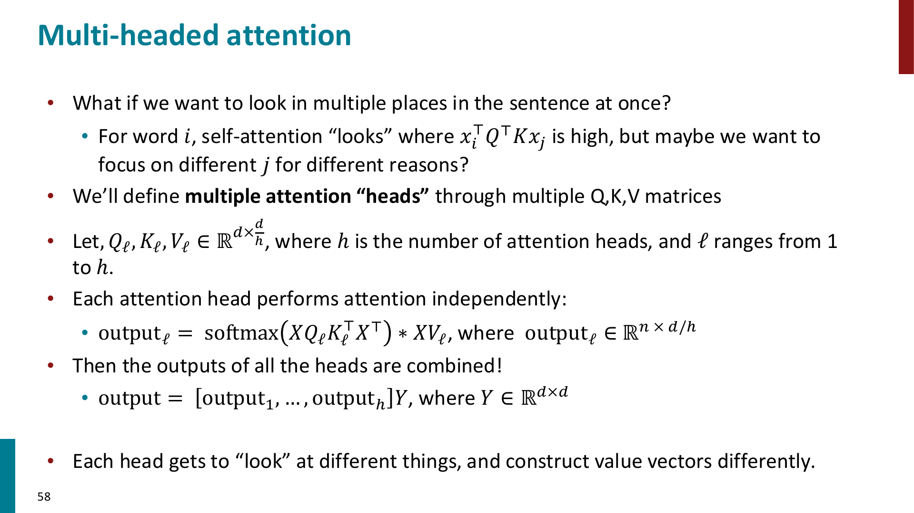
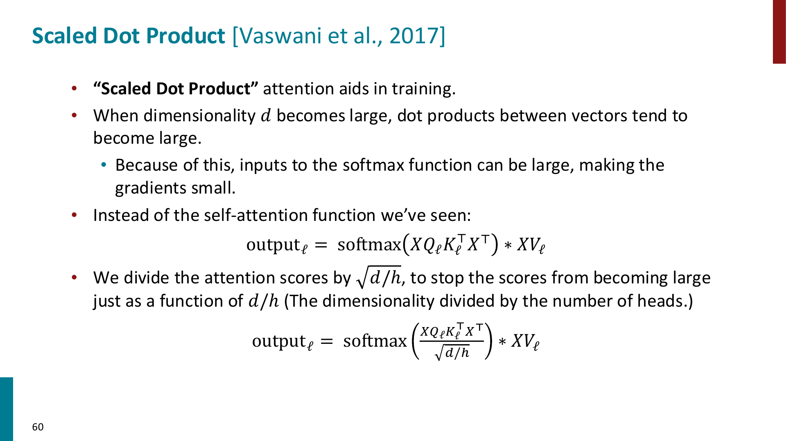
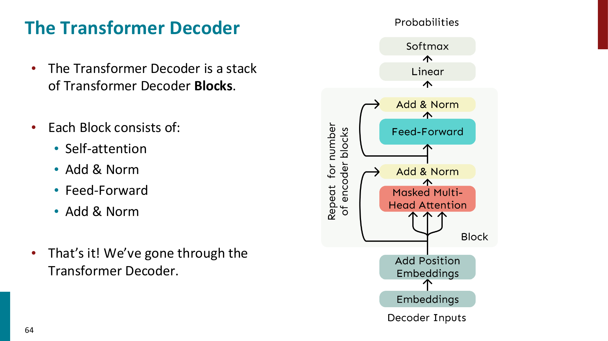
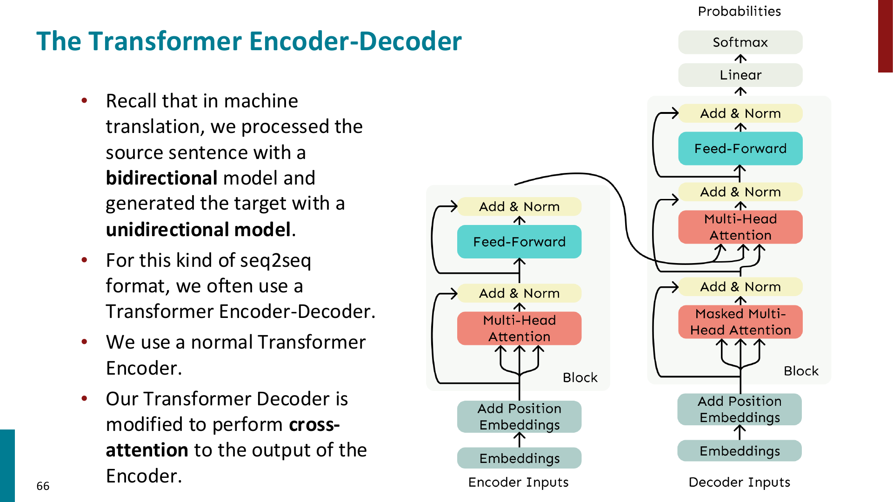

# Attention

> 推荐阅读：https://jalammar.github.io/illustrated-transformer/

Attention 可以用来解决上面 RNN 的 bottleneck

Core idea: on each step of the decoder, use direct connection to the encoder to focus on a particular part of the source sequence

用上 attention 机制后，原先的 seq-to-seq 的 decoder/encoder RNN 的架构如下：

- We’ve seen that attention is a great way to improve the sequence-to-sequence model for Machine Translation.

- However: You can use attention in many **architectures** (not just seq2seq) and many **tasks** (not just MT)
- ==More general definition of attention==:
    - Given a set of vector **values**, and a vector **query**, **attention** is a technique to compute a weighted sum of the values, dependent on the query.
    - We sometimes say that the **query attends to the values**.
    -  For example, in the seq2seq + attention model, each decoder hidden state (query) attends to all the encoder hidden states (values)

思考一下，抽象的来说，Attention 是一种 general 的用于表征一整个 sequence 序列的方式，RNN (把先前 sequence 表征为 hidden state 的思想）又何尝不是如此呢？换句话说，==它们本质上都是一种把序列信息传给当前位置表示的方法==

而既然 Attention 可以更直接、更并行地传递序列信息，那我们能不能完全去掉 RNN，用 Attention 来建模序列？答案是可以的！

## Self-Attention

前面在 Machine Translation 里看到的 attention 更准确地说是 **cross-attention**：

- query 来自 decoder 当前 hidden state
- key/value 来自 encoder 的所有 hidden states
- 也就是 decoder 在生成当前词时，回头看 source sentence 的不同位置

而如果我们想完全去掉 RNN，就需要让一个序列内部的 token 彼此交换信息，这就是 **self-attention**

!!! important

    Cross-attention: query 和 key/value 来自不同序列

    Self-attention: query, key, value 都来自同一个序列

对于一个输入序列 $w_1,\dots,w_n$，先把每个 word 转成 embedding：

$$
x_i = E w_i
$$

然后对每个位置的 embedding 分别做三个线性变换：

$$
q_i = W_Q x_i
$$

$$
k_i = W_K x_i
$$

$$
v_i = W_V x_i
$$

其中：

- $q_i$ 是 query：当前位置想要找什么信息
- $k_i$ 是 key：某个位置提供的信息可以被怎样检索
- $v_i$ 是 value：某个位置真正要被取走、加权平均的内容

接着用 query 和 key 的 dot product 来计算位置 $i$ 对位置 $j$ 的 attention score：

$$
e_{ij} = q_i^\top k_j
$$

然后对所有 $j$ 做 softmax：

$$
\alpha_{ij}
=
\frac{\exp(e_{ij})}{\sum_{j'}\exp(e_{ij'})}
$$

最后用 attention distribution 对所有 value 做加权平均：

$$
o_i = \sum_j \alpha_{ij} v_j
$$

也就是说，$o_i$ 是第 $i$ 个位置在看完整个序列后得到的新表示

!!! tip

    可以把 self-attention 理解成：每个 token 都发出一个 query，去和句子里所有 token 的 key 做匹配，然后按照匹配程度把所有 token 的 value 加权平均回来。

    因此 self-attention 的输出不是单纯的 word embedding，而是一个已经融合了上下文信息的 contextual representation。

### Matrix form of self-attention

为了并行计算，我们通常把所有 token 的向量堆成矩阵：

$$
X =
\begin{bmatrix}
x_1 \\
\vdots \\
x_n
\end{bmatrix}
\in \mathbb{R}^{n \times d}
$$

那么：

$$
Q = XW_Q,\quad K = XW_K,\quad V = XW_V
$$

self-attention 可以写成：

$$
\text{Attention}(Q,K,V)
=
\text{softmax}(QK^\top)V
$$

这里 $QK^\top \in \mathbb{R}^{n\times n}$，它包含了所有 token pair 之间的 attention score

!!! important

    这也是 self-attention 的一个重要计算特征：它要计算所有位置两两之间的关系，因此 attention matrix 的大小是 $n\times n$，计算量和显存都会随序列长度呈 quadratic growth。

### Why position representation is needed?

Self-attention 本身没有内置顺序信息。

例如只看一组 unordered embeddings 时，self-attention 并不知道 `the cat chased the dog` 和 `the dog chased the cat` 的位置差异，因为它只是在做 query-key matching 和 weighted average

因此我们需要把 position information 加到 token representation 里：

$$
\tilde{x}_i = x_i + p_i
$$

其中 $p_i$ 是第 $i$ 个位置的 position vector

课件里主要提到两种 position representation：

- **Sinusoidal position representation**
    - 用不同周期的 $\sin$ 和 $\cos$ 函数构造位置向量
    - 优点是形式固定，理论上对更长序列有一定 extrapolation 的直觉
    - 缺点是不可学习，实际 extrapolation 效果也不一定好
- **Learned absolute position representation**
    - 把每个位置 $p_i$ 当成可学习参数
    - 优点是灵活，能根据训练数据调整
    - 缺点是不能自然泛化到训练时没见过的更长位置

!!! tip

    在 Transformer 里，word embedding 只告诉模型“这个 token 是什么”，position embedding 告诉模型“这个 token 在哪里”。

    两者相加后，模型才同时知道 token identity 和 token order。

### Adding nonlinearities

Self-attention 的核心操作是 weighted average，本身没有 element-wise nonlinearity。

如果只是堆很多层 self-attention，本质上容易变成不断重新平均 value vectors，因此 Transformer block 会在 attention 后面接一个 feed-forward network：

$$
m_i = W_2 \text{ReLU}(W_1 o_i + b_1) + b_2
$$

这个 FFN 是 **position-wise** 的：

- 每个位置都用同一套 FFN 参数
- 不同位置之间的信息交换已经由 self-attention 完成
- FFN 的作用是对每个位置自己的表示做非线性变换

### Masking the future

如果用 self-attention 做 language modeling 或 decoder，我们在预测第 $i$ 个位置时不能看到未来的 token

例如预测 `The chef who ...` 的下一个词时，模型不能偷看后面的 ground-truth word，否则训练目标就泄漏了

解决方法是 **causal mask**：

$$
e_{ij}
=
\begin{cases}
q_i^\top k_j, & j \le i \\
-\infty, & j > i
\end{cases}
$$

这样做 softmax 时，未来位置 $j>i$ 的 attention weight 会变成 0

!!! important

    Masking 的意义不是让模型一个 timestep 一个 timestep 地慢慢算，而是为了在训练时仍然可以并行计算整个序列，同时保证每个位置只 attend to 它之前的 token。

## Multi-Head Attention

单个 attention head 只能用一套 $W_Q,W_K,W_V$ 去决定“看哪里”和“取什么信息”

但一个 token 可能同时需要关注多种关系：

- 语法上的主谓宾关系
- 指代关系，例如 `his` 指向谁
- 局部短语结构
- 长距离依赖

因此 Transformer 使用 **multi-head attention**：让多个 attention heads 并行工作，每个 head 使用自己的一套 $W_Q,W_K,W_V$

设一共有 $h$ 个 heads，每个 head 的维度是：

$$
d_h = \frac{d}{h}
$$

第 $\ell$ 个 head 计算：

$$
\text{head}_\ell
=
\text{softmax}
\left(
\frac{XW_Q^\ell (XW_K^\ell)^\top}{\sqrt{d_h}}
\right)
XW_V^\ell
$$

然后把所有 heads 的输出 concatenate 起来，再过一个线性层：

$$
\text{MultiHead}(X)
=
[\text{head}_1;\dots;\text{head}_h]W_O
$$

!!! tip

    Multi-head attention 不是简单地把同一种 attention 算很多遍，而是给模型多个“视角”。

    不同 head 可以学习关注不同类型的依赖关系，最后再把这些信息合并起来。

### Scaled dot-product attention

当 $d_h$ 很大时，query 和 key 的 dot product 容易变得很大

如果 softmax 的输入过大，分布会变得过于尖锐，梯度容易变小，不利于训练

所以 Transformer 使用 scaled dot-product attention：

$$
\text{Attention}(Q,K,V)
=
\text{softmax}
\left(
\frac{QK^\top}{\sqrt{d_k}}
\right)
V
$$

其中 $d_k$ 是 key/query 的维度。在 multi-head attention 里，一般有：

$$
d_k = d_h = \frac{d}{h}
$$

!!! important

    除以 $\sqrt{d_k}$ 不是改变 attention 的思想，而是为了让 attention scores 的数值尺度更稳定，使 softmax 不至于太容易饱和。

## Transformer

Transformer 的核心思想可以概括为：

> 用 self-attention 代替 recurrence，让每个 token 可以直接和任意位置的 token 建立联系，并且整个序列可以并行计算

### Transformer Decoder

Transformer Decoder 可以用来构建 language model

输入流程大致是：

$$
\text{token ids}
\rightarrow
\text{embeddings}
\rightarrow
\text{add position embeddings}
\rightarrow
\text{stacked decoder blocks}
\rightarrow
\text{linear + softmax}
\rightarrow
\text{next-token distribution}
$$

一个 Transformer Decoder Block 包含：

- Masked Multi-Head Self-Attention
- Add & Norm
- Feed-Forward Network
- Add & Norm

其中 masked self-attention 保证 decoder 只能看过去，不能看未来

!!! important

    Decoder-only Transformer 本质上就是一个 conditional-on-prefix 的 language model：

    $$
    P(x_1,\dots,x_T)
    =
    \prod_{t=1}^T P(x_t \mid x_{< t})
    $$

    causal mask 保证模型在预测 $x_t$ 时只使用 $x_{< t}$。

### Residual connection and Layer Normalization

课件里把 residual connection 和 layer normalization 合在一起叫 **Add & Norm**

Residual connection 的形式是：

$$
X^{(i)}
=
X^{(i-1)} + \text{Layer}(X^{(i-1)})
$$

它的直觉是：模型不需要每层都从头学习一个全新的表示，而是学习相对上一层的 residual change

!!! tip

    Residual connection 对梯度传播也很重要，因为它提供了一条更直接的路径，让深层网络更容易训练。

Layer normalization 对每个 token 的 hidden vector 做归一化

对于 $x\in\mathbb{R}^d$：

$$
\mu = \frac{1}{d}\sum_{j=1}^d x_j
$$

$$
\sigma^2 = \frac{1}{d}\sum_{j=1}^d (x_j-\mu)^2
$$

$$
\text{LayerNorm}(x)
=
\gamma \odot \frac{x-\mu}{\sqrt{\sigma^2+\epsilon}} + \beta
$$

其中 $\gamma,\beta\in\mathbb{R}^d$ 是可学习参数

在 Transformer block 里，Add & Norm 通常可以写成：

$$
\text{LayerNorm}(x+\text{Sublayer}(x))
$$

这里的 Sublayer 可以是 multi-head attention，也可以是 feed-forward network

### Transformer Encoder

Transformer Encoder 和 Decoder 最大的区别是：Encoder 的 self-attention **不需要 causal mask**

因为 encoder 的目标不是从左到右生成下一个词，而是为每个位置计算一个可以看完整输入序列的 contextual representation

所以 encoder 中每个 token 都可以 attend to：

- 左边的 token
- 右边的 token
- 自己

这就类似于 bidirectional RNN 的效果，只不过 Transformer 用 attention 直接连接所有位置

### Transformer Encoder-Decoder

在机器翻译这类 seq2seq 任务中，通常使用 Transformer Encoder-Decoder

整体结构是：

- Encoder 读取 source sentence，使用 unmasked self-attention 得到 source representations
- Decoder 生成 target sentence，使用 masked self-attention 处理已经生成的 target prefix
- Decoder 额外使用 cross-attention 去看 encoder 的输出

Cross-attention 的 Q/K/V 来源不同：

$$
q_i = W_Q z_i
$$

$$
k_j = W_K h_j
$$

$$
v_j = W_V h_j
$$

其中：

- $z_i$ 来自 decoder 当前层的 hidden states
- $h_j$ 来自 encoder 的输出 hidden states
- 因此 query 来自 target side，key/value 来自 source side

!!! important

    Encoder-decoder Transformer 保留了 seq2seq 的思想：

    source sentence 先被 encoder 表示出来，decoder 再一边生成 target sentence，一边通过 cross-attention 对齐并读取 source sentence 的信息。

## Summary of Transformer blocks

Transformer 的几个核心组件可以这样记：

- **Self-attention**
    - 让序列内部的 token 互相读取信息
- **Position embedding**
    - 给 attention 补上顺序信息
- **Causal mask**
    - 用在 decoder/language model 中，防止看到未来
- **Multi-head attention**
    - 让模型从多个不同视角关注不同关系
- **Feed-forward network**
    - 给每个位置加入非线性变换能力
- **Residual connection**
    - 帮助深层网络训练，让信息和梯度更容易传播
- **Layer normalization**
    - 稳定 hidden states 的数值分布，加快训练

Transformer 相比 RNN 的关键优势是：

- 可以并行处理整个序列
- 任意两个位置之间的路径更短，长距离依赖更容易建模
- attention distribution 有一定 interpretability

但它也有一个明显代价：

- self-attention 需要计算所有 token pair 的关系，因此对长度为 $n$ 的序列有 $O(n^2)$ 的 attention cost
