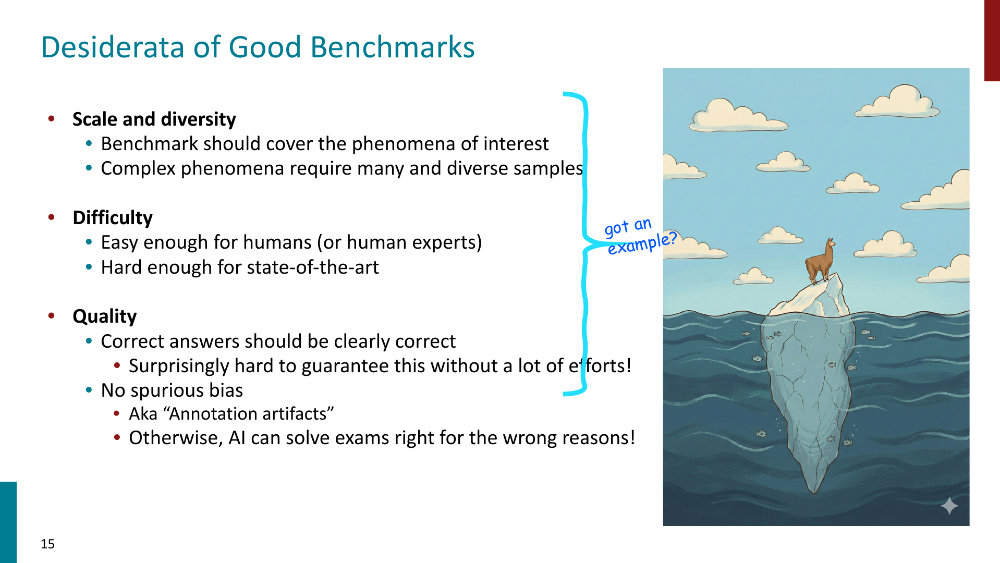
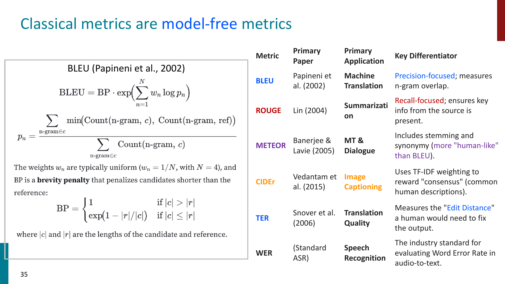
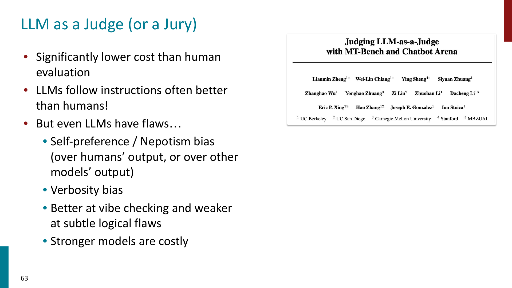
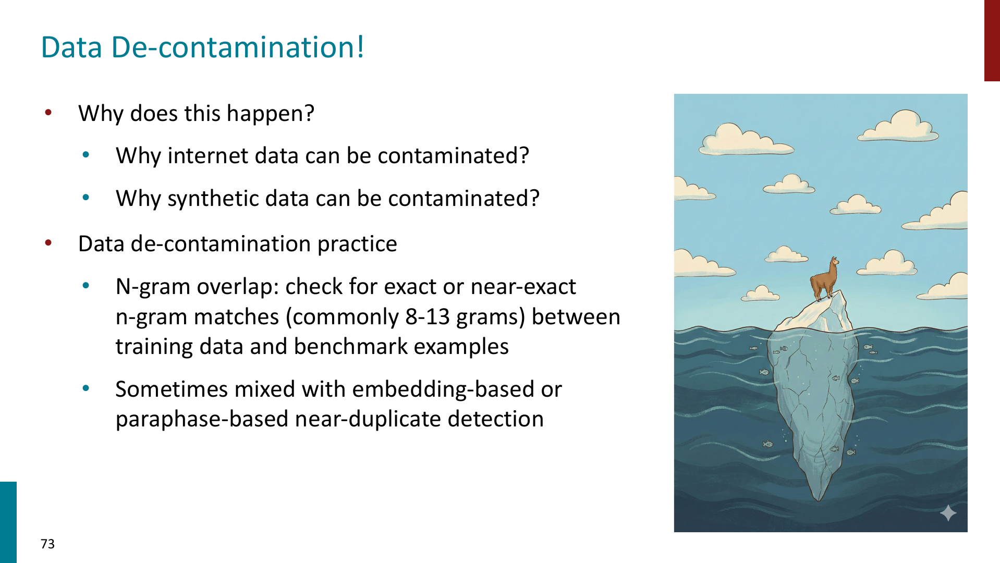

# Benchmark and Evaluation

## Why benchmarks matter

Benchmarks 的作用是给模型能力提供一个可比较的标准。

常见 benchmark 例子包括：

- GLUE / SuperGLUE
- MMLU
- GPQA
- HLE
- Chatbot Arena

但 benchmark 的生命周期会变短，因为模型会不断针对已有测试集优化。

## Good benchmarks

一个好的 benchmark 通常需要满足：

- **Scale and diversity**
    - 覆盖足够多的任务类型和语言现象
- **Difficulty**
    - 对人类或专家可解，但对当前 SOTA 仍有挑战
- **Quality**
    - 题目和答案本身不能有明显错误
- **No spurious bias**
    - 模型不能靠 shortcut / annotation artifact 得高分

!!! important

    Benchmark 分数高不一定代表模型真正掌握了能力，也可能只是学会了数据集里的 shortcut。

## Spurious bias and artifacts

很多 benchmark 会无意中包含 artifacts：

- answer 与 context 有高 lexical overlap
- 正确选项更常出现在某个固定位置
- unanswerable questions 有特殊措辞模式
- negation / entity swap 造成浅层线索

这会导致模型：

$$
\text{high score} \not\Rightarrow \text{true understanding}
$$

所以需要 adversarial examples、diagnostic sets、dynamic benchmarks 等方法检查模型是不是 right for the wrong reasons。

## Classical metrics

生成任务常用 model-free metrics：

- **BLEU**
    - precision-oriented n-gram overlap
    - 常用于 machine translation
- **ROUGE**
    - recall-oriented overlap
    - 常用于 summarization
- **METEOR / CIDEr / TER / WER**
    - 从不同角度衡量 overlap、edit distance 或错误率

这些指标的共同问题是：主要看 surface overlap，不一定理解语义。

例如：

- 同义改写可能被低估
- 流畅但事实错误的文本可能被高估
- reference 不完整时，正确答案也可能被判错

## Model-based and reference-free evaluation

为了弥补 classical metrics 的限制，可以使用 model-based metrics：

- **BERTScore**
    - 用 contextual embeddings 比较 candidate 和 reference
- **BLEURT / COMET**
    - 用训练过的模型预测 human judgment
- **FActScore / SelfCheckGPT / G-Eval**
    - 更关注 factuality、consistency 或 reference-free evaluation

但 model-based metrics 也有问题：

- 可能继承 evaluator model 的 bias
- 计算成本更高
- 不同 prompt / rubric 会影响结果
- 对 hallucination 和 subtle reasoning error 仍然可能不稳定

## Human evaluation and LLM-as-judge

Human evaluation 长期被视为 gold standard，但成本高、速度慢，也会受主观偏好影响。

LLM-as-judge 更便宜、可扩展，但也有明显 bias：

- 偏好更长、更详细的回答
- 偏好自己或同系列模型的输出
- 对细微逻辑错误可能不敏感
- rubric 不清楚时结果不稳定

更可靠的做法是：

- 给清晰 rubric
- 给 examples / calibration
- 使用 pairwise comparison
- 用多个 judge model 或 human spot check

## Data contamination

数据污染是大模型评测中特别重要的问题：

如果 benchmark 的 test examples 已经出现在 pretraining data 里，模型分数可能被高估。

常见 decontamination 方法：

- n-gram overlap detection
- near-duplicate search
- embedding similarity search
- paraphrase-level contamination check

!!! warning

    对 closed-source models 来说，很难完全确认训练数据里是否包含某个 benchmark。

## Goodhart's Law

课件中强调了 Goodhart's Law：

> When a measure becomes a target, it ceases to be a good measure.

在 NLP evaluation 中的含义是：

- 一旦大家都针对某个 benchmark 优化
- benchmark 就可能逐渐失去区分真实能力的作用
- leaderboard progress 不一定等价于 real-world progress

## Summary of Benchmark and Evaluation

- Benchmark 是模型比较的公共标准，但也会被过拟合和污染
- 好 benchmark 需要规模、多样性、难度、质量和低 artifact
- Classical metrics 简单稳定，但主要衡量 surface overlap
- Model-based metrics 更接近语义判断，但可能继承 evaluator bias
- Human evaluation 更可信但成本高，LLM-as-judge 更 scalable 但有偏见
- 数据污染、prompt sensitivity、Goodhart's Law 都会影响 evaluation validity
