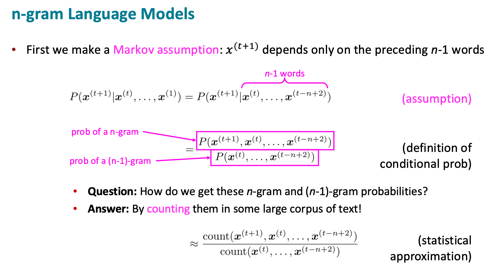
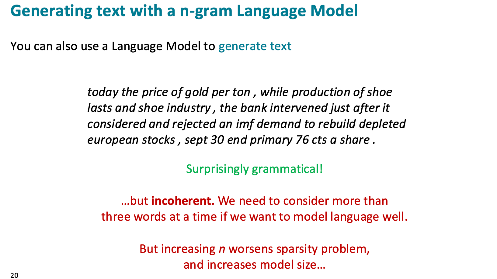
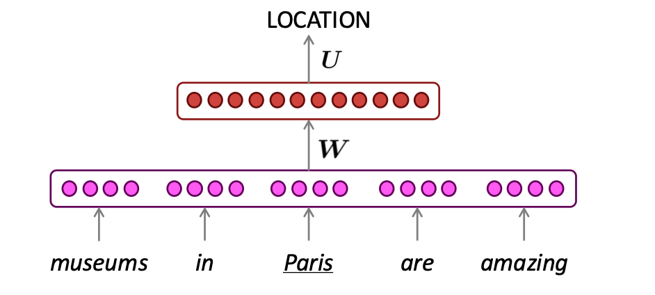
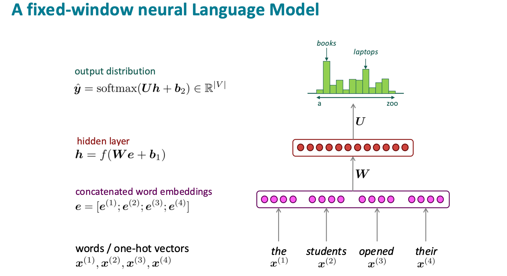
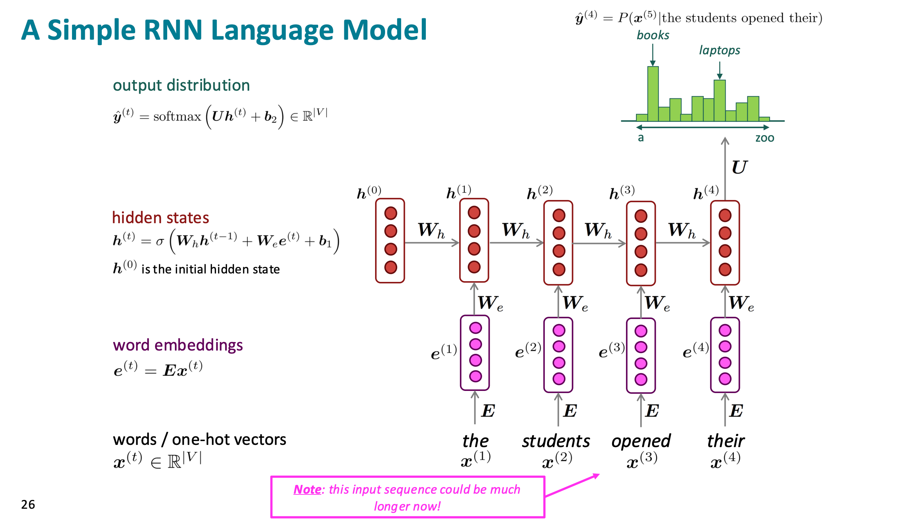
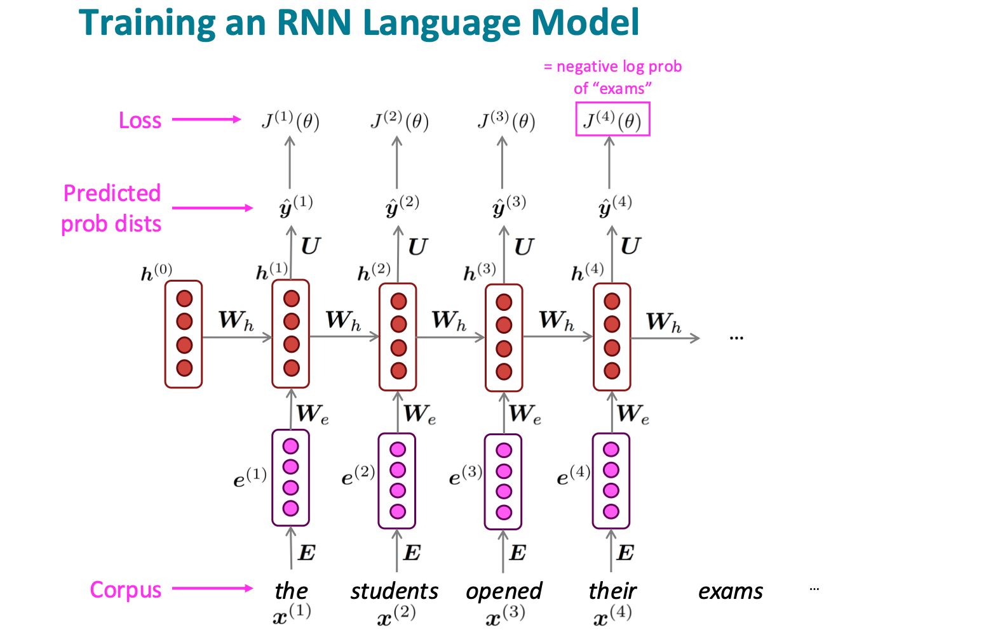
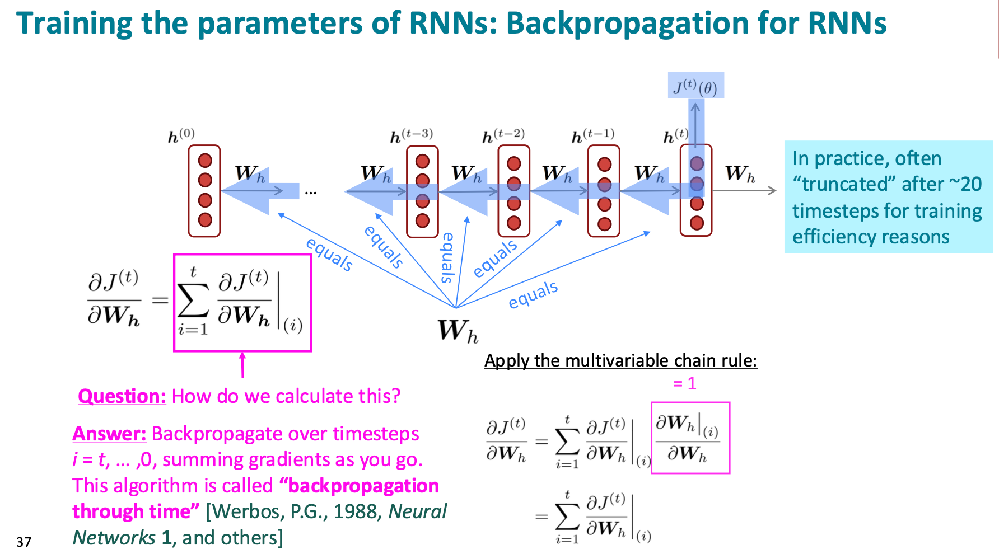
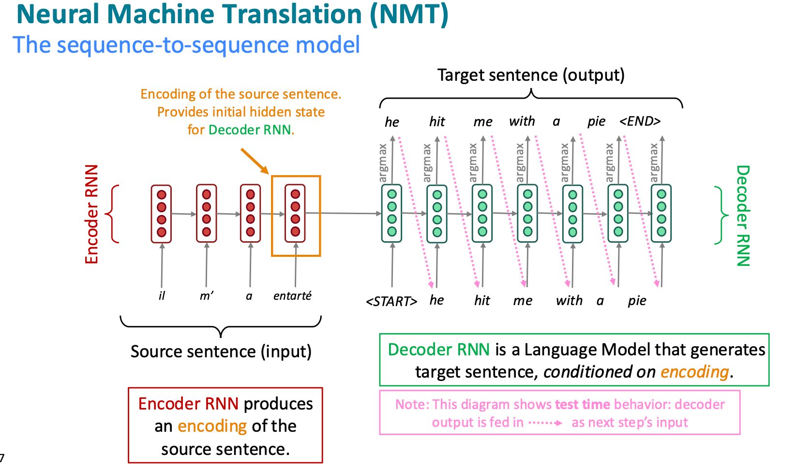
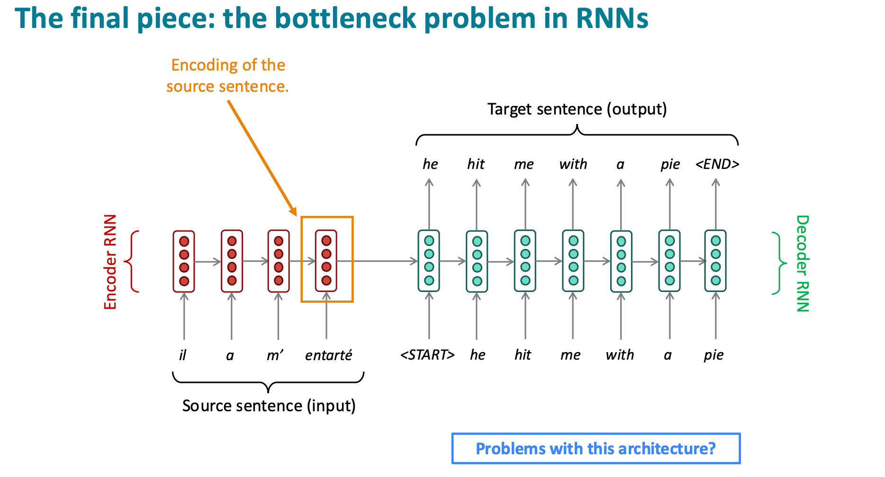

# Language Model

## Language Modeling

**Language Modeling** is the task of predicting what word comes next

More formally: given a sequence of words $x^{(1)}, x^{(2)}, x^{(3)} ..., x^{(t)}$, compute the probablity distribution of the next word $x^{(t+1)}$:

$$
P(x^{(t+1)} | x^{(t)},...,x^{(1)})
$$

And a system that does this is called a **Language Model**

!!! note

    Google 的搜索补全，键盘输入补全，GPT 等都属于 Language modeling 任务

### n-gram Language Models

Definition: An **n-gram** is a chunk of n consecutive words.

- Unigrams: "the", "students", "opened", "their"
- Bigrams: "the students", "students opened", "opened their"
- Trigrams: "the students opened", "students opened their"
- Four-grams: "the students opened their"

 显而易见的, n-gram language model 存在 Sparsity problems 和 Storage problems，当 n 增大时，存在这样的 tradeoff：虽然模型能看到的词变多了，但是需要更大的训练集来处理数据稀疏的问题，也会需要统计更多的 n-grams 词组的出现次数，带来很大的计算开销

因此我们可以思考：能否不直接用离散词的计数，而是把词变成向量，再用神经网络根据上下文做预测？即抛弃 n-gram 的基于计数的模型，使用 fix-window neural model 这种基于神经网络参数的模型

!!! important

    在 NER 命名实体识别任务中，我们会使用 window-based neural model

    

    为什么 fix-window neural model 可以解决 sparsity problems 呢？

    - 神经网络模型不是直接查 count，而是学习词向量和参数
    - 因此即使没见过例如 students opened their laptops 的完整短语，它也可能见过类似 students opened their books, students used their laptops 的表达，因为 books、laptops 这些词向量空间中可能存在一定的相似性，所以模型可以泛化

### fixed-window neural Language Model

> Approximatly: Y. Bengio, et al. (2000/2003): A Neural Probabilistic Language Model

但是同时，这样的方案还存在一些缺陷：

- Fixed window is **too small**
- Enlarging window enlarges $W$
- Window can never be large enough!
- $x^{(1)}$ and $x^{(2)}$ are multiplied by completely different weights in $W$. **No symmetry** in how the inputs are processed.

-> ***We need a neural arthitecture that can process any length input***

## RNN

**Core idea**: Apply the same weights $W$ repeatedly

RNN language model 的 loss 是所有时间步预测下一个词的平均损失；但不能把整个 corpus 一次性输入模型计算梯度，因为内存太贵。所以实际训练时用 SGD/mini-batch，每次取一批句子或文本片段，计算 loss，做 BPTT，更新参数，然后重复

### Backpropagation for RNNs

可以先画出计算图，记住串联相乘，并联相加

!!! note

    Simple RNN 存在梯度消失问题，为此提出了一些 RNN 的变式，例如 LSTM (https://colah.github.io/posts/2015-08-Understanding-LSTMs/)

## Machine Translation

Sequence-to-sequence is useful for more than just MT, Many NLP tasks can be phrased as sequence-to-sequence:

• **Summarization** (long text → short text)

• **Dialogue** (previous utterances → next utterance)

• **Parsing** (input text → output parse as sequence)

• **Code generation** (natural language → Python code)

!!! important

    机器翻译中建模的是：

    $$
    P(y\;| \;x)
    $$

    例如：

    $$
    x = \text{“我喜欢学习自然语言处理”}
    $$

    那么 NMT 模型想学的是：

    $$
    P(\text{I like studying natural language processing} \mid \text{我喜欢学习自然语言处理})
    $$

    也就是：**给定中文句子，英文翻译是这句话的概率有多大**，那么有

    $$
    P(y\mid x)
    =
    P(y_1\mid x)
    P(y_2\mid y_1,x)
    P(y_3\mid y_1,y_2,x)
    \cdots
    P(y_T\mid y_1,\dots,y_{T-1},x)
    $$

    ---

    而普通 language model 建模的是：

    $$
    P(y)
    $$

    比如：

    $$
    P(y)=P(y_1)P(y_2\mid y_1)P(y_3\mid y_1,y_2)\cdots
    $$

    它只关心：这个英文句子本身像不像自然语言，但是 NMT 是条件语言模型，它要求英文句子不仅要自然，而且要是源句子 $x$ 的合理翻译。

早期 encoder-decoder 模型通常把整个源句子的含义压缩到 encoder 最后的 hidden state 里，然后 decoder 靠这个状态来生成翻译。

也就是：

$$
x_1,\dots,x_T
\rightarrow
\text{one vector / final hidden state}
\rightarrow
y_1,\dots,y_T
$$

问题是：**整个源句子的信息都要挤进一个固定长度的向量里**

句子短的时候还好；句子很长的时候，encoder 最后的 hidden state 很难完整保留前面所有细节。

比如源句子里前半部分有一个很重要的信息，传到最后可能已经弱了，decoder 翻译时就容易漏译、错译

后来的 attention 在这一方面是这样改进的：

> decoder 在每一步生成词时，不只看 encoder 的最后状态，而是可以回头看 encoder 每个位置的 hidden state；从 **只看一个最终向量** --> **每一步都可以对源句子不同位置分配注意力**
