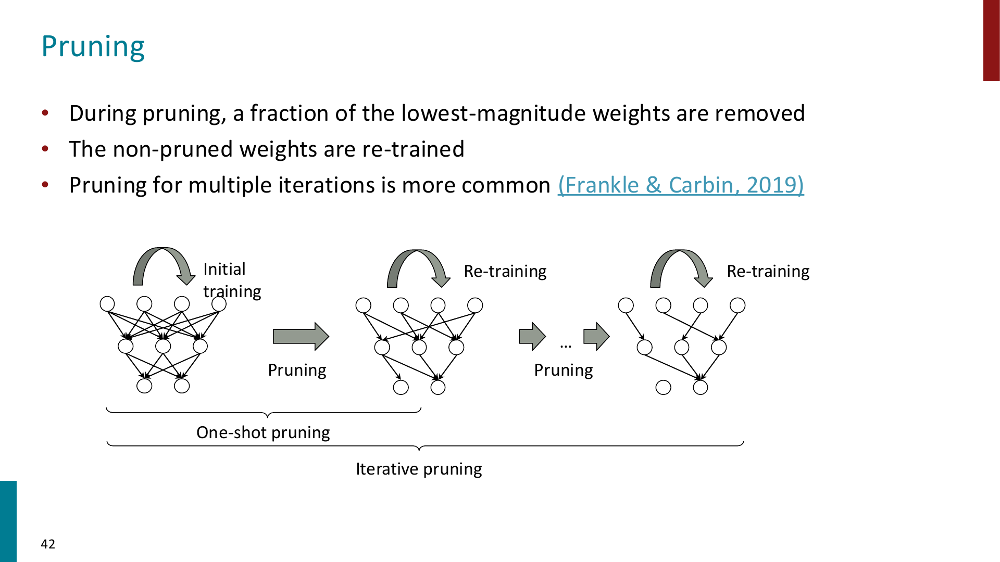
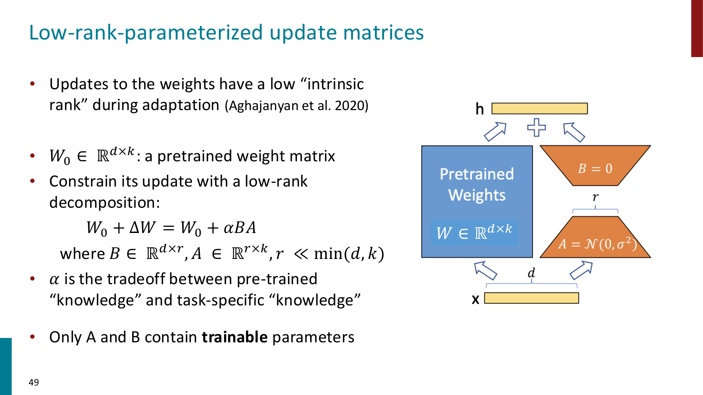
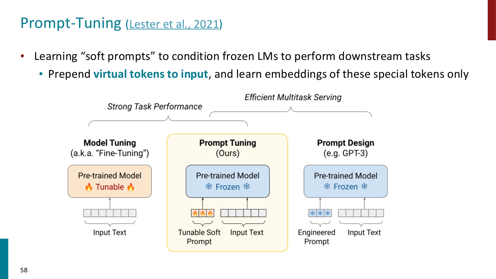
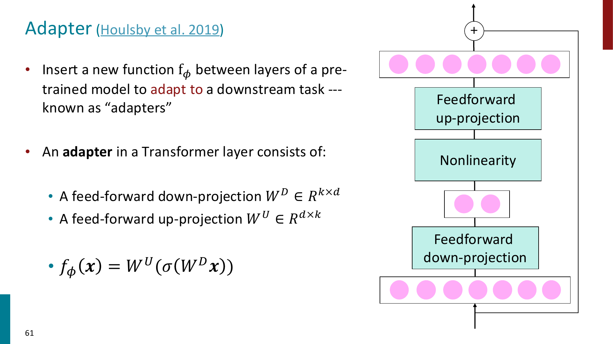
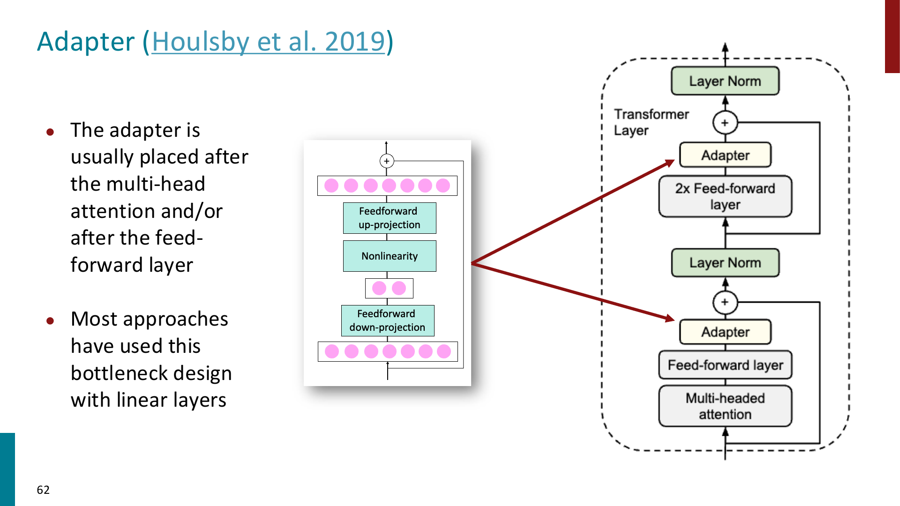
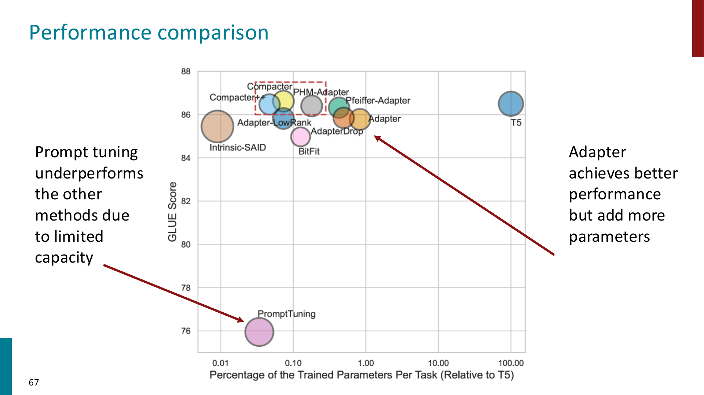

# PEFT

PEFT 全称为 **Parameter-Efficient Fine-Tuning**

前面我们已经看到：

- pretraining 很贵，但可以训练出通用 base model
- posttraining 可以让模型更符合 instruction 和 human preferences
- full fine-tuning 可以把模型适配到具体任务

但当模型越来越大时，full fine-tuning 会变得越来越不现实

!!! important

    Full fine-tuning: 更新模型的所有参数

    PEFT: 冻结大部分 pretrained parameters，只训练一小部分 task-specific parameters

## Prompting

在进入 PEFT 之前，课件先回顾了 prompting

Prompting 的核心思想是：不更新模型参数，只通过输入文本的设计，让模型把任务理解成一个 sequence prediction problem

常见 prompting 方式包括：

- **Zero-shot prompting**
    - 只写任务说明，不给示例
- **One-shot prompting**
    - 给一个输入输出示例
- **Few-shot prompting**
    - 给多个输入输出示例，让模型在 context 里模仿任务格式

例如 few-shot translation：

```text
thanks -> merci
hello -> bonjour
mint -> menthe
otter ->
```

这里模型没有发生 gradient update，只是根据 context 中的 pattern 继续生成

!!! tip

    Prompting 和 finetuning 的区别：

    - prompting: 改输入，不改参数
    - finetuning: 用训练数据更新模型参数

### Chain-of-thought prompting

一些复杂任务，尤其是 multi-step reasoning，只靠普通 prompt 可能不够

Chain-of-thought (CoT) prompting 的想法是：让模型先生成 reasoning steps，再生成最终答案

最简单的 zero-shot CoT prompt 是：

```text
Let's think step by step.
```

对于算术、数学文字题、逻辑推理等任务，CoT 可以把一个复杂问题拆成中间步骤，降低一次性预测最终答案的难度

!!! important

    CoT 的作用不是显式改变模型参数，而是改变模型生成答案的路径。

    它让模型先生成 intermediate reasoning，再基于 reasoning 得到 answer。

### Downsides of prompt-based learning

Prompting 虽然方便，但也有明显缺点：

- **Inefficiency**
    - prompt 每次 inference 都要被重新处理
    - few-shot examples 会占用 context window
- **Performance**
    - prompting 通常不如 task-specific finetuning 稳定
- **Sensitivity**
    - 对 prompt wording, example order, formatting 都可能敏感
- **Unclear learning mechanism**
    - 有时 random labels 也能产生一定效果（例如 sentiment analysis 中 few-shot prompt 随意给一些 sentiment label)，说明模型到底从 prompt 里学到了什么并不总是清楚

!!! tip

    Prompt engineering 的本质是“用输入控制模型行为”，但这种控制不一定稳定、可解释或高效。

## From fine-tuning to PEFT

Full fine-tuning 会更新所有模型参数，而对于一个大模型，如果每个 downstream task 都保存一份完整 fine-tuned checkpoint，会带来很高成本：

- 训练显存和计算成本高
- 每个任务都要保存完整模型副本
- 多任务部署困难
- 环境和能源成本高
- 开发门槛更集中在资源充足的组织

PEFT 的目标是：尽量只训练很少的参数，同时接近 full fine-tuning 的效果

可以把从三个视角理解 PEFT 的相关技术：

- **Parameter perspective**
    - sparse subnetworks
    - low-rank composition
- **Input perspective**
    - prompt tuning
    - prefix tuning
- **Function perspective**
    - adapters
    - task-specific modules

## Sparse Subnetworks and Pruning

一种 PEFT 思路是：大模型参数很多，但不是所有参数对某个任务都同等重要

因此我们可以通过 pruning 找到一个 sparse subnetwork



Pruning 可以看成给参数加一个 binary mask：

$$
b_i \in \{0,1\}
$$

如果 $b_i=1$，保留这个参数；如果 $b_i=0$，剪掉这个参数

对参数向量 $\theta$，pruned model 可以写成：

$$
\theta' = \theta \circ b
$$

其中 $\circ$ 是 element-wise product

最常见的 pruning criterion 是 **weight magnitude**

- 权重绝对值小，说明它可能不重要
- 先 prune 掉低 magnitude weights
- 然后 retrain 剩下的参数

!!! tip

    Pruning 的直觉是：如果一个参数已经非常接近 0，那么把它变成 0 对模型输出的影响可能较小。

### Lottery Ticket Hypothesis

Lottery Ticket Hypothesis 的核心观点是：

> 一个 dense randomly-initialized model 里可能已经包含一些 sparse subnetworks，这些 subnetworks 如果单独训练，也能达到和原模型接近的效果。

这些 subnetworks 被称为 **winning tickets**

在 pretrained models 中，也可以找到对特定任务有效的 sparse subnetwork

!!! important

    Pruning / subnetwork 方法体现的是一种 sparsity inductive bias：

    我们假设适配某个任务不一定需要更新整个 dense model，而可能只需要保留或调整其中一部分连接。

## LoRA

LoRA 全称为 **Low-Rank Adaptation**

它是目前最常用的 PEFT 方法之一

先回顾 full fine-tuning

给定 pretrained model 参数 $\phi_0$，full fine-tuning 会学习一个完整的参数更新：

$$
\phi_0
\rightarrow
\phi_0 + \Delta \phi
$$

问题是：

$$
|\Delta \phi| = |\phi_0|
$$

如果模型有 175B 参数，那么每个任务都要学习并保存一个 175B 量级的参数更新，这非常昂贵

LoRA 的核心假设是：**模型在 downstream adaptation 中真正需要的参数更新具有 low intrinsic rank**

也就是说，不需要直接学习完整的 $\Delta W$，而是用低秩分解表示它



对于 pretrained weight matrix：

$$
W_0 \in \mathbb{R}^{d\times k}
$$

full fine-tuning 会学习：

$$
W = W_0 + \Delta W
$$

LoRA 约束：

$$
\Delta W = \alpha BA
$$

其中：

$$
B \in \mathbb{R}^{d\times r}
$$

$$
A \in \mathbb{R}^{r\times k}
$$

并且：

$$
r \ll \min(d,k)
$$

因此：

$$
W = W_0 + \alpha BA
$$

训练时：

- 冻结 $W_0$
- 只训练 $A$ 和 $B$
- $r$ 是 LoRA rank，控制 trainable parameters 数量
- $\alpha$ 控制 task-specific update 的 scale

!!! important

    LoRA 的关键节省来自低秩分解：

    原本 $\Delta W$ 需要 $d\times k$ 个参数

    LoRA 只需要 $r(d+k)$ 个参数

    当 $r \ll d,k$ 时，参数量会小很多。

### Why LoRA works?

LoRA 的直觉是：虽然模型参数空间非常大，但一个具体任务所需的 adaptation 可能只落在一个低维子空间里

因此我们不直接更新整个 matrix，而是只学习一个 low-rank update direction

LoRA 通常被加在 Transformer 的 attention projection matrices 上，例如：

- $W_Q$
- $W_K$
- $W_V$
- $W_O$

实际 forward 时可以写成：

$$
h = W_0x + \alpha BAx
$$

推理时可以把 $BA$ merge 回原矩阵：

$$
W_{\text{merged}} = W_0 + \alpha BA
$$

因此 LoRA 可以做到几乎没有额外 inference latency

!!! tip

    LoRA 的一个工程优势是：多个任务可以共享同一个 base model，只保存各自的小 LoRA weights。

    切换任务时加载不同的 LoRA adapter 即可。

### QLoRA

==QLoRA 是 LoRA 的进一步内存优化==

核心做法是：

- 把 base Transformer model quantize 到 4-bit precision
- 冻结 quantized base model
- 在上面训练 LoRA parameters
- 使用 paged optimizer 处理显存峰值

!!! important

    LoRA 减少 trainable parameters

    QLoRA 进一步减少 frozen base model 的 memory footprint

    因此 QLoRA 让在较小硬件上 finetune 大模型变得更可行。

## Prefix Tuning and Prompt Tuning

LoRA 是从 parameter matrix 的角度做 adaptation

另一类方法是从 input perspective 出发：不改模型主体，而是在输入前面加一些 learnable virtual tokens

### Prefix Tuning

Prefix tuning 会学习一段 continuous task-specific prefix

这些 prefix 不是自然语言 token，而是可学习向量

模型主体参数冻结，训练时只更新 prefix parameters，包括输入层 embedding，attention 层的 prefix

可以理解成：

$$
\text{learnable prefix} + \text{input tokens}
\rightarrow
\text{frozen LM}
\rightarrow
\text{output}
$$

!!! tip

    Prefix tuning 相当于给每个任务学一个“软提示”，这个提示不一定能被人类读懂，但模型可以利用它改变自己的行为。

### Prompt Tuning

Prompt tuning 更直接：在输入前 prepend 一些 virtual tokens，只学习这些 virtual tokens 的 embeddings



和手写 prompt 的区别是：

- manual prompt 是离散文本，例如 `Let's think step by step`
- prompt tuning 学到的是连续向量，不一定对应真实词

!!! important

    Prompt tuning 的 trainable parameters 很少，但 capacity 也有限。

    课件中提到，prompt tuning 往往在模型足够大时才效果更好。

## Adapters

Adapters 是从 function perspective 做 adaptation

核心思想是：在 pretrained model 的层之间插入小的 task-specific modules，同时冻结原模型参数



一个典型 adapter 是 bottleneck 结构：

1. Down-projection
2. Nonlinearity
3. Up-projection

设输入 hidden state 为：

$$
x\in \mathbb{R}^d
$$

down-projection：

$$
W^D \in \mathbb{R}^{k\times d}
$$

up-projection：

$$
W^U \in \mathbb{R}^{d\times k}
$$

其中 $k \ll d$

adapter function：

$$
f_\phi(x)
=
W^U
\left(
\sigma(W^D x)
\right)
$$

通常还会通过 residual connection 加回原 hidden state：

$$
h' = h + f_\phi(h)
$$



Adapters 通常插入在：

- multi-head attention 之后
- feed-forward layer 之后
- 或者两处都插入

!!! tip

    Adapter 和 LoRA 的区别：

    - LoRA 修改的是已有 weight matrix 的更新方式
    - Adapter 是额外插入新的小模块

    因此 adapter 可能带来一点 inference latency，而 LoRA merge 后通常没有额外延迟。

## Comparing PEFT methods

不同 PEFT 方法的 tradeoff 不一样，大致可以这样理解：



- **Prompt tuning**
    - 参数最少
    - 部署灵活
    - capacity 较低，性能可能弱
- **Prefix tuning**
    - 比 prompt tuning 更强一些
    - 仍然从 input side 控制模型
- **LoRA**
    - 参数效率高
    - 性能强
    - 可以 merge，推理延迟低
    - 实践中非常常用
- **Adapters**
    - 表达能力较强
    - 需要插入额外模块
    - 可能增加推理开销
- **Pruning / subnetworks**
    - 强调 sparsity
    - 可以减少模型规模
    - 训练和选择 mask 可能复杂

!!! important

    PEFT 不是单一方法，而是一组 adaptation strategies。

    它们共同目标是：用更少的 trainable parameters 接近 full fine-tuning 的效果。

## A unified view

课件中提到，LoRA, prefix tuning, adapters 等方法可以从统一视角理解：

> 它们都在修改模型中间的 hidden representation

只不过修改方式不同：

- LoRA 通过 low-rank parameter update 间接改变 hidden states
- prompt / prefix tuning 通过 input-side virtual tokens 改变 hidden states
- adapters 通过额外 function module 改变 hidden states
- pruning 通过 sparse mask 改变可用参数子网络

因此可以把 PEFT 看成：

$$
h
\rightarrow
h + \Delta h_{\text{task}}
$$

其中 $\Delta h_{\text{task}}$ 由少量 task-specific parameters 控制

## Other efficient adaptation methods

课件最后还提到一些其他方向：

- **Knowledge distillation**
    - 用大模型作为 teacher，训练一个更小的 student model
    - 目标是让 student 模仿 teacher 的输出或中间表示
- **Gist tokens**
    - 学习把长 prompt 压缩到少量 tokens
- **ReFT**
    - 在 representation 层面直接做 intervention / adaptation

这些方法的共同目标仍然是：降低 adaptation 和 deployment 成本

## Summary of PEFT

可以把这一章的主线总结成：

- Prompting 不更新参数，只通过输入控制模型行为，但对 wording 和 examples 很敏感
- Chain-of-thought prompting 通过生成中间推理步骤改善 reasoning
- Full fine-tuning 对大模型成本很高，因此需要 parameter-efficient adaptation
- Pruning 用 binary mask 找 sparse subnetwork
- LoRA 冻结 pretrained weights，只训练 low-rank update matrices $A,B$
- QLoRA 在 LoRA 基础上量化 base model，进一步降低显存需求
- Prefix tuning / prompt tuning 学习 virtual tokens，从 input side 适配 frozen LM
- Adapters 在 Transformer 层中插入小的 bottleneck modules
- 不同 PEFT 方法在参数量、性能、推理延迟、部署灵活性之间有不同 tradeoff
