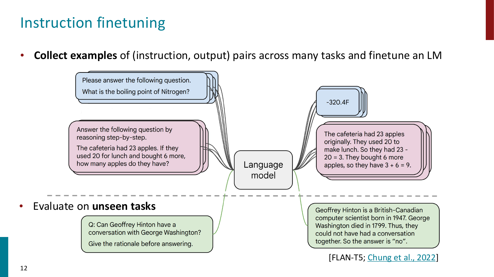
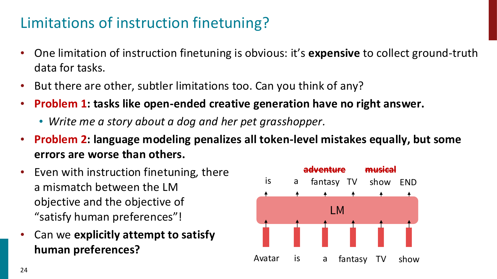
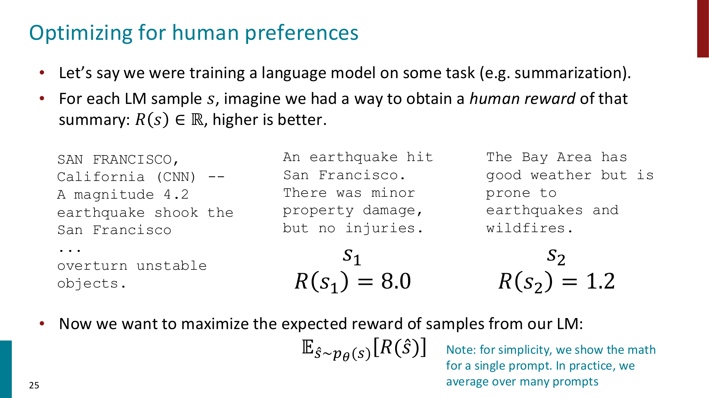
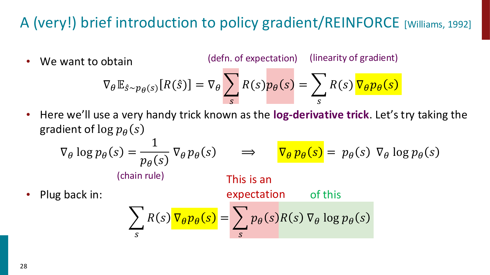
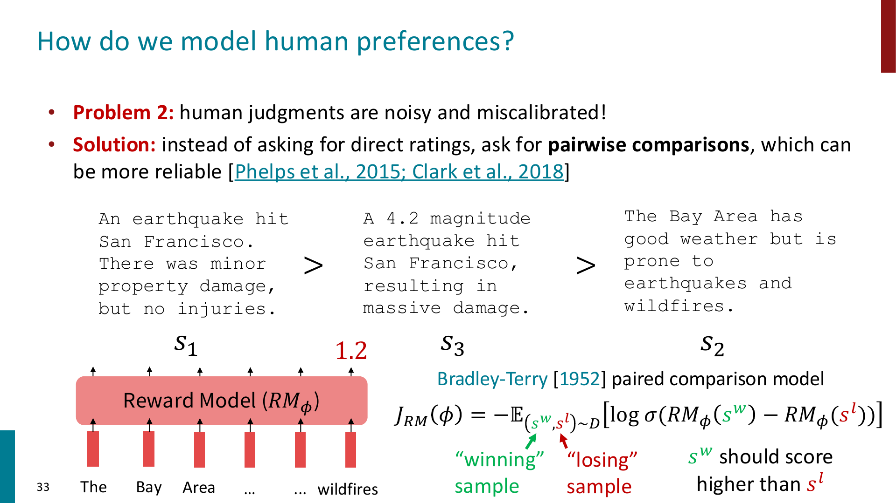
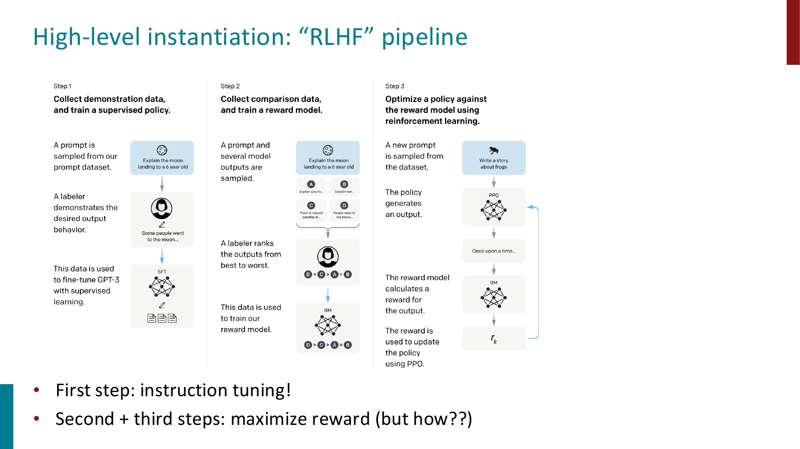
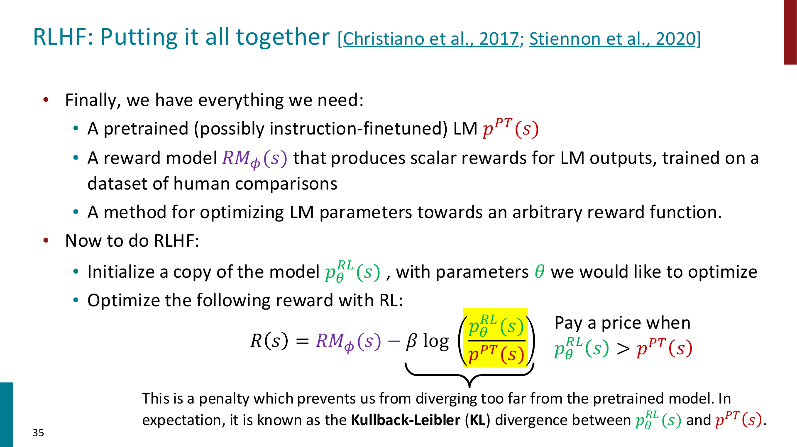
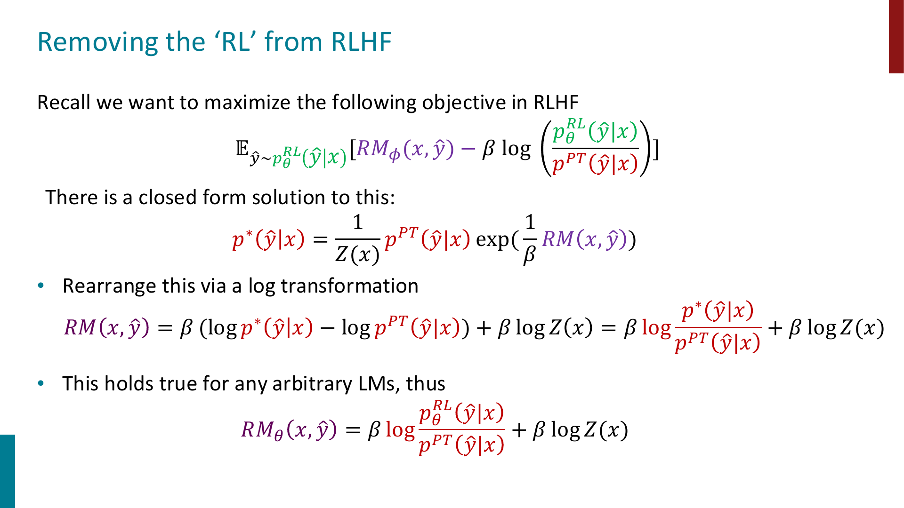
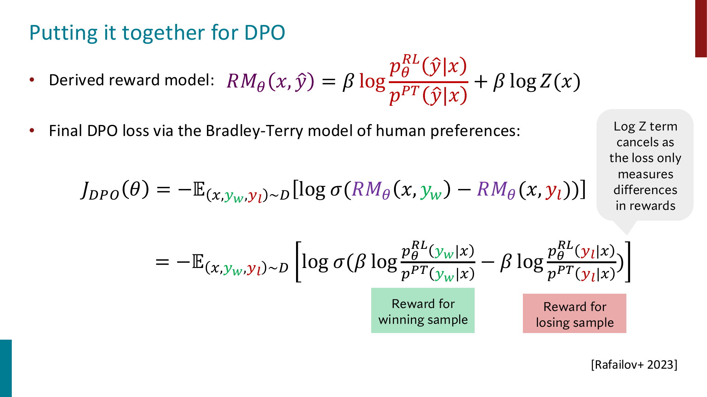

# Posttraining

Pretraining 让 language model 学会了大量语言统计规律和世界知识，但它的训练目标本质上仍然是：

$$
\text{predict next token}
$$

这并不等价于：

$$
\text{be helpful, truthful, harmless, and follow user intent}
$$

因此，base language model 往往还需要额外的 **posttraining**，让模型从“会续写文本”变成“能按照用户意图完成任务的 assistant”

!!! important

    Posttraining 的核心目标不是继续扩大预训练语料，而是让模型行为更符合人类需求。

    常见步骤包括 instruction finetuning, preference modeling, RLHF, DPO 等。

## Instruction Finetuning

Language modeling $\ne$ assisting users

一个 pretrained LM 只是在学习：

$$
p_\theta(x_t \mid x_{< t})
$$

如果给它一个 prompt，它最自然的行为是“继续写看起来像训练语料的文本”，而不一定是在认真完成用户指令

Instruction finetuning 的想法是：收集大量 `(instruction, output)` pair，然后用 supervised learning 去 finetune language model



例如训练数据可以是：

```text
Instruction: Answer the following question by reasoning step-by-step.
Input: The cafeteria had 23 apples...
Output: The cafeteria had 23 apples originally...
```

训练目标仍然是 language modeling，只是条件变成了 instruction：

$$
\max_\theta
\log p_\theta(y \mid x_{\text{instruction}})
$$

等价于最小化：

$$
J_{\text{SFT}}(\theta)
=
-
\sum_t
\log p_\theta(y_t \mid x_{\text{instruction}}, y_{< t})
$$

!!! tip

    Instruction finetuning 可以理解为：把很多不同任务都写成自然语言指令，让模型学会“看到指令后应该输出什么样的答案”。

### Scaling up finetuning

普通 finetuning 往往只针对一个具体任务，例如 sentiment classification

Instruction finetuning 则是把 finetuning 扩展到 many tasks：

- classification
- sequence tagging
- rewriting
- translation
- QA
- reasoning with rationale
- summarization

这使模型在训练时见过很多 task formats，测试时即使遇到 unseen task，也更可能理解 instruction 的含义

!!! important

    Instruction finetuning 的效果也强依赖 scale：

    model 越大、instruction tuning data 越多，通常提升越明显。

    甚至由于 Instruction finetuning 使用的数据量非常大，有些时候我们更愿意将其归为预训练而非微调

### Why instruction finetuning is not enough?

Instruction finetuning 有两个明显限制



**Problem 1: 很多任务没有唯一正确答案**

例如：

```text
Write me a story about a dog and her pet grasshopper.
```

开放式写作、对话、创意生成、总结等任务，很难说只有一个 ground-truth output

**Problem 2: token-level loss 不能表达人类偏好**

Language modeling loss 会把所有 token-level mistake 当成类似的错误

但在人类看来，不同错误的严重程度完全不同：

- 少一个无关紧要的形容词，可能问题不大
- 编造事实、误导用户、语气冒犯，问题很大

!!! important

    Instruction finetuning 仍然是在做 supervised next-token prediction。

    但我们真正想优化的是：输出是否满足 human preferences。

## Optimizing for Human Preferences

假设我们有一个 prompt，LM 可以生成不同 response

如果人类可以给每个 response 一个 reward：

$$
R(s)\in \mathbb{R}
$$

其中 $s$ 是模型生成的 sample，reward 越高代表人类越喜欢

那么我们真正想优化的是：

$$
\mathbb{E}_{\hat{s}\sim p_\theta(s)}[R(\hat{s})]
$$

也就是：希望模型生成的样本在期望意义下获得更高的人类偏好分数



!!! tip

    这一步把“训练语言模型”转成了一个 reinforcement learning 问题：

    LM 是 policy，生成的文本是 action sequence，人类偏好是 reward。

## Policy Gradient and REINFORCE

问题是：如何更新参数 $\theta$，让模型生成高 reward response 的概率变大？

我们想做 gradient ascent：

$$
\theta_{t+1}
:=
\theta_t
+
\alpha
\nabla_{\theta_t}
\mathbb{E}_{\hat{s}\sim p_{\theta_t}(s)}
[R(\hat{s})]
$$

但 reward function 可能是不可微的，因为它可能来自人类判断

policy gradient 使用一个重要技巧：**log-derivative trick**

$$
\nabla_\theta \log p_\theta(s)
=
\frac{1}{p_\theta(s)}
\nabla_\theta p_\theta(s)
$$

因此：

$$
\nabla_\theta p_\theta(s)
=
p_\theta(s)\nabla_\theta \log p_\theta(s)
$$

代回期望梯度：

$$
\nabla_\theta
\mathbb{E}_{\hat{s}\sim p_\theta(s)}[R(\hat{s})]
=
\mathbb{E}_{\hat{s}\sim p_\theta(s)}
[
R(\hat{s})
\nabla_\theta \log p_\theta(\hat{s})
]
$$



用 Monte Carlo samples 估计：

$$
\nabla_\theta
\mathbb{E}_{\hat{s}\sim p_\theta(s)}[R(\hat{s})]
\approx
\frac{1}{m}
\sum_{i=1}^m
R(s_i)
\nabla_\theta \log p_\theta(s_i)
$$

直觉上：

- 如果 $R(s_i)$ 高，就增加模型生成 $s_i$ 的概率
- 如果 $R(s_i)$ 低，就降低模型生成 $s_i$ 的概率

!!! important

    REINFORCE 的公式直觉很简单：reinforce good actions。

    但实际训练 LM 时，vanilla REINFORCE 方差高、训练不稳定、sample inefficient，所以实际 RLHF 中常用 PPO 这类更稳定的 RL algorithm。

### PPO

PPO 全称为 **Proximal Policy Optimization**

它的核心思想是：每次更新不要让 policy 变化太大

如果新 policy 相比旧 policy 改得太激进，可能会让模型突然偏离原本稳定的语言分布，训练变得不稳定

PPO 使用 probability ratio：

$$
r_t(\theta)
=
\frac{p_\theta(s_i)}{p_{\theta_{\text{old}}}(s_i)}
$$

并通过 clipping 限制 update range，例如限制在：

$$
[1-\epsilon, 1+\epsilon]
$$

!!! tip

    PPO 的作用可以理解为：既要让模型朝高 reward 的方向走，又不能一步走太远。

## Reward Modeling

直接让人类给每个模型输出打分很贵，而且人类打分容易 noisy and miscalibrated

所以 RLHF 通常先训练一个 **reward model**

$$
RM_\phi(s)
$$

它输入一个 response，输出一个 scalar reward，用来近似人类偏好

但比起让人类直接给分数，实践中更常见的是收集 **pairwise comparisons**

例如给定同一个 prompt 的两个回答：

$$
s_w \succ s_l
$$

表示人类更喜欢 winning sample $s_w$，而不是 losing sample $s_l$



Reward model 的训练目标使用 Bradley-Terry paired comparison model：

$$
J_{RM}(\phi)
=
-
\mathbb{E}_{(s^w,s^l)\sim D}
\left[
\log
\sigma
\left(
RM_\phi(s^w)
-
RM_\phi(s^l)
\right)
\right]
$$

直觉是：

$$
RM_\phi(s^w)
>
RM_\phi(s^l)
$$

也就是 reward model 应该给人类更喜欢的回答更高分

!!! important

    Pairwise comparison 通常比直接打分更可靠。

    人类可能很难稳定判断一个回答是 7 分还是 8 分，但更容易判断两个回答哪个更好。

## RLHF

RLHF 全称为 **Reinforcement Learning from Human Feedback**

它把前面几个部分组合起来：

1. 先有一个 pretrained / instruction-finetuned LM
2. 收集人类 preference data
3. 训练 reward model $RM_\phi$
4. 用 RL 优化 LM，使它生成 reward model 更喜欢的回答



在课件中，RLHF 的 reward 写成：

$$
R(s)
=
RM_\phi(s)
-
\beta
\log
\frac{
p_\theta^{RL}(s)
}{
p^{PT}(s)
}
$$

其中：

- $RM_\phi(s)$ 是 reward model 给出的偏好分数
- $p_\theta^{RL}$ 是正在被 RL 优化的 policy
- $p^{PT}$ 是原始 pretrained / instruction-finetuned model
- 第二项是 KL penalty，防止模型偏离原始模型太远



!!! important

    RLHF 不只是“最大化 reward model 分数”。

    它还通过 KL penalty 约束新模型不要离原模型太远，否则模型可能为了骗 reward model 而产生奇怪、退化或不真实的输出。

### InstructGPT and ChatGPT

课件中把 InstructGPT / ChatGPT 看成 instruction finetuning + RLHF 的代表

大致流程是：

- pretrain 一个 large language model
- 用人工 demonstration 做 supervised instruction finetuning
- 收集多个 model outputs 的 human ranking
- 训练 reward model
- 用 PPO 优化 policy

InstructGPT 的重要意义是：它把 RLHF 扩展到了大量真实用户任务上，而不仅是单一任务如 summarization

ChatGPT 则可以理解为把 instruction finetuning + RLHF 用到 dialog agent 场景中

## Limitations of RL and Reward Modeling

RLHF 很强，但它也有明显问题

### Human preferences are unreliable

人类偏好本身并不稳定：

- 不同 annotator 的标准可能不同
- 同一个 annotator 在不同时间判断也可能不同
- 标注者可能有文化、政治、教育背景上的 bias

### Reward hacking

RL 中常见问题是 **reward hacking**

也就是模型找到一种方式最大化 reward，但这种方式并不符合我们真正想要的目标

在 chatbot 中，这可能表现为：

- 回答看起来很权威，但其实是 hallucination
- 输出更长、更有条理，因此 reward model 更喜欢，但内容未必更准确
- 学会迎合偏好模型，而不是真正解决用户问题

!!! important

    Reward model 只是人类偏好的近似模型。

    如果过度优化这个近似目标，模型可能学会 exploit reward model，而不是满足真实人类需求。

### RL optimization is complex

RLHF 中的 PPO 训练也比较复杂：

- 需要 online sampling，训练慢
- 需要 fitting value function
- 对 hyperparameters 敏感
- 训练过程不稳定
- compute cost 高

这也是后面 DPO 这类方法出现的重要动机：能不能保留 preference optimization 的效果，但去掉复杂的 RL loop？

## Direct Preference Optimization

DPO 全称为 **Direct Preference Optimization**

它的目标是：直接用 preference data 优化 policy，而不显式训练 reward model，也不跑 PPO

换句话说：

> removing the "RL" from RLHF

### From RLHF objective to DPO

RLHF 想最大化：

$$
\mathbb{E}_{\hat{y}\sim p_\theta^{RL}(\hat{y}\mid x)}
\left[
RM_\phi(x,\hat{y})
-
\beta
\log
\frac{
p_\theta^{RL}(\hat{y}\mid x)
}{
p^{PT}(\hat{y}\mid x)
}
\right]
$$

这个目标有一个 closed-form optimal policy：

$$
p^*(\hat{y}\mid x)
=
\frac{1}{Z(x)}
p^{PT}(\hat{y}\mid x)
\exp
\left(
\frac{1}{\beta}
RM(x,\hat{y})
\right)
$$

整理后可以得到：

$$
RM(x,\hat{y})
=
\beta
\log
\frac{
p^*(\hat{y}\mid x)
}{
p^{PT}(\hat{y}\mid x)
}
+
\beta \log Z(x)
$$



DPO 的关键想法是：用当前 policy $p_\theta$ 来表示这个 implicit reward

$$
RM_\theta(x,\hat{y})
=
\beta
\log
\frac{
p_\theta(\hat{y}\mid x)
}{
p_{\text{ref}}(\hat{y}\mid x)
}
+
\beta \log Z(x)
$$

其中 $p_{\text{ref}}$ 通常是 reference model，例如 SFT model

!!! tip

    DPO 不需要单独训练一个 reward model。

    它把“这个回答有多好”转成了当前 policy 相对 reference policy 给这个回答提高了多少概率。

### DPO loss

Preference data 的形式是：

$$
(x, y_w, y_l)
$$

其中：

- $x$ 是 prompt
- $y_w$ 是 human-preferred winning response
- $y_l$ 是 losing response

DPO 使用 Bradley-Terry 形式：

$$
J_{DPO}(\theta)
=
-
\mathbb{E}_{(x,y_w,y_l)\sim D}
\left[
\log
\sigma
\left(
RM_\theta(x,y_w)
-
RM_\theta(x,y_l)
\right)
\right]
$$

把 implicit reward 代入后：

$$
J_{DPO}(\theta)
=
-
\mathbb{E}_{(x,y_w,y_l)\sim D}
\left[
\log
\sigma
\left(
\beta
\log
\frac{p_\theta(y_w\mid x)}{p_{\text{ref}}(y_w\mid x)}
-
\beta
\log
\frac{p_\theta(y_l\mid x)}{p_{\text{ref}}(y_l\mid x)}
\right)
\right]
$$



注意 $\beta\log Z(x)$ 会消掉，因为 loss 只关心 winning 和 losing response 的 reward 差

!!! important

    DPO 的直觉是：

    - 提高模型给 preferred response $y_w$ 的相对概率
    - 降低模型给 dispreferred response $y_l$ 的相对概率
    - 同时通过 reference model ratio 保持模型不要偏离原分布太远

## Human Preference Data

Posttraining 的效果很大程度上依赖 preference data 的质量

但这些 labels 本身也有复杂问题：

- RLHF labels 往往来自低薪标注者
- 标注者偏好会影响模型行为
- 不同国家、文化、政治立场、教育背景的人对“好回答”的标准可能不同
- 如果 preference data 有偏，模型会把这种偏好学习进去

!!! important

    Human feedback 并不是一个客观、无偏、完美的 reward source。

    它本身也是一种带有社会、文化、经济背景的训练信号。

### Human feedback vs AI feedback

由于 human feedback 很贵，后续很多工作尝试使用 AI feedback

例如：

- 用更强模型给 response 排名
- 用模型自己生成 instruction tuning data
- 用模型 critique 或 revise 自己的输出

这可以降低数据成本，但也带来新的风险：

- AI feedback 会继承 judge model 的偏差
- 如果模型互相训练，错误可能被放大
- 评估结果可能更偏向“像模型喜欢的回答”，而不是真正符合人类需求

## Summary of Posttraining

可以把 Posttraining 的主线总结成：

- Pretraining 让模型学会语言建模，但不保证模型会按照用户意图行动
- Instruction finetuning 用 `(instruction, output)` 数据让模型学会 follow instructions
- Instruction finetuning 仍然受限于 token-level supervised learning，无法充分表达 open-ended human preferences
- RLHF 用 human preference data 训练 reward model，再用 RL 优化 LM
- Reward model 通常用 pairwise comparisons 和 Bradley-Terry loss 训练
- RLHF 需要 KL penalty，防止 policy 偏离原模型太远
- PPO 是常见 RLHF 优化方法，但复杂、昂贵、对超参数敏感
- DPO 直接用 preference pairs 优化 policy，绕开显式 reward model 和 PPO
- Preference data 本身也可能带有 bias，因此 posttraining 不只是技术问题，也是数据和价值选择问题
