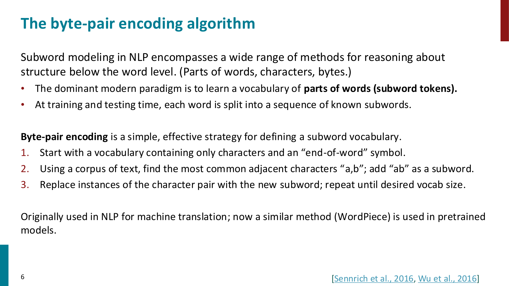
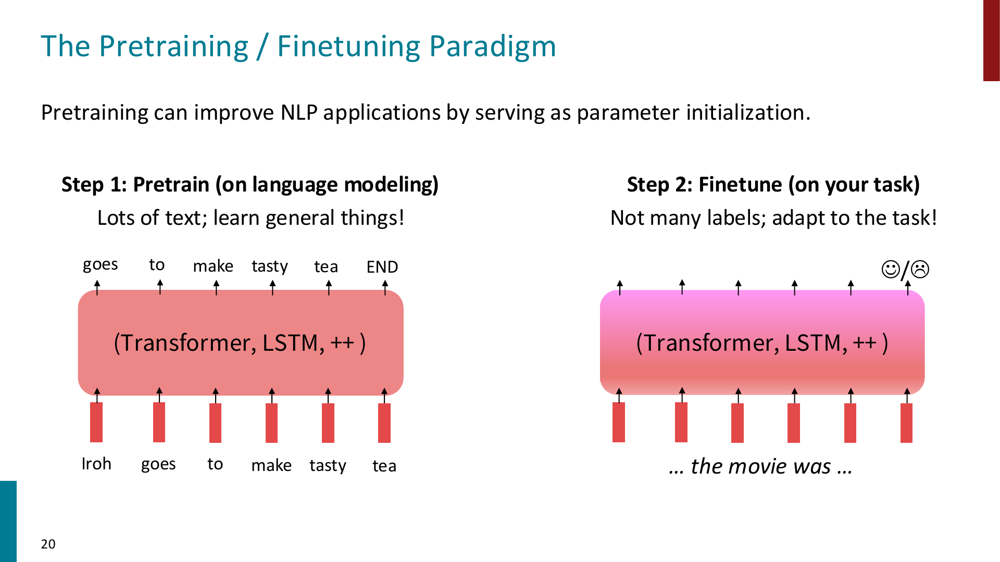
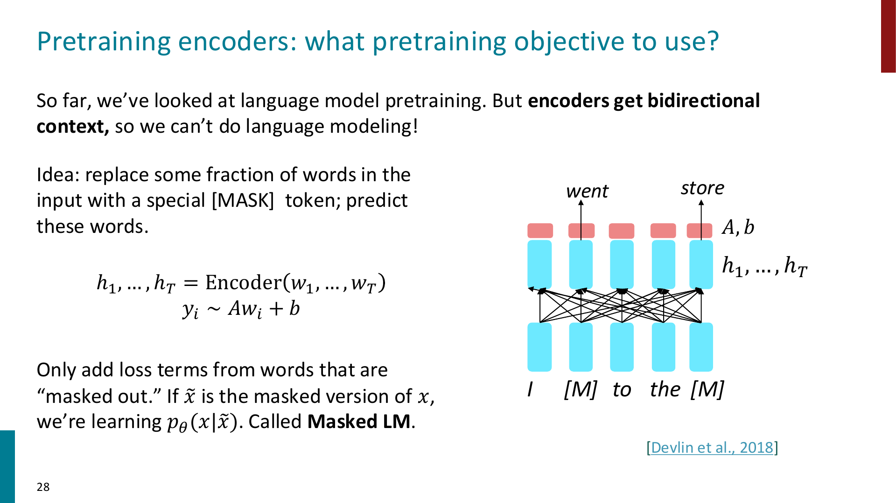
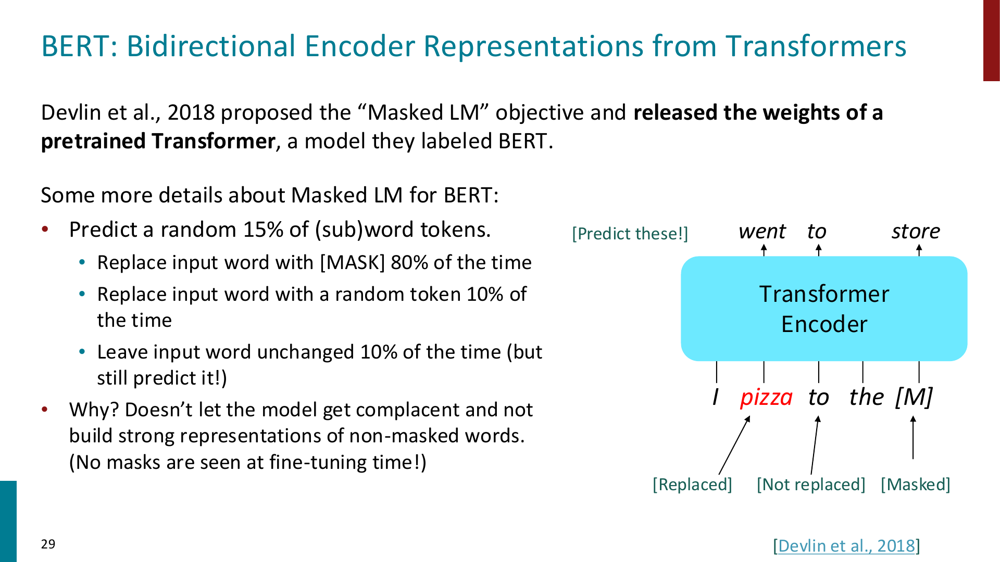
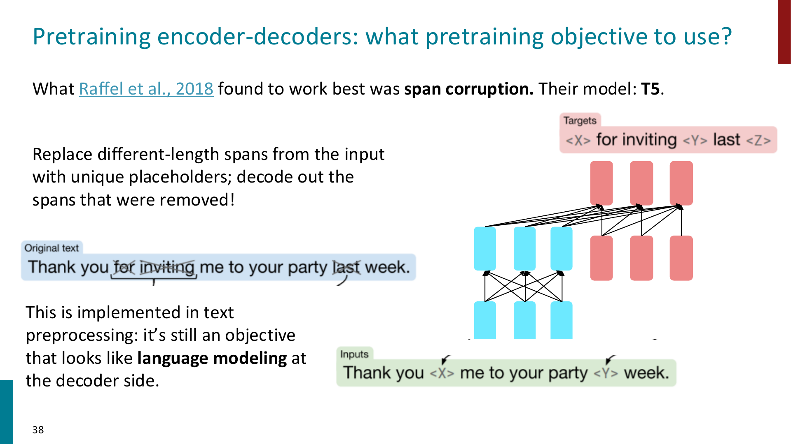
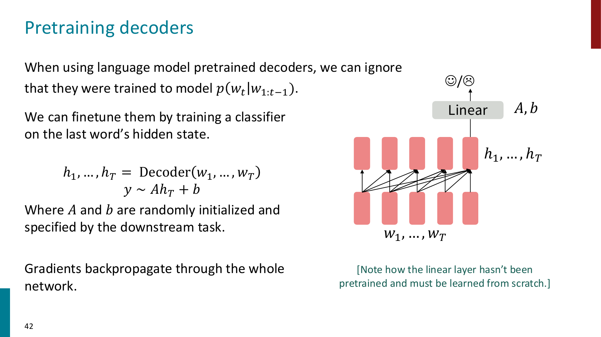
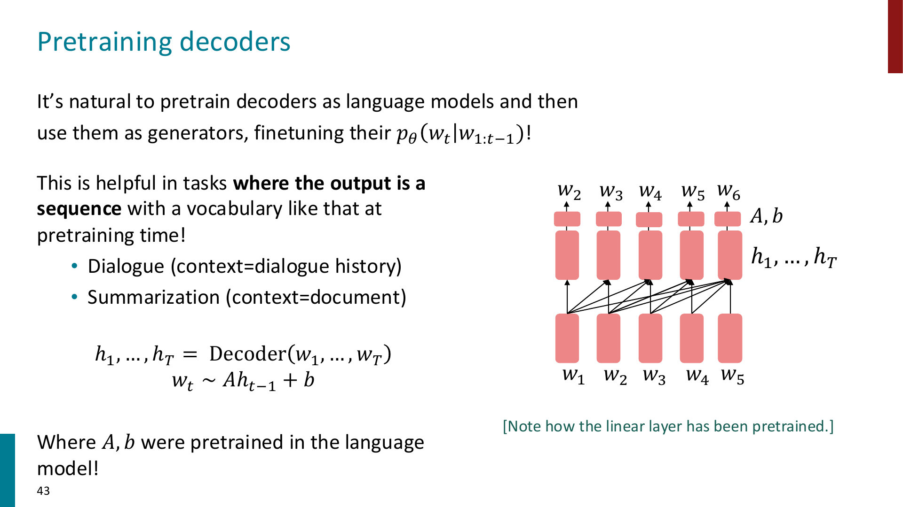
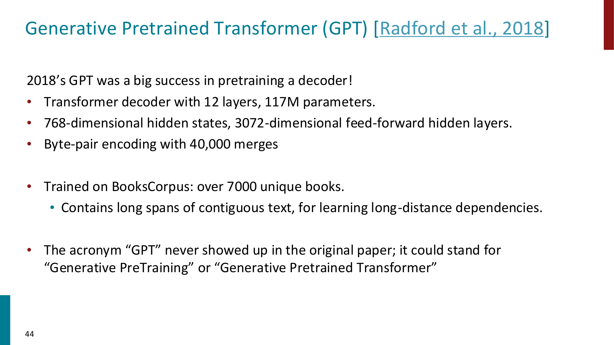
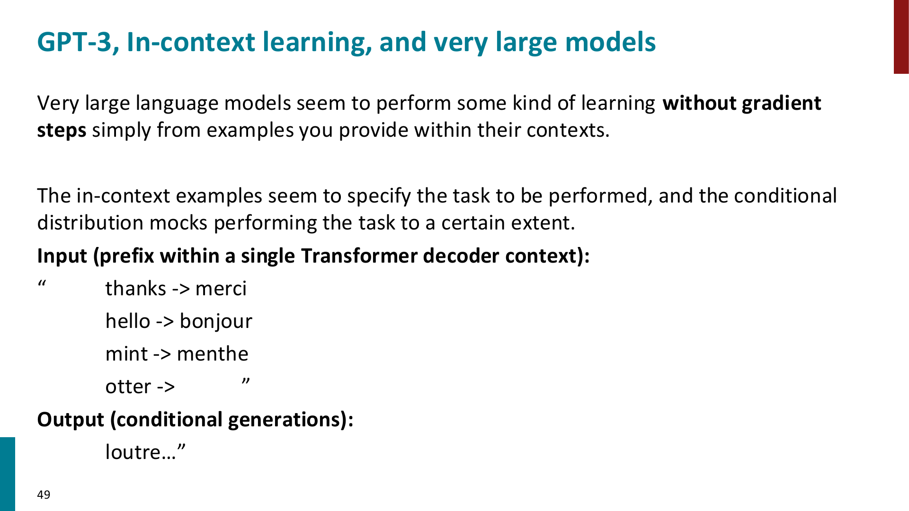
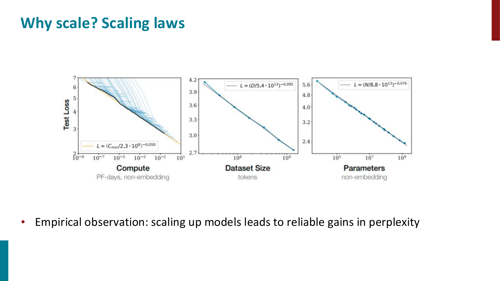

# Pretraining

Pretraining 的核心思想是：先在大规模、通常不需要人工标注的文本上训练模型，让模型学到比较通用的语言知识；然后再把这个模型拿到具体任务上 finetune

也就是：

$$
\text{large unlabeled text}
\rightarrow
\text{pretrained model}
\rightarrow
\text{downstream task}
$$

!!! important

    Pretraining 能 scale 的关键在于：不要依赖昂贵的 labeled data，而是利用互联网上大量自然文本构造自监督任务。

    常见的做法是：hide parts of the input, then train the model to reconstruct them.

## Subword Modeling

之前我们把词表看成一个固定大小的 word vocabulary，如果测试时出现词表里没有的词，就只能映射成 `UNK`

这会带来几个问题：

- 拼写错误，例如 `laern`
- 新词，例如 `Transformerify`
- 罕见词
- 形态变化，例如同一个词根的不同变体

如果所有没见过的词都变成同一个 `UNK`，模型就完全丢失了这些词内部的结构信息

因此现代 NLP 通常使用 **subword tokens**：不一定把一个 word 当成最小单位，而是把 word 切成更小的 pieces



### Byte-Pair Encoding

Byte-Pair Encoding (BPE) 是一种构造 subword vocabulary 的简单方法：

1. 从 character-level vocabulary 开始，包含所有字符以及 end-of-word symbol
2. 在 corpus 中找到最常见的相邻 token pair，例如 `a,b`
3. 把这个 pair 合并成新的 subword token `ab`
4. 重复这个过程，直到达到想要的 vocab size

这样会形成一个介于 character 和 word 之间的 vocabulary

- 高频词可能直接成为一个完整 token，例如 `hat`
- 低频词会被拆成多个 subword
- 最坏情况下，一个词可以被拆成字符序列，因此不容易出现完全无法表示的 `UNK`

!!! tip

    Subword modeling 的好处是：模型既不用维护极其巨大的 word vocabulary，也不会像 character-level model 那样让序列变得特别长。

    它是在 vocabulary size 和 sequence length 之间做折中。

## From word embeddings to model pretraining

在最早的做法里，我们已经见过一种 pretraining：预训练 word embeddings

例如 word2vec / GloVe：

$$
\text{large corpus}
\rightarrow
\text{word vectors}
\rightarrow
\text{downstream model}
$$

但是 pretrained word embeddings 有一个重要限制：**同一个 word 在不同句子里仍然对应同一个 vector**

比如：

> I record the record.

这里两个 `record` 一个更像 verb，一个更像 noun，但静态 word embedding 会给它们相同的初始表示

!!! important

    Word embedding pretraining 只预训练了 embedding matrix，大部分上下文建模参数仍然是随机初始化的。

    Model pretraining 则是把整个 Transformer / LSTM 等模型都预训练，让模型在 pretraining 阶段就学习如何根据上下文表示 token 和句子。

现代 NLP 的 pretraining 更像：

$$
\text{large corpus}
\rightarrow
\text{pretrained whole model}
\rightarrow
\text{finetune on downstream task}
$$

这使模型学到的不只是 word-level semantics，还包括 syntax, coreference, sentiment, factual knowledge, topic 等更复杂的语言规律

## Pretraining / Finetuning Paradigm



Pretraining / Finetuning 可以分成两步：

1. **Pretrain**
   - 使用大量 unlabeled text
   - 学习通用语言结构和参数初始化
   - 训练任务通常是 language modeling 或 reconstruct corrupted input
2. **Finetune**
   - 使用具体 downstream task 的 labeled data
   - 数据量通常小很多
   - 在预训练参数基础上继续训练，让模型适应具体任务

以 language modeling pretraining 为例，模型学习：
$$
p_\theta(w_t \mid w_1,\dots,w_{t-1})
$$

训练目标是最大化真实文本的概率，等价于最小化 negative log-likelihood：
$$
J(\theta)
=
-
\sum_t
\log p_\theta(w_t \mid w_{<t})
$$

pretrain 完后，保存模型参数，然后在下游任务上继续训练

!!! tip

    可以把 pretraining 看成一种强大的 parameter initialization。

    随机初始化的模型从零开始学语言；pretrained model 已经通过大量文本学过语言，再用少量 labeled data 去适配任务。

## Model pretraining three ways

不同 Transformer 架构适合不同的预训练方式：

- **Encoder**
  - 可以看到 bidirectional context
  - 适合做 classification, tagging, retrieval, NLU 等理解类任务
  - 代表模型：BERT
- **Encoder-Decoder**
  - encoder 负责理解输入，decoder 负责生成输出
  - 适合 seq2seq 任务
  - 代表模型：T5
- **Decoder**
  - 使用 causal mask，只能看 left context
  - 最自然的目标就是 language modeling
  - 适合 autoregressive generation
  - 代表模型：GPT

## Pretraining Encoders

Encoder 的 self-attention 是 bidirectional 的，每个位置都能看到左右两边的 token

这就导致它不能直接做普通 language modeling：

$$
p_\theta(w_t \mid w_{<t})
$$

因为 encoder 在表示 $w_t$ 的时候已经看到了未来 token，如果还让它预测下一个词，就会发生信息泄漏

因此 BERT 使用 **Masked Language Modeling (MLM)**：

> 随机 mask 掉输入中的一部分 token，让 encoder 根据双向上下文预测被 mask 的 token



设原始输入是：
$$
x = (x_1,\dots,x_T)
$$
mask 后的输入是：
$$
\tilde{x}
$$
encoder 输出 hidden states：
$$
h_1,\dots,h_T = \text{Encoder}(\tilde{x})
$$
对于被 mask 的位置 $i$，用 hidden state 预测原 token：
$$
p_\theta(x_i\mid \tilde{x})
=
\text{softmax}(Ah_i+b)
$$
loss 只在被 mask 的位置上计算：
$$
J(\theta)
=
-
\sum_{i\in M}
\log p_\theta(x_i\mid \tilde{x})
$$

其中 $M$ 是被 mask 的位置集合

!!! important

    MLM 的关键是：encoder 可以利用左右两边的 context，因此它学到的是 bidirectional contextual representation。

    这也是 BERT 适合理解类任务的原因。

### BERT

BERT 全称为 **Bidirectional Encoder Representations from Transformers**



BERT 的 MLM 细节：

- 随机选择 15% 的 subword tokens 来预测
- 对被选中的 token：
  - 80% 替换成 `[MASK]`
  - 10% 替换成 random token
  - 10% 保持原 token 不变，但仍然要求模型预测它

为什么不总是替换成 `[MASK]`？

因为 finetuning 和 test time 通常不会出现 `[MASK]`，如果模型只在 `[MASK]` 位置上学习表示，pretraining 和 finetuning 之间会产生 mismatch

!!! tip

    BERT 让一部分被预测 token 保持不变，目的是逼模型对所有位置都构建强 representation，而不是只对显式 `[MASK]` 的位置认真建模。

BERT 还使用过 **Next Sentence Prediction (NSP)**：

- 输入两个连续文本片段
- 判断第二个片段是否真的跟在第一个片段后面

不过后来的工作认为 NSP 不一定必要，例如 RoBERTa 主要通过训练更久、使用更多数据、去掉 NSP 来改进 BERT

BERT 的常见规模：

- BERT-base: 12 layers, 768 hidden size, 12 attention heads, 110M parameters
- BERT-large: 24 layers, 1024 hidden size, 16 attention heads, 340M parameters

!!! important

    BERT 这类 encoder-only model 不适合直接做自然的 autoregressive generation。

    因为它的预训练目标不是从左到右生成词，而是根据双向上下文填空。

### Extensions of BERT

课件中提到两个常见扩展：

- **RoBERTa**
  - 更长时间训练
  - 更多数据
  - 去掉 Next Sentence Prediction
- **SpanBERT**
  - 不只是 mask 单个 token，而是 mask 连续 span
  - 任务更难，也更接近很多需要短语级理解的任务

!!! tip

    从 RoBERTa 可以看到一个重要结论：不改变 Transformer encoder 结构，只增加数据和计算，也可能显著提升 pretraining 效果。

## Pretraining Encoder-Decoders

Encoder-decoder 架构同时有：

- encoder 的 bidirectional understanding
- decoder 的 autoregressive generation

因此它很自然地适合 seq2seq task，例如 translation, summarization, question answering

一种简单想法是：把输入前缀给 encoder，然后让 decoder 继续做 language modeling

但 T5 发现更有效的方式是 **span corruption**



Span corruption 的做法：

1. 从原始文本中删除若干连续 span
2. 用特殊 placeholder 替换每个被删掉的 span，例如 `<X>`, `<Y>`
3. decoder 的目标是按顺序生成被删除的 spans

例如：

$$
\text{Original: Thank you for inviting me to your party last week.}
$$

corrupted input:
$$
\text{Thank you <X> me to your party <Y> week.}
$$

target:
$$
\text{<X> for inviting <Y> last <Z>}
$$

!!! important

    T5 的 span corruption 本质上是一个 denoising objective：

    给模型一个被破坏的输入，让它恢复缺失内容。

    decoder 端仍然是 autoregressive generation，所以训练形式依然像 language modeling。

T5 还有一个重要思想：把各种 NLP task 都表示成 text-to-text

例如：

$$
\text{input text}
\rightarrow
\text{output text}
$$

这样 classification, translation, summarization, QA 都可以统一成“输入一段文本，输出一段文本”

## Pretraining Decoders

Decoder-only Transformer 使用 causal mask，只能 attend to past tokens

因此它最自然的 pretraining objective 就是 language modeling：
$$
p_\theta(w_t \mid w_{<t})
$$

也就是：
$$
p_\theta(w_1,\dots,w_T)
=
\prod_{t=1}^{T}
p_\theta(w_t\mid w_{<t})
$$

### Finetune decoder for classification

如果下游任务是分类任务，可以把整段输入喂给 pretrained decoder，然后取最后一个 token 的 hidden state 做分类



形式上：
$$
h_1,\dots,h_T
=
\text{Decoder}(w_1,\dots,w_T)
$$
$$
y
\sim
\text{softmax}(Ah_T+b)
$$

其中 $A,b$ 是下游任务新增的 classifier 参数，通常是随机初始化的

!!! tip

    这里 pretrained decoder 提供语言表示能力，而最后的 linear classifier 需要从下游 labeled data 中学习。

### Finetune decoder for generation

如果下游任务本身就是生成序列，例如 dialogue 或 summarization，那么 decoder-only model 可以更自然地继续使用 language modeling head



例如 summarization 可以写成：

$$
\text{document + prompt}
\rightarrow
\text{summary}
$$

模型继续预测：
$$
w_t
\sim
\text{softmax}(Ah_{t-1}+b)
$$

这时 $A,b$ 也来自 language modeling pretraining，因此输出层本身也已经被预训练过

!!! important

    对于生成任务，pretrained decoder 的优势很直接：pretraining 和 finetuning 都在做 next-token prediction，只是条件文本和目标文本变了。

### GPT

GPT 是 decoder-only pretraining 的代表



课件中 GPT-1 的设置：

- Transformer decoder
- 12 layers
- 117M parameters
- hidden size 768
- FFN hidden size 3072
- BPE with 40,000 merges
- 使用 BooksCorpus 训练

对于一些分类任务，GPT 会把输入格式化成一个 token sequence，然后在特殊 token 的表示上做分类

例如 natural language inference：

```text
[START] premise [DELIM] hypothesis [EXTRACT]
```

然后把 classifier 接在 `[EXTRACT]` token 的 hidden state 上

## In-context Learning

当 decoder language model 变得非常大时，它不一定需要 gradient update 才能适配一个任务

如果我们在 prompt 里给出几个输入输出示例，模型可能会根据这些 examples 推断接下来要做什么，这叫 **in-context learning**



例如 prompt 中给出：

```text
thanks -> merci
hello -> bonjour
mint -> menthe
otter ->
```

模型可能继续生成：

```text
loutre
```

!!! important

    In-context learning 没有更新模型参数。

    它只是把 examples 放进当前 context，让 decoder 根据 prefix 的条件分布继续生成。

这和 finetuning 的区别是：

- finetuning: 用 labeled data 更新参数
- in-context learning: 不更新参数，只改变输入 prompt

## Scaling Laws

课件中还强调了 scaling 的重要性：随着 model size, dataset size, compute 增大，language model 的 perplexity / loss 通常会稳定下降



粗略来说，大 Transformer 的训练成本和下面两个因素强相关：

$$
\text{training cost}
\propto
\text{number of parameters}
\times
\text{number of training tokens}
$$

所以不是参数越大越好，还要考虑 data 和 compute 的分配

!!! tip

    Compute-aware scaling 的核心问题是：

    给定固定训练预算，应该把 compute 用在更大的 model 上，还是更多的 training tokens 上？

    如果模型太大但数据不够，可能并不是最优；更小但训练 token 更多的模型有时反而效果更好。

## What does pretraining teach?

Pretraining 的任务看起来只是“预测缺失 token”或“预测下一个 token”，但为了做好这些任务，模型会被迫学习很多语言和世界知识

例如：

- `Stanford University is located in ___, California.`
  - factual knowledge
- `I put ___ fork down on the table.`
  - syntax
- `The woman walked across the street, checking for traffic over ___ shoulder.`
  - coreference
- `I went to the ocean to see the fish, turtles, seals, and ___.`
  - lexical semantics / topic
- `The movie was ___.`
  - sentiment

!!! important

    Pretraining 并不是显式告诉模型 grammar, sentiment, coreference rules。

    这些能力是模型为了降低 language modeling / reconstruction loss，从大规模文本统计中间接学出来的。

但 pretraining 也会带来问题：

- 模型可能记住训练数据中的内容
- 训练数据可能包含 copyrighted material 或 private information
- 模型会学习并放大数据中的 bias，例如 racism, sexism 等

因此 pretraining 的效果很强，但它不是免费且无风险的：数据来源、隐私、版权、公平性都需要被认真考虑

## Summary of Pretraining

可以把这一章的主线总结成：

- Subword modeling 解决固定 word vocabulary 和 `UNK` 的问题
- Pretraining 从静态 word embeddings 发展到 whole-model pretraining
- Pretraining / finetuning paradigm 用大量无标注数据学习通用能力，再用少量标注数据适配任务
- Encoder-only model 使用 MLM，代表是 BERT
- Encoder-decoder model 常用 denoising / span corruption，代表是 T5
- Decoder-only model 使用 language modeling，代表是 GPT
- 大模型可以通过 prompt 做 in-context learning
- Scaling laws 说明 model size, data size, compute 对效果有可预测影响
- Pretraining 会学习很多有用语言规律，也会继承和放大训练数据中的风险
