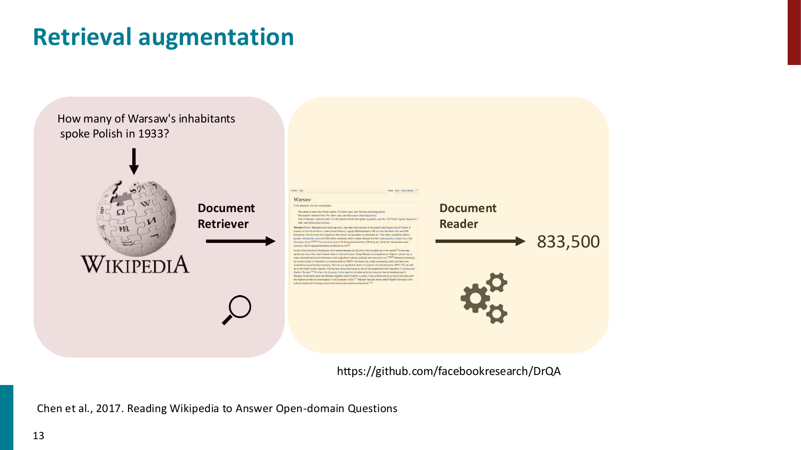
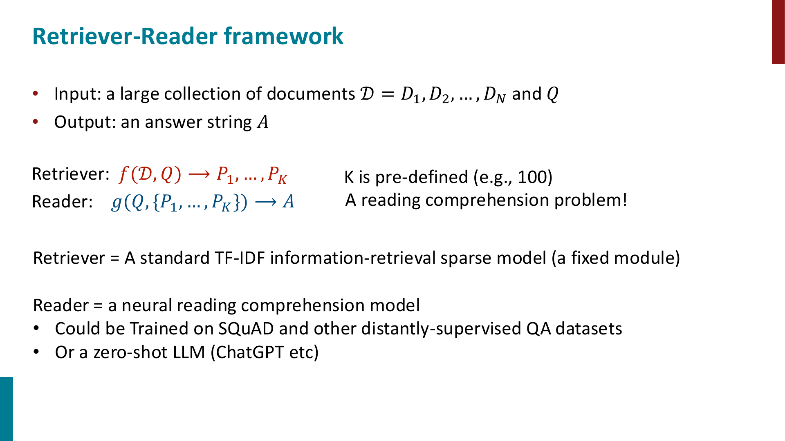
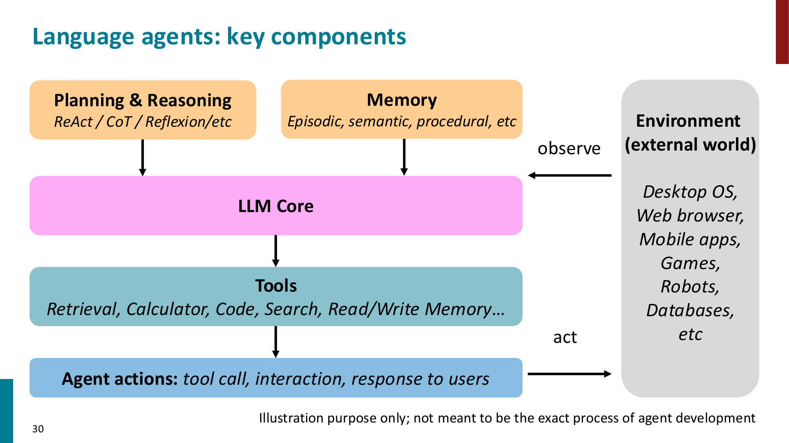

# RAG and Language Agents

这一章的核心问题是：

> 如果模型本身没有记住某个事实，或者知识已经过时，能不能在推理时动态拿到外部信息？

## Open-domain QA

Reading comprehension 通常会给定 passage，模型只需要在给定文本里找答案。

Open-domain QA 更难：

- 没有直接给定 evidence passage
- 文档库可能很大，例如 Wikipedia / web corpus
- 模型需要先找到 relevant documents，再回答问题

所以 open-domain QA 通常被拆成两步：

$$
\text{retrieve} \rightarrow \text{read / generate}
$$

## Retrieval-Augmented Generation

RAG 的基本思想是：不要要求 language model 把所有知识都存在参数里，而是在 inference time 检索相关文档，再把文档作为 context 提供给模型。

RAG 的优点：

- **Dynamic**
    - 文档库可以更新，不一定要重新训练模型
- **Interpretable**
    - retrieved documents 可以作为 evidence / citation
- **Knowledge efficient**
    - 减少模型单纯依赖 parametric memory 的压力

!!! important

    RAG 的关键不是“把更多文本塞进 prompt”，而是把更相关、更可靠的 evidence 放到模型能使用的位置。

## Retriever-reader framework

典型 RAG 系统可以写成：

给定文档库 $D = \{D_1,\dots,D_N\}$ 和问题 $Q$：

$$
\text{Retriever: } f(D,Q) \rightarrow P_1,\dots,P_K
$$

$$
\text{Reader: } g(Q,\{P_1,\dots,P_K\}) \rightarrow A
$$

其中：

- **Retriever**
    - 找出和 query 最相关的 passages
    - 可以是 sparse retrieval，例如 TF-IDF / BM25
    - 也可以是 dense retrieval，例如 DPR / embedding search
- **Reader / Generator**
    - 基于 retrieved passages 生成最终答案
    - 现在常用 instruction-tuned LLM 直接完成这一步

!!! tip

    如果 retriever 没有把答案相关文档召回，后面的 LLM 通常也很难补救。

## Limitations of RAG

RAG 不是简单地“接上搜索引擎就解决 hallucination”。

几个常见问题：

- **Retriever recall**
    - relevant document 没被找回来，答案就会缺 evidence
- **Long-context utilization**
    - 即使放入很多文档，模型也不一定真正使用关键信息
- **Citation hallucination**
    - 模型可能生成看起来合理但并不支持答案的 citation
- **Context saturation**
    - 加更多 retrieved passages 不一定持续提升效果，甚至可能引入噪声

## Language Agents

Agent 的核心区别在于：模型不只是输出文本，还可以根据 observation 做 action。

一个 language agent 通常包含：

- **LLM Core**
    - 负责理解任务、规划、生成下一步动作
- **Planning and Reasoning**
    - 把复杂任务拆成多个 steps
- **Memory**
    - 存储经验、知识或长期偏好
- **Tools**
    - 调用 retrieval、calculator、code interpreter、browser、API 等
- **Environment**
    - agent 执行动作并获得 observation 的外部世界

## Reasoning, memory, and tools

几个代表性方向：

- **ReAct**
    - interleave reasoning and acting
    - 每一步可以先思考，再调用工具，再根据 observation 更新下一步
- **Self-consistency**
    - 采样多条 reasoning paths，再聚合答案
- **Reflexion**
    - 把失败经验转化为 natural language feedback，作为后续尝试的 memory
- **Tool use**
    - 让模型学习什么时候调用工具，以及如何组织 tool input / output

Memory 可以粗略分成：

- **Episodic memory**
    - 过去发生过的 experiences
- **Semantic memory**
    - facts / knowledge
- **Procedural memory**
    - skills / procedures

## Summary of RAG and Agents

- RAG 把 external knowledge 引入 inference process
- RAG 系统通常包含 retriever 和 reader / generator
- Retriever 决定 evidence 是否能被召回，是系统上限的重要来源
- LLM 是否能正确使用 retrieved context 仍然是难点
- Agent 在 LLM 外面加入 tools、memory、planning 和 environment interaction
- ReAct, self-consistency, Reflexion 都是在提升 reasoning / action loop 的可靠性
