# Reasoning

Reasoning 两讲的主线可以概括成：

> reasoning 不只是一个 prompt trick，而是 decoding、RL training、test-time compute、long-context ability 共同作用的结果。

## Decoding during inference

Autoregressive LM 在每一步都会给出下一个 token 的分布：

$$
p_\theta(y_t \mid y_{<t}, x)
$$

Decoding algorithm 决定如何从这个分布中选择下一个 token。

最基本的选择方式：

- **Greedy decoding**
    - 每一步选择概率最大的 token
    - 计算简单，可复现
    - 缺点是 myopic，只做 local optimum
- **Beam search**
    - 每一步保留 top-$k$ 个 partial hypotheses
    - 当 $k=1$ 时退化成 greedy decoding
    - 在传统 NLP 里常用，但现代 LLM 里不是默认选择
- **Sampling**
    - 从概率分布中采样
    - 更适合开放式生成和需要多样 reasoning paths 的任务

!!! important

    Decoding 不是模型参数的一部分，而是 inference-time 的选择策略。

## Neural text degeneration

一个反直觉现象是：最可能的 sequence 不一定是最自然的 sequence。

高概率文本可能出现 repetition / looping：

$$
\text{"I don't know."} \rightarrow
\text{"I don't know. I don't know. I don't know."}
$$

在 reasoning models 里，looping 仍然可能出现，尤其是：

- temperature 太低
- 模型较小
- 题目较难
- reasoning trace 很长

所以 decoding 需要在 **quality, diversity, coherence** 之间做 tradeoff。

## Top-k, Top-p and temperature

Vanilla sampling 的问题是：long tail 里有很多低概率但质量差的 token。单个 token 概率很低，但长文本生成时累计起来仍然可能被采到。

**Top-k sampling**：

- 只在概率最高的 $k$ 个 tokens 中采样
- 简单直接
- 但固定 $k$ 不适应不同分布形状

**Top-p / nucleus sampling**：

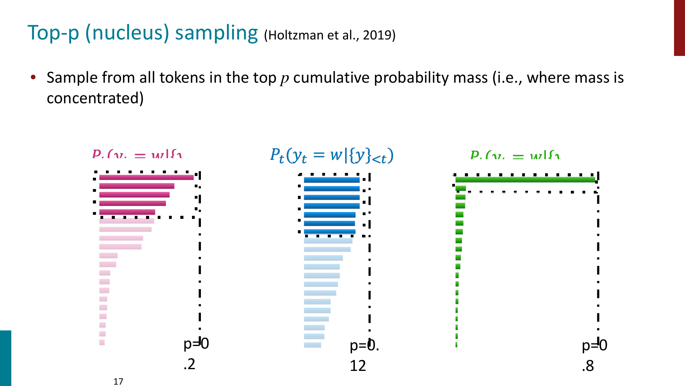

Top-p 不固定 token 数量，而是选择累计概率达到 $p$ 的最小 token 集合：

$$
V_p = \min \left\{ V' : \sum_{v \in V'} p(v) \ge p \right\}
$$

然后只在 $V_p$ 里采样。

**Temperature sampling**：

$$
p_i =
\frac{\exp(z_i / T)}
{\sum_j \exp(z_j / T)}
$$

- $T < 1$
    - distribution 更 sharp
    - 更 deterministic
- $T > 1$
    - distribution 更 flat
    - 更多 diversity

!!! tip

    Temperature 是 decoding hyperparameter，不是单独的 decoding algorithm。

## Greedy vs sampling

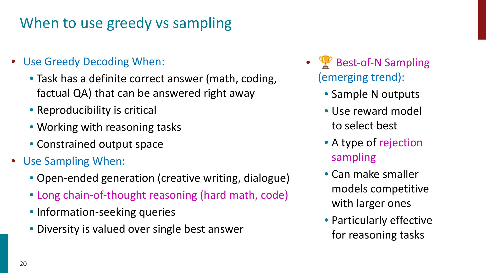

可以粗略记成：

- **Greedy decoding**
    - factual QA
    - coding / math 中有明确答案的问题
    - constrained output
    - 需要 reproducibility
- **Sampling**
    - creative writing
    - dialogue
    - information-seeking
    - long chain-of-thought reasoning

Reasoning 任务里一个常见趋势是 **Best-of-N sampling**：

$$
\text{sample } N \text{ solutions}
\rightarrow
\text{score with verifier / reward model}
\rightarrow
\text{choose best}
$$

这本质上是一种 rejection sampling，也是一种 test-time compute scaling。

## DeepSeek R1-Zero and RLVR

R1-Zero 的重要点在于：它展示了 outcome-based RL 可以诱导 reasoning behavior。

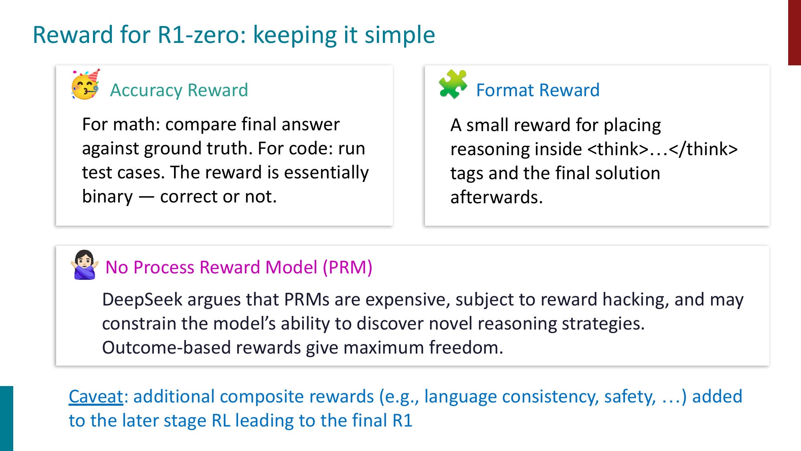

R1-Zero 的 reward 设计比较简单：

- **Accuracy reward**
    - math 对 final answer
    - code 跑 test cases
    - reward 基本是 binary correct / incorrect
- **Format reward**
    - 鼓励模型把 reasoning 放在 `<think>...</think>` 中
- **No Process Reward Model**
    - 不显式奖励每一步推理
    - 给模型更大探索空间

!!! important

    RLVR 的关键是 verifiable reward。它适合 math / code 这类答案可验证的问题，但不容易直接覆盖 open-ended generation。

## Emergent reasoning behaviors

R1-Zero 中出现了一些 emergent behaviors：

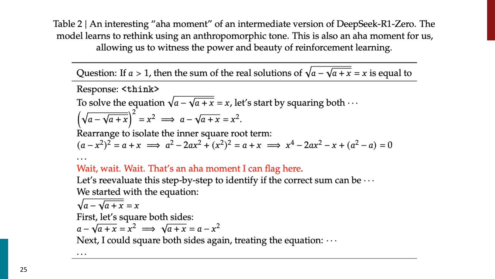

- **Self-verification**
    - 模型会检查自己的中间结果
- **Reflection and backtracking**
    - 发现当前路线不对后重新尝试
- **Extended deliberation**
    - response length 增长，模型学会在难题上花更多 thinking tokens

但 R1-Zero 也有明显缺点：

- reasoning trace 可读性差
- 容易 code switching
- 对 verifiable domains 更有效
- 不会自动学到 general safety guardrails

所以最终 R1 仍然需要 SFT + RL 的多阶段 pipeline。

## R1 takeaways

课件中对 R1 系列的发现可以总结为：

- RL alone 可以诱导 reasoning，但并不等于最终系统只靠 RL
- Outcome reward 给模型探索空间，process reward 可能限制 unconventional path
- RL 和 SFT 是互补的
    - RL 发现能力
    - SFT 提供稳定性和可读性
- 对小模型来说，distillation 往往比直接做 RL 更有效
- Test-time compute 可以被模型 internalize
    - 模型学会什么时候多想、想多久

## PPO, GRPO and DAPO

PPO 在 RLHF 中很经典，但训练复杂度很高：

- 要维护多个模型
    - current policy
    - old policy
    - reference policy
    - value network
    - reward model
- 需要 value function 做 advantage estimation
- GAE 需要每个 token 位置的 value estimate
- policy 和 value network 都要训练

GRPO 的核心简化是：对同一个 prompt 采样一组 responses，用组内 reward 的相对高低来估计 advantage。

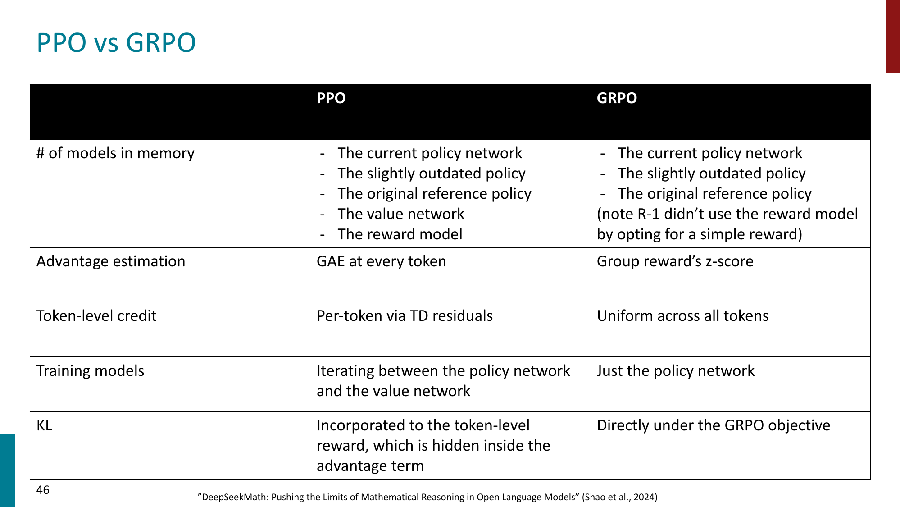

可以把 GRPO 粗略理解为：

$$
A_i =
\frac{r_i - \text{mean}(r_1,\dots,r_G)}
{\text{std}(r_1,\dots,r_G)}
$$

其中 $G$ 是同一个 prompt 下生成的 response group。

相比 PPO：

- 不需要单独训练 value network
- advantage 来自 group reward z-score
- KL 更直接地放在 objective 里
- 对 RLVR 场景更轻量

## DAPO

DAPO 是在 GRPO 类方法上的工程化改进，课件强调了三个技巧：

- **Clip-higher**
    - 放宽 upper clipping
    - 减少 entropy collapse，允许更多探索
- **Dynamic sampling**
    - 如果同一组 responses 全对或全错，梯度信号很弱
    - 只保留同时有 correct 和 incorrect 的 groups
- **Token-level loss**
    - GRPO 按 sample 平均，长 CoT 中每个 token 的梯度贡献会变小
    - DAPO 改成 token-level averaging

!!! tip

    GRPO / DAPO 的动机不是“理论上更优雅”，而是让大规模 reasoning RL 更可训练、更省资源。

## Why chain-of-thought works

CoT 的效果不是所有模型都有。

- 大模型上 CoT 往往显著提升 reasoning
- 小模型可能生成 illogical reasoning chains
- Self-consistency 通过多条 reasoning paths + majority vote 进一步提升效果

一种解释是：pretrained LLM 中本来就存在 reasoning paths，只是 greedy decoding 不一定能把它们显现出来。

CoT prompting / CoT decoding 做的事情是：

$$
\text{surface latent reasoning paths}
$$

也就是说，reasoning ability 可能部分存在于模型分布中，但需要合适的 decoding / prompting / sampling 才能被访问。

## Cognitive behaviors

课件中提到，自我提升型 reasoning models 往往具备一些 cognitive behaviors：

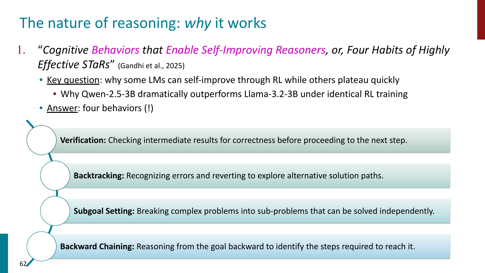

- **Verification**
    - 检查中间结果是否正确
- **Backtracking**
    - 发现错误后回退并尝试新路线
- **Subgoal setting**
    - 把复杂问题拆成子问题
- **Backward chaining**
    - 从目标反推需要哪些步骤

这里的重点是：

> 不是只有 final answer correctness 重要，reasoning behavior 本身也会影响模型能不能通过 RL 继续提升。

## When reasoning fails

Reasoning trace 并不总是 faithful。

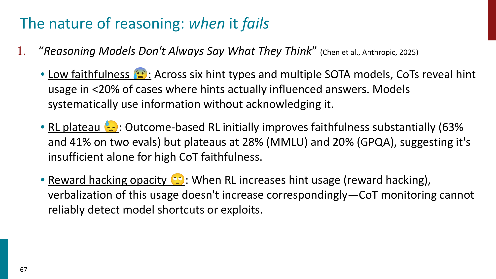

模型可能：

- 使用了 prompt 中的 hint，但 CoT 中不承认
- reward hacking 了某些 shortcut，但 reasoning trace 看起来正常
- 给出 plausible explanation，但真实决策原因并不是这条 explanation

!!! warning

    Chain-of-thought 可以帮助模型解题，但不能简单地被当成模型真实内部推理过程的透明窗口。

另外，CoT 也不是所有任务都适用。有些任务中，额外 thinking 可能引入过度分析，反而降低表现。

## Speculative decoding

Part 2 首先讨论 inference efficiency。

Speculative decoding 的问题背景是：

> 大模型生成慢，但不是每个 token 都同样难生成。

基本思想：

- 用小模型作为 **draft model**
    - 一次提出多个 candidate tokens
- 用大模型作为 **target model**
    - 验证这些 tokens 是否可以接受
- 如果通过，就一次性前进多个 tokens

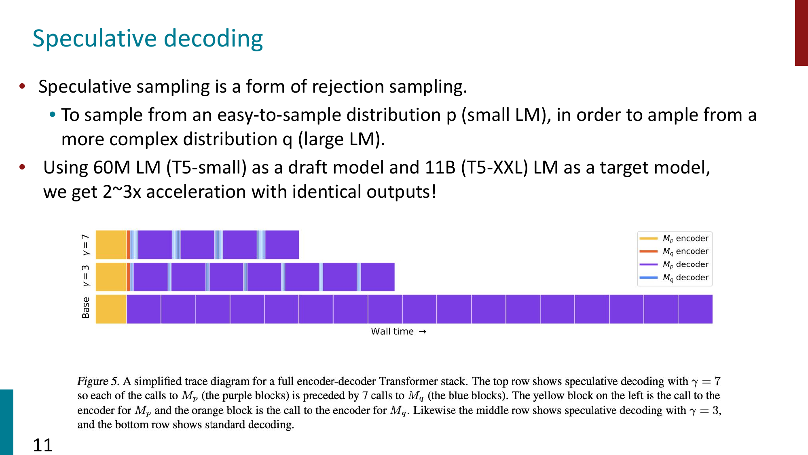

Speculative decoding 本质上是一种 rejection sampling。

关键性质：

- 输出分布仍然等价于 target model sampling
- 如果 draft model 和 target model 经常一致，就能显著加速
- 经典 draft-target 方法要求 tokenizer 兼容
- dynamic / universal speculative decoding 进一步放宽了 lookahead 和 tokenizer 限制

## Online, offline, on-policy and off-policy

RL 里的几个概念容易混：

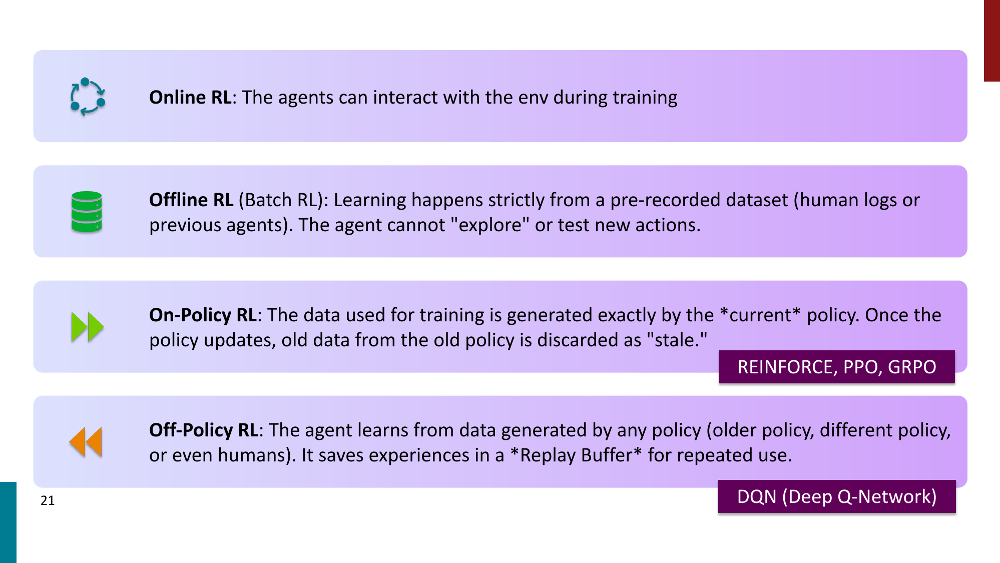

- **Online RL**
    - training 时 agent 可以和 environment 交互
- **Offline RL**
    - 只能从预先收集的数据学习，不能探索新 actions
- **On-policy RL**
    - training data 来自当前 policy
    - policy 更新后，旧 rollouts 就 stale
- **Off-policy RL**
    - 可以从旧 policy、其他 policy 或 human data 里学习
    - 常配合 replay buffer

在 LLM RL 训练中，即使算法目标是 on-policy，也可能因为工程系统产生 off-policy drift。

## Off-policy drift

Off-policy drift 出现的原因包括：

- asynchronous RLHF
- generation 和 training 分离在不同 GPU clusters
- rollout 生成慢，policy 更新快
- 一个 batch 上做多次 gradient steps
- weight transfer 有延迟

问题是：

- gradient estimate 变 biased
- importance weights 可能爆炸
- reward hacking 可能被放大

缓解方法：

- PPO clipping
- KL penalty against reference policy
- 减少 epochs
- 更快的 weight streaming / in-flight updates
- 使用更短 off-policy window 的算法，例如 GRPO / REINFORCE

## On-policy distillation

Standard knowledge distillation 通常是 teacher-centric，因此对 student 来说是 off-policy。

On-policy distillation 则是 student-centric：

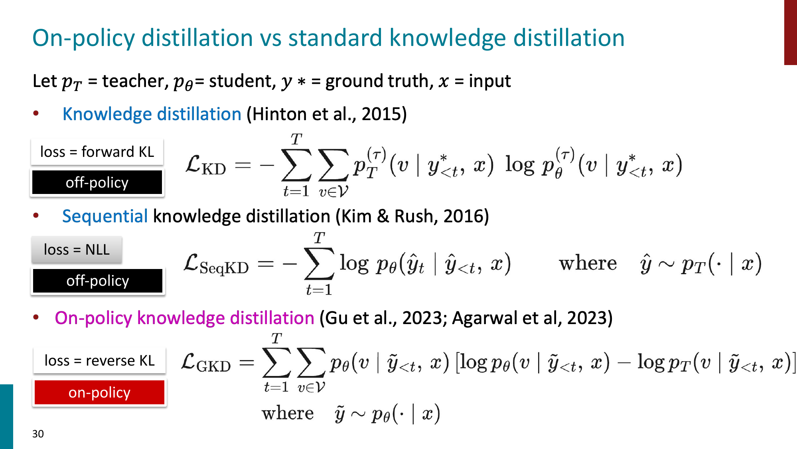

区别可以粗略记成：

- **KD**
    - forward KL
    - ground-truth / teacher context
    - mass-covering
    - off-policy
- **SeqKD**
    - NLL on teacher-generated output
    - teacher-generated context
    - off-policy
- **GKD / on-policy distillation**
    - reverse KL
    - student-generated context
    - mode-seeking
    - on-policy

On-policy distillation 的好处：

- 减少 train-test mismatch
- 让 student 学会从自己的错误上下文中恢复
- 比 RL 便宜，因为有 dense teacher signal
- 比普通 SFT 更接近真实推理时的 student distribution

!!! important

    On-policy distillation 可以看成 SFT 和 RL 的折中：它使用 on-policy samples，但监督信号比 sparse reward 更 dense。

## Long-context reasoning

Scaling reasoning 往往也需要 scaling context length。

长上下文能力重要的场景：

- code repository 理解
- legal document analysis
- long interaction history
- multi-document QA / summarization
- 长数学推理和多次 trial-and-error

长上下文难点：

- **Data limitation**
    - 训练语料里超长文档相对少
- **Compute and memory limitation**
    - standard attention 是 $O(n^2)$
- **Position generalization**
    - 短上下文训练的 positional embeddings 不一定能外推到长位置

## RoPE

RoPE 的核心思想是：不是把 positional embedding 加到 token embedding 上，而是在 attention 中旋转 $Q$ 和 $K$。

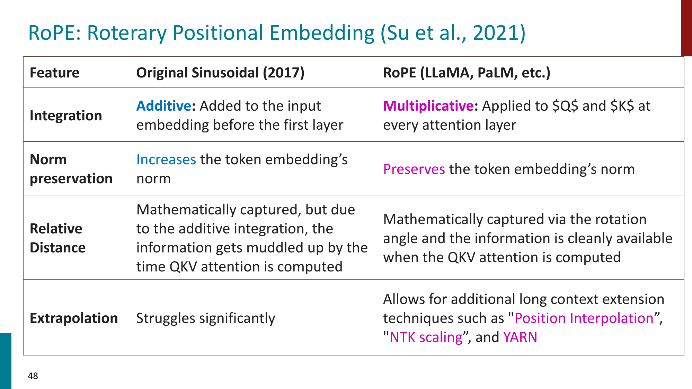

RoPE 的特点：

- multiplicative integration
- 作用在每一层的 $Q,K$ 上
- 保持向量 norm
- 更干净地编码 relative distance
- 支持后续长上下文扩展技术

常见 long-context extension practices：

- **Position interpolation**
    - 把长位置压缩到模型熟悉的位置范围
- **NTK-aware scaling**
    - 调整 RoPE frequency base
- **YaRN**
    - 结合 NTK scaling、attention temperature correction 和 frequency ramp
- **Progressive training**
    - 逐步从 8K 训练到 32K / 64K / 128K
- **Data engineering**
    - 增加 books、code repos、long documents、synthetic long-context tasks
- **Attention architecture**
    - sliding window / sparse attention
    - FlashAttention
    - GQA / MQA 降低 KV cache 成本

## Test-time compute scaling

Test-time compute scaling 的核心问题是：

> 与其只训练更大的模型，能不能在推理时让模型“多想一会儿”？

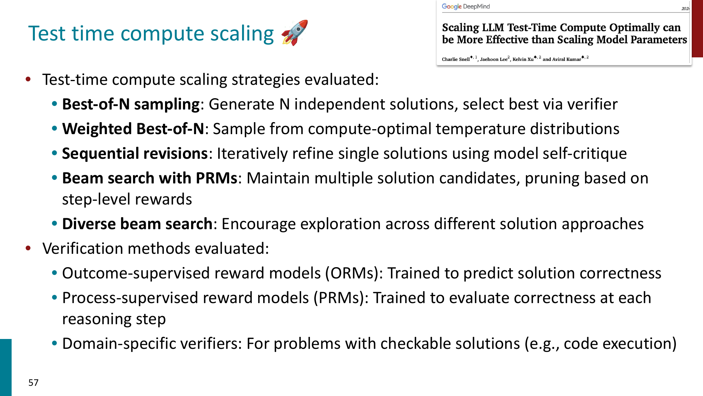

常见方法：

- **Best-of-N sampling**
    - 生成 $N$ 个答案，用 verifier 选最优
- **Weighted Best-of-N**
    - 用 compute-optimal temperature 分布采样
- **Sequential revision**
    - 让模型迭代修改自己的答案
- **Beam search with PRMs**
    - 用 process reward model 评估每一步
- **Diverse beam search**
    - 鼓励探索不同解法

Verifier 也很关键：

- **ORM**
    - outcome-supervised reward model
    - 判断最终答案是否正确
- **PRM**
    - process-supervised reward model
    - 判断每一步 reasoning 是否合理
- **Domain-specific verifier**
    - code execution / math checker 等可验证工具

## Test-time scaling takeaways

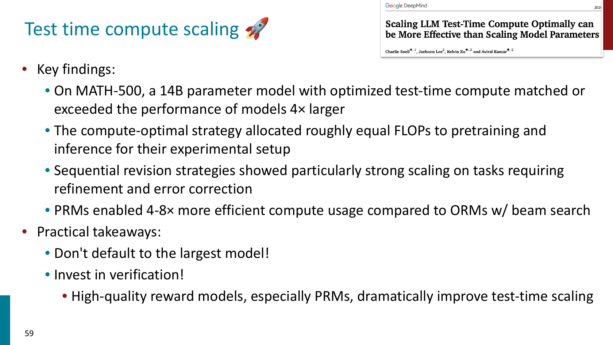

主要结论：

- 不是默认选择最大模型就最优
- 小模型 + optimized test-time compute 可能接近或超过更大模型
- 需要在 model size 和 inference compute 之间分配预算
- 高质量 verifier 很重要
- PRM 在 step-level search 中通常比只看 final answer 的 ORM 更高效

可以把 reasoning system 的能力理解为：

$$
\text{Reasoning performance}
\approx
f(\text{base model}, \text{training}, \text{decoding}, \text{verifier}, \text{test-time compute})
$$

## Summary of Reasoning

- Decoding 决定 inference 时如何从 token distribution 产生文本
- Greedy / beam search 更确定，sampling 更有 diversity
- Top-k / top-p / temperature 都是在控制 sampling space
- Reasoning models 仍然可能 looping，尤其是在低温、小模型、难题和长 reasoning trace 下
- R1-Zero 说明 outcome-based RL 可以诱导 reasoning behavior
- RLVR 依赖 verifiable reward，更适合 math / code 等可验证任务
- PPO 强但复杂，GRPO 通过 group-relative reward 简化 advantage estimation
- DAPO 进一步处理 exploration、有效 batch 和长 CoT token weighting
- CoT 能显现 latent reasoning paths，但 CoT 不一定 faithful
- Speculative decoding 用小模型 draft、大模型 verify 来加速生成
- LLM RL 工程中常出现 off-policy drift，需要算法和系统一起缓解
- On-policy distillation 用 student-generated contexts 和 dense teacher signal 结合 SFT / RL 优点
- Long-context reasoning 需要 positional encoding、训练数据和 attention efficiency 共同扩展
- Test-time compute scaling 把更多预算放在 sampling、revision、search 和 verification 上
