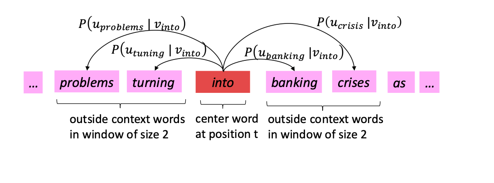
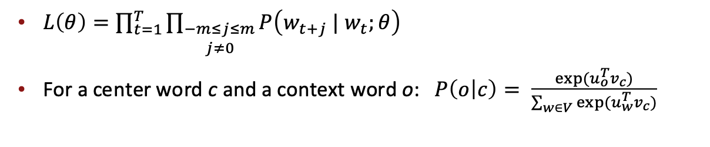
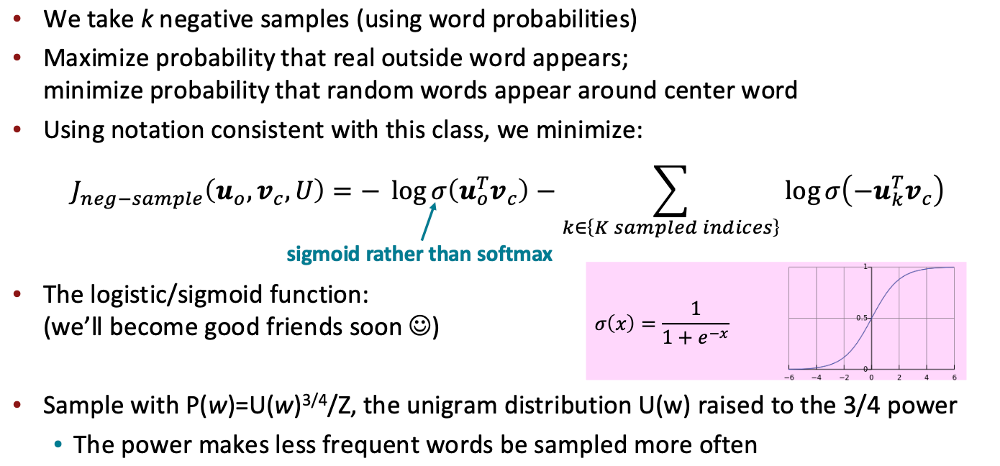
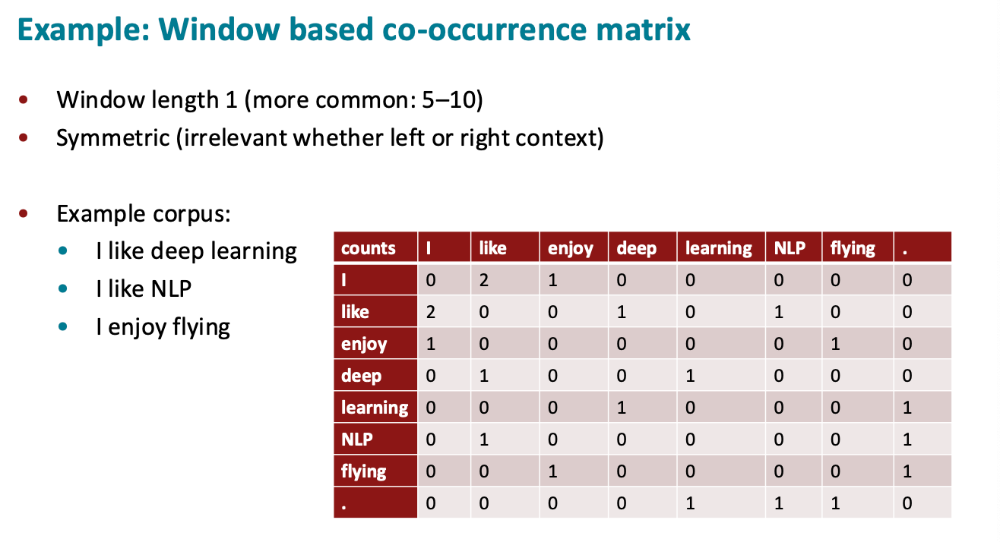
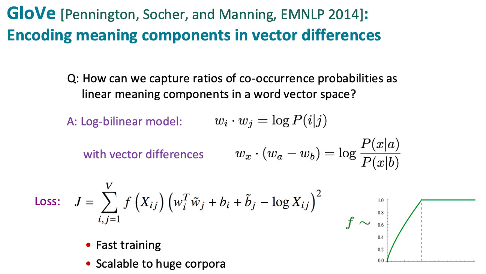
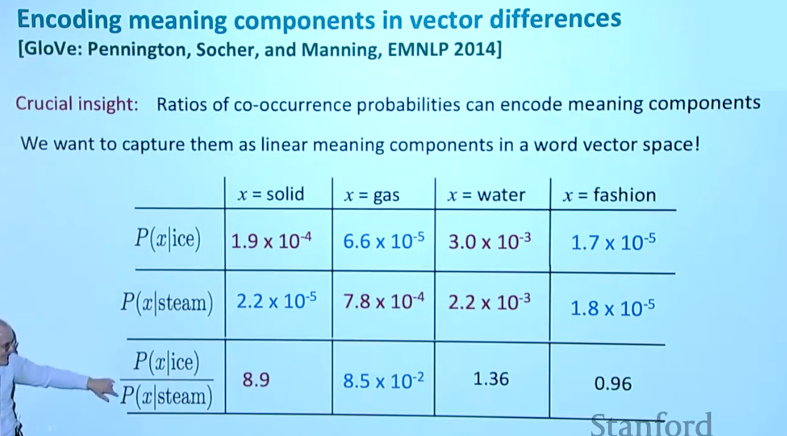

# Word Vectors

!!! important

    A word's meaning is given by the words that frequently appear close-by

    - "You shall know a word by the company it keeps"
    - One of the most successful ideas of modern statistical NLP!

我们想要的能够编码 Word 的 Word Vectors 能满足：

- 两个 word 经常出现在相似的语境下，这两个 word 对应的 word vector 也应当相似
- 可以通过 dot product 来计算两个 word 的相似度

## Word2Vec

### Overview

Word2Vec 存在两种模型，分别为：

- CBOW (Continuous Bag of Words)
    - Predict center word from (bag of) context words
- SG (Skip-grams)
    - Predict context ("outside") words (position independent) given center word

其中 Skip-grams 的思想大致如下：

- 其中 $u_w$ 是 w 作为 context word 的词向量，$v_w$ 是 w 作为 center word 的词向量
- $\theta$ 代表了所有模型参数，若 vector 为 d 维，词表共有 V 个 word，则 $\theta \in \R^{2dV}$

由于当词表很大时，使用 softmax 时，每一次计算概率的分母项（即 softmax 的归一化项）都要非常大的代价，因此标准的 word2vec 通常实现 skip-gram model with **negative sampling** 代替 softmax

### Negative sampling

- Negative Sampling 不再问：在整个词表里，哪个词最可能是上下文词？

- 而是换成一个二分类问题：给定一个词对 $(c,o)$，判断它是真实上下文词对，还是随机噪声词对？

!!! tip

    $U(w)$ 是词 $w$ 的 unigram distribution，也就是这个词在语料中的原始出现概率但是把它变成：$U(w)^{3/4}$ 之后，所有词的值加起来通常不再等于 1，所以需要除以一个 $Z$，这个 $Z$ 定义为：$ Z = \sum_{w \in V} U(w)^{3/4} $也就是把词表里所有词的 $U(w)^{3/4}$ 加起来

此外可以发现，在 Negative Sampling 中使用诸如 SGD 的梯度更新方法来更新 Word2Vec 的两个 embedding 矩阵时

$$
V \in \mathbb{R}^{|V|\times d} \\
U \in \mathbb{R}^{|V|\times d}
$$

由于每次训练只涉及少量词，梯度的更新是稀疏的，因此在工程程实现时，要利用这个稀疏性，只更新 embedding 矩阵中的少数几行，而不是更新整个矩阵

## Co-occurrence Matrix

前面 Word2Vec 的训练过程主要是：

遍历语料 -> 取一个中心词 -> 看它周围的上下文词 -> 构造正样本和负样本 -> 用 SGD 更新向量 -> 重复很多轮

但是，既然我们都要扫完整个语料，为什么不直接一次性统计所有词之间的共现次数？并且 Word2Vec 本质上也是在利用“哪些词经常出现在彼此附近”的统计信息，实际上也是可行的

可以发现，共现矩阵是一个对称矩阵，我们把每一行的向量就作为词向量

!!! important

    但是 co-occurence matrix 存在一个弊端，就是 word vector 的维度数和词表大小相同，因此当词表很大时，word vector 会成为一个高维稀疏向量，此时我们可以通过 SVD Factorization （奇异值分解）对 co-occurence matrix 做降维得到低秩矩阵，这样就能得到低维稠密的词向量

    不过直接 Running an SVD on raw counts 效果并不是很好，通常需要做一些例如对 count 取 log 的修正

## GloVe

GloVe 全称为 **Global Vectors for Word Representation**，可以理解成一种结合了 **co-occurrence matrix** (count-based method) 和 **Word2Vec** (prediction-based method) 的方法

**GloVe** 的思想是：先统计全局共现矩阵 $X$，但不直接对 raw counts 做 SVD，而是训练低维词向量，让词向量的点积去拟合共现次数的对数，而词向量差则可以拟合共现概率

!!! tip

    为什么要用 $\log X_{ij}$？

    - 如果直接拟合原始共现次数 $X_{ij}$，高频词对会产生过大的影响
    - 比如 the dog, the car, the government 中 the 这类功能词和很多词都频繁共现，如果直接拟合 raw counts，模型很容易被这些高频词支配
    - 这和前面 co-occurrence matrix 部分提到的 “log the frequencies” 思想是一致的：直接对 raw counts 做 SVD 效果不好，通常需要先对计数做缩放或修正

!!! tip

    $f(X_{ij})$ 的作用？

    - 是一个 weighted function，它的作用是控制不同词对在训练中的重要程度
    - 直觉上：共现次数太小的词对可能只是偶然共现，不应该给太大权重

**为什么 GloVe 能学到线性语义关系？**

如表格，如果我们想要区分 ice 和 steam，**共现概率的比值是一个很好的统计量**

由于 solid 更常出现在 ice 附近，而不是 steam 附近；gas 更常出现在 steam 附近，而不是 ice 附近；因此 solid 和 gas 都是区分 ice 和 steam 的语义特征

而 Glove 就希望将这种 ratio 编码进词向量差里：

$$
w_x \cdot (w_{\text{ice}} - w_{\text{steam}})
=
\log \frac{P(x|\text{ice})}{P(x|\text{steam})}
$$

- 这样，任意上下文词 $x$ 和这个差向量做点积，就能判断 $x$ 更偏向 `ice` 还是 `steam`
- 而反之，`ice` 和 `steam` 的含义又是由它们的各种上下文词 $x$ 决定的，因此 `ice` 和 `steam` 的差向量就潜移默化的编码了“固态”与“气态”的语义差异

这正说明语义成分可以被编码在词向量差中，也是 GloVe 核心思想 **Encoding meaning components in vector differences** 的含义

## Evaluation

训练完 word vectors 后，需要评价它好不好，有两种评价方式

- intrinsic evaluation: 不把词向量放进真实 NLP 系统里，而是直接设计一些小任务来测试词向量本身，例如比较 king 和 queen 是否相似？
- extrinsic evaluation: 把词向量放进一个真实 NLP 任务里，看最终任务效果有没有提升
