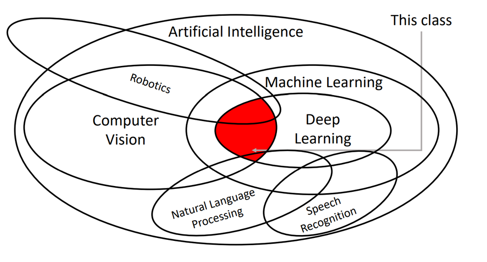
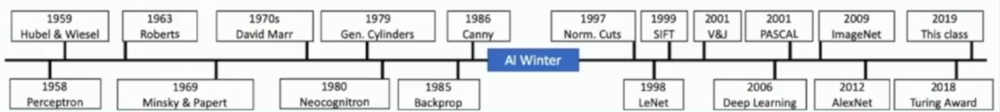

# Lec 1: Introduction to Deep Learning for Computer Vision

## Overview
!!! note "Deep Learning for Computer Vision"
    

## Brief History

??? info "AI Winter"
    历史上公认发生过两次大规模的AI冬天：

    1. 第一次AI Winter（约 1974 - 1980年）

        背景：早期AI研究在一些受限领域（如棋类游戏）取得了成功，让人们对通用智能非常乐观。早期的机器翻译也备受期待。

        导火索：

        - 机器翻译失败：早期的基于规则的翻译系统被发现非常脆弱，无法处理语言的歧义和复杂性，美国政府对此投入的大量资金打了水漂。

        - 感知机（Perceptron）的局限性：1969年，Marvin Minsky的著作指出了单层神经网络（感知机）的根本性缺陷（如无法解决XOR问题），沉重打击了当时以神经网络为代表的联结主义学派。

        - 莱特希尔报告 (Lighthill Report)：1973年，英国政府发布的这份报告对AI研究的实际成果提出了极其尖锐的批评，导致英国政府大幅削减AI研究经费。

        - DARPA的失望：美国国防高级研究计划署（DARPA）是早期AI的主要资助者，在发现多个项目未能达到预期后，也大幅削减了对AI基础研究的资助。

    2. 第二次AI Winter（约 1987 - 1993年）

        背景：在1980年代，**专家系统（Expert Systems）**的商业成功引发了AI的又一次繁荣。专家系统是一种基于大量“如果-那么”规则来模拟人类专家决策的程序。

        导火索：

        - 专家系统泡沫破裂：人们发现专家系统虽然在某些狭窄领域有用，但其开发和维护成本极其高昂，知识库难以更新，且非常“脆弱”，无法处理其规则之外的任何问题。数十亿美元的产业最终崩溃。

        - Lisp机器市场的崩溃：当时用于开发AI的专用计算机（Lisp机）市场也随之崩盘。

        - 各国宏大计划的失败：日本雄心勃勃的“第五代计算机计划”等项目也未能实现其宏伟目标。
### History for Computer Vision
- 1959: Hubel and Wiesel's work on the visual cortex
- 1963: Larry Roberts creates the first computer vision program
- 1966: The summer vision project at MIT, where students were tasked with creating a vision system
- 1970s: Early work on image segmentation
- 1980s: Recognition via Edge Detection
- 1990s: Recognition via Grouping
- 2000s: Recognition via Matching
- 2001: Face detection by Viola and Jones, one of the first successful applications of machine learning to vision
- 2009: ImageNet project begins, leading to the development of large-scale datasets for training deep learning models
- 2012: AlexNet wins the ImageNet competition, demonstrating the power of deep learning

### History for Deep Learning
- 1958: Perceptron implemented by hardware
- 1969: Minsky and Papert's book "Perceptrons" critiques early neural networks
- 1980: Neocognitron by Kunihiko Fukushima introduces the Neocognitron, an early convolutional neural network
- 1986: Backpropagation algorithm popularized by Rumelhart, Hinton, and Williams
- 1998: Convolutional Neural Networks (CNNs) introduced by LeCun et al. for digit recognition
- 2000s: "Deep Learning" term popularized
- 2012 to Present: Deep Learning Explosion

