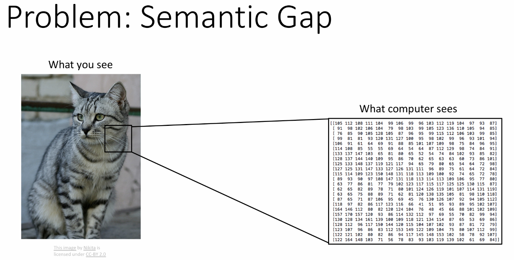
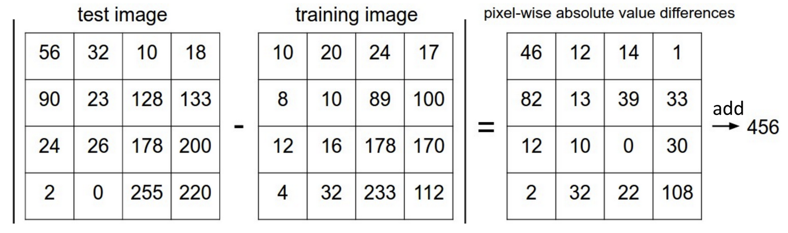
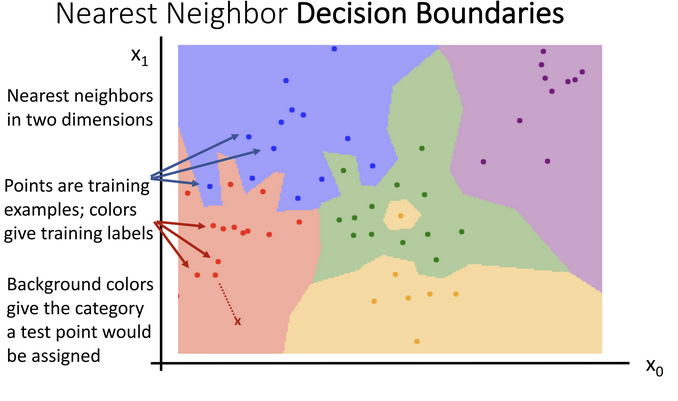
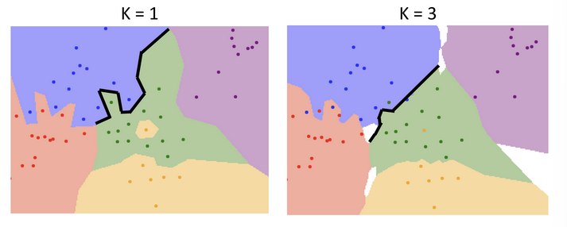
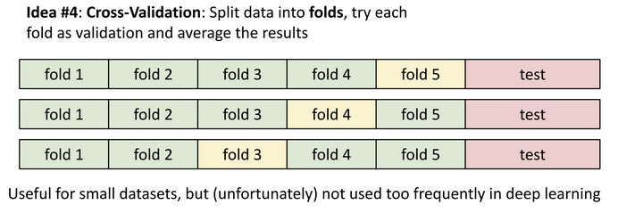

# Lec 2: Image Classification

## Sementic Gap
电脑看图像只是一个巨大的数字表格, 对图像的简单更改都可能会改变整个表格, 这是一个语义鸿沟(semantic gap)



图像分类有多个挑战: 视角变化(viewpoint variation) / 类内变化(intraclass variation) / 细粒度分类(fine-grained classification) / 背景干扰(background clutter) / 光照变化(illumination changes) / 变形(deformation) / 遮挡(occlusion) / etc.

机器学习: 数据驱动的方法
收集数据 -> 训练分类器 -> 应用, 大体是下面这样的:

```python
def train(images, labels):
    # Machine learning!
    return model
def predict(model, test_images):
    # Use model to predict labels
    return test_labels
```

!!! info "常见的图像分类数据集"
    - MNIST: 手写数字识别数据集
    - CIFAR-10: 10类小图像数据集
    - CIFAR-100: 100类小图像数据集
    - ImageNet: 大规模图像分类数据集，包含超过1400万张图像和1000个类别

## Nearest Neighbor Classifier
最简单的分类器是最近邻分类器(Nearest Neighbor Classifier)，它通过计算测试样本与训练样本之间的距离来进行分类。

对于每个测试样本，找到距离最近的训练样本，并将其标签作为预测标签。

例如使用曼哈顿距离($L_1$)来作为距离度量(distance metric):



```python
import numpy as np

class NearestNeighbor:
    def __init__(self):
        pass

    def train(self, X, y):
        """ X is N * D where each row is an example. Y is 1-dimension of size N """
        # the nearest neighbor classifier simply remembers all the training data
        self.Xtr = X
        self.ytr = y

    def predict(self, X):
        """ X is N * D where each row is an example we wish to predict label for """
        num_test = X.shape[0]
        # lets make sure that the output type matches the input type
        Ypred = np.zeros(num_test, dtype=self.ytr.dtype)

        # loop over all test rows
        for i in xrange(num_test):
            # find the nearest training image to the 1'th test image
            # using the L1 distance (sum of absolute value differences)
            distances = np.sum(np.abs(self.Xtr - X[i, :]), axis = 1)
            min_index = np.argmin(distances) # get the index with smallest distance
            Ypred[i] = self.ytr[min_index] # predict the label of the nearest example

        return Ypred
```

!!! info "X[i, :] vs X[i]"
    - `X[i, :]` 是二维数组的第 i 行，表示一个样本的所有特征。
    - `X[i]` 在 NumPy 中等价于 `X[i, :]`，表示同一行。

    在习惯上，通常采用 `X[i, :]` 的写法，能够具有更强的清晰度和可读性，让不太熟悉 NumPy 的人也能更容易理解这是在操作行和列。

    并且当处理更高维的数组（比如三维的图像数据 (高, 宽, 通道)）时，你就必须使用更明确的索引，例如 `image[:, :, 0]` 来获取整个R通道。在二维代码中也坚持使用 `X[i, :]` 可以保持一种统一和规范的编码风格。

## K-Nearest Neighbor Classifier
显然，最近邻分类器在解决实际问题时往往过于简单了。K-最近邻分类器（K-Nearest Neighbor Classifier）通过考虑多个最近邻样本来进行更稳健的分类。具体来说，对于每个测试样本，KNN 会找到 K 个距离最近的训练样本，并根据这 K 个样本的标签进行投票，最终确定测试样本的预测标签。

KNN 的基本步骤如下：

1. 计算测试样本与所有训练样本之间的距离。
2. 找到距离最近的 K 个训练样本。
3. 根据这 K 个样本的标签进行投票，确定测试样本的预测标签。

KNN 的优点是简单易懂，且在小规模数据集上效果良好。然而，它的缺点也很明显：计算量大，尤其是在数据量较大时，预测速度较慢。

```python
class KNearestNeighbor:
    def __init__(self, k=3):
        self.k = k

    def train(self, X, y):
        self.Xtr = X
        self.ytr = y

    def predict(self, X):
        num_test = X.shape[0]
        Ypred = np.zeros(num_test, dtype=self.ytr.dtype)

        for i in range(num_test):
            distances = np.sum(np.abs(self.Xtr - X[i, :]), axis=1)
            min_indices = np.argsort(distances)[:self.k]
            closest_labels = self.ytr[min_indices]
            Ypred[i] = np.bincount(closest_labels).argmax()

        return Ypred
```

!!! info "np.bincount"
    `np.bincount` 是一个 NumPy 函数，用于统计数组中每个非负整数的出现次数。它返回一个数组，其中索引表示整数值，值表示该整数在输入数组中出现的次数。

    For example, if closest_labels is [1, 7, 1, 1, 2], np.bincount will return an array like [0, 3, 1, 0, 0, 0, 0, 1] (0 zeros, 3 ones, 1 two, etc.).

    在 KNN 中，我们使用 `np.bincount(closest_labels).argmax()` 来找到出现次数最多的标签，这样可以确定 K 个最近邻样本中最常见的标签作为预测结果。

## Decision Boundaries
决策边界（Decision Boundaries）是指在特征空间中将不同类别分开的边界。对于 KNN 分类器，决策边界是由训练样本的位置和标签决定的。KNN 的决策边界通常是非线性的，因为它是由多个最近邻样本的标签投票结果形成的。



从决策边界可以看出，最近邻分类器很容易受离群值影响

当 K 较小时，决策边界可能会非常复杂，容易过拟合；当 K 较大时，决策边界可能会变得平滑，但可能会欠拟合。



## Hyperparameters
超参数（Hyperparameters）是指在模型训练之前需要设置的参数，这些参数通常会影响模型的性能。对于 KNN 分类器，超参数包括：

- K：最近邻的数量，决定了分类器的复杂度。
- 距离度量：用于计算样本之间距离的方式（如欧氏距离、曼哈顿距离等）。
- 权重：是否对最近邻样本的标签进行加权（如距离越近的样本权重越大）。

通常我们将数据分为三部分：训练集、验证集、测试集；我们用验证集来调优超参数，最终在测试集上评估模型性能。

!!! info "训练集、验证集、测试集"
    - **训练集**：用于训练模型，模型在此数据上学习特征和标签之间的关系。
    - **验证集**：用于调优超参数和选择最佳模型，帮助避免过拟合。
    - **测试集**：用于评估最终模型的性能，确保模型在未见数据上的泛化能力。

    三者的关系类似于教科书和课后作业、模拟考试、正式高考之间的关系。

使用单一的验证集（一次模拟考）有一个问题：模型在这次模拟考上表现好，可能只是运气（比如这套模拟题恰好是它擅长的类型）。为了得到对“学习策略”更可靠的评估，就有了**交叉验证 (Cross-Validation)**



这种方法可以更全面地评估模型的性能，减少由于单次验证集划分带来的偶然性影响。

**工作方式：**

1. 我们不再单独划分出验证集，而是将整个训练数据（不包括测试集！）分成K份（比如5份）。

2. 进行K轮实验：

    - 第1轮：用第1份做“模拟考”（验证集），用剩下的4份做“教科书”（训练集），得到一个分数。

    - 第2轮：用第2份做“模拟考”，用剩下的4份做“教科书”，得到一个分数。

    - ...

    - 第5轮：用第5份做“模拟考”，用剩下的4份做“教科书”，得到一个分数。

3. 最后，将这K轮的“模拟考”分数取平均值，作为对当前“学习策略”（超参数）的最终评估。
