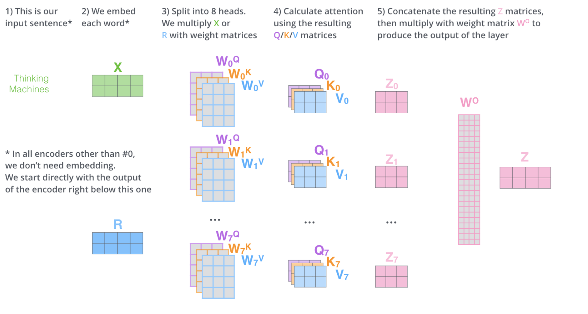

# Transformer

> 图解 Transformer: https://jalammar.github.io/illustrated-transformer/

## Q1

> Transformer为何使用多头注意力机制？（为什么不使用一个头） 

单头注意力只能在一个表示子空间中计算词与词之间的关系。而自然语言中，一个词和其他词的关联是**多维度的**，例如句子：*"The animal didn't cross the street because **it** was too tired."*中

- **it** 这个词需要找到语法主语(animal)
- 理解语义指代关系
- 感知句子结构中的位置依赖

单个注意力头很难在同一组 Q/K/V 权重中同时捕捉这些不同类型的关系

## Q2

> Transformer为什么Q和K使用不同的权重矩阵生成，为何不能使用同一个值进行自身的点乘？ （注意和第一个问题的区别） 

最重要的原因是打破对称性：如果 Q = K（使用同一权重矩阵），那么注意力矩阵 A = softmax(QQ^T / √d) 会是对称矩阵，即 `A[i][j] = A[j][i]` ，这意味着 token i 对 token j 的注意力，将永远等于 token j 对 token i 的注意力，但是语言的语义往往是不对称的

例如：“猫”追“老鼠”中，“追”应该强烈的关注主语”猫“，而”猫“不一定需要同等程度地关注”追“

## Q3

> 为什么在进行softmax之前需要对attention进行scaled（为什么除以dk的平方根），并使用公式推导行讲解 

核心原因是：**attention score 的方差会随着向量维度的增长而增加，从而导致 softmax 结果的不稳定性**

设 query 和 key 向量的每个分量独立同分布：
$$
q_i \sim \mathcal{N}(0, 1), \quad k_i \sim \mathcal{N}(0, 1), \quad i = 1, 2, \dots, d_k
$$
各分量之间相互独立。

点积定义为：
$$
z = q \cdot k = \sum_{i=1}^{d_k} q_i k_i
$$
**计算期望：**
$$
\mathbb{E}[q_i k_i] = \mathbb{E}[q_i] \cdot \mathbb{E}[k_i] = 0 \cdot 0 = 0
$$
**计算方差：**

由于各项独立，先算单项的方差：
$$
\text{Var}(q_i k_i) = \mathbb{E}[q_i^2 k_i^2] - (\mathbb{E}[q_i k_i])^2
$$
因此总方差：
$$
\text{Var}(z) = \sum_{i=1}^{d_k} \text{Var}(q_i k_i) = d_k
$$
可以发现点积 z 的标准差为 $d_k$，随维度线性放大

而高方差会导致 softmax 的饱和：

对于序列中的 n 个 token，注意力分数向量为：
$$
\mathbf{z} = [z_1, z_2, \dots, z_n], \quad z_j = q \cdot k_j
$$
当 $d_k$ 很大时，各 $z_j$ 的数值量级为 $\sqrt{d_k}$，softmax 为：
$$
\text{softmax}(z_j) = \frac{e^{z_j}}{\sum_{l} e^{z_l}}
$$
设某个 $z_j$ 比其他值大，例如：
$$
\mathbf{z} = [\underbrace{30}_{\text{最大}}, 1, 2, 1]
$$
softmax 输出趋近于 one-hot，**梯度几乎为零**：
$$
\frac{\partial \text{softmax}(z_j)}{\partial z_j} = s_j(1 - s_j) \approx 1 \cdot 0 = 0
$$
这就是**梯度消失**，模型无法有效训练

但是当我们将注意力分数除以 $\sqrt{d_k}$ 后，定义缩放后的分数：
$$
\tilde{z} = \frac{z}{\sqrt{d_k}} = \frac{q \cdot k}{\sqrt{d_k}}
$$
验证方差：
$$
\text{Var}\left(\frac{z}{\sqrt{d_k}}\right) = \frac{\text{Var}(z)}{(\sqrt{d_k})^2} = \frac{d_k}{d_k} = 1
$$
缩放后 $\tilde{z} \sim \mathcal{N}(0, 1) $，数值范围恢复正常，softmax 工作在 **线性区**：
$$
\mathbf{\tilde{z}} = [1.2, -0.3, 0.8, -0.5]
$$
这样的注意力分数向量的结果就是合理的，梯度也会变为正常

因此最后得到 Transformer 的缩放点积注意力：
$$
\text{Attention}(Q, K, V) = \text{softmax}\left(\frac{QK^T}{\sqrt{d_k}}\right)V
$$
整理一下思路，总结一下就是：

$$
\underbrace{d_k \uparrow}_{\text{维度增大}} \Rightarrow \underbrace{\text{Var}(q \cdot k) = d_k \uparrow}_{\text{点积方差爆炸}} \Rightarrow \underbrace{\text{softmax} \to \text{one-hot}}_{\text{注意力退化}} \Rightarrow \underbrace{\nabla \to 0}_{\text{梯度消失}}
\\
\div \sqrt{d_k} \Rightarrow \text{Var} = 1 \Rightarrow \text{softmax 分布合理} \Rightarrow \text{训练稳定}
$$

## Q4

> 在计算attention score的时候如何对padding做mask操作？

首先为什么需要 Padding Mask?

因为 batch 训练时，序列长度不同，需要补齐到同一长度，例如

```plaintext
序列1: [我, 爱, 猫, <PAD>, <PAD>]   长度 3，补2个PAD
序列2: [今, 天, 天, 气,   很,   好]   长度 6
```

这里的 PAD token 是无意义的填充，不应该被 attend 到，否则会污染注意力分布

在工程层面，忽略掉这些 PAD token 主要是通过构造 padding mask 矩阵标识这些 PAD 的位置，在softmax 时可以把这些位置的注意力分数标记为 -inf

## Q5

> 为什么在进行多头注意力的时候需要对每个head进行降维？（可以参考上面一个问题）

多头注意力是建立在单头注意力的基础上的升级版，降维的核心动机主要是保持计算量与单头的注意力机制相同，并且能在最后对结果向量做拼接时保持总维度的不变：即 $d_k' = d_k / \text{head\_num}$



## Q6

> 大概讲一下Transformer的Encoder模块？ 

```plaintext
输入序列
    │
    ▼
┌─────────────────────────────┐
│      Embedding + PE          │  ← 位置编码
└─────────────────────────────┘
    │
    ▼  （重复 N 次）
┌─────────────────────────────┐
│  ┌───────────────────────┐  │
│  │  Multi-Head Attention  │  │  ← 子模块 1
│  └───────────────────────┘  │
│            │                │
│       Add & Norm            │  ← 残差 + LayerNorm
│            │                │
│  ┌───────────────────────┐  │
│  │   Feed Forward (FFN)  │  │  ← 子模块 2
│  └───────────────────────┘  │
│            │                │
│       Add & Norm            │  ← 残差 + LayerNorm
└─────────────────────────────┘
    │
    ▼
Encoder 输出（传给 Decoder 或下游任务）
```

## Q7

> 为何在获取输入词向量之后需要对矩阵乘以embedding size的开方？意义是什么？ 

原始 Transformer 论文中明确提到：在 Embedding 层，将权重矩阵乘以 $\sqrt{d_\text{model}}$，即：
$$
\text{input} = \text{Embedding}(x) \times \sqrt{d_{\text{model}}} + \text{PE}
$$
核心原因是：Embedding 和 PE 的数值尺度不匹配

**Positional Encoding 的值域是固定的：**
$$
PE_{(pos, 2i)} = \sin\left(\frac{pos}{10000^{2i/d}}\right) \in [-1, 1]
$$
PE 的每个分量都被限制在 **[-1, 1]** 之间，数值尺度固定。

**Embedding 的值域在训练初期很小：**

神经网络初始化时（如 Xavier 初始化），embedding 权重通常满足：
$$
\text{Var}(\text{embedding}) \sim \frac{1}{d_{\text{model}}}
$$
标准差约为：
$$
\sigma \sim \frac{1}{\sqrt{d_{\text{model}}}}
$$
当 d_model = 512 时，embedding 每个分量的标准差约为 **0.044**，远小于 PE 的数值范围。

不缩放会发生什么？例如：

```
Embedding 数值: ~0.044  （很小）
PE 数值:        ~[-1, 1] （相对很大）

直接相加：
input = Embedding + PE
      ≈ 0.044 + 0.7
      ≈ 0.744   ← PE 主导，Embedding 的语义信息被淹没！
```

模型几乎只能看到位置信息，词义信息几乎消失。

## Q8

> 简单介绍一下 Transformer 的位置编码？有什么意义和优缺点？ 

Transformer 完全基于 attention 机制，attention 的计算本质是集合操作——打乱输入顺序不影响结果：

```
["我", "爱", "猫"]  和  ["猫", "爱", "我"]
```

对 attention 来说，两者的输出完全相同（只是位置调换），但语义完全不同。所以必须显式地把位置信息注入到输入中

原论文中采用的是正弦位置编码（Sinusoidal PE）：
$$
PE_{(pos, 2i)} = \sin\left(\frac{pos}{10000^{2i/d_{\text{model}}}}\right)
\\
PE_{(pos, 2i+1)} = \cos\left(\frac{pos}{10000^{2i/d_{\text{model}}}}\right)
$$
其中 pos 是 token 在序列中的位置，i 是维度索引

- 优点：作为绝对位置编码，使用正/余弦相较于直接用位置序号而言，编码值有界，并且能够泛化到未见长度；并且相比可学习的位置编码不需要训练
- 缺点：无法直接建模相对位置的关系，只能依靠 W_k, W_q 来间接学习相对位置关系

## Q9

> 简单讲一下Transformer中的残差结构以及意义。 

Transformer 中每个子模块的输出都会套一个残差连接：
$$
\text{output} = \text{LayerNorm}(x + \text{Sublayer}(x))
$$
用图来看是这样：

```plaintext
x ──────────────────────────────┐
│                               │
▼                               │
Sublayer(x)                     │ (残差分支)
│ (Multi-Head Attention 或 FFN) │
▼                               │
         (+) ←──────────────────┘
          │
          ▼
      LayerNorm
          │
          ▼
        output
```

残差结构的主要意义就是解决深度网络的梯度消失问题。没有残差时，梯度需要逐层反向传播：
$$
\frac{\partial L}{\partial x} = \frac{\partial L}{\partial y} \cdot \frac{\partial \text{Sublayer}(x)}{\partial x}
$$
每经过一层都要乘一个雅可比矩阵，层数多了之后连乘结果趋近于 0，梯度消失。

加入残差后：
$$
\frac{\partial L}{\partial x} = \frac{\partial L}{\partial y} \cdot \left(1 + \frac{\partial \text{Sublayer}(x)}{\partial x}\right)
$$
多了一个常数项 **1**，无论 Sublayer 的梯度多小，梯度都能通过这条"高速公路"直接回传到浅层：

## Q10

> 为什么transformer块使用LayerNorm而不是BatchNorm？LayerNorm 在Transformer的位置是哪里？ 

先看两者的归一化方向：

输入矩阵 shape: [batch, seq_len, d_model]
- BatchNorm：沿 batch 方向归一化 （跨样本，同一特征维度）
- LayerNorm：沿 d_model 方向归一化（同一样本，所有特征维度）

用公式表示：

**BatchNorm**（对每个特征维度，跨 batch 和 seq 计算均值方差）：
$$
\hat{x}_{b,t,d} = \frac{x_{b,t,d} - \mu_d}{\sigma_d}, \quad \mu_d = \frac{1}{B \cdot T}\sum_{b,t} x_{b,t,d}
$$
**LayerNorm**（对每个 token，跨 d_model 计算均值方差）：
$$
\hat{x}_{b,t,d} = \frac{x_{b,t,d} - \mu_{b,t}}{\sigma_{b,t}}, \quad \mu_{b,t} = \frac{1}{D}\sum_{d} x_{b,t,d}
$$

主要原因是 NLP 任务中，batch 中的序列长度是不定的：

例如：样本1：【我，爱，猫，PAD，PAD】；样本 2：【今，天，天，气，很，好】（PAD 也会被编码成一个向量），此时 BatchNorm 用 PAD 的值参与均值/方差的计算是没有意义的；而且自回归时需要逐 token 推理，BatchNorm 无法处理 batch_size = 1 的情况

## Q11

> 简单描述一下Transformer中的前馈神经网络？使用了什么激活函数？相关优缺点？

每个 Encoder/Decoder 层中，attention 之后都接一个 FFN，对**每个 token 独立**做相同的变换：

$\text{FFN}(x) = \text{Activation}(xW_1 + b_1)W_2 + b_2$

维度变化：

```plaintext
输入:   [batch, seq_len, 512]   d_model = 512
           │
           │  W₁: [512, 2048]
           ▼
中间层: [batch, seq_len, 2048]  d_ff = 2048（扩大4倍）
           │
           │  激活函数
           ▼
           │  W₂: [2048, 512]
           ▼
输出:   [batch, seq_len, 512]   还原回 d_model
```

使用了 RELU 函数

- 优点是计算简单，且梯度相比 sigmoid/tanh 而言（不容易消失）
- 缺点是输入为负时，梯度为 0，导致神经元死亡问题，该神经元会永久停止更新

## Q12

> Encoder端和Decoder端是如何进行交互的？（在这里可以问一下关于seq2seq的attention知识） 

Encoder 的输出以 **K 和 V** 的形式传入 Decoder，这就是两者交互的核心

每个 Decoder Block 包含三个子模块： Masked Self-Attention --> Cross-Attention --> FFN； Encoder 和 Decoder 端的交互发生在 Cross-Attention 处

## Q13

> Decoder阶段的多头自注意力和encoder的多头自注意力有什么区别？（为什么需要decoder自注意力需要进行 sequence mask) 

Decoder 的多头自注意力机制是带掩码的；原因是在训练时，Decoder 的输入是一整个 token sequence，而每个 token 不应该看到位于它后面的 token

## Q14

> Transformer的并行化体现在哪个地方？Decoder端可以做并行化吗？ 

- Encoder 的并行化是完全并行的，Encoder 的 Self-Attention 中，每个 token 的 Q,K,V 计算完全独立，可以同时进行

  - 整个 attention 的计算就是一个大矩阵乘法：

  - $$
    QK^T = (XW_Q)(XW_K)^T
    $$

- Decoder 也类似，在训练时是可以并行的，因为目标序列已知，可以用 Causal Mask 模拟自回归；但是在推理过程是必须串行的，因为推理做的词语接龙过程天然就是串行的；但是推理过程每一步重复计算前一步 token 的 K、V 是一种浪费，所以就会引入 KV Cache 技术

## Q15

> Transformer训练的时候学习率是如何设定的？Dropout是如何设定的，位置在哪里？Dropout 在测试的需要有什么需要注意的吗？

- 原论文的训练采用了 Warmup 的策略，让学习率随训练步数先上升后下降
- Droput 设置在了三个地方
  - Embedding + PE 之后
  - 每个子模块的残差相加之前，也就是先 Dropout 再做残差连接
  - Attention 注意力分数在 softmax 后，与 V 相乘前也会做 Dropout
- 测试的时候关掉 Dropout 即可，因为 Dropout 的随机性是训练专用的正则化手段，测试/推理时需要稳定确定的预测

## Q16

> 解码端的残差结构有没有把后续未被看见的mask信息添加进来，造成信息的泄露。

不会，残差连接是对每个 token 独立的：

每个 token 经过 masked-attention 层得到包含了在它之前的注意力权重的 token 向量，然后再去和原先的 token 向量相加，不会包含该 token 后的 token 信息
