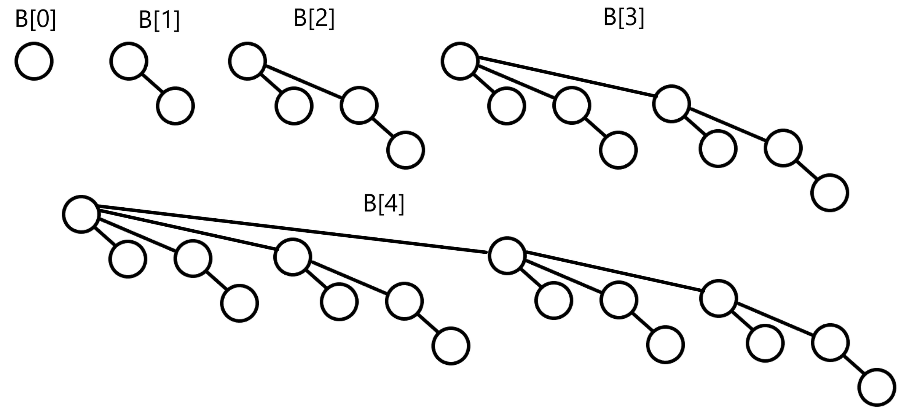
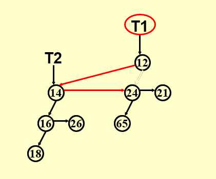
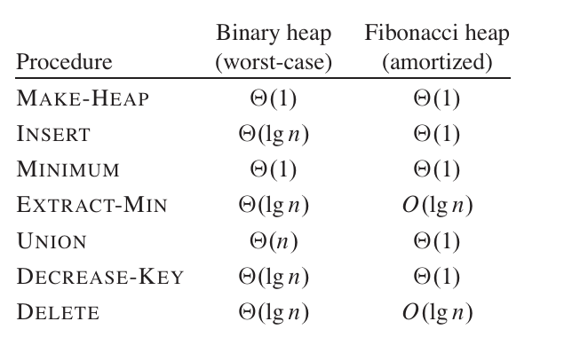
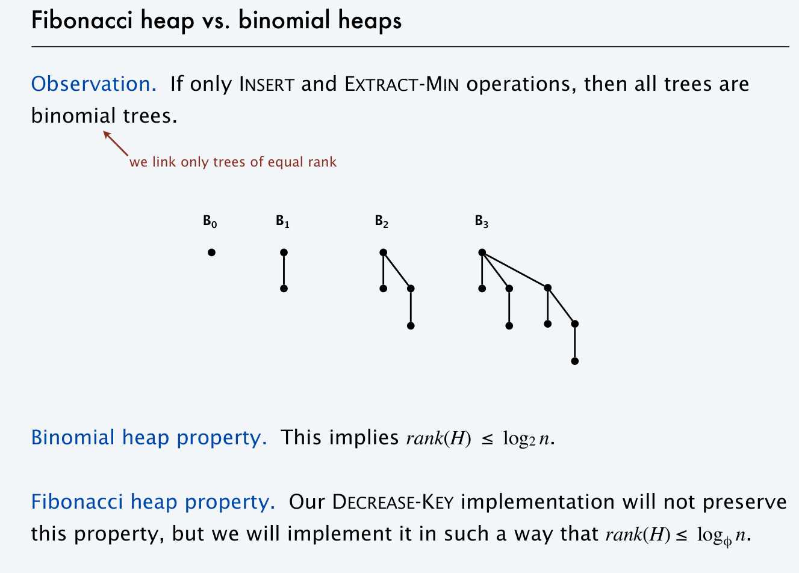

# Chapter 5 | Binomial Queue & Fibonacci Heap
## Binomial Queue

!!! tip "注"
    二项队列(Binomial queue)，或者更多人把它叫做二项堆(Binomial heap)，事实上个人认为和队列没有什么关系，因此在接下来的叙述中，我会使用二项堆这个名称而非二项队列，前者仅作为本篇笔记的标题使用

堆的其中一个应用就是优先队列。本节要介绍的二项堆(Binomial Queue)也是优先队列的一种实现，只不过不同于之前我们用一个堆维护优先队列，二项堆同时维护了具有不同特征的若干个。

!!! quote "link"
    Wikipedia: https://en.wikipedia.org/wiki/Binomial_heap

    YouTube: https://www.youtube.com/watch?v=6JxvKfSV9Ns

    Halifuda's Blog: https://www.cnblogs.com/halifuda/p/14380013.html

    isshikih's notebook:https://note.isshikih.top/cour_note/D2CX_AdvancedDataStructure/Lec05/

!!! tip "Instruction"
    在学习 Binomial Queue 时，可以带着二进制的眼光进行学习

---

### 概述
二项堆是一种优先队列的实现方式。二叉堆作为基本的堆已经足够好，只是合并操作的复杂度不太能接受（单次$O(N)$）。为了支持高效的合并操作，左偏树和斜堆出现。**但左偏树和斜堆由于不再是完全二叉树，因此实现时必须用到指针式结构**。

而二项堆在这些操作上的时间复杂度与左斜堆非常类似：都有$O(logn)$的合并、删除、插入；$O(n)$的建堆（队）；摊还意义上$O(1)$的插入；并且二项堆往往用 leftchild-rightsibiling 的指针结构实现

??? question "贴一道 PTA 的题目"
    We can perform BuildHeap for leftist heaps by considering each element as a one-node leftist heap, placing all these heaps on a queue, and performing the following step: Until only one heap is on the queue, dequeue two heaps, merge them, and enqueue the result.  Which one of the following statements is FALSE?
    
    A.in the k-th run, $\lceil N/2k \rceil$ leftist heaps are formed, each contains $2k$ nodes

    B.the worst case is when $N=2K$ for some integer $K$

    C.the time complexity $T(N)=O(\frac{N}{2}​log{2^0}+\frac{N}{2^2}​log2^1+\frac{N}{2^3}​log2^2+⋯+\frac{N}{2K}log2^{K−1})$ for some integer $K$ so that $N=2K$

    D.the worst case time complexity of this algorithm is $Θ(NlogN)$

    --> **D选项错误**，应该是$\Theta(N)$，所以我们说左斜堆的建堆操作是可以达到$O(N)$的

---

### 定义
**二项堆(Binomial Queue)**本质上是一系列**二项树(Binomial Tree)**的集合。所以我们首先给定**二项树(Binomial Tree)**的定义：

!!! definition "Binomial Tree"
    1、一个单结点可以作为二项树$B_0$，其秩为0；

    2、二项树$B_k$的秩是$k$，且是由两棵$B_{k−1}$合并而成的，其中一棵作为子树连接在另一棵的根上。

    这样解释不太清楚，我们画出图来：

    <center></center>


    显然能够得到，**二项树并非二叉树**,而二项树作为一种树，它的限制比较强，因此也有非常多十分好的性质。对于我们建构二项堆来说主要有以下几点：
    
    1、二项树$B_k$由两棵$B_{k−1}$合并即可得来；

    2、二项树$B_k$总共拥有$2^k$个结点；

    3、二项树$B_k$的树根总共拥有$k$个子树，并且它们分别是二项树$B_0$,$B_1$,...,$B_{k−1}$；

    4、二项树$B_k$树根的高度是$k$

    这4条性质的证明就不赘述了，从图上可以轻易看出。另外二项树还有一个更有意思的性质：二项树$B_k$中，高度为$h$的结点共有$C_k^h = \binom{k}{h}$个。这个性质容易用数学归纳法证明

有了二项树的定义，我们就可以介绍二项堆了。

!!! definiton "Binomial Queue"
    **二项堆(Binomial Queue)**是一系列满足堆序的**二项树(Binomial Tree)**的集合，其中每个二项树的阶数 $k$ 都是不同的，反过来讲这句话，集合中 $k$ 阶的二项树要么只有一个，要么没有。

    譬如二项堆$Q$拥有19个结点，由于19=(10011)2，从而Q就拥有（而且必然是）$B_0$、$B_1$和$B_4$三棵二项树。**如果不考虑树的顺序，那么只要结点数给定，二项堆的结构就已经被决定了**。
    进而，**进而，一个有$N$个结点的二项堆，它的二项树的棵数就是$O(log \ N)$的。**

    !!! eg "🌰"
        <center> { width=75% } </center>
        > 题目实现的二项堆不一定有 min 指针！注意面向题面和选项判断实现。

### 实现
由于这种性质，我们可以用一个数组来存储二项堆的诸多二项树。用数组来存比链表要优越得多，因为数组可以明确地保存某棵二项树的秩，并且可以让我们立刻找到二项堆里的秩为r的二项树。用链表的唯一好处就是省略了之间不存在二项树的位置，但是对数组来讲，这只是一个$O(1)$的损耗。

刚刚已经提到，一棵二项树$B_k$树根的子树分别是二项树$B_0$到$B_{k−1}$，这也明确地告诉我们，它的诸子树也算一个二项堆。不过，这个二项堆我们不需要快速找到每棵子树，而只需要在树根被删除时提取出来（下面会介绍到），同时它的每个位置又都有二项树，从而用一个链表来实现是更合适的选择

并且由于每个二项树是一个多叉树，所以我们通常用"Left child Next Sibling"(左儿子右兄弟)的方式来实现

下面是 C 语言版本的二项树和二项堆的声明

```C
// C Implementation from cy's ppt
typedef struct BinNode *Position;
typedef struct Collection *BinQueue;
typedef struct BinNode *BinTree; /* missing from p.176 */
struct BinNode {
    ElementType Element;
    Position
    LeftChild;
    Position
    NextSibling;
};
struct Collection {
    int CurrentSize; /* total number of nodes */
    BinTree TheTrees[ MaxTrees ];
};
```

---

### 操作
#### Merge
合并二项堆（Merge）：二项堆的核心算法。合并两个二项堆类似于二进制加法，甚至有进位这种情况。新的二项堆必须满足条件，每种二项树都至多只有一棵，所以合并的时候是如此操作的：

将$Q1$和$Q2$合并成新队列。从新队列的第0棵二项树开始逐位考虑。对于第i棵二项树的临时数量来分类讨论，可能是两个队列都没有，而且也没有进位，这样新队列也没有这种二项树；也有可能是只有$Q1$拥有这种二项树，或者是只有$Q2$有，或者只是进位，总之只有一棵，则新队列只要继承这棵二项树即可；可能是有两棵，这样新队列没有这种二项树，而向下一位进位一棵合并后的二项树；可能是有三棵，这样任选其中一棵放在新队列里即可，剩余的两棵合并后进位。

可以看出，一次合并操作的时间复杂度是$O(logN_1+logN_2)=O(logN)$的。

为了保证这一点，两棵二项树的合并必须是$O(1)$的。由于刚刚提到，二项树是用链表存储的。一棵二项树只能并到另一棵同秩的二项树上，而且合并后，它必然是新树根的最大的子树（因为树根原本的子树都是更小的）。从而告诉我们，二项树的“左儿子右兄弟”中，最左侧的表头是最大的树。这样，合并时只要把作为子树的树放在表头即可，自然是O(1)的。二项树的合并、二项堆的合并的一种实现如下

??? node "merge"
    ```C
    BinQueue Merge(BinQueue H1, BinQueue H2)
    {
        BinTree T1, T2, Carry = NULL;
        int i, j;
        if (H1->CurrentSize + H2->CurrentSize > Capacity)
            ErrorMessage();
        H1->CurrentSize += H2->CurrentSize;
        for (i = 0, j = 1; j <= H1->CurrentSize; i++, j *= 2)
        {
            T1 = H1->TheTrees[i];T2 = H2->TheTrees[i]; /*current trees */
            switch (4 * !!Carry + 2 * !!T2 + !!T1)/* assign each digit to a tree*/
            {
            case 0: /* 000 */
            case 1: /* 001 */
                break;
            case 2: /* 010 */
                H1->TheTrees[i] = T2;
                H2->TheTrees[i] = NULL;
                break;
            case 4: /* 100 */
                H1->TheTrees[i] = Carry;
                Carry = NULL;
                break;
            case 3: /* 011 */
                Carry = CombineTrees(T1, T2);
                H1->TheTrees[i] = H2->TheTrees[i] = NULL;
                break;
            case 5: /* 101 */
                Carry = CombineTrees(T1, Carry);
                H1->TheTrees[i] = NULL;
                break;
            case 6: /* 110 */
                Carry = CombineTrees(T2, Carry);
                H2->TheTrees[i] = NULL;
                break;
            case 7: /* 111 */
                H1->TheTrees[i] = Carry;
                Carry = CombineTrees(T1, T2);
                H2->TheTrees[i] = NULL;
                break;
            } /* end switch */
        } /* end for-loop */
        return H1;
    }
    ```

    <center>{width=60%}</center>

    其中 CombineTrees() 函数的定义如下：
    ```C
    BinTree CombineTrees( BinTree T1, BinTree T2 ) {  /* merge equal-sized T1 and T2 */
        if ( T1->Element > T2->Element )
            /* attach the larger one to the smaller one */
            return CombineTrees( T2, T1 );
        /* insert T2 to the front of the children list of T1 */
        T2->NextSibling = T1->LeftChild;
        T1->LeftChild = T2;
        return T1;
    }
    ```

---

#### Insert
插入（Insert）：既然合并是$O(logN)$的，插入则以一次合并完成即可。后面会介绍到，插入的摊还时间复杂度可以达到$O(1)$。

---

#### Build
建立二项堆（Build）：建立二项堆列其实可以看作是插入的摊还分析，因为从一个数组开始建立二项堆的方法就是N次插入或者N次合并。之后会分析到，这样操作的时间复杂度是$O(N)$。

---

#### FindMin
找到堆顶（Find Min）：二项树是满足堆序的，但二项堆不记录整体的堆序，从而找到堆顶需要遍历二项树的堆顶，时间复杂度是$O(logN)$，当然我们也可以在对堆中增加指向最小节点的 Min 指针，并在插入中维护 Min 指针，从而让查询的时间复杂度降为$O(1)$。

---

#### DeleteMin
删除最小值（DeleteMin）：删除最值只是删除一个结点，它的诸子树并不应该从结构里删除，从而这些子树应该并入二项堆。刚刚介绍到，某棵二项树树根的诸子树也是一个二项堆，从而这一操作也可以看作是合并。由于二项树$B_k$有$k−1$棵子树，这样的合并也是$O(logN)$的，从而整体的操作也是$O(logN)$的

??? note "DeleteMin"
    ```C
    ElementType DeleteMin(BinQueue H) {
        int i, j;
        int MinTree; /* MinTree is the index of the tree with the minimum item */
        
        BinQueue DeletedQUeue;
        Position DeletedTree, OldRoot;
        ElementType MinItem; /* the minimum item to be returned */

        if(IsEmpty(H)) {
            Error("Empty binomial queue");
            return -Infinity;
        }

        MinItem = Infinity;
        for (i = 0; i < MaxTrees; i++) { /* Step 1: find the minimum item */
        
            if (H->TheTrees[i] &&
                H->TheTrees[i]->Element < MinItem) {
                    /* Update minimum */
                    MinItem = H->TheTrees[i]->Element;
                    MinTree = i;
                }/* end if */
                
        } /* end for-i-loop */
        

        DeletedTree = H->TheTrees[Mintree];
        H->TheTrees[MinTree] = NULL: /* Step 2: remove the MinTree from H => H’ */ 
        OldRoot = DEletedTree; /* Step 3.1: remove the root */ 
        DeletedTree = DeletedTree->LeftChild;
        free(OldRoot);

        DeletedQueue = Initialize(); /* Step 3.2: create H” */ 
        DeletedQueue->CurrentSize = (1 << MinTree) - 1 /* 2 ^ MinTree – 1 */
        
        for (j = MinTree - 1; j >= 0; j--) {
            DeletedQueue->TheTrees[j] = DeletedTree;
            DeletedTree = DeletedTree->NextSibling;
            DeletedQueue->TheTrees[j]->NextSibling = NULL:
        } /* end for-j-loop */

        H->CurrentSize -= DeletedQueue->CurrentSize + 1; /* DeletedQueue size + DeletedMin size(1) */

        Merge(H,DeletedQueue);
        return MinItem;
    }
    ```

#### *DecreaseKey
对于Binomial Queue而言，如果给定了节点的位置，DecreaseKey的时间复杂度是$O(logn)$。但是我好像并没有找到相关的操作方法

---

### 摊还分析
这里我们解决前面提到的**插入的摊还时间复杂度分析**（或者说通过连续插入的方式建队的时间复杂度分析）

我们得出的结论如下：

**A binomial queue of N elements can be built by N
successive insertions in O(N) time.**

---

#### Aggregate Proof
为了方便书写，我们用二进制的方式表示二项堆的建立过程(假设这里只引入$B_0 \sim B_3$)

建立的过程如下：

0000 -> 0001 -> 0010 -> 0011 -> 0100 -> 0101 -> 0110 ->0111 -> 

我们如果只考虑“进位”，对应了小树合并成大树的“指针连接”步骤，会发现建立大小为N的二项堆共N次插入中，导致第0位进位的概率是1/2，第1位是1/4，第2位是1/8，......以此类推

可以计算$\text{Total Link} = N \cdot (1/2 + 1/4 + 1/8 +...) = O(N)$

此外我们也可以在这个过程中发现，开销较大的插入会消除一些树，而开销较小的插入会增加一些树。而这就有一些摊还分析中势能法的感觉了，所以接下来我们也可以通过势能法来证明

---

#### Potential Proof
我们考虑用$Q$中二项树的棵数做位势函数$\Phi$,假设单次插入花费的时间$T=k$，$k$也即进位的次数

显然任意时刻$\Phi$>0，而二项堆未建立时$\Phi_0=0$，从而这个位势函数的确指示了时间复杂度的一个上界

而若$T=k$,则$\Delta\Phi = 1 - k$，进而任一次插入的均摊时间$T^* = T + \Delta\Phi = k + (1-k) = 1$

所以我们就证明了单次插入在均摊意义上的时间复杂度是$O(1)$

建堆执行N次插入（也就是N次合并），它的均摊时间复杂度自然是：

$$
T_1^*=T_1+(\Phi_1−\Phi_0)
$$

$$
T_2^*=T_2+(\Phi_2−\Phi_1)
$$

<center>...</center>

$$
T_N^*=T_N+(\Phi_N−\Phi_{N−1})
$$

加上前面得到的单次公式

$$
T^∗=T+\Delta\Phi=1
$$

得到：

$$
\Sigma{T^∗}=N
$$

进而建堆的均摊复杂度就是$O(N)$

---

## Fibonacci Heap

!!! quote "link"
    halifuda's blog:https://www.cnblogs.com/halifuda/p/14389799.html
    
    Youtube:https://www.youtube.com/watch?v=6JxvKfSV9Ns

---

### 概述
??? info "mergeable heap"
    @Introduction_to_Algorithms

    A mergeable heap is any data structure that supports the following five operations,in which each element has a key:

    **MAKE-HEAP()**:creates and returns a new heap containing no elements.

    **INSERT(H,x)**:inserts element x, whose key has already been filled in, into heap H.

    **MINIMUM(H)**:returns a pointer to the element in heap H whose key is minimum.

    **EXTRACT-MIN(H)**:deletes the element from heap H whose key is minimum, returning a pointer to the element.

    **UNION(H1,H2)**:creates and returns a new heap that contains all the elements of heaps H1 and H2. Heaps H1 and H2 are “destroyed” by this operation.

    In addition to the mergeable-heap operations above, Fibonacci heaps also support the following two operations:
    
    **DECREASE-KEY(H,x,k)**:assigns to element x within heap H the new key value k, which we assume to be no greater than its current key value.1
    
    **DELETE(H,x)**:deletes element x from heap H.



如上图可见，虽然 Fibonacci Heap 的实现很复杂，但是它在 Insert，Union，DecreaseKey 方面都有优势，当然这里对 Fibonacci heap 的时间复杂度分析都是摊还意义上的，并不是最坏情况的时间复杂度

我们已经知道，二叉堆和二项堆的 Decrease 操作都是$O(logN)$的，但某些时候我们会频繁地需要 Decrease，这就使我们期待一个更好的时间复杂度。斐波那契堆就是解决这个问题的一个经典办法。不过在介绍斐波那契堆之前，我们先来介绍两个操作，它们是斐波那契堆的灵感来源

---

#### 左偏树的Decrease
二叉堆和二项堆都可以用向上过滤来进行Decrease，但左偏树不可以。因为左偏树只保证右路径的长度，它的左路径可以任意长，从而如果对一个左路径上的结点向上过滤，最坏的复杂度将是O(N)。为了维持一个好的复杂度，左偏树用切除（Cut）来解决Decrease操作：

当Decrease操作应用于结点$X$时，如果它是树根则不需理会，否则将它从它的父亲F上切除，原树成为了两个树$T_X$和$T_F$。显然，$T_X$是一个左偏树，但是$T_F$已经不是了，我们需要对它做一些调整。我们知道，如果一个树的左右子树都是左偏树但它本身不是左偏树，那么它只需要交换左右子树，就可以成为左偏树。从而对$T_F$，我们从$F$开始向上改造，只要祖先结点$A$不满足左偏树的性质，就交换它的左右子树。

这个向上改造显然不能一直改造到根，否则与向上过滤没有区别。实际上，我们只需要向上改造至多$logN$个结点即可。因为（即使经过了切除）$T_F$的右路径总是不长于$logN$的,并且不难知道向上改造不合格结点的过程中，一遇到合格的结点就表明改造完成；当我们向上改造了$logN$个结点，最近的结点的dist就必然大于右路径长度，即整棵树最大的dist,于是我们就只需要改造至多$logN$个结点。

这样改造完之后，将$T_X$和$T_F$ Merge即可。可见这一操作的复杂度是$O(logN)$。

---

#### 二项堆的懒合并
二项堆的合并是$O(logN)$的。实际上我们可以将它改造成$O(1)$，只需要执行懒惰合并（Lazy Merge）。具体方法就是：合并二项堆$Q_1$和$Q_2$，只需要将它们的二项树列表连接在一起。这明显是$O(1)$的。

可见，这样做有两个后果：
1、新队列不再满足二项堆的性质，这是懒惰合并的必然代价，我们称用上了懒惰合并的二项堆为懒惰二项堆。
2、多次合并之后，FindMin和DeleteMin的复杂度将不再是$O(logN)$。

对于第二个后果，我们没有直接的解决办法，但我们可以改造FindMin及DeleteMin的操作，使得它们的摊还复杂度还是能保持普通二项堆的$O(logN)$。改进方法如下：

遍历所有二项树，找到最小元素将其删除。随后我们需要将懒惰二项堆转变为标准的二项堆，即通过合并二项树，使得集合中不存在高度相同的两棵二项树（这里的时间复杂度证明比较复杂，主要是我有点看不懂，暂略）

所以，简单来说，懒惰合并的主要思想是只有当两个二项堆真正需要合并时 (即删除最小元素后) 才进行合并

---

有了前面两个操作为基础，我们就来介绍斐波那契堆。对于堆的经典操作，除了FindMin 和 ExtractMin 是$O(logN)$的，其余的操作斐波那契堆都以$O(1)$完成。

### 定义
从设计的思维来讲，斐波那契堆就是“懒惰二项堆+左偏树切除”
!!! Definition "Fibonachi Heap"
    1、它是一些满足堆序的树的森林；

    2、森林里的树并不是二项树，但是它们的合并还遵循二项树的法则：将键值更大的树作为键值更小的树的子树，而且只有秩相同时，两棵树才能合并。我们不妨叫这种树为“斐波那契树”，后面会看到这种命名的意义；

    3、斐波那契堆通过级联切除(Cascading Cut)和懒惰合并(Lazy Merge)维持均摊复杂度

这里给出两幅图片方便理解斐波那契堆的结构


---

### 操作
#### Merge
斐波那契堆的合并也是懒惰合并，时间复杂度自然是$O(1)$

---

#### Insert
直接看作是特殊的Merge即可

---

#### DecreaseKey
这一操作遵循级联切除。级联切除是这样应用的：

首先，如同左偏树一样，一个被Decrease的结点需要从它的父节点切除，然后直接进入斐波那契树森林中。

之后，对于它的父亲F：如果此前F没有被切除子树过，那么就给F打上标记#；如果F曾经被切除过子树（这时它一定有标记#了），那么就把F也切除掉（此时F的父亲也要打上标记#）。F

直接进入森林，但是标记#需要去掉：森林里的任何根结点都不能标上标记#（因为它们没法再被切除了）。

对于F的父亲，也同样地检查和操作，即若F被切除时父亲已经有标记#，则也要切除父亲，直到不需要再切除或到根节点为止。

可以看到这和左偏树的向上改造有些类似，都是向上对祖先的检查。正因此，这一操作的时间复杂度没法直接保证，后面和DeleteMin一起，我们介绍它的摊还复杂度。

---

#### DeleteMin/FindMin
类似懒惰二项堆。同样，复杂度仍需要摊还分析。在进行摊还分析之前，我们先来介绍两个引理：
!!! info "引理1"
    一棵斐波那契树$X$的第$i$年轻的子树$C$的秩至少是$i−2$。其中第$i$年轻表示它是第$i$个被并入的，秩即子树棵数
    ??? proof "证明"
        由于斐波那契树的合并也需要遵循同秩的原则，因此当$C$并入$X$时，由于$X$已经有了至少$i−1$、至多$i$棵子树，从而C的秩至少是$i−1$。从此之后，C只能被切除子树1次，否则它将会被从$X$切除，从而就不会是$X$的儿子了，因此C的秩至少是$i−2$。定理得证。

!!! info "引理2"
    引理1是引理2的引理：一棵秩为$R$的斐波那契树$X$，它的大小至少是$F_{R+1}$，其中$Fi$指斐波那契数列第$i$项。
    ??? proof "证明"
        我们设SR是秩为R的斐波那契树大小的最小值。显然，S0=1、S1=2。对于SR，它一定有R棵子树，从而有第1,2,...,R年轻的子树。由于引理1，它一定有秩（至少）为0,1,...,R−2的子树，注意这里只枚举了第2-R项，所以它还有一棵大小至少为1的子树，算上树根，因此有

        $$
        S_R = 1+1+\Sigma_{i=0}^{R-2}S_i \Rightarrow S_R - S_{R-1} = S_{R-2}
        $$

        并且它的首项为$S_0=1,S_1=2$，这个引理正是斐波那契堆的命名来源

下面我们就可以来开始分析 DecreaseKey 和 DeleteMin 的摊还复杂度：

### 摊还分析
我们将位势函数定义为$\Phi = T + 2L$，其中T是树的棵数，L是标记数。容易看到$\Phi_0 = 0$，并且任意时刻$\Phi$非负，因此位势函数可以应用。

#### DecreaseKey 分析
假设级联切除总共切除了$c$次。每一次都增加了一棵树；除了第一次和最后一次，每一次都消去一个标记；最后一次大概率会增加一个标记（除非遇到了根节点）。那么位势变化的上界即

$$
\Delta\Phi = -2(c-2+1)+c = -c+2
$$

计算上切除时间$c$，从而摊还时间为$T^* = c+\Delta\Phi \leq c+-c+2 = 2 = O(1)$,那么累加后显然摊还复杂度为$O(1)$

#### DeleteMin 分析
这里挪用了算法导论的分析

我们假设$rank(H)$表示$H$中秩的最大值，$trees(H)$表示$H$中树的棵树

那么实际的开销：$c_i = O(rank(H)) + O(trees(H))$

- $O(rank(H))$ 用于将$Min$树的孩子合并到root list中
- $O(rank(H)) + O(trees(H))$ 用于查找并且更新$Min$指针
- $O(rank(H)) + O(trees(H))$ 用于合并调整森林

势能的变化：$\Delta\Phi \leq rank(H') + 1 - trees(H)$

- 没有节点被标记
- $trees(H') \leq rank(H') + 1 \Leftarrow \text{no two trees have same rank after consolidation}$

摊还开销：$O(logn)$

- $\hat{c_i} = c_i + \Delta \Phi = O(rank(H)) + O(rank(H'))$
- The rank of a Fibonacci heap with n elements is $O(logn) \Leftarrow \text{Fibonacci Lemma2}$ 

---

