# Chapter 8 | Dynamic Programming

!!! quote "quote"
    Those who cannot remembter the past are condemned to repeat it. -Dynamic Programming Bellman

!!! note "Comparision"
    **Greed**: Process the input in some order,myopically making irrevocable decisions.

    **Divide-and-conquer**: Break up a problem into independent subproblems;solve each subproblem;combine solutions to subproblems to form solutionto original problem.

    **Dynamic programming**: Break up a problem into a series of overlapping subproblems; combine solutions to smaller subproblems to form solution to large subproblem.

动态规划（dynamic programming）是一个重要的算法范式，它将一个问题分解为一系列更小的子问题，并通过存储子问题的解来避免重复计算，从而大幅提升时间效率。

---

## Introduction
!!! quote "一个非常好的基础概述课本"
    https://www.hello-algo.com/chapter_dynamic_programming/intro_to_dynamic_programming/

和分治法一样，动态规划(dynamic programming)是通过组合子问题的解而解决整个问题的(此处"programming"是指一种规划，而不是指写计算机代码)
从先前对分治法的介绍已经知道，分治法算法是指将问题划分为一些独立的子问题，递归地求解各子问题，然后合并子问题的解而得到原问题的解。与此不同，动态规划适用于子问题不是独立的情况，
也就是各子问题包含公共的子子问题。在这钟情况下，若用分治法则会做许多不必要的工作，即重复地求解公共的子子问题。动态规划算法对每个子子问题只求解一次，
将其结果保存在一张表中，从而避免每次遇到各个子问题时重新计算答案。

动态规划常应用于**最优化问题**。此类问题可能有很多种可行解。每个解有一个值，而我们希望找出一个具有最优（最大或最小）值的解。称这样的解为该问题的“一个”最优解（而不是“确定的”的最优解），
因为可能存在多个取最优值的解。

动态规划算法的设计可以分为如下4个步骤：

1. 描述最优解的结构
2. 递归定义最优解的值
3. 按自底向上的方式计算最优解的值
4. 由计算出的结果构造出一个最优解

第1~3步构成问题的动态规划解的基础。第4步在只要求计算最优解的值时可以略去。
如的确做了第4步，则有时需要在第3步的计算中记录一些附加信息，使构造一个最优解变得容易

!!! note "Time complexity analysis"
    判断动态规划（DP）算法的运行时间通常可以通过以下几个方面来分析：

    - 状态数
    
    DP算法的效率很大程度上取决于状态数，也就是子问题的数量。状态数一般由状态空间的规模来决定。如果问题规模为 $n$，状态数通常为 $O(n)$、$O(n2)$ 或更大，具体情况取决于算法如何设计。例如：

    斐波那契数列：只有一个状态维度（数列位置），总共有 $\Theta(n)$ 个状态。
          
    矩阵链乘法：状态为$M_i \, M_{i+1}... \, M_{j}$，总共有$\Theta(n^2)$个状态。

    - 转移方程
    
    转移方程决定了每个状态的计算复杂度。一般来说，DP算法的时间复杂度可以通过计算单个状态所需的时间和状态数的乘积来估计。通常有两类情况：

    固定常数操作：在每个状态转移时只需要进行固定数量的操作，比如加法或比较。此时每个状态的计算复杂度为 $\Theta(1)$。
          
    依赖多种状态的复杂操作：如果状态转移需要遍历多种情况或子状态单个状态的计算复杂度可能会增加,例如矩阵链乘法需要顺序遍历所有子状态，状态转移操作的计算复杂度为 $\Theta(n)$。

    - 动态规划算法的时间复杂度公式
    
    综合上面的分析，一般可以得到一个动态规划算法的时间复杂度公式：
    
    $$
    时间复杂度=状态数×每个状态的计算时间
    $$
    
---

## Property
!!! quote ""
    https://www.hello-algo.com/chapter_dynamic_programming/dp_problem_features/

参考 Hello算法对动态规划算法设计特性的介绍，写得很精美

下面的各部分利用动态规划方法来求解一些问题，主要是最优化问题。

---

## Fibonacci Numbers
我们首先可以通过两个经典的 Fibonacci Numbers 算法的比较来感受动态规划算法的特点

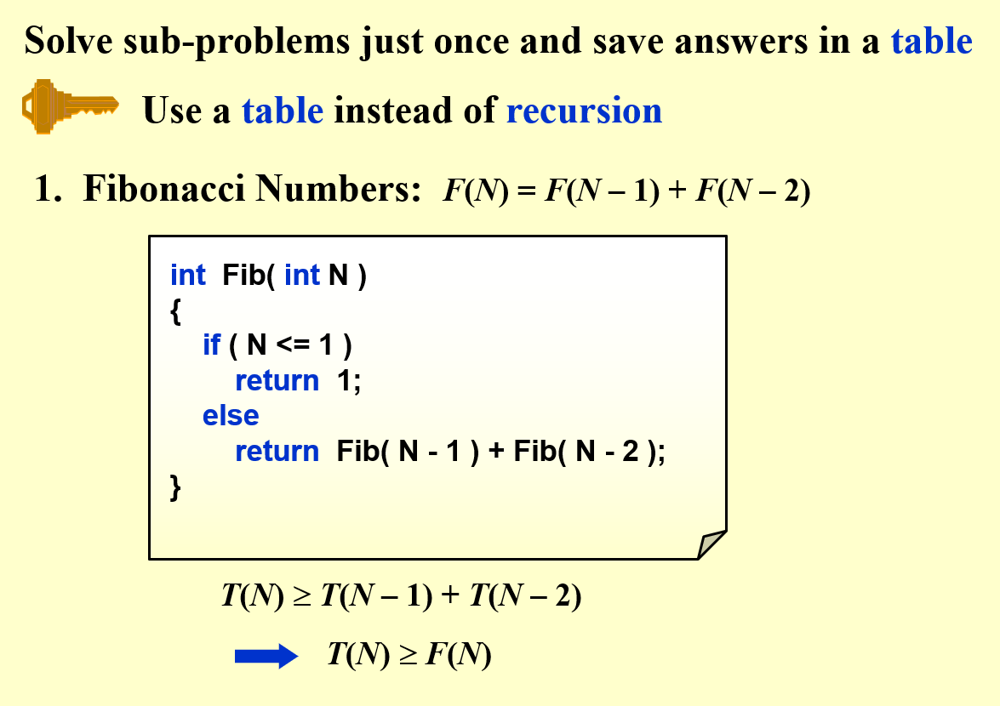

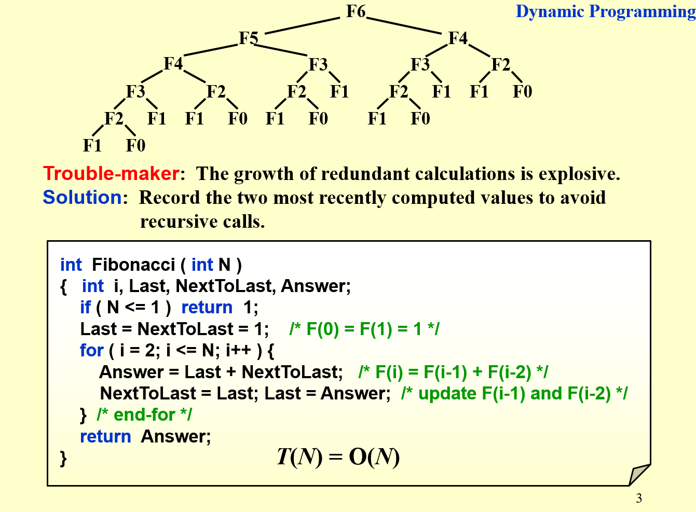

---

## Shorteset Path in DAGS
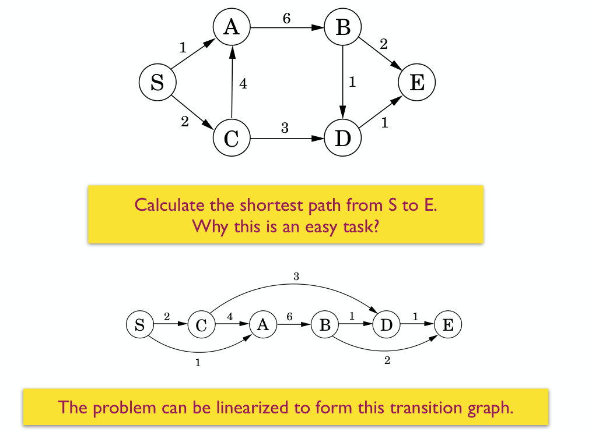

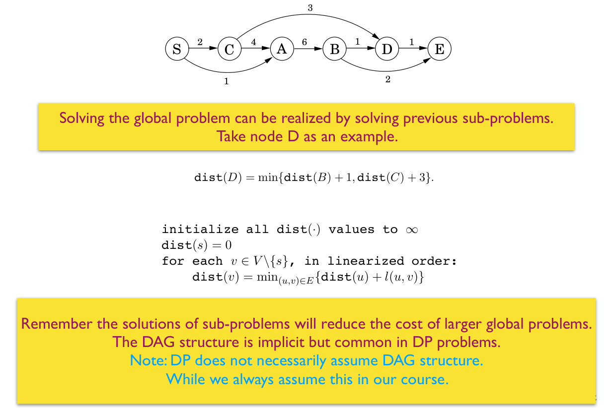

通过这个案例，我们或许能感受到动态规划算法的问题（子问题）的结构与DAGS的关系

---

## Maximum subsequence sum
最大子序列和(Maximum subsequence sum)也是一个经典的案例

我们可以通过不同算法之间的比较进一步简单感受动态规划算法的特点

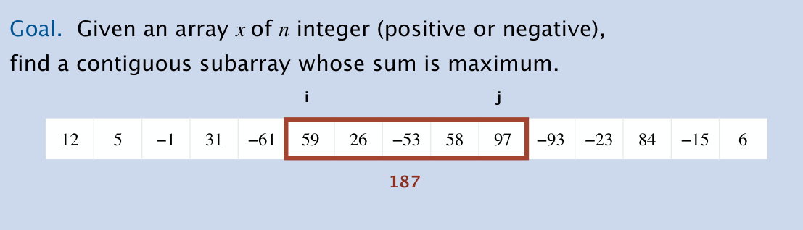

---

### Brute-force algorithm:

For each i and j: compute a[i] + a[i+1] + .. + a[j].

Time complexity:
$T(n) = 1\cdot n+2\cdot (n-1)+3\cdot (n-2)+...+n\cdot 1$

$= \Sigma _{i=1} ^ n i\cdot (n-i+1) = n\Sigma _{i=1} ^ n i - \Sigma _{i=1} ^n i^2 +\Sigma _{i=1} ^n i = \Theta(n^3)$

---

### Cumulative sum trick
- Precompute cumulative sums: $S[i] = a[0] + a[1] + … + a[i]$. $\Theta(n^2)$
- Now $a[i] + a[i+1] + … + a[j] = S[j] − S[i−1]$.$\Theta(n^2)$
- improves running time to $\Theta(n^2)$

---

### Divide and conquer algorithm
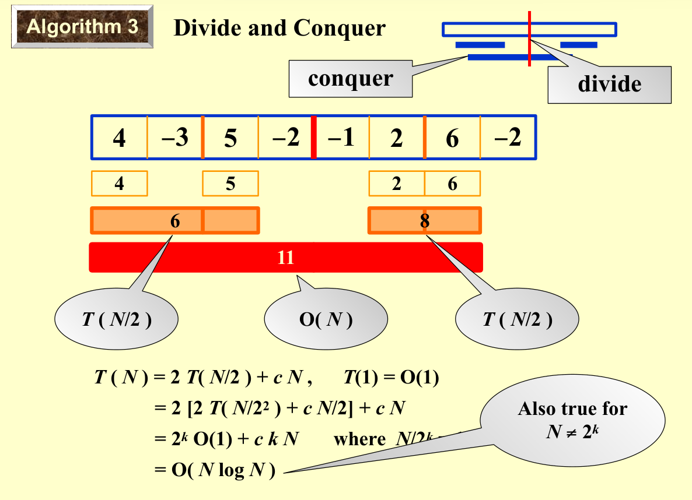

---

### Kadane's algorithm
运用了动态规划的思想的算法

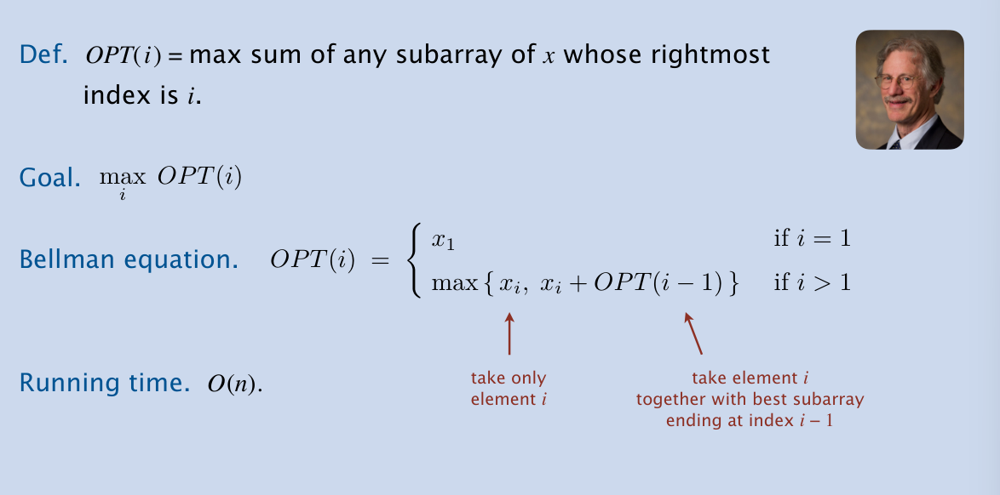

---

## Product Assembly
考虑如下的Product Assembly Problem(装配线调度问题)

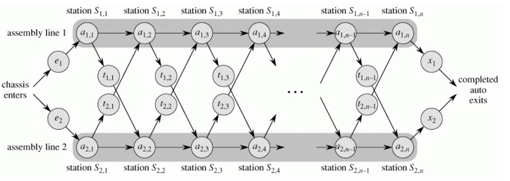

如果给定一个装配序列，比如告诉我们在装配线1上使用哪些站，在装配线2上使用那些站（当然图中对应的装配线序号是0，1），则可以在
$\Theta(n)$的时间计算出一个底盘零件通过工厂装配线装配成车所需的时间。

但是不幸的是，选择装配线的可能方式一共有$2^n$种，因此通过穷尽所有可能的方式再找出最小时间
来求解最优解的方式肯定是不可行的

按照[动态规划算法设计的步骤](#introduction)来看,我们首先需要描述通过工厂最快路径的结构

我们考虑底盘从起始点到装配站$S_{1,j}$的最快可能路线。如果j=1，则底盘能走的只有一条路线，所以很容易就可以
确定它到装配站$S_{1,j}$花费了多少时间。对于j=2,3,...,n，则有两种选择:这个底盘可能从装配站$S_{1,j-1}$
直接到装配站$S_{1,j}$，在相同的装配线上，移动零件的时间是可以忽略的。或者，这个底盘可能来自装配站$S_{2,j-1}$，
然后再移动到装配站$S_{1,j}$，移动的代价是$t_{2,j-1}$（表示从2号装配线到j-1装配站所花的时间）

显然，经过上述分析，我们发现对于装配线调度问题，一个问题的（找出通过装配站$S_{i,j}$的最快路线）最优解包含了子问题
（找出通过$S_{1,j-1}$或$S_{2,j-1}$的最快路线）的一个最优解。

我们称这个性质为**最优子结构**，这是是否可以应用动态规划方法的标志之一，我们会在后面详细讨论。

根据动态规划方法的第二个步骤，我们需要利用子问题的最优解来递归定义一个最优解的值。对于装配线的调度问题，我们选择在两条装配线上通过装配站$j$的最快路线的问题来作为子问题,j=1,2,3...,n。令$f_i[j]$表示一个底盘从起点到装配站$S_{i,j}$的最快可能时间。最终到达工厂的最快时间记为$f^*$

则

$$
f^* = min(f_1[n] + x_1, \quad f_2[n] + x_2)
$$  

显然有

\[
f_1[j] = 
\begin{cases} 
e_1 + a_{1,1}, & \text{if } j = 1 \\
\min\{f_1[j-1] + a_{1,j}, f_2[j-1] + t_{2,j-1} + a_{1,j}\}, & \text{if } j \geq 2 
\end{cases}
\]

\[
f_2[j] = 
\begin{cases} 
e_2 + a_{2,1}, & \text{if } j = 1 \\
\min\{f_1[j-1] + a_{2,j}, f_2[j-1] + t_{1,j-1} + a_{2,j}\}, & \text{if } j \geq 2 
\end{cases}
\]

接下来的第三步骤，我们可以自底向上的计算最优解值，并且如果需要第四步得到最优解，在设计算法时可以对每个状态附加一个“即将到达的装配站”的信息。这里暂且不表

---

## Optimal binary search trees
最优二叉搜索树：用于优化搜索效率。它是一种特殊的二叉搜索树，能够最小化查找操作的期望代价，适用于需要频繁查找的静态数据集。

有点哈夫曼树的味道，然而哈夫曼树用于数据压缩，通过构建权重最小的二叉树来减少编码的位数，
最优二叉搜索树用于最小化查找操作的期望代价，适用于需要频繁查找的静态数据集。

问题描述如下图

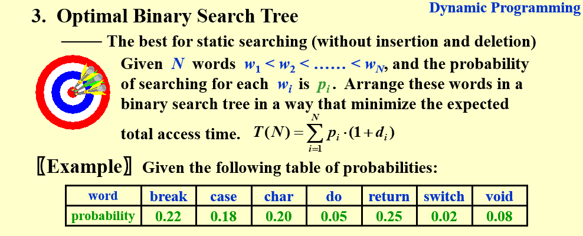

设计动态规划算法：
首先我们需要描述最优解的结构以及递归定义最优解的值

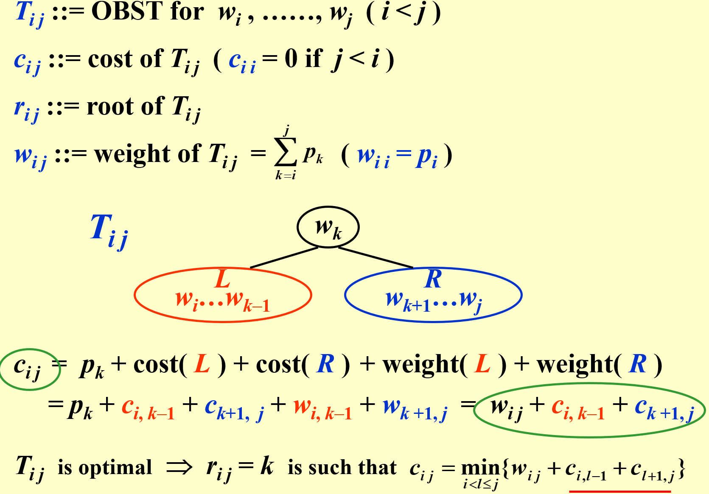

然后就可以按照自底向上的方式计算最优解的值

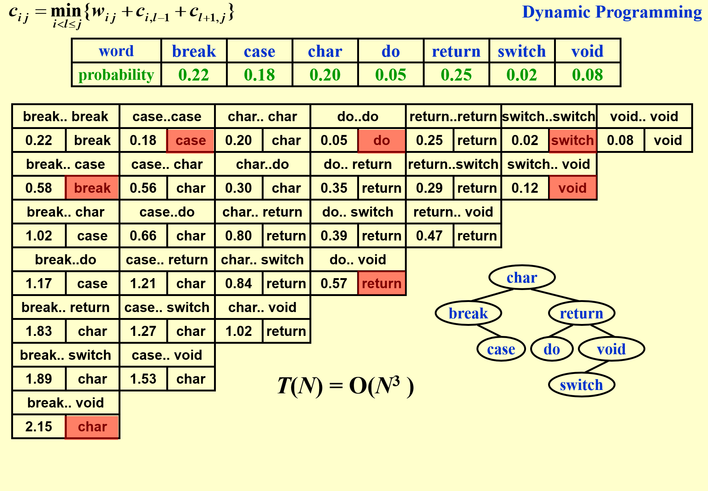

当然如果我们不仅想要求出最优解的值，还想要得到问题的一个最优解

我们需要每次计算一个$c_{i \, j}$时都记录下最优解时的根节点

最后我们想找$brak-void$的$c_{i \, j}$只需要按照表中记录的根节点分割并构建出最优解时对应的树

---

## 0-1 knapsack
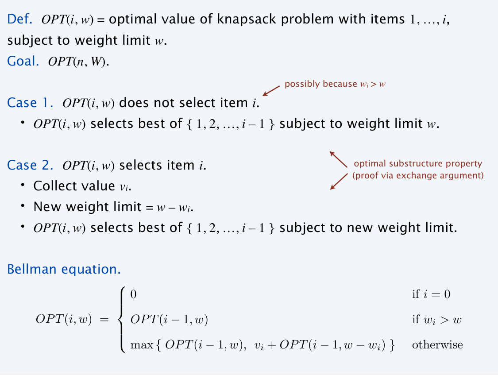

找到背包问题的贝尔曼方程来解决最优化问题

所以我们只需要把$i$行$w$列(当然在下图中也可以是$i+1$行$w+1$列)的矩阵从左到右，从上往下地按照贝尔曼方程填写完整，最右下角的值就是我们寻找的解。

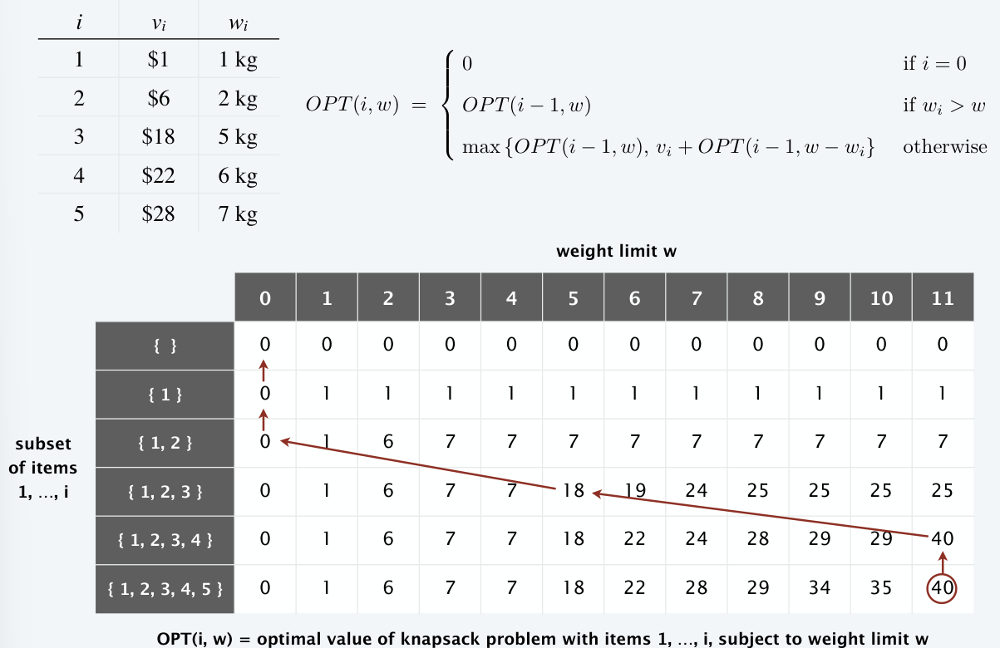

!!! note "w的整数限制"
    在这个问题中我们也可以发现，这个算法只适用于处理背包限重是整数的情况，也就是标准的0-1背包问题

很显然可以得到伪代码如下，并且我们知道时间复杂度和空间复杂度都是$\Theta(n W)$的

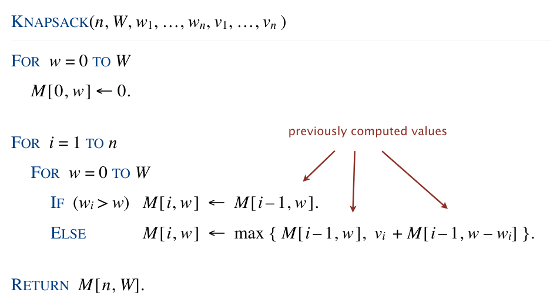

!!! info "NP completeness"
    背包问题（特别是0-1背包问题）是一个经典的NP完全问题，意味着目前没有已知的多项式时间算法来解决它

---

## Martix multiplication
问题描述如下图

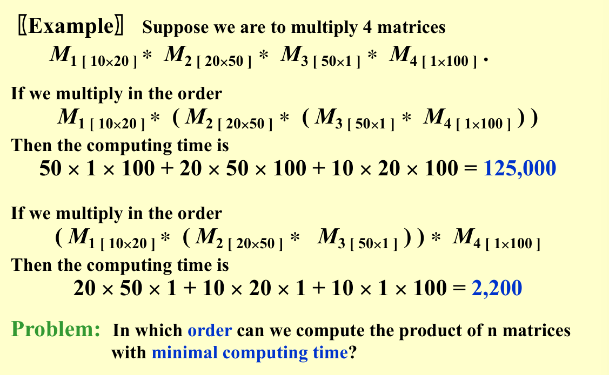

我们如果用比较暴力的枚举算法，可以试着分析一下它所需要的时间复杂度

$\text{Let} \ b_n = \text{number of different ways to compute} \ M_1 \cdot M_2 .... M_n$
$\text{Then we have} \ b_2=1,b_3=2,b_4=5,...$

$\text{Let} \ M_{ij} = M_i...M_j. \ \text{Then} \ M_{1n} = M_1 ... M_n = M_{1\ i} \cdot M_{i+1\ n}$
$\Rightarrow b_n = \Sigma_{i=1}^{n-1} b_i b_{n-i} \ \text{where} \ n > 1 \ \text{and} \ b_1 = 1$

据此可以得出总共需要枚举的次数

$$
b_n = O(\frac{4^n}{n\sqrt{n}})
$$

因此需要的时间开销是很大的

!!! info "Catalan number(加泰罗尼亚数)"
    加泰罗尼亚数是出现在各种计数问题中的自然数序列，通常涉及递归定义的对象。它们以欧仁·加泰罗尼亚 （Eugène Catalan） 的名字命名，尽管它们之前是在 1730 年代由 Minggatu 发现的。

    第 n 个加泰罗尼亚数可以直接用中心二项式系数表示为

    $$
    C_n = \frac{1}{n+1} \binom{2n}{n} = \frac{(2n)!}{(n+1)! \, n!} \quad \text{for } n \geq 0.
    $$

    加泰罗尼亚数字满足递归关系
    
    \begin{align*}
        C_0 &= 1 \quad \text{and} \quad C_n = \sum_{i=1}^{n} C_{i-1} C_{n-i} \quad \text{for } n > 0, \\
        \text{或者} \\
        C_0 &= 1 \quad \text{and} \quad C_n = \frac{2(2n - 1)}{n + 1} C_{n-1} \quad \text{for } n > 0.
    \end{align*}

    渐近地，加泰罗尼亚数字增长为 

    $$
    C_n \sim \frac{4^n}{n^{3/2} \sqrt{\pi}}
    $$

因此我们有动态规划的算法，找到贝尔曼方程

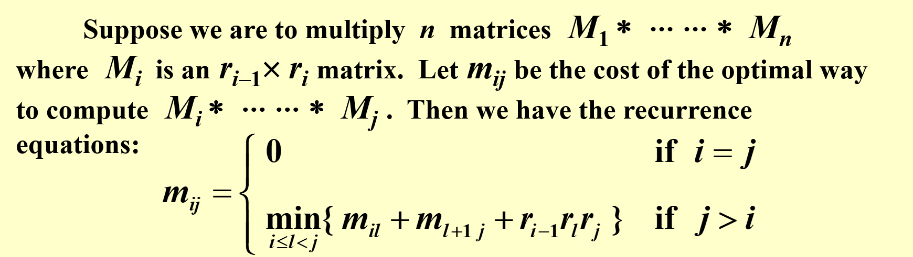

之后就可以自底向上地求出$m_{1,N}$

??? note "pseudocode for OptMatrix"
    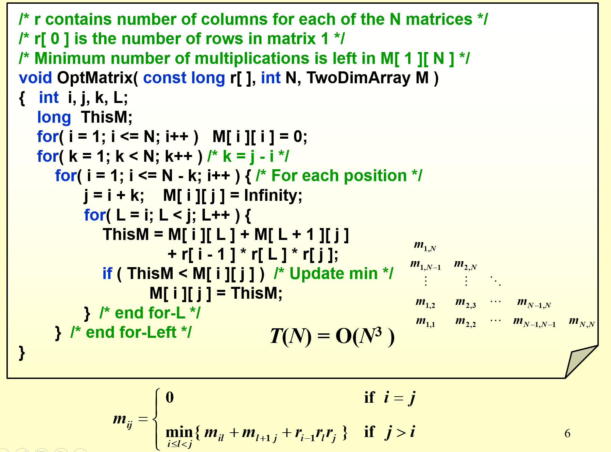

---

## All-Pairs Shortest Path
All-Pairs Shortest Path(全源最短路径问题)，与单源最短路径不同

单源最短路径算法 (Single-Source Shortest Path Algorithm)：目标是计算从一个特定的源节点（S）到图中其他所有节点的最短路径。典型的算法包括 Dijkstra 算法（适用于非负权图）

全源最短路径算法 (All-Pairs Shortest Path Algorithm)：
目标是计算图中每一对节点之间的最短路径。典型的算法包括 Floyd-Warshall 算法

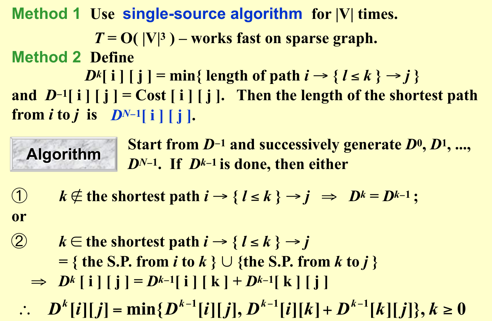

!!!question "Time complexity for Method 1"
    使用 V 次 Dijkstra算法

    $O(E+V \, logV) \cdot V = O(V^2) \cdot V = O(V^3)$
