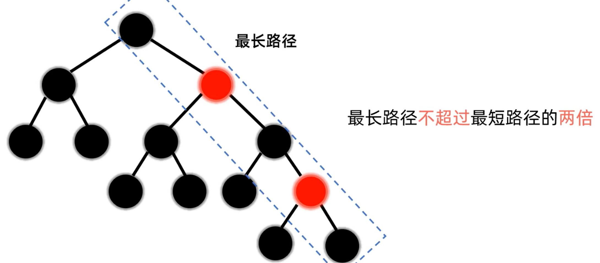
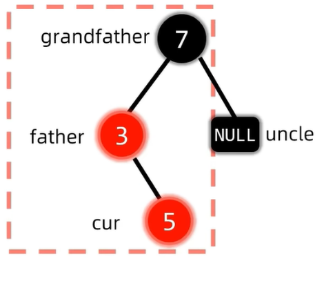
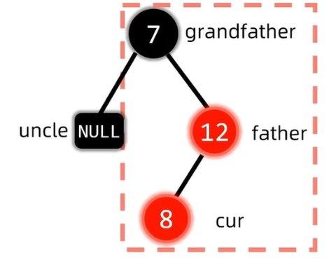
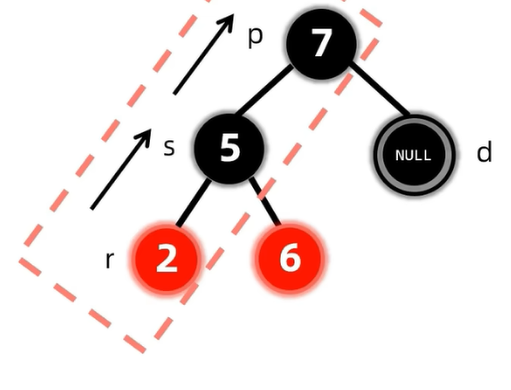
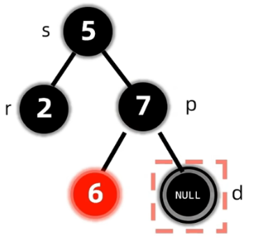
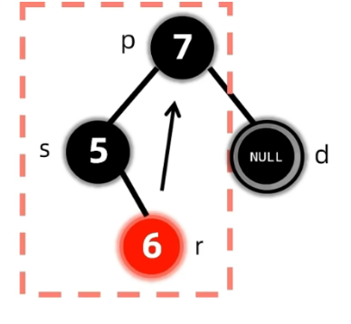
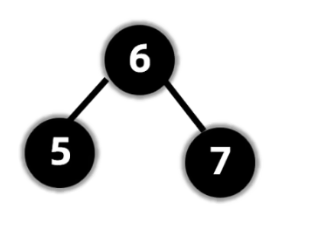
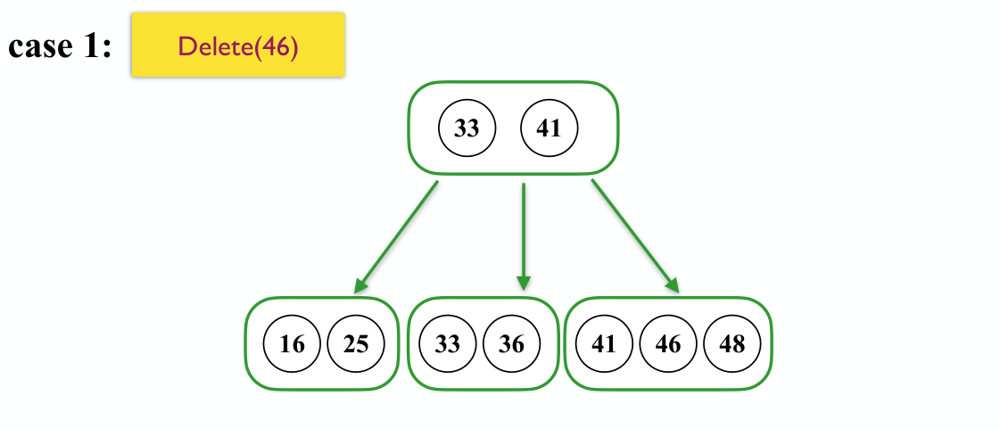
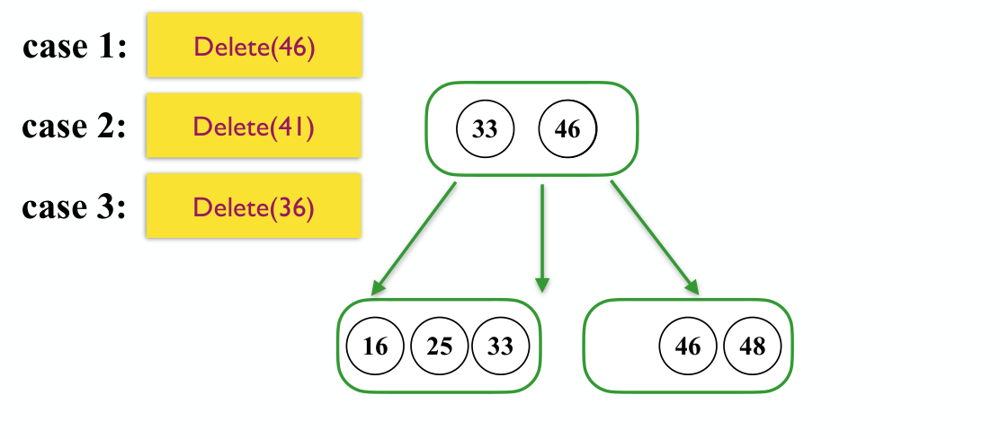

# Chapter 2 | Red Black Tree & B+ Tree

## Red Black Tree

### 概述
我们知道AVL树在每次操作都对原树进行平衡化操作，从而使得二叉搜索树保持一个相对平衡的状态，避免了链式结构造成的O(n)的复杂度。而同样的，红黑树也是一种平衡二叉搜索树，只不过与AVL树相比，它们对于“平衡”的定义以及为达到“平衡”采取的策略不同而已。

顾名思义，**红黑树(Red Black Tree)** 就是一种节点分类为红黑两色的，比较平衡的二叉搜索树。只不过不同于 AVL 树，红黑树的“平衡”性质是通过**黑高(black height)** 来定义的。接下来依次给出红黑树的定义和黑高的定义。

---

### 红黑树的定义
!!! definition Red Black Tree
    

    红黑树是满足如下性质的一种二叉搜索树：

    !!! info "Properties"
        1. Every node is either red or black.
        2. The root is black.
        3. Every leaf (`NIL`) is black.
        4. if a node is red, then both its children are black.
        5. For each node, all simple paths from the node to descendant leaves contain the same number of black nodes.
    
    根据网上流传较广（不过个人认为并不是很有效果）的口诀，我们可以进一步将红黑树的规则归纳为，可能可以方便我们接下来的讨论

    **左根右**、**根叶黑**、**不红红**、**黑路同**

    翻译成人话其实就是：
    1. 满足二叉搜索树性质
    2. 根和叶子节点都为黑色
    3. 不能存在两个连续的红色节点
    4. 任一节点到它的叶子节点所经过的黑色节点个数相同

    !!! warning "Leaf Node？"
        由于这里的“叶子结点”被重新定义了，为了描述方便，我们或许可以称所有两个子结点都是 `NIL` 的结点为**末端结点**或者其他类似的讲法（也就是通俗意义上的叶子结点）

---

### 黑高的定义
特定节点的黑高，等于该节点到叶结点到简单路径中（**不包括自身**），黑色节点的数量。

---

### 推论
!!! tip "一些推论"
    1.根据以上对红黑树的定义，我们可以得出一条在判定非红黑树时常用的推论
    <a name="推论1">
    **合法红黑树的红色节点只能有2个叶子节点或没有叶子节点**
    </a>
    ??? tip "解释"
        主要原因是红黑树中若出现了仅有一个叶子节点的红节点时，根据**红节点只能有黑色子节点**的性质，它的另一个子节点只能也是黑色的非叶子节点。所以从该红色节点出发向叶子走就会走出必定黑高不同的两条路径，破坏了**黑高相同**这一性质。
        
        同时需提醒的是，**叶子节点指的是`NIL`的黑节点**

    2.由于红黑树中黑高相同，所以很显然一条路径中，红色节点越多该路径长度也越大。那么最短路径一定是全黑的路径，最长路径一定是一黑一红的路径。
    
    那么我们就有红黑树中**最长路径不超过最短路径两倍**的结论，把结论推广到任一节点，那么就能得到**任一节点左右子树的高度比不超过两倍**
    

    ??? info "AVL树 vs 红黑树"
        在这里我们将AVL树和红黑树对高度的要求做对比，会发现AVL树对此更严格，因此在时间复杂度同为O(logn)下，**AVL树的查询操作更加高效**

        但同时，由于AVL树在每次进行插入和删除时都相较会进行更多的**旋转**操作（这会在下面对插入删除的介绍中体现），因此**红黑树的插入和删除操作更加高效**

        
    
    3.**一个有 $N$ 个内部节点（不包括叶子结点）的红黑树，其高度最大为 $2log⁡2(N+1)$**

    ??? tip "证明"
        > [关于黑高和点数的关系](https://stackoverflow.com/questions/70944386/maximum-height-of-a-node-in-a-red-black-tree)。

        1. 首先我们有 $N \geq 2^{bh}-1$，也就是 $bh \leq \log_2 (N+1)$；
        2. 然后显然有 $2 bh(Tree) >= h(Tree)$

---

### 插入
红黑树本质是一种二叉平衡树，因此红黑树的插入按理和二叉搜索树类似，只不过红黑树引入了节点的红黑颜色，所以插入时可能会破坏原树的红黑颜色性质。
那么为了尽可能减少对颜色性质的破坏，我们**默认插入的节点是红色节点** -- 因为红色节点的插入不可能破坏黑路同，只可能破坏不红红或根叶黑（事实上大多数情况若原树非空的话，连根叶黑都不会破坏）

如果插入新节点后，红黑树的性质并没有被破坏，那么我们不需要对红黑树进行维护；而如果破坏了红黑树的性质，我们就需要对红黑树做进一步维护。

我们可以将插入的情况分为：

1. 插入节点没有父亲（是根节点）-- 违反根叶黑
2. 插入节点父亲节点是红色节点 -- 违反不红红
3. 插入节点父亲节点是黑色节点 -- 不需要维护

!!! warning "为什么要讨论根叶黑？"
    可能有些人会有疑问，插入节点是根节点这一情况是平凡的，并不需要讨论，但其实在后面的详细维护步骤中我们会发现，对插入节点处的维护可能会递归地引起上层节点的维护，因此即使原树非空，我们也会遇到要讨论“插入节点是根节点”的情形（即**向上递归**地将爷爷节点作为 cur 直至根节点）

很显然，对上述需要进行维护的1、2情况进一步分类，需要维护的情况只有三种：

1. **插入节点是根节点**
2. **插入节点父亲红叔叔红**
3. **插入节点父亲红叔叔黑**

下面我们分别进行讨论

#### 插入节点是根节点
!!! note "直接变黑"
    非常简单，我们直接将根节点变黑就行了

#### 插入节点父亲红叔叔红
!!! note "叔父爷变色 爷变插入节点"
    === "Frame 1"
        

        在这一情况下，cur节点插入默认为红，father/uncle均为红
    === "Frame 2"
        

        **将 father,uncle,grandfather 均变色**
        目的在于：不改变 grandfather 子树中各子树黑高的同时，修复了"不红红"
        但是将 grandfather 变为红色时，若 grandfather 存在红色父亲节点，便又破坏了"不红红"。而这就需要 **grandfather 成为插入节点** cur，**递归向上**地进行维护，直至根节点
    === "Frame 3"
        

        grandfather 此时作为 cur，恰好是根节点
        那么根据"插入节点是根节点"的操作方式，直接将 cur 变为黑色即可

#### 插入节点父亲红叔叔黑
!!! note "(LL RR LR RL)旋转后 将(最后一次)旋转点与中心点变色"
    !!! info "LL"
        === "Frame 1"
            

            注意这里的叶子节点 `NIL` 也应当作 uncle

        === "Frame 2"
            

            做 LL 旋转

        === "Frame 3"
            

            对旋转点和旋转中心点变色

    !!! info "RR"
        === "Frame 1"
            

            同理 LL

        === "Frame 2"
            

            同理 LL

        === "Frame 3"
            

            同理 LL

    !!! info "LR"
        === "Frame 1"
            
            
            与 AVL 树的 LR 旋转相同，只不过多了变色操作
        === "Frame 2"
            

            可以把 double rotation 理解为连续两次的 simple rotation
            LR 旋转即是先对 father-cur 左旋，再对 grandfather-father-cur 做右旋
            （也就达到了将最中间的数作为 root，它的左子树给左，右子树给右的效果）
        === "Frame 3"
            

            最后将**最后一次**旋转的旋转点和中心点变色
            事实上 LL 与 RR 情况的变色也可以记为"将最后一次旋转的旋转点和中心点变色"
            （只不过 LL 与 RR 由于是 simple rotation 只有一次旋转）
    
    !!! info "RL"
        === "Frame 1"
            

            同LR
        === "Frame 2"
            

            同LR
        === "Frame 3"
            

            同LR

**归纳总结如下图**

#### \*Top-Down 思路
!!! note "@《Data Structures and Algorithm Analysis in C 》"
    Implementing the percolation would require maintaining the path using a stack or parent pointers.We saw that splay trees are more efficient if we use a top-down proedure, and it turns out that we can apply a top-down procedure to red black trees.

在有了 Bottom-Up Insertion 思路的基础上，Top-Down Insertion 在维护上其实较为简单，这里简单进行说明

在与插入数作比较向下寻找的过程中，**当我们发现一个节点 X 具有两个红色孩子，我们就将 X 变为红色，两个孩子变为黑色**

而这样的维护可能会对红黑树造成破坏，当 X 的父亲也为红色时，就违反了“不红红”的性质，那么我们就只需要根据先前提到的"插入节点父亲红叔叔黑”的情况进行 Zig Rotation or Zig-zag Rotation（由于我们自顶向下的维护，不可能出现父亲红叔叔也红的情况，因为如果出现会在这次维护前先被维护）

这样的 Top-Down 的思路在算法实现上就只需要另外记下每次递归向下的 cur，father，grandfather 即可；就不需要在初始化时增加每个节点的 parent 指针，或是令设一个 log(n) 大小的栈来存储整条路的节点指针

### 构建
红黑树的构建其实就是节点的依次插入，可以作为插入操作的复习参考

下面的这个视频就比较生动地诠释了红黑树的构建过程

👉**[红黑树的构建（自视频 10:52 起）](https://www.bilibili.com/video/BV1Xm421x7Lg?t=652)**

---

### 删除
**关于删除操作可以参考这个视频，~~下文也是依此归纳~~**
👉**[红黑树-删除](https://www.bilibili.com/video/BV16m421u7Tb)**

要删除某个节点 x，我们首先要找到它，在 BST 中找到某个 x 的开销为 O(log⁡N)。接下来我们要删除这个任意位置的节点，由于红黑树的本质是一种二叉搜索树，所以对需要删除节点所做的“数”上的操作是相同的，只不过需要维护颜色上的性质

我们可以仿照二叉搜索树的删除将情况分类如下：

|没有非`NIL`子节点|有一个非`NIL`子节点|~~有两个非`NIL`子节点~~                         |
|:--------------|:------------------|:------------------------------------------|
|直接用`NIL`替代 |直接删除，用子节点替代它|将值与左子树最大值或右子 树最小值交换，颜色不换， 然后删除在原子树位置的该点|

有两个非 `NIL` 子节点的情况总是会递归地转换成没有非 `NIL` 子节点和只有一个非 `NIL` 子节点的情况，因此我们实际上只需要对这两类情况做讨论

!!! warning "说明"
    为了和视频内容对应，我们下面重新恢复习惯讲法
    将末端节点（通俗意义上的叶子节点）称为孩子节点

#### 只有左孩子/右孩子
!!! note "只有左孩子/右孩子"
    === "case 1"
        
    === "case 2"
        
    由于红黑树性质的约束，根据[推论1](#推论1)，红色节点不可能只有左子树或者只有右子树，因此该节点只可能是黑色，并且孩子必须是红色（否则破坏黑路同）

    此外，红色孩子不可能再有红色孩子（破坏不红红）及黑色孩子（破坏黑路同），因此最终只有两种可能

    那么**删除黑色节点只需让红色节点代替它，再将红色节点变色为黑即可**

#### 没有孩子
若删除节点没有孩子，我们需要根据该节点的红黑做进一步讨论

##### 节点为红
这是一种平凡的情况，**删除后无需做任何调整**

##### 节点为黑
!!! definition "双黑节点"
    黑色节点被删除导致的最直接结果就是该路的黑高少1，这里我们假装这个节点还没有被删除，引入**双黑节点**的概念，双黑节点标记了经过该点的路径都少了一个黑节点

我们对被删除节点的 sibling 兄弟节点继续分类

###### 兄弟为黑且有红孩
!!! note "兄弟为黑且有红孩"
    === "LL"
        === "Frame 1"
            

            只要 s 有红色左孩子那么就属于 LL 型，即使是图中有两个红色孩子的情况也算数
        === "Frame 2"
            

            首先进行变色:**r变s，s变p，p变黑**

        === "Frame 3"
            

            然后执行 LL 型的**左旋**操作
        === "Frame 4"
            

            最后将**双黑变为单黑**，实际已经恢复了黑路同，双黑`NULL`变为单黑`NULL`
    === "RR"
        情况对称，同理 LL
    === "LR"
        === "Frame 1" 
            

            LR型我们只关注r,p的颜色
        === "Frame 2"
            

            首先进行变色:**r变p，p变黑**
        === "Frame 3"
            

            然后执行 LR 型 **double rotation**,也就是先左旋再右旋
        === "Frame 4"
            

            最后将**双黑变为单黑**，实际已经恢复了黑路同，双黑`NULL`变为单黑`NULL`
    === "RL"
        情况对称，同理 LR

###### 兄弟为黑且无红孩
!!! note "兄弟为黑且无红孩"
    === "Example 1"
        === "Frame 1"
            

            被删除的节点被标记为双黑节点，其兄弟为黑且无红孩
        === "Frame 2"
            

            由于右边经过双黑黑高少1，所以**将兄弟变为红色**以
            使得左右子树的黑高平衡
        === "Frame 3"
            

            由于左右子树的黑高都少1，我们可以将**双黑上移**，标记经过 8 节点的黑高都少1

            然后需要继续调整 8 和 18 子树的黑高，即**继续处理双黑**

            发现属于兄弟为黑且有一个红孩的情况
        === "Frame 4"
            

            RR 型，左旋后**取消双黑标记**，将双黑变为单黑
    
    === "Example 2"
        === "Frame 1"
            

            被删除的节点被标记为双黑节点，其兄弟为黑且无红孩
        === "Frame 2"
            

            由于右边经过双黑黑高少1，所以**将兄弟变为红色**
            
            使得左右子树的黑高平衡

            同时将**双黑标记**上移
        === "Frame 3"
            

            上移后25处的双黑标记表明经过25节点的黑高都少1

            那么将红节点变为黑色来弥补黑高

            即**双黑遇到红色变单黑**
    
    === "Example 3"
        === "Frame 1"
            

            被删除的节点被标记为双黑节点，其兄弟为黑且无红孩
        === "Frame 2"
            

            同理**兄弟变红，双黑上移**
        === "Frame 3"
            

            根节点黑高少了也没事，**双黑遇根变单黑**

###### 兄弟为红
!!! note "兄弟为红"
    === "Frame 1"
        

        被删除的节点被标记为双黑节点，其兄弟为红
    === "Frame 2"
        

        兄弟为红，父亲必定为黑

        先执行**兄父变色**
    === "Frame 3"
        

        然后**父亲朝着双黑旋转**
        （这里双黑在父亲右边，所以是右旋）
    === "Frame 4"
        

        继续消除双黑：属于兄弟为黑且无红孩

        **兄弟变红，双黑上移，遇红变单黑**

#### 总结

可以参照这个删除案例的动画做复习巩固
👉**[红黑树删除-案例 自视频20:41](https://www.bilibili.com/video/BV16m421u7Tb?t=1241)**

!!! tip ""
    Rotation 在不同数据结构、不同操作中出现的数量：

    |Option|AVL Tree|RB Tree|
    |----|----|----|
    |Insertion|$\leq 2$|$\leq 2$|
    |Deletion|$O(\log N)$|$\leq 3$|

    知道这个结论就可以很轻松地解决这道题目

    

---

## \*B Tree

### 概述
!!! note "@wikipedia"
    B树，概括来说是一个一般化的BST，一个节点可以拥有2个以上的子节点。与先前学过的AVL,红黑树等自平衡二叉查找树不同，B树适用于读写相对大的数据块的存储系统，例如磁盘。B树减少定位记录时所经历的中间过程，从而加快访问速度。B树这种数据结构可以用来描述外部存储。这种数据结构常被应用在数据库和文件系统的实现上

!!! info "硬盘的读取特性"
    硬盘读取物理地址连续的多个字节和读取单个字节的耗时几乎没有区别

所以简单来说就是通过降低树高来减少硬盘读取次数，从而提高访问效率

---

### 性质
在 B 树中，有两种节点：

1. 内部节点：存储了数据以及指向其子节点的指针。
2. 外部节点/失败节点：与内部节点不同的是，外部节点不存储数据，只是为了查找时方便表示查找失败，在通常情况下省略

!!! warning "叶子节点"
    不同的教材似乎对叶子节点的讲法不同，我们统一将内部节点的最后一层节点称为叶子节点

一棵m阶B树满足的性质如下：

- **平衡性**：所有的叶子节点都在同一层
- **有序性**：节点内部有序，任一元素的左子树都大于它，右子树都小于它
- **多路性**:对于m阶B树的节点
    - 分支数 = 元素数+1
    - 最多$m$个分支，$m-1$个元素
    - 普通节点最少$\lceil{\frac{m}{2}}\rceil$个分支，$\lceil{\frac{m}{2}}\rceil-1$个元素；根节点最少2个分支，1个元素

一个简单的5阶B树的图例如下:

---

### 插入
针对m阶高度h的B树，插入一个元素时，首先判断在B树中是否存在，如果不存在，即在叶子结点处结束，然后在叶子结点中插入该新的元素。

1. 若该节点元素个数小于m-1，直接插入；
2. 若该节点元素个数等于m-1，插入后该节点元素个数变为m，引起节点上溢出；进行分裂操作：以该节点中间元素为分界，取中间元素（即第$\lceil{\frac{m}{2}}\rceil$个元素），插入到父节点中（此时父节点也可能上溢出）；
3. 重复上面动作，直到所有节点符合B树的规则；最坏的情况一直分裂到根节点，生成新的根节点，高度增加1；

详细过程可以参照这个视频
👉**[B树(B-树) - 来由, 定义, 插入, 构建](https://www.bilibili.com/video/BV1tJ4m1w7yR)**

---

### 删除
删除非叶节点元素类似于二叉搜索树，找到它的直接前驱或直接后继替代它，再删除直接前驱或直接后驱

因此删除非叶节点元素最终都转换成**删除叶节点元素**

删除叶结点元素的大致流程如下：具体可以参照👉**[B树(B-树) - 删除](https://www.bilibili.com/video/BV1JU411d7iY/)**

### B Tree & Red Black Tree

!!! info "@Oi-Wiki 2-3-4 树"
    具体内容参见[oi-wiki](https://oi-wiki.org/ds/2-3-4-tree/)

B树有很多特殊形式，比如3阶B树（又称2-3树），比如4阶B树（又称2-3-4树 or 2-4树）。与一般的 B 树一样，它们都可以实现在 $O(\log n)$ 时间内进行搜索、插入和删除操作。

!!! warning "说明"
    dyx:说明一下，ads课默认只教b+树，我们上课讲b树只是为了帮助大家理解红黑树。所以之后无论做题还是考试，出现2-3树或者2-3-4树，都应该默认看成b+树。

而其中,2-3-4树和红黑树是**同构**，任意一棵红黑树都唯一对应一棵 2-3-4 树。在 2-3-4 树上的插入和删除操作导致节点的扩展、分裂和合并，相当于红黑树中的变色和旋转。下图是 2-3-4 树的 2 节点、3 节点和 4 节点对应的红黑树节点。注意到 2-3-4 树的 3 节点对应红黑树中红色节点左偏和右偏两种情况，所以一棵红黑树可能对应多棵 2-3-4 树。

下图是一棵红黑树和与之对应的 2-3-4 树。将红黑树中的红色节点上移到父节点的左右两侧，形成一个 B 树节点，就可以得到与之对应的 2-3-4 树。可以发现，红黑树的节点数等于 2-3-4 树的节点个数

---

## B+ Tree

### 概述
前面将得到的B树可以像二叉搜索树那样快速的查找到一个元素，这种查找过程又叫做随机查找，当我们要按照顺序去遍历所有元素时，就要采取中序遍历的方法，在节点之间来回移动，效率较低，而 B+ 树正是解决了这个问题而诞生，被广泛作为**数据库**的**索引**结构

叶结点包含了所有的关键字，若要顺序查找所有关键字对应的记录，可以像遍历链表一样逐一查找；非叶子结点可以帮助我们快速的定位到叶子节点层上的关键字，相当于为叶子结点层建立了索引，以log(n)级别的复杂度查找到关键字

事实上，整套 B+ 树是一个**多级索引结构**，叶结点层是对它指向记录的索引，中间层非叶节点是对叶结点层关键字的索引，再上一层是对下一层这些索引项的索引...直到 root；而先前的 B 树若作为索引结构，相当于每个节点的关键字都对应了一条记录

将B树和B+树做对比我们发现：

B树**所有结点**的关键字**都有直接指向对应记录的指针**；B+树**叶结点**包含**全部关键字**及**指向相应记录的指针**，非叶节点只作索引

B树顺序查找或范围查找**只能中序遍历**，效率低；B+树兼顾**顺序查找和随机查找**，还可以方便地进行**范围查找**

---

### 性质
从名字上来看，B+ 树和 B 树非常相似，而一般地来说，B+ 树满足如下性质：(实际就是上面提到的 B 树的"多路性"--稍有不同)

!!! note "Property of B+ Tree -- from cy's ppt"

    1. The root is either a leaf or has between $2$ and $M$ children.
   
    2. All nonleaf nodes (except the root) have between $\lceil M/2 \rceil$ and M children.
   
    3. All leaves are at the same depth.
    
    > Assume each nonroot leaf also has between $\lceil M/2 \rceil$ and $M$ children.

    > (这里leafnode的children应该意思就是键值--这似乎是唯一不同之处)

!!! warning "B+树的定义"
    各种资料上B+树的定义各有不同，一种定义方式是关键字个数和孩子结点个数相同。而另一种方式是维基百科上所定义的方式，即关键字个数比孩子结点个数小1，这种方式是和B树基本等价的

    而cyll这里的定义又奇怪一点，似乎在这一基础上让leafnode特殊地最多拥有$M$个键值
例如下图就是一棵 M = 4 的 B+ 树

所有真实的数据都被存储在叶子结点中，形成一个有序的数列。而非叶子结点中**第 i 个键值等于其第 i+1 棵子树的最小值**（在上图中表现为颜色相同的一对上下结点），因此非叶结点最多存 M−1 个值。

!!! info "key"
    B+树的 key 数似乎指的是叶子节点中的键值个数？

??? tip "发现"
    于是我们发现这样一个性质：在存储数值不重复的情况下，**非叶结点存储的键值都不相同**。

    证明很简单，对于任意一个非叶子结点，它存储的值必定不会被它的子节点存储（如果它的子节点不是叶子），因为它存的是它的子节点的第一个子树的最小值，而它的子节点存的是第二个子树开始的最小值。

    以及另一个性质：由于它在空间最浪费的情况下是一棵$\lceil{\frac{M}{2}}\rceil$叉树，所以**B+树的深度**是 $O(log\lceil{\frac{M}{2}}\rceil N)$

---

### 查找
类似于二叉搜索树的查找，比较简单，不赘述

---

### 插入
B+ 树的插入算法与 B 树的相近：

- 若为空树，创建一个叶子节点，然后将记录插入其中，此时这个叶子节点也是根节点，插入操作结束。

- 针对叶子类型节点：根据关键字找到叶子节点，向这个叶子节点插入记录。插入后，若当前节点关键字的个数小于等于 m ，则插入结束。否则发生了上溢出，执行分裂操作：将这个叶子节点分裂成左右两个叶子节点，左叶子节点包含（$\lceil \frac {m+1} 2 \rceil$）个记录，右节点包含剩下的记录，将第（$\lceil \frac {m+1} 2 \rceil + 1$）个记录的关键字进位到父节点中（父节点一定是索引类型节点），进位到父节点的关键字左孩子指针向左节点，右孩子指针向右节点。将当前节点的指针指向父节点，然后执行第 3 步。

- 针对索引类型节点（内部节点）：若当前节点关键字的个数小于等于 m-1 ，则插入结束。否则发生了上溢出，执行分裂操作：将这个索引类型节点分裂成两个索引节点，左索引节点包含$\lceil \frac {m} 2 \rceil$key，右节点包含除中间位置（$\lceil \frac {m} 2 \rceil + 1$）外剩下的key，将中间位置的关键字进位到父节点中，进位到父节点的关键字左孩子指向左节点，进位到父节点的关键字右孩子指向右节点。将当前节点的指针指向父节点，然后重复这一步。

可以参考下面的案例加深理解

!!! section "Insert(44), split"
    === "Frame 1"
        
    === "Frame 2"
        
    === "Frame 3"
        
    === "Frame 4"
        
    === "Frame 5"
        
    === "Frame 6"
        

--- 

### \*删除
B+ 树的删除也仅在叶子节点中进行，当叶子节点中的最大关键字被删除时，其在非叶子节点中的值可以作为一个分界关键字存在。若因删除而使节点中关键字的个数少于
$\lceil \dfrac{m}{2} \rceil$ 时，其和兄弟节点的合并过程亦和 B 树类似。

!!! warning
    由于cy's ppt 没有涉及B+树的删除内容，所以不太清楚这里定义的叶子节点和节点键数是否都是在少于 $\lceil \dfrac{m}{2} \rceil$ 时发生下溢出。个人认为能将具体步骤和案例理解个大概即可，并且一般而言本课程涉及的B+树都是2-3树或2-3-4树，直接记节点键数等于1时发生溢出就可。而且考试大概率不会出，出的话请狠狠 blame cy

具体步骤如下：

首先查询到键值所在的叶子节点，删除该叶子节点的数据。

如果删除叶子节点之后的数据数量，满足 B+ 树的平衡条件，则不做平衡操作。但是如果删除的叶子节点数据是最小数，则要更新父节点中对应的值。

否则，就需要做平衡操作：如果该叶子节点的左右兄弟节点的数据量可以借用，就借用过来满足平衡条件。否则，就与相邻的兄弟节点合并成一个新的子节点了。

在上面平衡操作中，如果是进行了合并操作，就需要向上修正父节点的指针：删除被合并节点的键值以及指针。

由于做了删除操作，可能父节点也会不平衡，那么就按照前面的步骤也对父节点进行重新平衡操作，这样一直到某个节点平衡为止。

结合具体案例说明会更清晰一些

!!! note "Deletion of B+ Tree"
    === "Delete(46)"
        === "Frame 1"
            
        === "Frame 2"
            

    === "Delete(41)"
        === "Frame 1"
            
        === "Frame 2"
            
    
    === "Delete(36)"
        === "Frame 1"
            
        === "Frame 2"
            
        === "Frmae 3"
            
    
    === "Delete(48)"
        === "Frame 1"
            
        === "Frame 2"
            

    === "Delete(33)"
        === "Frame 1"
            
        === "Frame 2"
            
        === "Frame 3"
            
            
            注:这里图中的43应该为46
     