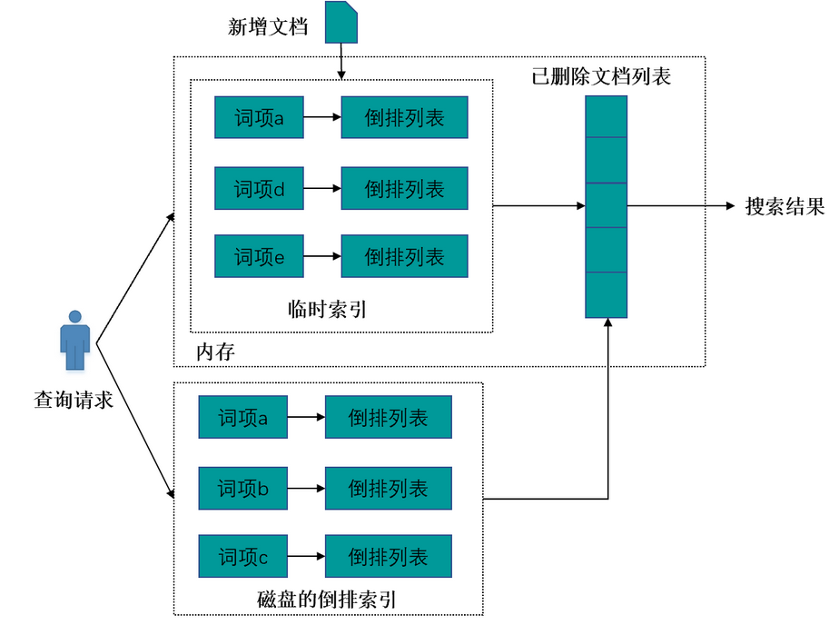

# Chapter 3 | Inverted File Index

## Inverted File Index

### 概述
> 倒排索引（inverted file index）是一种常见的文本检索技术，用于快速查找包含特定单词或短语的文档。它通过将单词或短语作为关键字，并将它们出现在文档中的位置记录在一个索引中，从而支持快速的文本检索。在搜索过程中，系统可以快速地定位包含指定单词或短语的文档，并返回它们的相关信息。倒排索引广泛应用于搜索引擎、数据库系统和信息检索等领域。
>  
> —— ChatGPT

!!! quote "link"
    Wiki: https://en.wikipedia.org/wiki/Inverted_index

简单来说，拿搜索引擎的应用举例：在没有搜索引擎时，我们是直接输入一个网址，然后获取网站内容，这时我们的行为是：

```
document -> to -> words
```
通过文章，获取里面的单词，这种就是所谓的”正向索引”（forward index）。

后来，我们希望能够输入一个单词，找到含有这个单词，或者和这个单词有关系的文章：
```
word -> to -> documents
```
于是就把这种索引，称为 inverted index，直译过来，应该叫”反向索引”，国内翻译成”倒排索引”。

---

### 实现

知道了倒排索引的思想之后，其实现就变得非常直观了。我们可以用一个字典来描述一类关系，其主键为单词，键值为这个单词出现的所有位置。

最朴素的版本就是让键值为单词出现过的文档的序号序列；而如果我们还需要知道词汇出现的位置，则可以让键值是一个二元组的序列，其中第一个元素是文档的序号，第二个元素是单词在文档中出现的位置；甚至，我们还可以在键值中增加单词出现的次数以优化我们的搜索体验

!!! eg "一个 🌰"
    
    例如我们有如下文件集：

    !!! summary "文档集"
        | Doc   | Text                                              |
        |:-----:|:--------------------------------------------------|
        | 1     | Gold silver truck                                 |
        | 2     | Shipment of gold damaged in a fire                |
        | 3     | Delivery of silver arrived in a silver truck      |
        | 4     | Shipment of gold arrived in a truck               |

    那么我们可以得到如下的倒排索引：

    !!! summary "倒排索引"
        | No.| Term       | Times; (Doc ID: Places) |
        |:--:|:-----------|:------------------------|
        | 1  | a          | {3; (2;6),(3;6),(4;6)}  |
        | 2  | arrived    | {2; (3;4),(4;4)}        |
        | 3  | damaged    | {1; (2;4)}              |
        | 4  | delivery   | {1; (3;1)}              |
        | 5  | fire       | {1; (2;7)}              |
        | 6  | gold       | {3; (1;1),(2;3),(4;3)}  |
        | 7  | of         | {3; (2;2),(3;2),(4;2)}  |
        | 8  | in         | {3; (2;5),(3;5),(4;5)}  |
        | 9  | shipment   | {2; (2;1),(4;1)}        |
        | 10 | silver     | {2; (1;2),(3;3,7)}      |
        | 11 | truck      | {3; (1;3),(3;8),(4;7)}  |

所以实际上非常简单，我们只需要扫描文档，然后存下每一个文件在哪里出现过即可。

---

### 改进

那么到此为止了吗？非也。倘若毫无节制的将所有词都存到倒排索引中，那么我们的倒排索引就会变得非常大，其中必然有很多冗余信息存在，所以我们需要对倒排索引进行一些改进。

---

#### 停用词

我们观察到，我们存下来的这些内容中，有一些东西频繁地出现在所有文档中，在特定情况下，这些词可能并不会成为一个索引，例如正常的英文文章中的 `a`，`the` 等。所以，对于这一类词——我们称之为**停用词(stop words)**，对于停用词，我们就不需要将他们存下了。

!!! question "哪些词会成为停用词？"

    一般一个词成为停用词，是因为它无法成为一个有效的检索关键字，它可能是在大量资料中大量出现，导致我们无法利用它找出我们想要的资料。换句话来说，一个共通点是它们**通常**都有着相当高的出现频率。

> 但是我们也不能盲目地将所有的词都作为停用词，因为有些词它在某些含义下适合作为一种停用词，但是在另一些含义下，它就不适合作为停用词了，不过这个问题就变得比较复杂了，所以这里并不展开。

---

#### 词干分析

**词干分析(word stemming)**是一种将单词转换为其词干的技术。例如，词干分析可以将单词 `trouble`，`troubled`，`troubles`，`troubling` 都转换为 `trouble`（甚至是 `troubl`，核心目的是让它们变成同一个单词）。相同词干的词有着类似的含义，在检索 `troubled` 的时候，当然也可能想找到包含 `trouble` 的文档。这种技术也可以让多个单词共享同一条索引记录，在存和找的过程中都能优化效果。

不过在具体操作方面，这个东西就显得比较繁杂和暴力了，我们只能根据语法规范进行暴力匹配和判断，这里我们就不展开了。

---

#### 分布式

可想而知，对于一个搜索引擎来说，它所需要索引的文料是非常庞大的，所以我们通常需要将其分布式地存储和索引。

而这里有两种分布式的策略，其一是根据单词的字典序进行分布式，其二是根据文档进行分布式。

显然根据单词的内容进行分布式，能够提高索引效率，但是这样的话，我们就需要将所有形式接近的单词都存储在一个地方，这样就会造成单点故障，容灾能力很差，所以这种方式并不是很好。

而第二种办法则有较强的容灾性能。即使一台机器无法工作，也不会剧烈影响到整个系统的工作。

---

#### 动态索引

!!! note "Dynamic indexing"
    对于动态索引，cy's ppt 上讲的比较简略，这里稍微阐述地详细了一些，并举了一个实现的例子，主要还是做了解感受动态索引的思想。

现实生活中，文档总是实时更新的，因此我们往往需要动态更新索引
在动态更新索引中，有3个关键的索引结构：倒排索引、临时索引和已删除文档列表。

① 倒排索引就是对初始文档集合建立好的索引结构，该索引存在磁盘中，不可改变。

② 临时索引是在内存中实时建立的倒排索引，该索引存储在内存中，当新增文档进入系统，解析文档，之后更新内存中维护的临时索引，文档中出现的每个单词，在其倒排列表末尾追加倒排列表项，随着新加入系统的文档越来越多，临时索引消耗的内存也会随之增加，一旦临时索引将指定的内存消耗光，要考虑将临时索引的内容更新到磁盘索引中，以释放内存空间来容纳后续的新进文档。

③ 已删除文档列表则用来存储已被删除的文档的相应文档ID，形成一个文档ID列表。这里需要注意的是：当一篇文档内容被更改，可以认为是旧文档先被删除，之后向系统内增加一篇新的文档，通过这种间接方式实现对内容更改的支持。



当系统发现有新文档进入时，立即将其加入临时索引中。有文档被删除时，则将其加入删除文档队列。文档被更改时，则将原先文档放入删除队列，解析更改后的文档内容，并将其加入临时索引中。通过这种方式可以满足实时性的要求。

如果用户输入查询请求，则搜索引擎同时从倒排索引和临时索引中读取用户查询单词的倒排列表，找到包含用户查询的文档集合，并对两个结果进行合并，之后利用删除文档列表进行过滤，将搜索结果中那些已经被删除的文档从结果中过滤，形成最终的搜索结果，并返回给用户。这样就能够实现动态环境下的准实时搜索功能。

--- 

#### 压缩
我们注意到，在倒排索引中，对于某一个term的Posting List，其中需要存储出现次数，文档的ID及出现位置；而对一个搜索引擎而言，其应当包含的文档数量级是很大的，如果我们对每个term的Posting List都直接存储其对应的文档ID，那么存储的开销是比较大的（因为ID的位数通常情况下会比较大）

举一个例子,比如computer这个单词的Posting List 存储的ID是下面这样：

computer -> 2, 15, 47, ..., 58879,58890,...

我们可以转而通过存储ID间隔的方式来压缩这部分存储空间

computer -> 2, 13, 32,...,...,11,...

事实上，大部分间隔都可以被编码成不超过20个bit的二进制串

---

#### 阈值
这里感觉没什么好讲的，ppt上的大致意思是：如果用户想要找到最相关的前x个document其实是比较不方便的，因为这不属于Bollean queries，也容易因为truncation失去一些也比较相关的documents（因为“相关性”是很难量化的）

一种描述相关性的方式是将各个搜索关键词按照它们在 Inverted File Index 中出现的次数升序排序（次数越低说明关键词越重要），设定一个阈值（例如80%），我们只根据前80%的term做搜索

---

## Perfomance Evaluation

评价一个搜索引擎的方式有很多，例如索引的速度，搜索的速度，对语言的理解能力...但最重要的是用户的满意度

只不过 User happiness 这个东西很难定义

一个维度是 Data Retriveal Perfomance Evaluation(数据检索性能评估)，这与搜索的时间，搜索引擎的索引大小等有关

另一个维度是 Information Retrieval Perfomance Evaluation(信息检索性能评估)，主要关注的问题是搜索结果与用户需求的相关性

可以比较数学的方式来量化相关性

|  |Relevant|Irrelevant|
|:------------|:----|:---|
|Retrieved    |$R_R$|$I_R$|
|Not Retrieved|$R_N$|$I_N$|

可以分别定义查准率和召回率（自己起的名

$Precision P = R_R / (R_R + I_R)$
 
$Recall    R = R_R / (R_R + R_N)$

如下图，显然 Precision 和 Recall 的值越大越好


