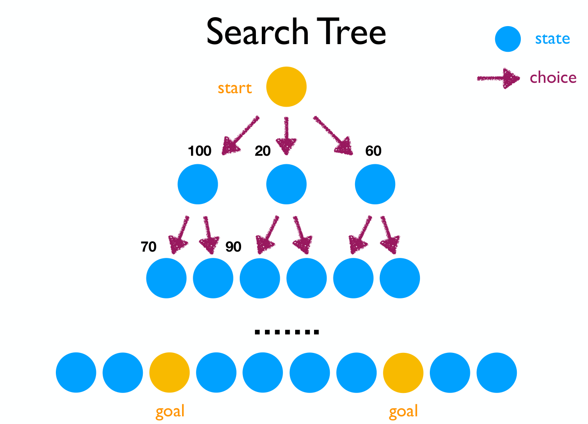
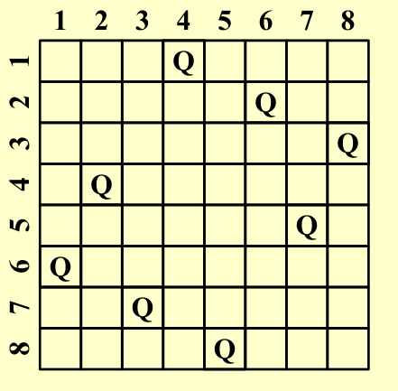
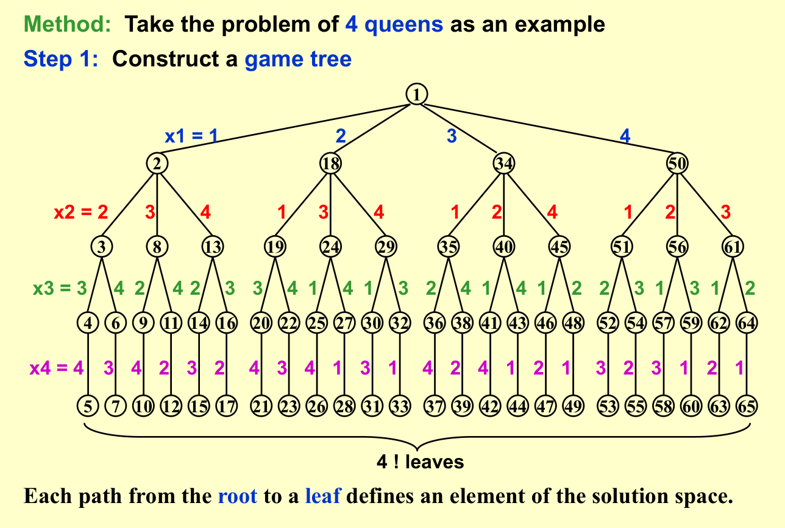
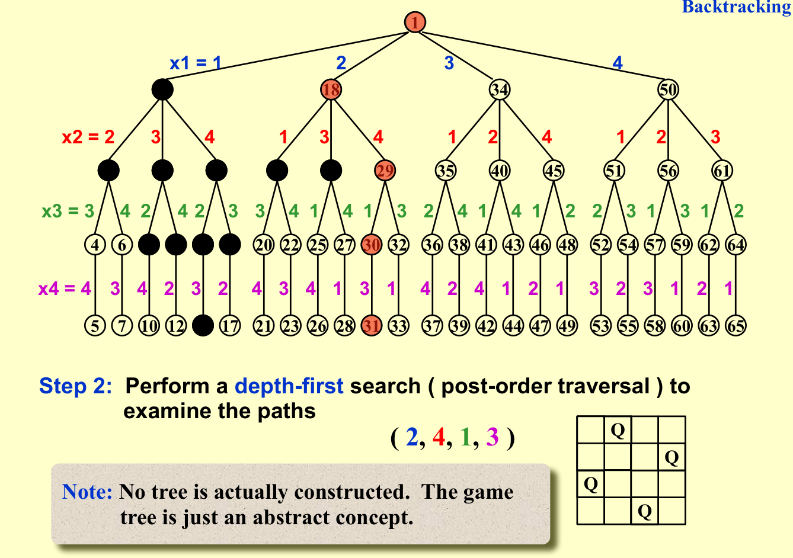
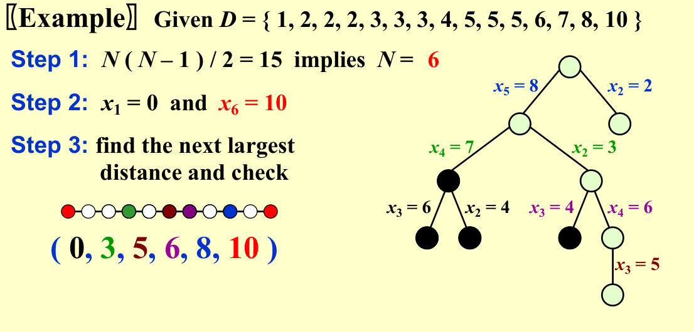
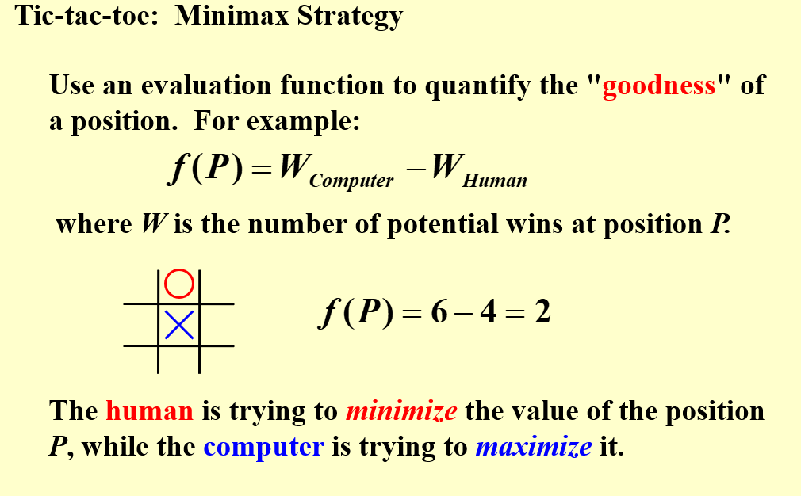
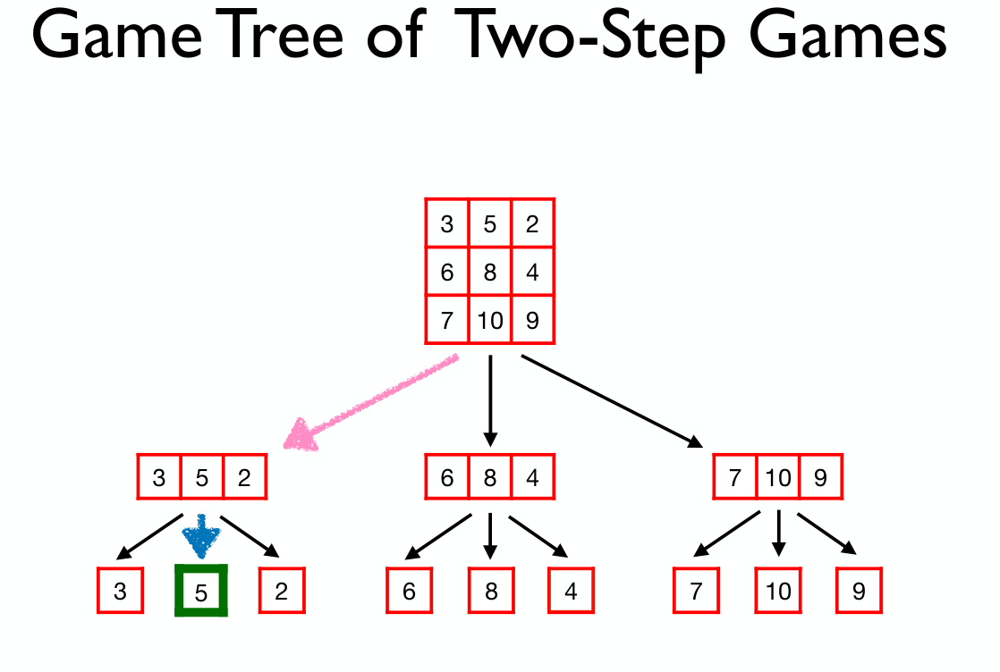
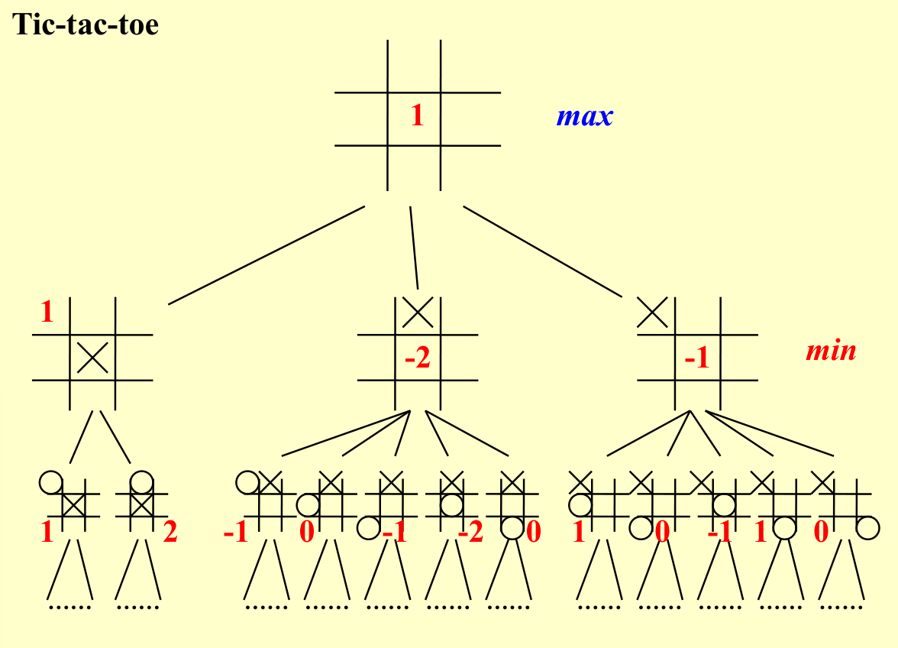
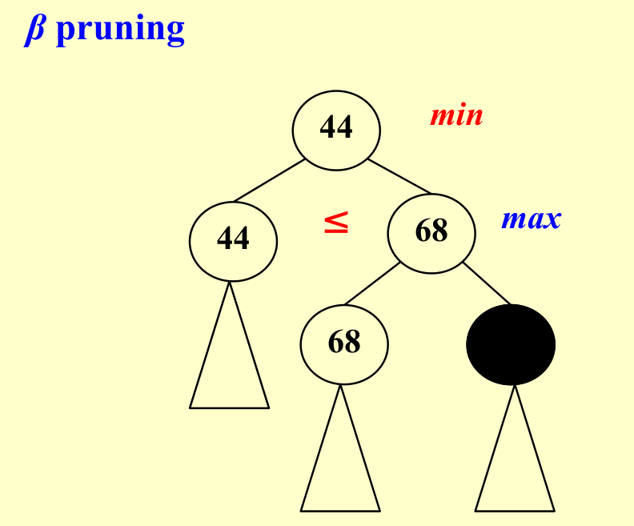

# Chapter 6 | Search and Backtracing
搜索，也就是对状态空间进行枚举，通过穷尽所有的可能来找到最优解，或者统计合法解的个数。

搜索有很多优化方式，如减小状态空间，更改搜索顺序，剪枝等

!!! quote "link"
    OI-Wiki:https://oi.wiki/search/backtracking/
    
    Hello-Algorithm:https://www.hello-algo.com/chapter_backtracking/backtracking_algorithm/

## Fundamental Search
搜索通常可以用搜索树的形式表现


抽象地来说，解决一个问题，也就是枚举所有的状态空间找到解集，我们总是可以用搜索树的模型来设计搜索算法

```python
def TREE_SEARCH(problem, strategy):
    """
    Function to perform tree search based on the given problem and strategy.
    """
    # Initialize the search tree using the initial state of the problem
    search_tree = initialize_search_tree(problem.initial_state)
    
    while True:
        # If there are no candidates for expansion, return failure
        if not search_tree.has_candidates():
            return "failure"
        
        # Choose a leaf node for expansion according to the strategy
        leaf_node = strategy.choose_leaf_node(search_tree)
        
        # If the node contains the goal state, return the corresponding solution
        if problem.is_goal_state(leaf_node.state):
            return leaf_node.solution()
        
        # Else, expand the node and add the resulting nodes to the search tree
        search_tree.expand_node(leaf_node)
```

---

!!! definition "Definition with search tree"
    $b$:the maximum edge on a node

    $d$:the maximum depth of a search tree

### BFS
BFS 全称是 Breadth First Search，中文名是宽度优先搜索，也叫广度优先搜索。

是图上最基础、最重要的搜索算法之一。

所谓宽度优先。就是每次都尝试访问同一层的节点。 如果同一层都访问完了，再访问下一层。

这样做的结果是，BFS 算法找到的路径是从起点开始的最短合法路径。换言之，这条路径所包含的边数最小

!!! info "Analysis on BFS"
    BFS 通常采用 FIFO queue 实现，因此 Time Complexity:$O(b^d)$; Space Complexity:$O(b^d)$

    另外，时间复杂度较难优化，而$b^d$的空间复杂度在处理现实世界的问题中往往显得过于庞大

---

### DFS
DFS 为图论中的概念。在搜索算法中，该词常常指利用递归函数方便地实现暴力枚举的算法，与图论中的 DFS 算法有比较相似，暂不赘述。

该类搜索算法的特点在于，将要搜索的目标分成若干「层」，每层基于前几层的状态进行决策，直到达到目标状态

!!! info "Analysis on DFS"
    DFS 通常采用 LIFO queue(stack) 实现，因此 Time Complexity:$O(b^d)$; Space Complexity:$O(bd)$

    这里的空间复杂度就远比 BFS 合理，因此在解决实际问题的搜索中，DFS搜索算法往往得到更广泛的应用

---

### * A* Search
!!! quote "link"
    http://www.gamedev.net/reference/articles/article2003.asp

A* （A* search algorithm，A * 读作 A-star），简称 A * 算法，是一种在图形平面上，对于有多个节点的路径求出最低通过成本的算法。它属于图遍历（Graph traversal）和最佳优先搜索算法（Best-first search），亦是 BFS 的改进。例如课上讲到的扫地机器人就是运用了这个算法

A* 算法的基本思想：

- 启发式函数：A* 算法使用启发式函数 $h(n)$，该函数估计从当前节点 $n$ 到目标节点的代价。通常选择一个简单且有效的启发式函数（比如曼哈顿距离），以确保算法的效率。

- 评估函数：A* 维护一个评估函数 $f(n)$，用于衡量从起点到目标节点的总代价。评估函数由两部分组成：
    $f(n)=g(n)+h(n)$

    $g(n)$：从起点到当前节点 $n$ 的实际代价。

    $h(n)$：从当前节点 $n$ 到目标节点的估计代价。

- 优先队列：A* 使用优先队列（通常实现为最小堆）来存储待扩展的节点，优先级由评估函数 $f(n)$ 决定。算法每次从队列中取出 $f(n)$ 最小的节点进行扩展。


## Search with backtracing

!!! note "Rationale of the backtracing algorithms @cy's ppt"
    回溯法是一种经常被用在搜索中的技巧，包括先前提到的我们较为熟悉的 DFS 和 BFS。
    
    回溯法的本质是：走不通就回头。

    回溯法的基本思路如下:
    
    1. 构造空间树；

    2. 进行遍历；

    3. 如遇到边界条件，即不再向下搜索，转而搜索另一条链；

    4. 达到目标条件，输出结果。

---

### Eight Queens
八皇后问题是一个非常经典的问题，所以简单来说，就是满足8*8的棋盘中8个皇后彼此不能互相攻击



这里为了简化分析我们把模型退化成四皇后问题，同时为了方便叙述，直接搬了PPT上的图片



注意这里为了方便描述，$x_i$表示第$i$行的Queen放置的位置（列数）



我们发现，虽然问题的解空间是$A_4^4 = 4!$，这也与叶子节点数对应；但是在进行搜索时，存在一些由于已经不满足题意而不需要继续往下搜索的分支，对应图中我们将这种结点标黑，其实这就是一种剪枝的思想，在层数上对我们的搜索进行优化（事实上这里我们运用的深度优先搜索本身就蕴含了剪枝的思想）

---

### The Turnpike Reconstruction Problem
收费站重建问题(The Turnpike Reconstruction Problem)描述的是一条被抽象为直线的公路上，有 $N$ 个收费站（$x_1,x_2,...,x_N$​）。现在给出任意两个收费站之间的距离的可重集合$D$，（可想而知，一共有 $\frac{N(N−1)}{2}$​ 个元素），求收费站的位置，即给定任意两点的距离集合，求出这些点的坐标。

!!! tip "solution"
    大概思路就是，脑海中有一条从左往右的数轴，首先假设 $x1=0$，那么很显然 $x_N=max{D}$。同时我们也得到这条线段的长度为max{D}。接下来在$D$中从大到小取出元素，则必定追加在$x_1$右侧或$x_N$​左侧，以此类推。（反证法可以证明在完全安排好之前都是追加在左侧或者右侧的既定边界之间的）。而每一次追加的选择都代表决策树中的一个分支，可以利用其它条件进行剪枝（例如图中的$x_2=4 和 x_5=8$ 会产生两个4距离​）

    ??? warning "参考图"
        存在一定误导性，仅供参考

        

??? note "Reference Code"
    ``` C
    bool Reconstruct (DistType X[], DistSet D, int N, int left, int right) {
        /* X[1]...X[left-1] and X[right+1]...X[N] are solved */
        bool Found = false;
        if (Is_Empty(D))
            return true;/* solved */
        D_max = Find_Max(D);
        /* option 1: X[right] = D_max */
        /* check if |D_max-X[i]|∈D is true for all X[i]'s that have been solved */
        OK  = Check(D_max, N, left, right);
        if (OK) {
            X[right] = D_max;
            for (i = 1; i < left; i++) Delete(|X[right]-X[i]|, D);
            for (i = right + 1; i <= N; i++) Delete(|X[right]-X[i]|, D);
            Found = Reconstruct(X, D, N, left, right - 1)
            if(!Found) { /* if does not work, undo */
                for(i = 1; i < left; i++) Insert(|X[right]-X[i]|, D);
                for(i = right + 1; i <= N; i++) Insert(|X[right]-X[i], D)
            }
        }
        /* finish checking option 1 */

        if (!Found) { /* if option 1 does not work */
        /* option 2: X[left] = X[N] - D_max */
            OK = Check(X[N] - D_max, N, left, right);
            if (OK) {
                X[left] = X[N] - D_max;
                for (i = 1; i < left; i++) Delete(|X[left] - X[i]|, D);
                for (i = right + 1; i<= N; i++) Delete(|X[left] - X[i]|, D);
                Found = Reconstruct(X, D, N, left + 1, right);
                if (!Found) {
                    for(i = 1; i < left; i++) Insert(|X[left]-X[i], D);
                    for (i = right + 1; i <= N; i++) Insert(|X[left]-X[i], D);
                }
            }
        /* finish checking option 2 */
        } /* finish checking all the options */
        
        return Found;
    }
    ```
---

### Tic-tac-toe Game
在一个只有两个玩家的零和博弈中，如果定义一个与某一个玩家的胜率直接相关的量，那么一个玩家的策略肯定总是试图最大化这个量，对方的策略肯定总是试图最小化这个量

??? note "Two-Step Game"
    在一个最简单的模型: Two-Step Game 中，我们可以看到这样的MinMax与MaxMin思想

    !!! note "MinMax Game"
        

    !!! note "MaxMin Game"
        

    我们可以以 MinMax Game 为例画出这个游戏的 Game Tree
    (红色箭头代表Min方的策略，蓝色箭头表示Max方的策略，Min方选取了使得Max方取值最小的路)

    

    与这部分知识相关的还有Von Neumann's Minimax Theorem;Nash Equilibrium等等，这里不再赘述

如果我们在 Tic-tac-toe 中也定义类似的“收益”：
其中W是在P位置下棋后所有可能的赢法数

$$
f(P) = W_{\text Computer} - W_{\text Human}
$$

我们作为人类玩家，决策的出发点是最小化这个收益；电脑的出发点是最大化这个收益

因而对于先手的电脑来说，就会有这样的一个 Game Tree



---

### alpha-beta 剪枝
简单来说就是放弃做一些不可能带来更多好处的决策判断

alpha和beta的含义如下

- $\alpha$:MAX's best option on path to root
- $\beta$: Min's best option on path to root
  
??? note "reference graph"
    === "Figure 1"
        

    === "Figure 2"
        

详细的说明可以参考[OI-Wiki:Alpha_Beta Pruning](https://oi-wiki.org/search/alpha-beta/)

