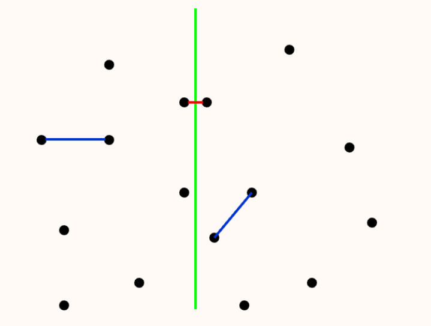
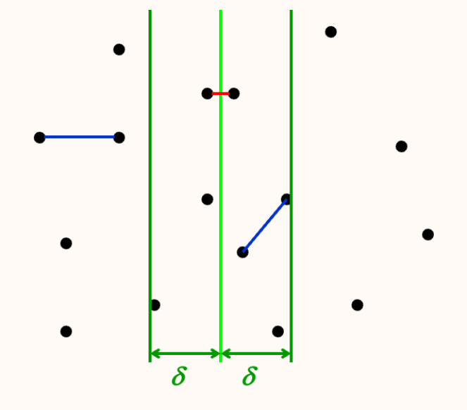
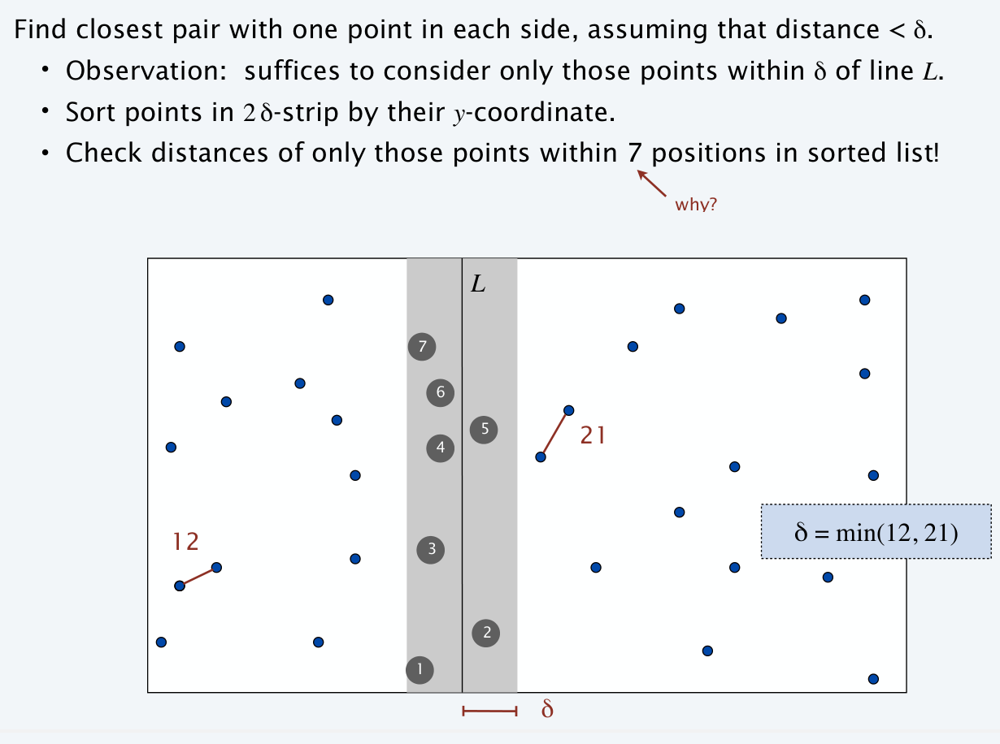
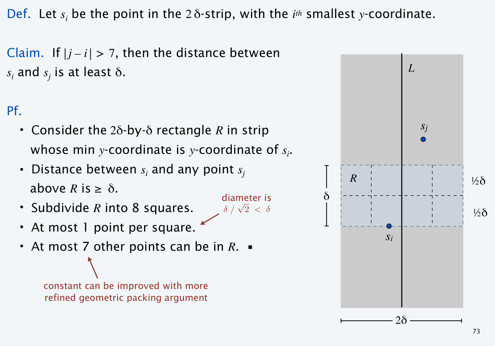
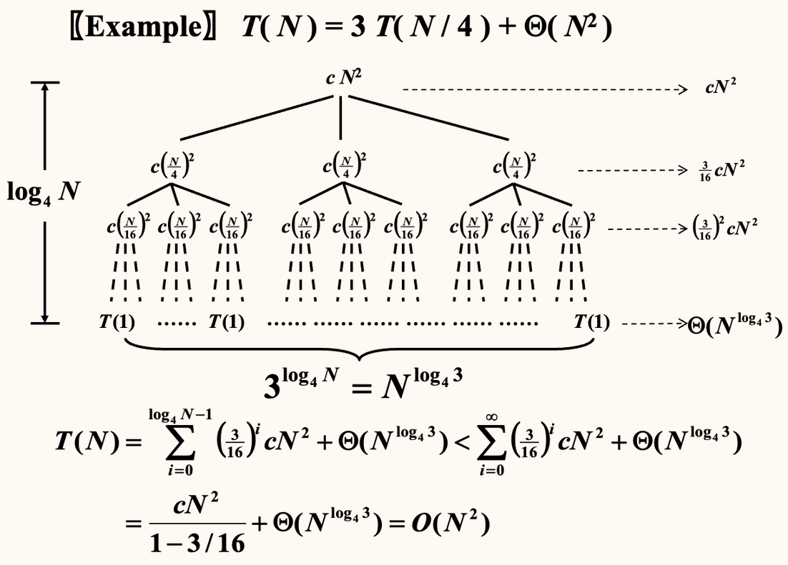
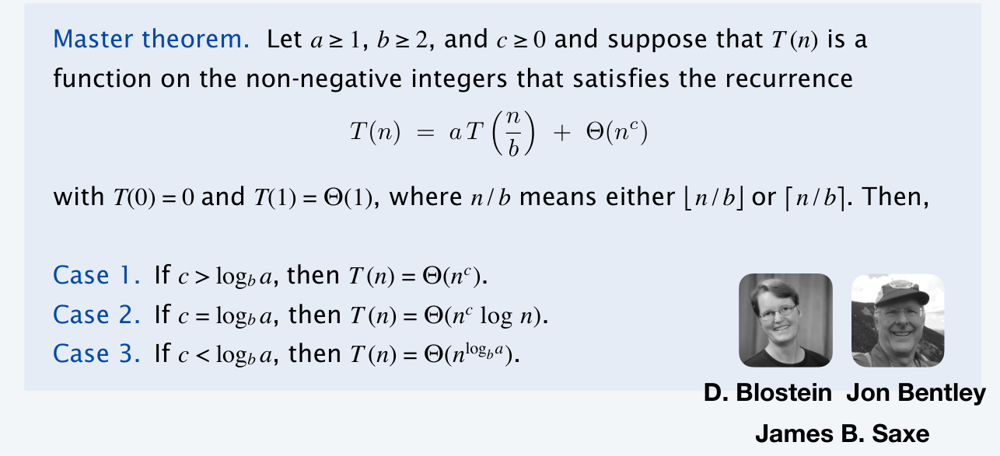
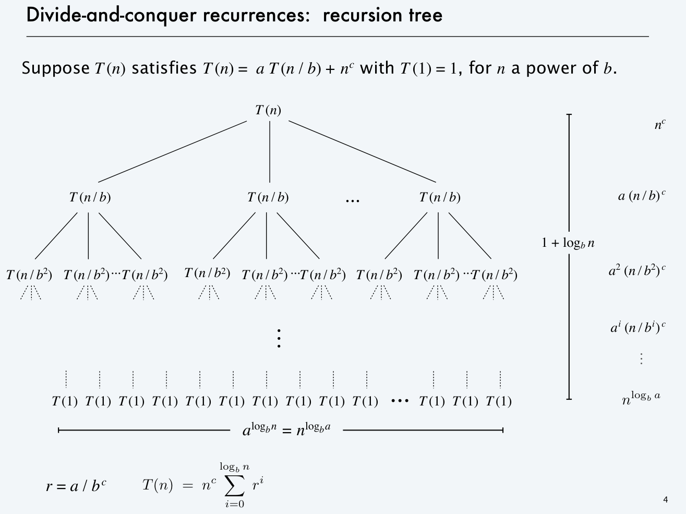
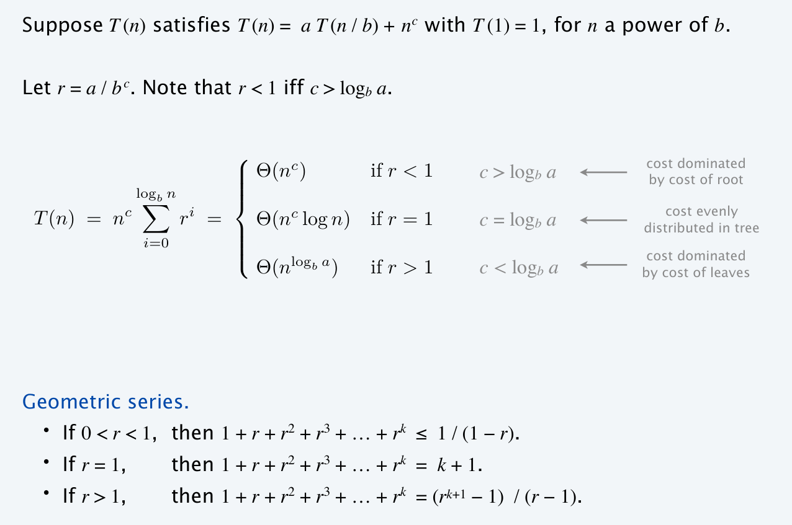

# Chapter 7 | Divide and Conquer
## 概述

!!! quote "link"
    Wikipedia: https://en.wikipedia.org/wiki/Divide-and-conquer_algorithm

套用 Wiki 上的说法，**分治法(Divide-and-conquer algorithm)**属于一种算法范型，它的基本思想是将一个问题分解为若干个规模较小的相同问题，然后递归地解决这些子问题，最后将这些子问题的解合并得到原问题的解，一个比较经典的案例就是归并排序。

本节的重点实际上也并不是聚焦于分治本身，而是其复杂度分析。

---

### [案例] Closet Points Problem

二维最近点问题(Closet Points Problem)，指的是给定平面上的 n 个点，找出其中距离最近的两个点。

---

#### 朴素方法

最朴素的做法当然是枚举所有的点对，一共需要 $C_{N}^{2} = {{N}\choose{2}} = \frac{N(N-1)}{2}$ 即复杂度为 $O(N^2)$。

---

#### 分治方法

现在我们类比最大子序列和问题的分治做法。

??? extra "最大子序列和的分治做法"
    1. 将序列分为左右两部分，分别求解最大子序列和；
    2. 求解跨越中点的最大子序列和；
    3. 比较三者的大小，取最大值；

我们可以将整个平面分为两个部分，即如图中绿色线将点对划分为两个部分。

 { width=50% } 

接下来我们同样分为这么三步：

1. 将点对分为左右两部分，分别求解最近点对；
2. 寻找跨越分界线的点对，从中寻找最近点对；
3. 比较三者的大小，取最小值；

显然，我们现在需要解决的就是要如何设计第二步的实现，以求更优的复杂度。

首先我们假设在第一步中，我们求得两边求得的最小距离中较小的那个为 $\delta$，换句话来说，如果答案在第二步中被更新，那么它的距离需要小于 $\delta$。而我们知道，在第二步中被拿出来的点对，一定是一个在分界线左侧一个在分界线 $L$ 右侧。朴素的来想，在距离分界线 $\delta$ 以外的点对中，我们是不需要考虑的。而在距离分界线 $\delta$ 以内的点，都存在成为答案点对点可能。

 { width=50% } 

如图，现在我们知道，只有落在两条深绿色之间的点才可能会更新答案。所以我们现在需要做的是：遍历这个区域内的点，计算它们两两的距离并以最小值更新答案

这里有一个很巧妙的 trick：如果我们事先将所有点按照 y 轴方向上的坐标大小排序好，对于任意一个点，我们只需要计算在它之上的7个点与它的距离即可，不需要再遍历所有点。也就是说这里的时间复杂度可以由比较笨的$O(N^2)$变为$O(N)$（只需要在分治开始前做一次$O(logN)$的排序即可）

??? question "Proof"
    === "slice 1"
        

    === "slice 2"
        

于是我们能得到这个分治的时间复杂度计算递推公式（当然我们需要在分治前做排序，只不过这并不影响时间复杂度分析结果）：

$$
T(N) = \underbrace{2\; T(\frac{N}{2})}_{\text{Step 1. divide}} + \underbrace{O(N)}_{\text{Step 2. across}} = O(N\log N)
$$

而我们接下来要解决的问题就是，如何通过这个递推式得到结果。
为什么由$T(N) = 2T(\frac{N}{2}) + O(N)$的递推式能一眼看出$O(NlogN)$的时间复杂度

---

## 复杂度分析

在开始接下来的内容之前，我们需要给出更一般的，我们想要解决的问题，即求解时间复杂度递推公式形如下式的算法的时间复杂度：

$$
T(N) = aT(\frac{N}{b}) + f(N) \;\;\;\; a,b \in Z^+
$$

例如，上面的最近点对问题，就是 $a = 2,\; b = 2,\; f(N) = O(N)$ 的情况。

---

### 代换法

**代换法(substitution method)**的思路非常直白，首先我们通过某些手段（~~比如大眼观察法👀~~）来得到一个预设的结果，接下来通过代入、归纳的方法来证明这个结果。

> 大胆猜测，小心求证！

!!! eg "🌰"
    === "题面"
        求解复杂度：

        $$
        T(N) = 2\; T(\frac{N}{2}) + N
        $$
    === "解答"
        **预设**：
        
        $$
        T(N) = O(N\log N)
        $$

        **代入**：

        - 对于足够小的 $m < N$，有：

        $$
        T(\frac{m}{2}) = O(\frac{m}{2}\log \frac{m}{2}) \leq c \frac{m}{2}\log \frac{m}{2}
        $$

        - 将上式代入：

        $$
        T(m) = 2\; T(\frac{m}{2}) + m
        $$

        - 得：

        $$
        T(m) \leq 2\; c \frac{m}{2}\log \frac{m}{2} + m \leq c m \log m \text{ for } c \geq 1
        $$

        对于足够小的 $m = 2$ 式子就可以成立，由归纳法得结论成立。

不过很显然，在某些情况下我们求证了一个复杂度的假设成立，但它并不一定足够紧，这是猜解法的通病。

---

### 递归树法

**递归树法(recursion-tree method)**的思路是，我们通过画出递归树来分析算法的时间复杂度，实际上和直接数学推理的区别不是很大，主要就是通过观察递归过程中数据增长的模式来进行分析。

??? extra "some mathematical tools"
    $$
    a^{\log_b N} = \exp^{\frac{\ln N}{\ln b} \ln a} = \exp^{\frac{\ln a}{\ln b} \ln N} = N^{\log_b a}
    $$

就类似于直接展开式子，只不过通过树状图的形式或许更加直观。

对于一个递推式，我们将它不断展开以后，其形式大概会是这样：

$$
T(N) = ... = 
\underbrace{\sum_{leaf_i}^{leaves}T(N_{leaf_i})}_{conquer}
+ 
\underbrace{\sum_{node_i}^{non-leaf-nodes}f(N_{node_i})}_{combine}
$$

其中，由于末端子问题的规模一般都足够小，可以认为 $T(N_{leaf_i})$ 都是常数，于是上式又可以变化为：

$$
T(N) = ... = 
\underbrace{c\; N_{leaves}}_{conquer}
+ 
\underbrace{\sum_{node_i}^{non-leaf-nodes}f(N_{node_i})}_{combine}
$$

具体来说解释其含义，combine 部分就是在每一次“分治”的处理时间，如合并当前的子问题分治后的结果，体现在递推式的 $f(N)$ 部分；而 conquer 部分指的是当“分治”的“治”在“分”的末端的体现，即对于足够小的规模的问题，不再需要继续“分”的时候，对其处理的开销。

实际上在代码层面这两部分可能区别不大（可能就是一个分支的事情），不过在数学意义上，对于一个递推式子求解我们一般是需要“首项”的，或者说是“最底层”的，而这个“最底层”的部分就是 conquer 部分。

接下来结合 🌰 来分析一下：

!!! eg "🌰"
    

    > From cy's ppt.
    >
    > `\underbrace` 下面那个等式的证明在上面的 "some mathematical tools"。

    可以发现，此情况下 $a = 3,\; b = 4,\; f(N) = \Theta(N^2)$，也就是说每次分为 $3$ 个子问题，子问题的规模是 $\frac{N}{4}$，而合并开销为 $\Theta(N^2)$。

    此时由于分治的策略是相对均匀的，所以我们可以认为得到的是一个完美三叉树。

    显然，树高为 $\log_4 N$，根记为 $0$，每个分治节点的 combine 开销已经标注在图的节点位置，横向箭头标记的是对该层所有节点的开销的求和。特别的，对于最底层，即叶子层，它表示的是 conquer 部分的开销（虽然我个人觉得没必要区分这俩）。

    于是我们可以根据下式的形式，对其进行求和，得到图片中下方的式子。

    $$
    T(N) = ... = 
    \underbrace{c\; N_{leaves}}_{conquer}
    + 
    \underbrace{\sum_{node_i}^{non-leaf-nodes}f(N_{node_i})}_{combine}
    $$

---

### 主方法

!!! quote "link"
    OI Wiki: https://oi-wiki.org/basic/complexity/#主定理-master-theorem

    Wikipedia: https://en.wikipedia.org/wiki/Master_theorem_(analysis_of_algorithms)

**主方法(master method)**之所以叫“主”，是因为它分析的是 combine 和 conquer 部分孰为主导。

---

#### Cook book
个人认为主方法类似于 Cook book，理解就好但没必要去死记硬背，需要的时候去查一下即可。

下面给出比较常用的结论及对应证明。

**$n^c$ form**

当$T(N)$为多项式形式时，可以直接查看下面的结论

??? quesiton "proof"
    === "slice 1"
        
    
    === "slice 2"
        

---

**$n^k log^p N$ form**

当$T(N)$为多项式乘对数形式，可以查看下面的结论

!!! note "Conclustion"
    当递推关系满足：

    $$
    \begin{aligned}
    & T(N) = a T(\frac{n}{b}) + \Theta(N^c \log^p{N})
    & \text{Where } a \geq 1,\; b > 1,\; p \geq 0
    \end{aligned}
    $$

    其复杂度有结论：

    $$
    T(N) = \left\{
        \begin{aligned}
            & O(N^{\log_b{a}}) & \text{if } log_b^a > c \\
            & O(N^c \log^{p+1}{N}) & \text{if } log_b^a = c \\
            & O(N^c \log^{p}{N}) & \text{if } log_b^a < c
        \end{aligned}
    \right.
    $$

!!! info "记忆方法！"
    对上面两个结论粗浅地进行理解，其实可以试着将他们统一起来：
    都是比较$log_b^a$和$c$的关系，前者代表divide的比重，后者代表conquer的比重；
    若divide比重大，结论指数项替换为$log_b^a$；
    若conquer比重大，结论指数项保留$c$；
    若一样大，保留的同时再多乘一个$logN$

个人认为解决问题只需要将上面这些结论作为 Cook book 即可

下面的内容来自[Isshikih's notebook](https://note.isshikih.top/cour_note/D2CX_AdvancedDataStructure/Lec07/#%E9%80%92%E5%BD%92%E6%A0%91%E6%B3%95)

---

#### 形式一

!!! definition "Form 1"
    对于形如 $T(N)=aT(N/b)+f(N)$ 的递推式：

    1. 若 $f(N)=O(N^{(\log_b{a})-\varepsilon}), \text{ for }\varepsilon>0$，那么 $T(N)=\Theta(N^{\log_b{a}})$；
    2. 若 $f(N)=\Theta(N^{\log_b{a}})$，那么 $T(N)=\Theta(N^{\log_b{a}}\log{N})$；
    3. 若 $f(N)=\Omega(N^{(\log_b{a})+\varepsilon}), \text{ for }\varepsilon>0$ 且 $af(\frac{N}{b})<cf(N), \text{ for } c<1 \text{ and } \forall N > N_0$，那么 $T(N)=\Theta(f(N))$；

    > 情况三的后面那个条件又叫 regularity condition。

回顾我们在前面说的那句话，「**主方法(master method)**之所以叫“主”，是因为它分析的是 combine 和 conquer 部分孰为主导」，观察三种情况的区分条件都是比较 $f(N)$（每一次的 combine 开销） 和 $N^{\log_b{a}}$（即求和式中的 conquer 的开销），当 $f(N)$ 足够小时，以 conquer 开销为主（i.e. case 1）；当足够大时，以 combine 为主（i.e. case 3）；而其中还有一个中间状态（i.e. case 2）。

??? eg "examples for form 1"
    - 【eg1】$a = b = 2,\; f(N) = N$；
        - $f(N) = N = \Theta(N^{\log_2{2}})$，适用于情况 2；
        - 因此得到结果 $T(N) = \Theta(N \log N)$；
    - 【eg2】$a = b = 2,\; f(N) = N \log N$；
        - $f(N) = N \log N$，虽然 $N \log N = \Omega(N^{\log_2{2}})$，但是 $N \log N \neq \Omega(N^{(\log_2{2}) - \varepsilon})$，所以不适用于情况 3；
            - 具体来说，$\lim \limits_{N\to \infty} \frac{N \log N}{N^{1+\varepsilon}}=\lim \limits_{N\to \infty} \frac{\log N}{N^{\varepsilon}} = 0 \text{ for fixed } \varepsilon > 0$；
            - 这个例子体现出了 $\varepsilon$ 的一定作用；

---

##### 证明

!!! proof "proof for form 1"
    对于形如 $T(N)=aT(N/b)+f(N)$ 的递推式，我们需要依次证明，此处我们使用递归树法进行证明。

    ???+ section "情况一"

        **🎯 目标**：若 $f(N)=O(N^{(\log_b{a})-\varepsilon}), \text{ for }\varepsilon>0$，那么 $T(N)=\Theta(N^{\log_b{a}})$；

        **🪧 证明**：我们首先需要绘制出对应的递归树，或者搞清楚展开后的情况，因为懒得画图所以我这里采用文字叙述。

        树高 $\log_b{N}$，共 $\log_b{N} + 1$ 层，则有：

        - 第 $0$ 层（根）一共 $1$ 项，combine 的开销为 $f(N)$；
        - 第 $1$ 层一共 $a$ 项，combine 的开销为 $a\times f(\frac{N}{b})$；
        - 第 $2$ 层一共 $a^2$ 项，combine 的开销为 $a^2 \times f(\frac{N}{b^2})$；
        - ......
        - 第 $j$ 层一共 $a^j$ 项，combine 的开销为 $a^j \times f(\frac{N}{b^j})$；
        - ......
        - 第 $(\log_b{N}) - 1$ 层一共 $a^{(\log_b{N}) - 1}$ 项，combine 的开销为 $a^{(\log_b{N}) - 1} \times f(\frac{N}{b^{(\log_b{N}) - 1}})$；
        - 第 $\log_b{N}$ 层，即为叶子层，一共 $a^{\log_b{N}} = N^{\log_b{a}}$ 项，conquer 的开销为 $N^{\log_b{a}} \times \Theta(1) = \Theta(N^{\log_b{a}})$；

        得到求和式：

        $$
        T(N) = \Theta(N^{\log_b{a}}) + \sum_{j = 0}^{(\log_b{N})-1} a^j f(\frac{N}{b^j})
        $$

        而我们有条件 $f(N)=O(N^{(\log_b{a})-\varepsilon}), \text{ for }\varepsilon>0$，将它代入到上式中得到：

        $$
        \begin{aligned}
        T(N) 
        &= \Theta(N^{\log_b{a}}) + \sum_{j = 0}^{(\log_b{N})-1} a^j O\left(\left(\frac{N}{b^j}\right)^{(\log_b{a})-\varepsilon}\right)\\
        &= \Theta(N^{\log_b{a}}) + O\left(
            N^{(\log_b{a}) - \varepsilon}
            \times
            \sum_{j = 0}^{(\log_b{N})-1} \left(\frac{a}{b^{(\log_b{a})-\varepsilon}}\right)^j
        \right) \\
        &= \Theta(N^{\log_b{a}}) + O\left(
            N^{(\log_b{a}) - \varepsilon}
            \times
            \sum_{j = 0}^{(\log_b{N})-1} (b^{\varepsilon})^j
        \right) \\
        &= \Theta(N^{\log_b{a}}) + O\left(
            N^{(\log_b{a}) - \varepsilon}
            \times
            \frac{1\times(1-(b^\varepsilon)^{\log_b{N}})}{1-b^\varepsilon}
        \right) \\
        &= \Theta(N^{\log_b{a}}) + O\left(
            N^{(\log_b{a}) - \varepsilon}
            \times
            \frac{N^\varepsilon-1}{b^\varepsilon-1}
        \right) \\
        &= \Theta(N^{\log_b{a}}) + O\left(
            N^{(\log_b{a}) - \varepsilon}
            \times
            N^\varepsilon
        \right) \\
        &= \Theta(N^{\log_b{a}}) + O\left(
            N^{\log_b{a}}
        \right) \\
        &= \Theta(N^{\log_b{a}})
        \end{aligned}
        $$

        至此，情况一证明完毕。

    ???+ section "情况二"

        **🎯 目标**：若 $f(N)=\Theta(N^{\log_b{a}})$，那么 $T(N)=\Theta(N^{\log_b{a}}\log{N})$；

        **🪧 证明**：前面的部分和情况一的类似，我们通过相同的步骤得到相同的求和式：

        $$
        T(N) = \Theta(N^{\log_b{a}}) + \sum_{j = 0}^{(\log_b{N})-1} a^j f(\frac{N}{b^j})
        $$

        而我们有条件 $f(N)=\Theta(N^{\log_b{a}})$，将它代入到上式中得到：

        \begin{aligned}
        T(N)
        &= \Theta(N^{\log_b{a}}) + \sum_{j=0}^{(\log_b{N})-1}a^j\Theta\left(\left(\frac{N}{b^j}\right)^{\log_b{a}}\right) \\
        &= \Theta(N^{\log_b{a}}) + \Theta\left(
            N^{\log_b{a}} \times
            \sum_{j=0}^{(\log_b{N})-1}\left(\frac{a}{b^{\log_b{a}}}\right)^j
        \right) \\
        &= \Theta(N^{\log_b{a}}) + \Theta\left(
            N^{\log_b{a}} \times
            \log_b{N}
        \right) \\
        &= \Theta(N^{\log_b{a}}\log{N})
        \end{aligned}

        至此，情况二证明完毕。

    ???+ section "情况三"

        **🎯 目标**：若 $f(N)=\Omega(N^{(\log_b{a})+\varepsilon}), \text{ for }\varepsilon>0$ 且 $af(\frac{N}{b})<cf(N), \text{ for } c<1 \text{ and } \forall N > N_0$，那么 $T(N)=\Theta(f(N))$；

        **🪧 证明**：情况三的证明，从条件的变化就可以看出来和前面稍许有些不同了。不过求和式的得到还是一样，通过和之前一样的方法，我们首先得到求和式：

        $$
        T(N) = \Theta(N^{\log_b{a}}) + \sum_{j = 0}^{(\log_b{N})-1} a^j f(\frac{N}{b^j})
        $$

        接下来的步骤和之前不同。在继续之前，我们首先观察不等式 $af(\frac{N}{b})<cf(N)$，在我们的求和式中，我们观察到我们有大量的形如 $a^jf(\frac{N}{b^j})$ 的项，而这些项都可以通过迭代上面那个不等式来实现，即：

        $$
        a^jf(\frac{N}{b^j}) < c\times a^{j-1}f(\frac{N}{b^{j-1}}) < ... < c^j f(N)
        $$

        将这个不等式应用于求和式中，我们能够得到：

        $$
        \begin{aligned}
            T(N) 
            &< \Theta(N^{\log_b{a}}) + \sum_{j=0}^{(\log_b{N})-1}c^j f(N) \\
            &= \Theta(N^{\log_b{a}}) + f(N) \sum_{j=0}^{(\log_b{N})-1}c^j \\
            &= \Theta(N^{\log_b{a}}) + f(N) \times \frac{c^{1-\log_b{N}}}{1-c} \\
            &= \Theta(N^{\log_b{a}}) + f(N) \times \frac{1-N^{\log_b{c}}}{1-c}
        \end{aligned}        
        $$

        而由于 $c<1$，所以 $\log_b{c} < 0$；而 $N > 0$，而且一般非常大，所以 $N^{\log_b{c}} \in (0,1)$。因此，对于确定的常数 $c$，我们有 $\frac{1-N^{\log_b{c}}}{1-c} \in \left(0, \frac{1}{1-c}\right)$；

        因此，上式便能改变为：

        $$
        \begin{aligned}
            T(N) 
            &< \Theta(N^{\log_b{a}}) + f(N) \times \frac{1-N^{\log_b{c}}}{1-c} \\
            &< \Theta(N^{\log_b{a}}) + f(N) \times \frac{1}{1-c}
        \end{aligned}
        $$

        并且，由于 $f(N)=\Omega(N^{(\log_b{a})+\varepsilon}), \text{ for }\varepsilon>0$，所以根据**[符号定义](https://oi-wiki.org/basic/complexity/#%E6%B8%90%E8%BF%9B%E7%AC%A6%E5%8F%B7%E7%9A%84%E5%AE%9A%E4%B9%89)**可以得到 $T(N) = O(f(N))$。

        而我们知道，要证明 $T(N) = \Theta(f(N))$ 还需要证明 $T(N) = \Omega(f(N))$：

        $$
        \begin{aligned}
        T(N)
        &= \Theta(N^{\log_b{a}}) + \sum_{j = 0}^{(\log_b{N})-1} a^j f(\frac{N}{b^j})
        &\geq \sum_{j = 0}^{(\log_b{N})-1} a^j f(\frac{N}{b^j})
        &\geq f(N)
        \end{aligned}
        $$

        由此得到 $T(N) = \Omega(f(N))$，最终证得 $T(N) = \Theta(f(N))$，至此，情况三证明完毕。

---

#### 形式二

!!! definition "Form 2"
    对于形如 $T(N) = aT(\frac{N}{b}) + f(N)$ 的递推式：

    1. 若 $af(\frac{N}{b}) = \kappa f(N) \text{ for fixed } \kappa < 1$，那么 $T(N) = \Theta(f(N))$；
    2. 若 $af(\frac{N}{b}) = K \; f(N) \text{ for fixed } K \; > 1$，那么 $T(N) = \Theta(N^{\log_b{a}}) = \Theta(a^{\log_b{N}})$（个人感觉后面那个式子更方便直观记忆）；
    3. 若 $af(\frac{N}{b}) = f(N)$，那么 $T(N) = \Theta(f(N) \log_b N)$；

---

##### 证明

!!! proof "proof for form 2"
    对于形如 $T(N)=aT(N/b)+f(N)$ 的递推式，基于线性关系的形式二的证明实际上和形式一的第三种情况的证明非常相像。

    假设我们有 $af(\frac{N}{b}) = c f(N)$，只需要讨论 $c$ 的取值范围对结果的影响，就可以一次性得到结果。

    类似于形式一的第三种情况的证明，我们迭代该关系式，得到关系：

    $$
    a^j f(\frac{N}{b^j}) = c^j f(N)
    $$

    于是，我们有：

    $$
    \begin{aligned}
        T(N)
        &= \Theta(N^{\log_b{a}}) + \sum_{j = 0}^{(\log_b{N})-1} a^j f(\frac{N}{b^j}) \\
        &= \Theta(N^{\log_b{a}}) + \sum_{j = 0}^{(\log_b{N})-1} c^j f(N) \\
        &= \Theta(N^{\log_b{a}}) + f(N) \sum_{j = 0}^{(\log_b{N})-1} c^j \\
        &= \Theta(N^{\log_b{a}}) + f(N) \times \frac{1-N^{\log_b{c}}}{1-c} \\
    \end{aligned}
    $$

    天呐，这不就是[形式一](#形式一){target="_blank"}里第三种情况的式子吗？然而当我们满心欢喜地打算照着它证明形式二的情况一时会发现，条件好像不够。我们现在并没有显式的 $f(N) = \Omega(N^{\log_b {a}} + \epsilon)$ 的条件，而这个条件最终决定 conquer 部分和 combine 部分谁占主导地位。但是，我们实际上只需要得到 $f(N)$ = $\Omega(N^{\log_b {a}})$ 就够了。其实 $af(\frac{N}{b}) \sim c f(N)$ 这件事本身就暗含了它与 $N^{\log_b {a}}$ 的关系：

    为了重复利用过程，我直接用 $\sim$ 来代替 $<,>,=$ 了，过程中保持传递性。

    $$
    c f(N) \sim a f(\frac{N}{b}) \sim ... \sim a^L f(\frac{N}{b^L})
    $$

    可以发现，这一步还是和形式一的第三种情况的证明过程高度相似。只不过现在我们要更进一步地看这个式子。

    当 $c < 1$ 时，实际上有 $f(N) > af(\frac{N}{b})$；当 $c = 1$ 时，实际上有 $f(N) = af(\frac{N}{b})$； $c > 1$ 时，实际上有 $f(N) < af(\frac{N}{b})$；

    我们假设 $\frac{N}{b^L}$ 足够小（即递归到最末端，只需要进行 conquer 的时候），即 $\frac{N}{b^L} = \Theta(1)$，那么就有 $L = \Theta(\log_b{N})$。于是，我们有：

    $$
    f(N) \sim \Theta(a^{\log_b{N}}) = \Theta(N^{\log_b{a}})
    $$

    皆大欢喜！三个愿望，一次满足！

    剩下的证明过程我就不再赘述了。

---

#### 形式三

!!! definition "Form 3"
    第三种形式是对于 $(N)$ 的特别形式，当递推关系满足：

    $$
    \begin{aligned}
    & T(N) = a T(\frac{n}{b}) + \Theta(N^k \log^p{N})
    & \text{Where } a \geq 1,\; b > 1,\; p \geq 0
    \end{aligned}
    $$

    其复杂度有结论：

    $$
    T(N) = \left\{
        \begin{aligned}
            & O(N^{\log_b{a}}) & \text{if } a > b^{k} \\
            & O(N^k \log^{p+1}{N}) & \text{if } a = b^{k} \\
            & O(N^k \log^{p}{N}) & \text{if } a < b^{k}
        \end{aligned}
    \right.
    $$

    实际上这个式子也非常好认，属于形式二的一种特殊形式。可以对照着看，非常容易看出关系。

    只不过对于特殊情况，这个形式的约束更加精确，证明过程有缘再补吧x