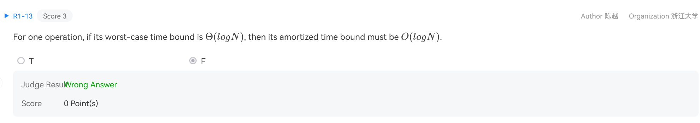
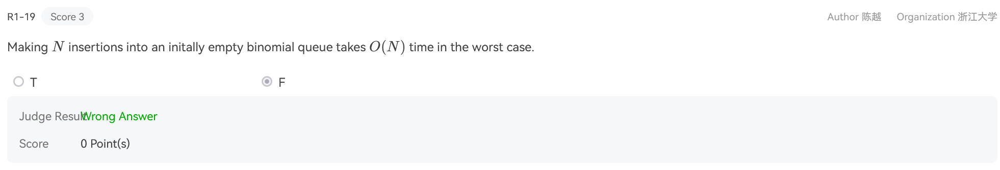
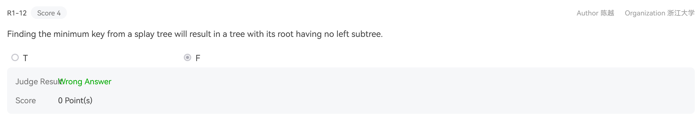

# ADS problem sheet
## 2017-18 mid-term exam
!!! note ""
    

    B

!!! note ""
    

    C backtracing

!!! note ""
    

!!! note ""
    

## 2018-19 mid-term exam
!!! note ""
    

    二项堆在均摊意义上的插入操作是$O(1)$

!!! note ""
    

    找到最小键并对其执行展开操作（将其移动到根）后，关键点是最小键将成为展开树的根。由于此节点没有 left child（根据定义，它是树中最小的元素），因此在 splay 操作之后，树的根将没有 left 子树。

!!! note ""
    

    选B

!!! note ""
    The functions IsRBTree is to check if a given binary search tree T is a red-black tree.  Return true if T is, or false if not.

    The red-black tree structure is defined as the following:
    ```C
    typedef enum { red, black } colors;
    typedef struct RBNode *PtrToRBNode;
    struct RBNode{
        int Data;
        PtrToRBNode Left, Right, Parent;
        int BH; /* black height */
        colors Color;
    };
    typedef PtrToRBNode RBTree;
    ```

    Please fill in the blanks
    ```C
    bool IsRBTree(RBTree T) {
        int LeftBH, RightBH;
        if (!T) return true;  // Empty tree is considered valid

        // Check the color of the node
        if (T->Color == black) {
            T->BH = 1;  // If the node is black, it contributes 1 black height
        } else {
            // Red node can't have a red child
            if (T->Left && (T->Left->Color == red)) return false;
            if (T->Right && (_________)) return false;  // (Fill in the blank here)
        }

        // If it's a leaf node (both left and right are null), it's valid
        if (!T->Left && !T->Right) return true;

        // For non-leaf nodes, check the black height property
        if (________) {  // (Fill in the blank here)
            if (T->Left) LeftBH = T->Left->BH;
            else LeftBH = 0;
            if (T->Right) RightBH = T->Right->BH;
            else RightBH = 0;

            if (LeftBH == RightBH) {  // Black height must be the same for both subtrees
                ___________;  // If current node is black, increment the BH
                return true;
            }
            else return false;
        }
        else return false;
    }
    ```

    1. **T->Right->Color == red**
    2. **IsRBTree(T->left) && IsRBTree(T->right)** 
    3. **T->BH = LeftBH + (1 ? (T->Color == black) : 0)**
   
!!! note ""
    The functions BinQueue_Find and Recur_Find are to find X in a binomial queue H.  Return the node pointer if found, otherwise return NULL.

    ```C
    BinTree BinQueue_Find( BinQueue H, ElementType X ) {
        BinTree T, result = NULL;
        int i, j; 

        for( i=0, j=1; j<=H->CurrentSize; i++, j*=2) {  /* for each tree in H */
            T= H->TheTrees[i];
            if ( X ___________){  /* if need to search inside this tree */
                result = Recur_Find(T, X);
                if ( result != NULL ) return result;
            } 
        }
        return result;
    }

    BinTree Recur_Find( BinTree T, ElementType X ) {
        BinTree result = NULL;
        if ( X==T->Element ) return T;
        if ( ______________ ){
            result = Recur_Find(T->LeftChild, X);
            if ( result!=NULL ) return result;
        } 
        if ( T->NextSibling!=NULL )
            result = Recur_Find(T->NextSibling, X);
        return result;
    }
    ```

    1. **>= T->Element**
    2. **T->LeftChild != NULL**

## 2015-16 mid-term exam
!!! note ""
    

## 2024 mid-term exam
!!! note ""
    

!!! note ""
    

!!! note ""
    The concept of inversions is significant in linear algebra. The number of inversions in a permutation p is defined as the number of pairs (i,j) such that i < j and p_i > p_j. For a given permutation p, a naive approach to figuring out the number of inversions involves using a double loop to check all possible pairs (i,j). The code for this method is as follows:

    ```C
    long long ans=0;
    for(int i=1;i<n;++i) {
        for(int j=i+1;j<=n;++j) {
            if(p[i]>p[j]) ans+=1;
        }
    }
    printf("%lld",ans);
    ```

    This method has a time complexity of O(n2).

    There is also a divide-and-conquer algorithm with lower time complexity (O(nlogn)) for finding inversions, which involves:

    (1) Dividing the sequence into two halves;

    (2) Counting the number of inversions within each half;

    (3) Counting the number of inversions between the two halves.

    The merge sort algorithm can conveniently help us count the inversions in step (3), so the process of finding inversions often accompanies the merge sort process.

    Below is the code for finding inversions of a permutation using merge sort. Please complete the following program:

    ```C
    #include<stdio.h>
    #define MAXN 500005
    int a[MAXN],tmp[MAXN];
    long long ans;
    void MergeSort(int a[],int l,int r) {
        if(l==r) return;
        int mid=(l+r)/2;
        MergeSort(a,l,mid);
        MergeSort(_______);
        int i=l,j=mid+1,cnt=0;
        while(i<=mid && j<=r) {
            if(______) {
                tmp[++cnt]=a[i++];
                _________________;
            }
            else {
                _________________;
            }
        }
        while(i<=mid) {
            tmp[++cnt]=a[i++];
            ans+=r-mid;
        }
        while(j<=r) {
            tmp[++cnt]=a[j++];
        }
        for(int i=l;i<=r;++i) {
            _________________;
        }
    }
    int read() { // Read in an integer from the standard input and return it.
        char ch=getchar(); int x=0;
        while(ch<'0' || ch>'9') ch=getchar();
        while(ch>='0'&&ch<='9') x=(x*10)+(ch^48), ch=getchar();
        return x;
    }
    int main()
    {
        int n,T;
        T=read(); // There are many test cases. Each of them includes a permutation.
        while(T--) {
            n=read(); // The length of permutation.
            for(int i=1;i<=n;++i) {
                a[i]=read();
            }
            ans=0;
            MergeSort(a,1,n); // Count the inversion number as well as merge sorting.
            printf("%lld\n",ans);    
        }
        return 0;
    }
    ```

    1. **a,mid+1,right**
    2. **a[i] <= a[j]**
    3. **ans = ans + j - mid**
    4. **tmp[++cnt] = a[j++]**
    5. **a[l] = tmp[i-l]**