# Instructions: Language of the Computer

## Introduction

* Language of the machine
    * Instructions (Statement)
    * Instruction Set (Syntax)
* Design goal
    * Maximize performance  
    同样资源的情况下性能大
    * Minimize cost  
    同样性能的情况下成本低
    * Reduce design time  
    指令集简单，易于理解
* 我们使用的是 RISC-V 架构

<center>{width=70%}</center>
<center>Instruction Characteristics</center>

指令集基本的结构：Operation 操作; Operand 操作数

* 不同指令集，指令的编码可以不同。如 000 表示加法，这也叫指令的 Encoding.  
* 操作数位宽可以不同，可以是立即数/寄存器/内存。 

## Operation

* Every computer must be able to perform *arithmetic*.    
    * Only one operation per instruction  
    * Exactly ***3*** variables ***e.g.*** `add a, b, c` 即 $a\leftarrow b+c$  
    注意结果放在第一个位置，这样易于解码  

* **Design Principle 1 - Simplicity favors regularity.**  

!!! Example
    * C code
    ``` C
    f = (g + h) - (i + j);
    ```
    * RISC-V code
    ``` C
    add t0, g, h
    add t1, i, j
    sub f, t0, t1
    ```
## Operands of the Computer Hardware 

### Register Operands

* Arithmetic instructions use register operands.
* RISC-V has a $32\times 64$-bit register file
    * Use for frequently accessed data
    * 32-bit data is called a **word**. 64-bit is called a **doubleword**.  
    * we call them `x0` to `x31`

* **Design Principle 2 - Smaller is faster.**   
寄存器不是越多越好，多了之后访问慢。  

    |Name|Register Name|Usage|Preserved or call?|
    |:-|-|-|-|
    |x0|0|The constant value 0|n.a.|
    |x1(ra)|1|Return address(link register)|yes|
    |x2(sp)|2|Stack pointer|yes|
    |x3(gp)|3|Global pointer|yes|
    |x4(tp)|4|Thread pointer|yes|
    |x5-x7|5-7|Temporaries|no|
    |x8-x9|8-9|Saved|yes|
    |x10-x17|10-17|Arguments/results|no|
    |x18-x27|18-27|Saved|yes|
    |x28-x31|28-31|Temporaries|no|

    !!! Info "为什么寄存器 `x0` 一直为 0"
        Make the common case fast. 因为经常有 0 参与计算，将其存在一个寄存器中，便于计算。

??? Example
    ``` C
    add x5, x20, x21
    add x6, x22, x23
    sub x19, x5, x6
    ```

### Memory Operands

* Data transfer instructions
    * Load: Load values from memory to register; ld:load doubleword
    * Store: Store result from register to memory; sd:store doubleword
* Memory is **byte addressed**.   
* RISC-V is **Little Endian**  

    !!! Example "Little vs Big Endian vs *Bi-endian"
        若将内存地址抽象成一维的数组，从右往左地址增加

        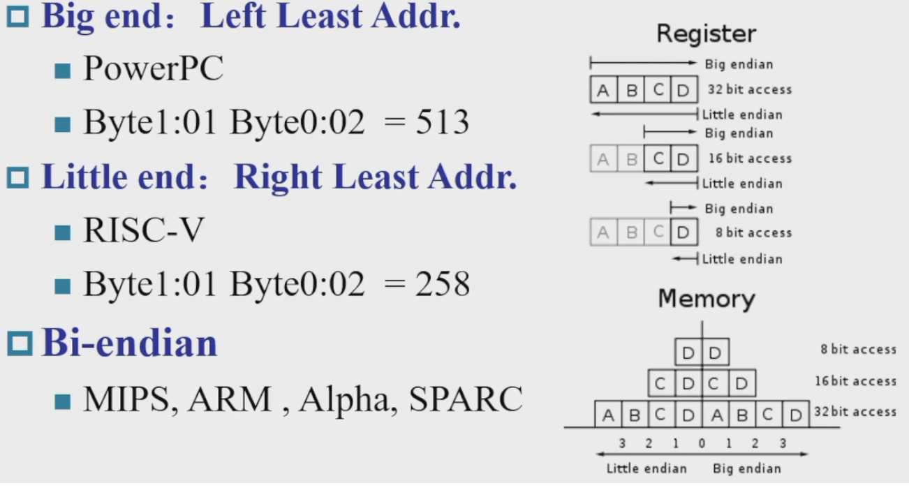
 
        **总结：小端：低位放在地址较小处；大端相反** 
     
* words align: 一个字是 4 字节，在内存读取数据是按照一个字一个字地方式读取，words align 要求字的起始地址一定要是 4 的倍数。RISC-V does not require words to be aligned in memory

    !!! Example "Memory Alignment"
        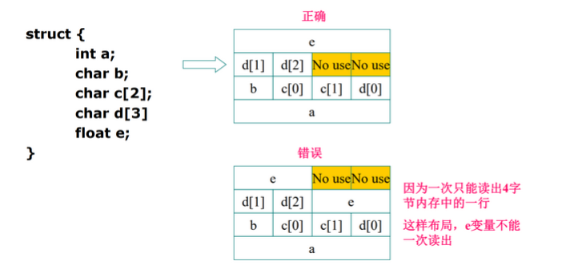{width=70%}

        第一个是对齐的，第二个是不对齐的。
        
        对齐的好处显而易见，而不对齐的好处是省空间

!!! Example "Memory Operand Example"
    ``` C
    A[12] = h + A[8];
    ```
    (**默认数组是双字的**, h in `x21`, base address of A in `x22`)  
    翻译为 RISC-V 代码得到
    ``` C
    ld x9, 64(x22)
    add x9, x21, x9
    sd x9, 96(x22)
    ```
    地址是以 byte 为单位，所以要偏移 $8\times 8=64$ bytes.  
    <u> load 和 store 是唯二可以访问存储器的指令。</u>  

### Registers vs. Memory

* Registers are faster to access than memory  
* Operating on memory data requires loads and stores  
* Compiler must use registers for variables as much as 
possible  
编译器尽量使用寄存器存变量。只有在寄存器不够用时，才会把不太用的值放回内存。  

### Constant or Immediate Operands

**Immediate**: Other method for adding constant  

* Avoids the load instruction  
* Offer versions of the instruction   
***e.g.*** `addi x22, x22, 4`    
* **Design Principle 3 - Make the common case fast.**     

!!! Summary
    {width=90%}

    * 为什么内存是 $2^{61}$ 个 doublewords?  
    可以表示的地址有这么多，因为我们以 64 位寄存器为基址，可以表示的双字就是 $2^{64}/2^3=2^{61}$ (这里 $2^3$ 表示 8 个字节，即双字). 即我们的 `load` 指令可以访问的范围有这么大。   

## Representing Instructions in the Computer

* All information in computer consists of binary bits.
* Instructions are encoded in binary  
called **machine code (机器码)**  
* Mapping registers into numbers  
0 for register `x0`, 31 for register `x31`. **e.t.c.**  
* RISC-V instructions   
**32** 位指令编码。所有指令都是规则化的，即一部分是 opcode, 一部分是 operands 等等。  

!!! info "Summary of RISC-V architecture"
    

From the given summary we can find that:

**All instructions in RISC-V have the same length 32**

$\Uparrow$

<u>**Design Principle 4 - Good design demands good compromises**</u>

### R-format

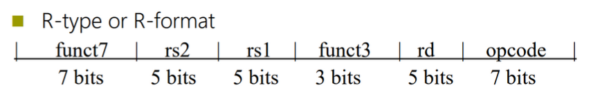

* *opcode*: operaion code
* *rd*: destination register number
* *funct3*: 3-bit function code(additional opcode)   
例如，我们加法减法可以做成一个 opcode, 然后利用 funct 进行选择。
* *rs1/rs2*: the first/second source register number
* *funct7*: 7-bit function code(additional opcode)  

### I-format  


* Immediate arithmetic and load instructions  
***e.g.*** `addi`, `ld`  
* *rs1*: source or base address register number
* *immediate*: constant operand, or offset added to base 
address  
将 rs2, funct7 合并了，得到 12 位立即数

### S-format


* *rs1*: base address register number
* *rs2*: source opearand register number
* immediate:  
Split so that *rs1* and *rs2* fields are always in the same place.  

??? Example
    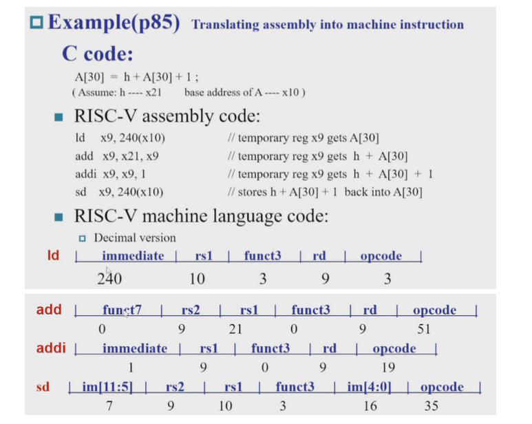

Stored Program Computer  
<div align=center>  </div>

* Instructions represented in binary, like data.  
* Instructions and data stored in memory.  
* Programs can operate on programs. ***e.g.*** compiplers, linkers. 
* Binary compatibility allows compiled programs to work on different computers

## Logical Operations

|Operation|C|RISC-V|
|:-|-|-|
|Shift left|<<|`slli`(shift left logical immediate)|
|Shift right|>>|`srli`(shift right logical immediate)|
|Bit-by-by AND|&|`and, andi`|
|Bit-by-by OR| \| |`or, ori`|
|Bit-by-by XOR|^|`xor, xori`|
|Bit-by-by NOT|~| - |

RISC-V 没有直接提供 BitWise NOT 指令，但是我们可以通过异或实现（与全 F 异或）  

### Shift

<center>{width=70%}</center>

* I 型指令
* 为什么还有 `funct6`     
移位不需要这么多立即数，只要六位 ($2^6=64$) 即可。
* 左移 i 位相当于乘 $2^i$, 右移 i 位相当于除 $2^i$.  

### AND

<center>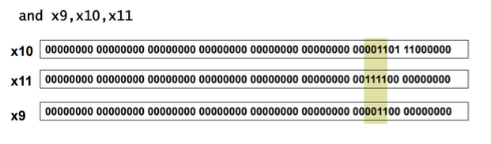{width=70%}</center>  

### OR

<center>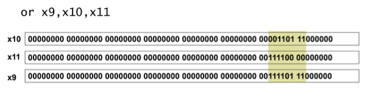{width=70%}</center> 

### XOR

<center>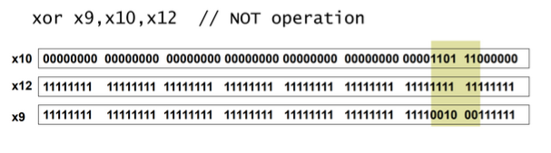{width=70%}</center> 

## Instructions for making decisions

### Branch instructions

* `beq reg1, reg2, Label`  
相等则跳转
* `bne reg1, reg2, Label`  
不相等则跳转

??? Example 
    <center>{width-70%}</center>

store 的立即数是作为数据的地址, beq 的立即数是作为运算的地址（加到 PC 上）因此二者的指令类型不同。

跳转的范围有限制，因为立即数只有 12 位。（PC 相对寻址，以当前程序位置为基准前后跳）  

??? Example "Loop"
    <center>{width=70%}</center>
    
    值得注意的是这里的数组是以doubleword为单位的，所以实际内存地址 x10 每经过一个循环加8

### slt instruction

set on if less than.    
`slt x2, x3, x4 # x2=1 if x3 < x4`  
R 型指令

??? Example
    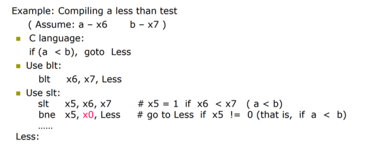

    这里的 `blt` 类似 `beq` and `bne` 是 branch if Less than

### More Conditional Operations

* `blt rs1, rs2, L1`  
若 `rs1<rs2` 则跳到 L1
* `bge rs1, rs2, L1`  
若 `rs1>=rs2` 则跳到 L1

### Signed vs. Unsigned

默认是有符号数进行比较  

* Signed comparison: `blt`, `bge`
* Unsigned comparison: `bltu`, `bgeu`

### Case/Switch

!!! Example "Compiling a switch using jump address table"
    <center>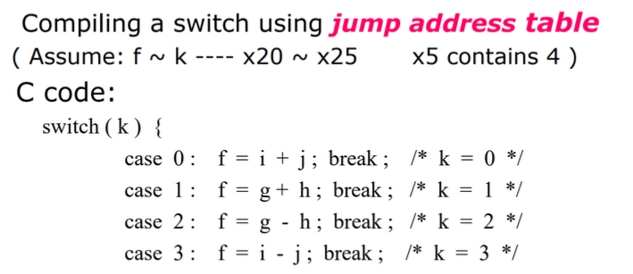{width=60%}</center>
    <center>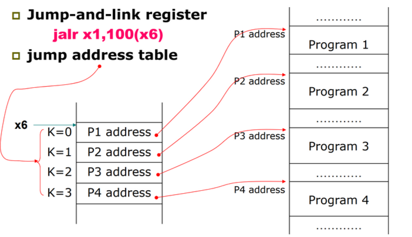{width=60%}</center>
    <center>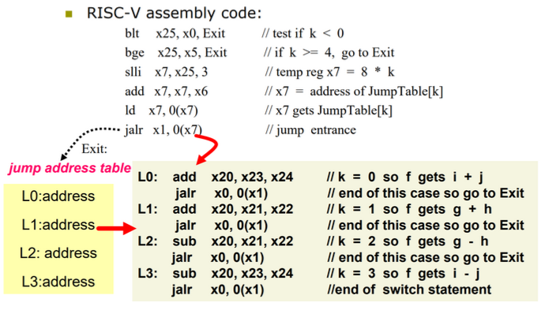{width=60%}</center>

    $x_6$ 是跳转表的基地址，$x_7\leftarrow x_6+8*k$  
    `jalr x1, 0(x7)`    
    把下一条指令的地址 `PC+4` 放入 `x1` 寄存器，随后跳向 `x7 + 0` 的指令地址。  
    这里我们 `jalr x0, ...` 因为我们不能改变 `x0` 寄存器，所以这里仅用作占位，并没有实际存储返回地址。

!!! info "basic block"
    A **basic block** is a sequence of instructions with

    * No embedded branches (except at end)
    * No branch targets (except at beginning)

## Supporting Procedures in Computer Hardware

**Procedure/function** --- be used to structure programs  
为了完成特定任务。易于理解，可以复用。

调用函数的步骤

1. Place Parameters in a place where the procedure can access them (in registers `x10~x17`)  
传参
2. Transfer control to the procedure  
控制权给子程序
3. Acquire the storage resources needed for the procedure
4. Perform the desired task
5. Place the result value in a place where the calling program can access it  
6. Return control to the point of origin (address in `x1`)

### Procedure Call Instructions

* **Procedure *call***: jump and link  
`jal x1, ProcedureLabel`
    *  Address of following instruction put in `x1`
    *  Jumps to target address
* **Procedure *return***: jump and link register  
`jalr x0, 0(x1)`
    * Like jal, but jumps to `0 + address in x1`
    * Use `x0` as rd (`x0` cannot be changed)
    * Can also be used for computed jump

不能用 `jal` 跳回来，跳进函数的地址的是固定的, Label 一定。但是跳回来的地址不一定，要用 `x1` 存储才能跳回。  

### Using More Registers

* Registers for procedure calling
    * `x10~x17`(`a0~a7`): eight argument registers to pass parameters or return values  
    用来传参的
    * `x1`: one return address register to return to origin point  
* Stack：Ideal data structure for spilling registers
    * Push, pop
    * Stack pointer (`sp`): `x2` 指向最栈顶，即最后一个有效数据所在的位置
* In RISC-V Stack grow from higher address to lower address  
    * Push: `sp = sp - 8`
  
        ***e.g.***
        ```assembly
        sp = sp - 8  # 减少栈指针，分配 8 字节空间
        sw value, 0(sp)  # 将值写入新的栈顶
        ```
    
    * Pop: `sp = sp + 8`  
   
        ***e.g.***
        ```assembly
        lw value, 0(sp)  # 从栈顶读取值
        sp = sp + 8  # 增加栈指针，释放 8 字节空间  
        ```
??? Example "Compiling a leaf procedure"
    <center>{width=70%}</center>

|Name|Register Name|Usage|Preserved or call?|
|:-|-|-|-|
|x0(zero)|0|The constant value 0|n.a.|
|x1(ra)|1|Return address(link register)|yes|
|x2(sp)|2|Stack pointer|yes|
|x3(gp)|3|Global pointer|yes|
|x4(tp)|4|Thread pointer|yes|
|x5-x7(t0-t2)|5-7|Temporaries|no|
|x8(s0/fp)|8|Saved/frame pointer|yes|
|x9(s1)|9|Saved|yes|
|x10-x17(a0-a7)|10-17|Arguments/results|no|
|x18-x27(s2-s11)|18-27|Saved|yes|
|x28-x31(t3-t6)|28-31|Temporaries|no|
|PC| - |Auipc(Add Upper Immediate to PC)|yes|

* `t0~t6` 临时寄存器，不需要在函数中保存 
* `s0~s11` saved registers  
标有 Preserved 表明我们需要在函数开始时保存该寄存器的值，并在离开函数前恢复寄存器的值。（如上例）

这样起到的效果是让临时寄存器的值暂存到栈中，再返回出来，调用函数前后临时寄存器的值不发生变化

<center>{width=70%}</center>

### Nested Procedure
递归形式的函数 下图 FP 表示函数帧指针

<center>{width=75%}</center>
<center>Figure: Local Data on the Stack</center>
??? Example
     

!!! Info "Preserved or not"
    

    寄存器一般靠堆栈保存, sp 靠加减保存。 

## Communicating with People
!!! note "Character set"
    * Byte-encoded character sets  
    ***e.g.*** ASCII, Latin-1
    * Unicode: 32-bit character set  
    ***e.g.*** UTF-8, UTF-16 

我们知道：编码中有不同长度的数据（例如char,int,short int），因此也需要有不同长度的 load 和 store.  

* Load byte/halfword/word/doubleword: *Sign extend* to 64 bits in rd    
我们的寄存器是 64 位的，因此需要扩充。
    * `lb rd, offset(rs1)`
    * `lh rd, offset(rs1)`
    * `lw rd, offset(rs1)` 
    * `ld rd, offset(rs1)` 

    ??? Example
        同样是取 A[4] 的值，不同的数据类型 offset 不同。`char` 为 4, `short int` 为 8, `int` 为 16.  

* Load byte/halfword/word/doubleword unsigned: *0 extend* to 64 bits in rd
    * `lbu rd, offset(rs1)`
    * `lhu rd, offset(rs1)`
    * `lwu rd, offset(rs1)`
* Store byte/halfword/word/doubleword: Store rightmost 8/16/32 bits  
    * `sb rs2, offset(rs1)`
    * `sh rs2, offset(rs1)`
    * `sw rs2, offset(rs1)`
    * `sd rs2, offset(rs1)`

    存储就不需要考虑扩充问题，因为我们不做运算，只是把对应部分放到对应位置。  
    offset 可以是 3. 因为 RISC-V 是可以不对齐的。（实际上 sh offset 一般是 2 的倍数, sw 是 4 的倍数）  

!!! Example "Compiling a string copy procedure"
    

    !!! warning "Tip"
        其实，i 不应该分配给 s3, 分配给一个临时寄存器，就可以不用堆栈保存 s3 了。因为临时寄存器不需要在函数中保存到堆栈；而保存寄存器需要我们在函数开始时保存该寄存器的值，并在离开函数前恢复寄存器的值。

        对于一个 leaf procedure(不再调用其他 procedure) 编译器要尽可能用完所有的临时寄存器，再去用其他的寄存器。

        为什么强调 leaf procedure? - 因为对于非 leaf 的函数（例如递归函数），可能临时变量会被调用后的函数改变，这样就不能继续用了。

## RISC-V Addressing for 32-Bit Immediate and Addresses

### Wide Bit Immediate addressing

如何将一个寄存器初始化为一个任意的立即数。

`lui reg, imm` 可以把 20 位的常数放到寄存器中。(U-type)
<center>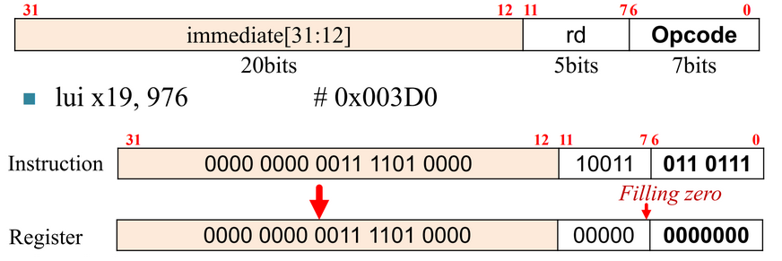{width=70%}</center>

注意这里，我们会把立即数放入寄存器的 [31:12] 位，低位会填充为 0.  

!!! Example "Loading a 32-bit constant"
    <center>{width=70%}</center>

    我们最终想放入寄存器的值是 32 位常数 `0x003D0900`. 先利用 `lui` 将高 20 位 976 放入寄存器中，随后利用加法指令加上 低 12 位，即 2304.  

### Branch Addressing

SB-type
<center>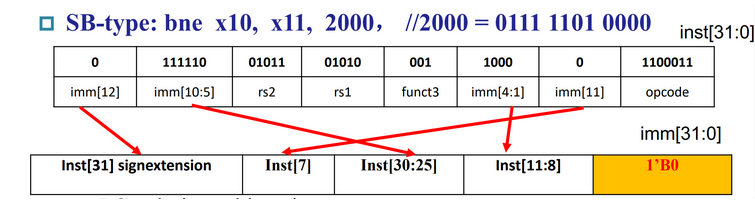</center>

* PC-relative addressing  
$Target\ address = PC + Branch\ offset = PC + immediate \times 2$  
这里低位会默认补 0. 这样可以把地址范围扩大一倍。(注意：末位补0和immediate * 2描述的是同一件事情)

### Jump Addressing

UJ-type(只有 `jal` 指令,`jalr`属于I型指令)

20-bit immediate for larger range, 低位默认补 0, 故实际表示立即数为 [20:0] 共 21 位。 (当然在前面计算时前面还需要补0)

<center>{width=70%}</center>

!!! Example
    <center>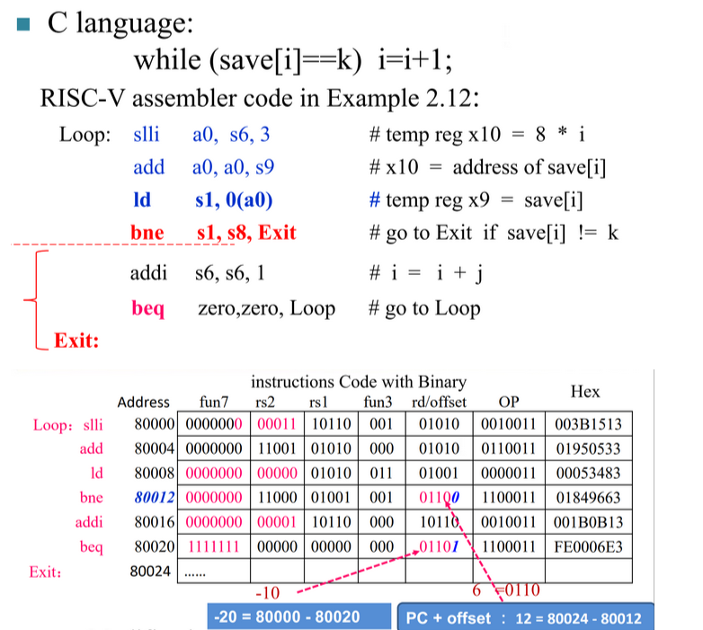{width=70%}</center>    

??? note "Branching far away"
    在指令集设计中，为了简化指令格式和硬件实现，分支指令通常使用 有符号立即数 表示目标地址的偏移量。这种设计的偏移范围是有限的。例如：

    RISC-V 的分支指令（如 beq、bne）使用 12 位立即数 表示偏移，跳转范围为：

    [−211,211−1]×2 字节=±4 KB

    [−211,211−1]×2字节=±4KB

    如果目标地址超出这个范围，直接用分支指令就无法实现跳转。

    这种情况称为 branching far away。

    方法 1：使用多条分支指令

    可以通过多次分支实现远距离跳转：

    1. 跳到一个中间地址（中转点）；
    2. 从中间地址跳到目标地址。

    方法 2：结合 JAL 指令

    JAL 指令（Jump and Link）可以跳转到更远的目标，因为它的偏移范围更大（20 位立即数，跳转范围 ±1 MB）。

    对于远距离的条件分支，可以结合 JAL 和 B 指令：
    条件分支跳转到中间点；

    使用 JAL 实现更远的跳转。

    示例：
    ```assmebly
    bne x1, x0, intermediate   # 如果条件满足，跳到中转点
    ...
    intermediate:
    jal x0, far_target       # 无条件跳转到远距离目标
    far_target:              # 跳转目标代码  
    ```

### RISC-V Addressing Summary

寻址方式是指令集的核心区别。

* **立即数寻址** `addi x5, x6, 4`
* **寄存器寻址** `add x5, x6, x7`
* **基址寻址** `ld x5,100(x6)`
* **PC 相对寻址** `beq x5,x6,L1`

??? Example
    <center>{width=80%}</center>

### RISC-V Disassembly

把机器码翻译为汇编指令。

* opcode  
先看 opcode, 确定是哪类指令，随后就可以按照每类指令的格式进行具体划分了。

??? Example
    <center>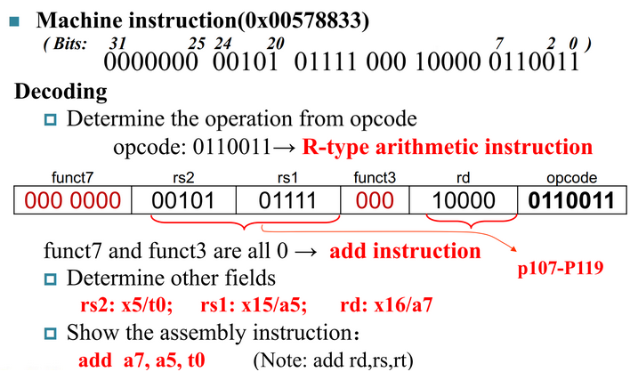{width=70%}</center>

---

## Synchronization in RISC-V
!!! Warning
    下面这些内容与多核编程/多进程比较相关？貌似不是本课程和考试的重点，讲的也不是很清楚

* Two processors sharing an area of memory
    * P1 writes, then P2 reads
    * Data race if P1 and P2 don’t synchronize
        * Result depends of order of accesses
* Hardware support required
    * **Atomic** read/write memory operation
    * No other access to the location allowed between the read and 
    write
* Could be a single instruction
    * **e.g.*** **atomic swap** of register ↔ memory
    * Or an atomic pair of instructions

Load reserved: `lr.d rd,(rs1)`  
把地址 rs1 的值放到寄存器 rd 中，同时

Store conditional: `sc.d rd,(rs1),rs2`
把寄存器 rs2 的值放入地址 rs1.  
如果成功那么 rd 里面是 0. 如果上条指令 load 后，这个地方的值被改变了，那么就失败了，返回 1 

用比较简单的话来讲，就是 `lr.d` 后，CPU霸道的标记了这个内存地址，其他CPU不允许再动，如果其他CPU对这个内存地址做了操作，那么再进行 `sc.d` 后，会失败，把 rd 置为 1

!!! Example "atomic swap"
    <center>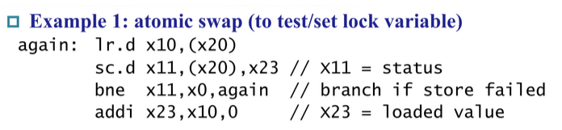{width=70%}</center>

    一直到这一对 Atmoic read/write operation 成功执行才退出

!!! Example "lock"
    <center>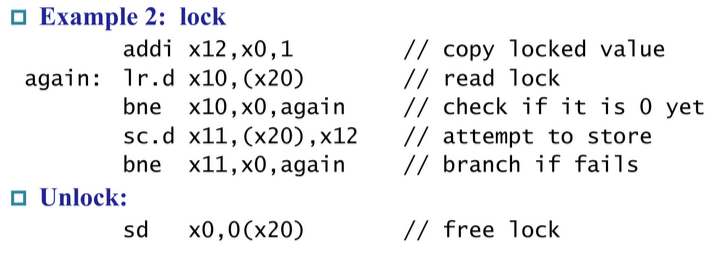{width=70%}</center>
    
    大致理解一下：内存地址空间可能被许多进程抢着用，进程需要知道这块内存地址是否被别的进程占用--也就是 lock 的用处

    如果某块地址 lock 为 0，那么我们的进程就可以使用这块地址，将这块地址抢过来后再将 lock 设为 1，这样其他进程就动不了这块内存了

    地址 x20 放的是锁，如果锁为 0, 说明我们现在可以存入数据，则我们获得锁随后存入，并释放锁。否则需要等锁释放了才能存。

## Translating and starting a program

<center>{width=70%}</center>

### Producing an Object Module
!!! Warning
    下面的许多内容都只是做个了解，具体会在编译原理中介绍

Provides information for building a complete program from the pieces(Header).  

<center>{width=70%}</center>

* Text segment: translated instructions
* Static data segment: data allocated for the life of the program
* Relocation info: for contents that depend on absolute location of loaded program
* Symbol table: global definitions and external refs
* Debug info: for associating with source cod

### Link

Object modules(including library routine) $\rightarrow$ executable program

* Place code and data modules symbolically in memory
* Determine the addresses of data and instruction labels
* Patch both the internal and external references (Address of invoke)

### Loading a Program

Load from image file on disk into memory

1. Read header to determine segment sizes
2. Create virtual address space
3. Copy text and initialized data into memory  
Or set page table entries so they can be faulted in
4. Set up arguments on stack
5. Initialize registers (including sp, fp, gp)
6. Jump to startup routine  
Copies arguments to x10, … and calls main
pWhen main returns, do exit syscall

### Dynamic Linking

Only link/load library procedure when it is called.  
静态链接已经编入文件了，动态链接是在运行时链接，可以用到最新的代码  

* Requires procedure code to be relocatable
* Avoids image bloat caused by static linking of all 
(transitively) referenced libraries
* Automatically picks up new library versions

## Arrays versus Pointers

指针是可以改变的，但是数组首地址不能改变，因此翻译成汇编的结果也有所不同。

??? Example "Clearing an Array"
    <center>{width=70%}</center>

## Real Stuff: MIPS Instructions

MIPS: commercial predecessor to RISC-V

* Similar basic set of instructions
* 32-bit instructions
* 32 general purpose registers, register 0 is always 0
* 32 floating-point registers
* Memory accessed only by load/store instructions
    * Consistent use of addressing modes for all data sizes

Different conditional branches

* For <, <=, >, >=
* RISC-V: `blt, bge, bltu, bgeu`
* MIPS: `slt, sltu` (set less than, result is 0 or 1)
* Then use `beq`, bne to complete the branch


## Real Stuff: The Intel x86 ISA

## Other RISC-V Instructions

* Base integer instructions (RV64I)  
    * Those previously described, plus
    * `auipc rd, immed` // rd = (imm<<12) + pc
    * follow by `jalr` (adds 12-bit immed) for long jump
    * `slt, sltu, slti, sltui`: set less than (like MIPS)
    * `addw, subw, addiw`: 32-bit add/sub
    * `sllw, srlw, srlw, slliw, srliw, sraiw`: 32-bit shift
* 32-bit variant: RV32I    
registers are 32-bits wide, 32-bit operations

RV64I 是最基本的。编译器需要知道当前执行是基于多少位的处理器。

Instruction Set Extensions

* M: integer multiply, divide, remainder
* A: atomic memory operations
* F: single-precision floating point
* D: double-precision floating point
* C: compressed instructions  
16 位的指令，用于低成本产品（嵌入式）

**Fallacies** (谬误)

* Powerful instruction $\Rightarrow$ higher performance
* Use assembly code for high performance
* Backward compatibility $\Rightarrow$ instruction set doesn’t change  

**Pifalls** (陷阱) 

* Sequential words are not at sequential addresses (应该 +4)
* Keeping a pointer to an automatic variable after procedure returns  