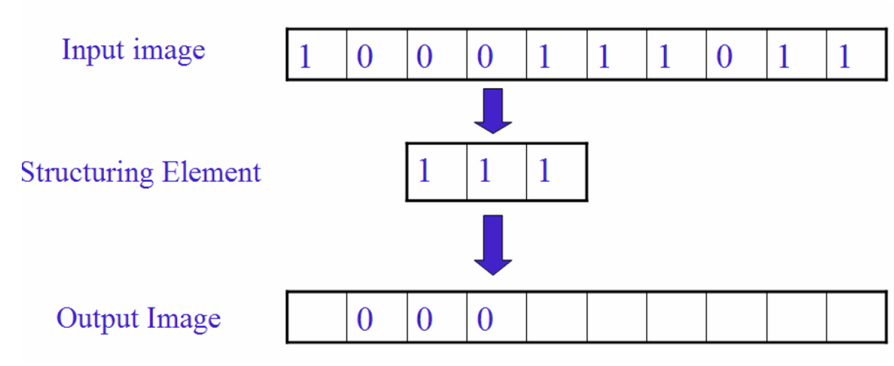
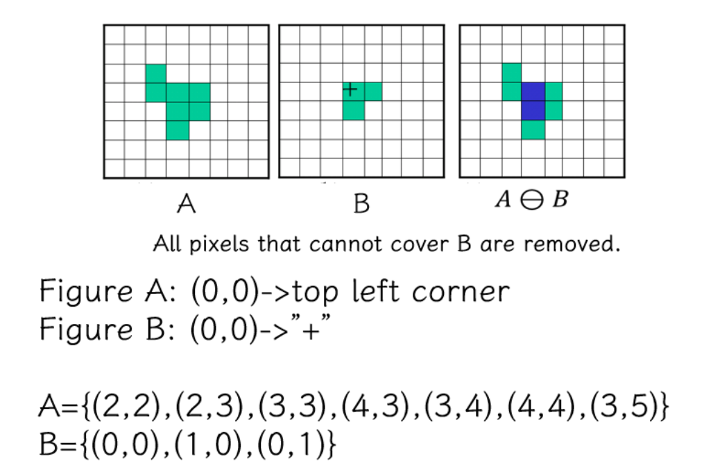

# 2 二值图像与形态学

!!! note "本章概述"
    二值图像 | Binary image
    图像二值化 | Image binarization
    形态学操作 | Morphological operation

    - 集合的定义 | Definition of set
    - 腐蚀 | Erosion
    - 膨胀 | Dilation
    - 开运算 | Opening
    - 闭运算 | Closing

    应用 | Application

如何从灰度图转为二值图像？
为什么需要二值图像（实际应用中二值化能把不重要的信息去掉）

---

## Binary Image

灰度图与二值图像的差别如下图所示：

二值图像（Binary Image）中像素（Pixel）的值只有 {0,1} 或者 {0,255}，编程中我们一般用 {0,255} 来构造二值图像。

二值图像的优缺点：

* 优点：
    * 更小的内存需求
    * 运行速度更快
    * 为二值图像开发的算法往往可以用于灰度级图像

* 缺点：

    * 应用范围有限；
    * 无法推广到三维空间中
    * 表现力欠缺，不能表现物体内部细节
    * 无法控制对比度

---

## Image binarization

* 设置一个阈值 Threshold，比阈值小的置为 0, 比阈值大的置为 255.
  
$$\left\{\begin{matrix}I(x,y)=0\ if\ I(x,y)\leq Threshold \\ I(x,y)=255\ if\ I(x,y)\geq Threshold \end{matrix} \right.$$

* 如何选取合适的 threshold?  

基本思想：将二值化得到的二值图像视为两部分，一部分对应前景（Foreground），另一部分对应背景（Background）。尝试找到一个合适的threshold使得到的前景和背景的内部方差最小，而它们之间的方差则最大。（事实上，这二者是等价的） 

这就是大津算法的思想

**OTSU 大津法**

> 大津法（OTSU）是一种确定图像二值化分割阈值的算法，由日本学者大津于1979年提出。从大津法的原理上来讲，该方法又称作最大类间方差法，因为按照大津法求得的阈值进行图像二值化分割后，前景与背景图像的类间方差最大。 

??? note "原理推导"
    OTSU算法的本质思想就是**最大化类间方差**
    
    从目的来看我们想设置一个阈值$\tau$将图像中的像素分为$A$(大于$\tau$)、$B$(小于$\tau$)两类。那么我们这个阈值的取值范围就是$[0,255]$。这里我们取整数，在这256个数中选取一个作为我们分割图像的阈值

    怎么选取这个阈值呢？我们从代码层面来说

    先统计图形中每个灰度的像素个数，设$n_i$为图像中灰度为$i$的像素的数量，则有$n_0,n_1,n_2...n_{255}$

    图像中像素灰度为$i$的概率为:

    $$
    p_i=\frac{n_i}{n_0+n_1+...+n_{255}}
    $$

    且有：

    $$
    \Sigma _{i=0} ^ {255} p_i = 1
    $$

    此时根据OSTU的思想来看，我们应该找出一个$\tau$使得A、B两类的方法最大。者可以看成一个求最大值的问题，用$\tau$遍历0-255所有的整数，求出所有对应的方差，取最大方差对应的$\tau$

    那现在唯一的问题就是已知$\tau$和图像，如何求A与B的方差了

    设阈值为$k$时，像素被分到A的概率为$p_A(k)$、分配到A的像素的平均灰度为$m_A(k)$

    同理设像素被分到B的概率为$p_B(k)$、分配到B的像素的平均灰度为$m_B(k)$

    还有灰度级$k$的累加均值$m \triangleq \Sigma _{i=0} ^k ip_i$，整个图像的灰度值$m_G \triangleq \Sigma _{i=0} ^{255} ip_i$

    则有：

    $$
    p_A(k) * m_A(k) + p_B(k) * m_B(k) = m_G \tag{1}
    $$

    $$
    p_A(k) + p_B(k) = 1 \tag{2}
    $$

    根据方差的概念，方差的表达式写成：
    
    $$
    \sigma^2 = p_A(k)(m_A(k)-m_G)^2 + p_B(k)(m_B(k)-m_G)^2 \tag{3}
    $$

    将(1)带入(3):

    $$
    \sigma^2 = p_A(k)p_B(k)(m_A(k)-m_B(k))^2  \tag{4}
    $$

    其中：
    

    $p_A(k) = \Sigma_{i=0}^k p_i$ 
    $p_B(k) = \Sigma_{i=k+1}^{255} p_i$
    

    

    $m=\Sigma_{i=0}^k ip_i$
    $m_G=\Sigma_{i=0}^{255}ip_i$
    

    

    $m_A(k)=\frac{\Sigma_{i=0}^k ip_i}{p_A(k)}$
    $m_B(k)=\frac{\Sigma_{i=k+1}^{255} ip_i}{p_B(k)}$
    

    当然，为了尊重原著我们可以把(4)写成

    $$
    \sigma^2 = \frac{(m_G*p_A(k)-m)^2}{p_A(k)(1-p_A(k))} \tag{5}
    $$

* 过程简述  
    * Step 1: 确定原始图像中像素灰度的最大值和最小值；
    * Step 2: 最小值加 1 作为 threshold 对原始图像进行二值化操作；
    * Step 3: 根据对应关系确定前景和背景，分别计算当前 threshold 下的内部协方差和外部协方差；（算一个就可以了）
    * Step 4: 回到 Step 2 直到达到像素最大值；
    * Step 5：比较找到最大外部和最小内部协方差对应的 threshold.

我们可以将前述 thresholding 策略推广到彩色图像，同时考虑 rgb 三个通道，我们就可以针对特定的色彩进行 thresholding 操作(思想类似，但是具体操作暂略)

??? Example Image
    
{width=70%}

大津算法存在问题：全局进行二值化操作不给力，如中间这幅图。

我们可以采用局部自适应操作来优化成为右边的图。具体思想：设定一个局部窗口，在整个图像上滑动该窗口；对于每一窗口位置，确定针对该窗口的threshold。

---

## Morphology Operation

### Morphology

* 形态学 Morphology  

    1960s 后期提出，研究动植物的结构与形态。形态学一般指生物学中研究动物和植物结构的一个分支

* 数学形态学 Mathematical morphology  

    基础理论：集合论。采用一种简单的非线性代数算子，主要用于二值图像，可扩展到灰度图像。用在噪声过滤、形状简化、细化、分割、物体描述等

用数学形态学（也称图像代数）表示以形态为基础对图像进行分析的数学工具  

* 基本思想是用具有一定形态的**结构元素(structure element)** 去度量和提取图像中的对应形状以达到对图像分析和识别的目的。  
* 形态学图像处理的数学基础和所用语言是**集合论**。  
* 形态学图像处理的应用可以简化图像数据，保持它们基本的形状特性，并除去不相干结构。
* 形态学图像处理的基本运算有4个：**膨胀、腐蚀、开操作和闭操作**  

---

### Set Theory for Image

**For reference**

  

  

  

---

### 膨胀 | Dilation
膨胀是将与物体“**接触**”的所有背景点合并到该物体中，使边界向外部扩张的过程。可以用来填补物体中的空洞。（其中“接触”的含义由结构元描述）

$$
A\oplus B = \{(x,y)| (B)_{(x,y)} \cap A \neq \varnothing \}
$$

其中 A：二值图像；B：二值模板，称为**结构元（structure element）**

该式B对A膨胀，注意这里的$\oplus$不是异或的意思

膨胀的方法简单来说就是将B的中心遍历放置在图像A中所有像素点，如果B与A没有任何接触，那么这个点不作为扩张点，否则这个点就作为扩张点

??? example "Dimension 1"
    === "第一步"
        

    === "第二步"
        

    === "第三步"
        

    === "第四步"
        

??? example "Dimension 2"
    
    > 这里的图中第二行的格子有些大，具有一定的误导性

显然我们发现，选择不同形状的结构元，结果也不同。一般来说，我们更多地选择各向同性（即对称）的结构元

---

### 腐蚀 | Erosion

腐蚀是一种消除边界点，使边界向内部收缩的过程。可以用来消除小且无意义的物体。

同理

$A$: Binary image  

$B$: binary template,  structure element  

$$A\ominus B=\{(x,y)|(B)_{xy}\subseteq A\}$$  

Physical meaning: remove boundary, remove unwanted small objects.

腐蚀的做法简单来说，就是将结构元B遍历A的每一个像素，只有B被A完全包含的像素才不会被腐蚀

??? example "Dimension 1"
    === "第一步"
        

    === "第二步"
        

    === "第三步"
        

    === "第四步"
        

    === "第五步"
        

??? example "Dimension 2"
    

!!! question "Padding"
    可能有人会有疑问，加入我们的扫描从第一行开始，结构元可能就超出了图像的边界（例如十字形的结构元），这个时候应该如何处理？我们可以借用 padding 的思想：把这一行往上复制一遍，再进行扫描。

!!! note "Application for Erosion"
    !!! Example "滤波"
        
        >这里我们腐蚀了白色像素

    !!! Example "提取边界"
        

    !!! Example "补洞"
        

**接下来我们对膨胀和腐蚀做一个小的总结：**

!!! Summary "Dilation and Erosion"
    * 膨胀  
    由B对A膨胀所产生的二值图像D是满足以下条件的点(x,y)的集合：如果B的原点平移到点(x,y)，那么它与A的交集非空。
    * 腐蚀  
    由B对A腐蚀所产生的二值图像E是满足以下条件的点(x,y)的集合：如果B的原点平移到点(x,y)，那么B将完全包含于A中
    * 膨胀与腐蚀是对偶的  
    $(A\ominus B)^c=\{z|(B_z)\subseteq A\}^c=\{z|(B_z)\cap A=\varnothing\}^c=\{z|(B_z)\cap A^c \neq \varnothing\}=A^c\oplus B$  

---

### 开运算 | Open

先腐蚀，后膨胀
$A\circ B=(A\ominus B)\oplus B$

Remove small objects, segment object at thin part, smooth boundary of large object but preserve its original area.

!!! note ""
    

---

### 闭运算 | Close

先膨胀，后腐蚀
$A \bullet B =(A\oplus B)\ominus B$  

Fill small holes, connect the neighboring objects, smooth boundary while preserving the area at most.

!!! note ""
    

---

| 操作             | 定义           | 主要功能                         | 适合处理的情况                                |
|------------------|----------------|----------------------------------|-----------------------------------------------|
| 开运算 (Open)    | 先腐蚀再膨胀   | 去除小前景噪声，平滑物体边缘     | 适合去除细小的白色前景噪声，平滑前景边缘      |
| 闭运算 (Close)   | 先膨胀再腐蚀   | 填充小孔，连接断裂部分，平滑边缘 | 适合填补前景中的小黑色空洞，连接前景物体      |

---

## 总结

