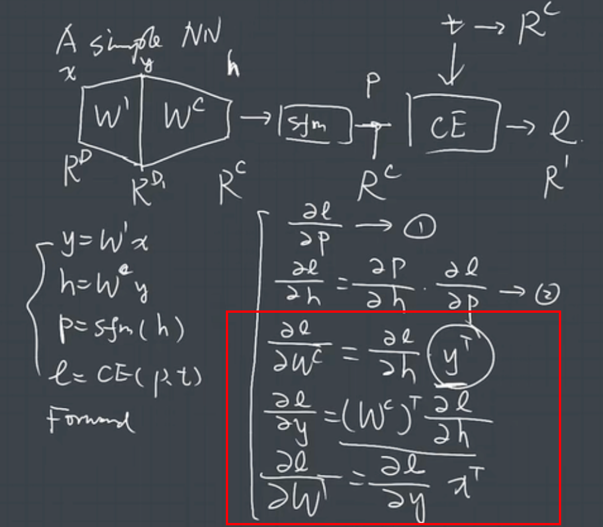

# 矩阵求导

对于
$$
\mathbf{y} = \mathbf{W} \mathbf{x}
$$

!!! note

    矩阵求导存在两种形式: 分母表达式和分子表达式

    分母表达式（Denominator Layout）: $\frac{\partial \mathbf{y}}{\partial \mathbf{x}} = \mathbf{W}^T$ 偏导结果的行数和分母行数相同

    分子表达式（Numerator Layout）: $\frac{\partial \mathbf{y}}{\partial \mathbf{x}} = \mathbf{W}$ 偏导结果的行数和分子行数相同

我们习惯使用列向量而非行向量，默认使用**分母表达式**：

这是为了 BP 算法形式的方便和简洁性，这样 L 关于 W 的偏导也是一个行数和 W 一样的向量
$$
\underbracket{\mathbf{W}_\text{new}}_{R^D} = \underbracket{\mathbf{W}}_{R^D} - \underbracket{\alpha \nabla_\mathbf{W} \mathcal{L}}_{R^D}
$$

!!! important

    W 是二维矩阵，但是在对 W 求导时，我们默认把 W 拉平成一个长向量，因为求导本质是在对**矩阵的各元素**逐一求导

    也就是：
    $$
    \mathbf{W} \in \mathbb{R}^{m \times n} \quad \Rightarrow \quad \text{vec}(\mathbf{W}) \in \mathbb{R}^{mn}
    $$
    所以分母布局本质上是在说：

    分母是输入变量，结果的形状和分母形状保持一致

在分母表达式下，链式求导过程就是这样的：

$$
y = f(\underbrace{g(\underbrace{h(x)}_{q})}_k)
\\
\Rightarrow \frac{\partial y}{\partial x} = \frac{\partial q}{\partial x} \cdot \frac{\partial k}{\partial q} \cdot \frac{\partial y}{\partial k}
$$

!!! important

    举一个例子：

    $$
    y = (Ax-b)^T(Ax-b) \quad \text{set} \; z = Ax -b
    \\
    \begin{aligned}
    \Rightarrow \frac{\partial y}{\partial x} &= \frac{\partial z}{\partial x} \cdot 
    \frac{\partial y}{\partial z}
    \\
    &= A^T \cdot (2z)
    \\
    &= 2A^T \cdot (Ax-b)
    \end{aligned}
    $$

    由于分子表达式和分母表达式互为转置，所以想写分子表达式只要给结果加个转置即可

以神经网络中的最简单的前向传播和反向传播为例：
$$
\mathbf{x} \xrightarrow{\mathbf{y = Wx}} \mathbf{y} \xrightarrow{\mathcal L = \text{f}(\mathbf{y})} \mathcal{L}
$$

设
$$
\mathbf{W} \in \mathbb{R}^{m \times n}, \quad \mathbf{x} \in \mathbb{R}^{n}, \quad \mathbf{y} \in \mathbb{R}^{m}
$$
可以证明损失函数 $\mathcal L$ 关于 $\mathbf{x}$ 和 $\mathbf{W}$ 的梯度。

先看 $\mathcal L$ 关于 $\mathbf{x}$：
$$
\frac{\partial\mathcal{L}}{\partial \mathbf{x}}
=
\frac{\partial \mathbf{y}}{\partial\mathbf{x}}\frac{\partial{\mathcal{L}}}{\partial \mathbf{y}}
$$
从分量角度看，
$$
\begin{aligned}
\left(\frac{\partial \mathcal{L}}{\partial \mathbf{x}}\right)_j
&=
\frac{\partial \mathcal{L}}{\partial x_j} \\
&=
\sum_{i=1}^{m}\frac{\partial y_i}{\partial x_j}\frac{\partial \mathcal{L}}{\partial y_i} \\
&=
\sum_{i=1}^{m}w_{ij}\frac{\partial \mathcal{L}}{\partial y_i}
\end{aligned}
$$
这正是矩阵乘法$\mathbf{W}^\top \frac{\partial \mathcal{L}}{\partial \mathbf{y}}$的第 $j$ 个分量，因此
$$
\frac{\partial\mathcal{L}}{\partial \mathbf{x}}
=
\mathbf{W}^\top \frac{\partial{\mathcal{L}}}{\partial \mathbf{y}}
$$

再看 $\mathcal L$ 关于 $\mathbf{W}$：
$$
\left(\frac{\partial \mathcal{L}}{\partial \mathbf{W}}\right)_{ij}
=
\frac{\partial \mathcal{L}}{\partial w_{ij}}
=
\sum_{k=1}^{m}\frac{\partial y_k}{\partial w_{ij}}\frac{\partial \mathcal{L}}{\partial y_k}
$$
由于 $w_{ij}$ 只会影响 $y_i$，因此可以写成：
$$
\begin{aligned}
\left(\frac{\partial \mathcal{L}}{\partial \mathbf{W}}\right)_{ij}
&=
x_j\frac{\partial \mathcal{L}}{\partial y_i}
\end{aligned}
$$
而外积$\frac{\partial \mathcal{L}}{\partial \mathbf{y}}\mathbf{x}^\top$的第 $(i,j)$ 个元素恰好是$\frac{\partial \mathcal{L}}{\partial y_i}x_j$，所以
$$
\frac{\partial \mathcal{L}}{\partial \mathbf{W}}
=
\frac{\partial \mathcal{L}}{\partial \mathbf{y}}\mathbf{x}^\top
$$

最终得到 BP 中最常用的两条结果：

$$
\frac{\partial\mathcal{L}}{\partial \mathbf{x}} = \mathbf{W}^\top \frac{\partial\mathcal{L}}{\partial \mathbf{y}}
$$

$$
\frac{\partial\mathcal{L}}{\partial \mathbf{W}} = \frac{\partial\mathcal{L}}{\partial \mathbf{y}}\mathbf{x}^\top
$$

最后可以在一个 Simple NN 上验证一下反向传播过程中各层的求导情况，检验理解成果，也能发现其实也完全可以通过**前后矩阵形状**来判断求导公式：

