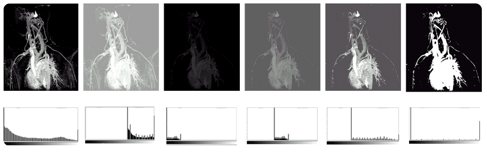

# Chapter 3 | 图像灰度变换

## 灰度感知 | Grayscale perception
根据韦伯定理（ch1），我们有

$$\dfrac{\Delta I}{I}\approx K_{Weber}\approx 1\%\sim 2\%$$

据此我们可以做这样的推导，

$$\frac{I_{max}}{I_{min}}=(1+K_{Weber})^{255} \approx 13 \sim 156$$

其中$I_\text{max}$为最大可感知的亮度，$I_\text{min}$为最小可感知的亮度；255表示0-255的色彩深度的变化，对应了256个可感知的亮度级别。

该式的含义是：如果我们划分了256个可感知的亮度级别，那么从最小的可感知亮度开始，每增加一个亮度级别，亮度将变化为原来的$(1+K_\text{Weber})$倍，因此在256亮度级别总数下，最大可感知亮度与最小可感知亮度的比例必然是$(1+K_\text{Weber})$

另外人们发现感知能力是服从$\log(I)$ 的，换言之，亮度线性变化引起的人类感受变化并不也是线性的，而是对数的。这称作**Fechner’s Law**。

## 可视化增强 | Visibility enhancement

### $\gamma$ 校正 | $\gamma$ correction
根据费希纳定律(Fechner's Law)，人眼对亮度的感知不是线性的，更接近于对数分布——对暗部的变化更敏感，对亮部的变化则不太敏感。而原始图像的亮度通常是线性记录的，不符合人眼的特性。

Gamma 矫正通过调整图像的亮度，使其符合人眼的对比敏感度，从而让图像显示得更加自然，亮度变化更加均匀，增强可视化效果。

我们可以对亮度做$\gamma$的指数运算（当然实际操作中可能还需要乘上一个系数来调整亮度的范围）来近似表示这个对数变化，从图像也可以看出二者的趋势会更加接近

{:width=50%}

!!! note "图像通过gamma校正进行操作"

    
{width=70%}

    > 姑且可以认为这样操作与调整曝光时间的效果是一样的

!!! note "不同$\gamma$的渐变效果"

    

    左边在亮度上其实是均匀变化的，但是在我们人眼看来，深色数量远多于亮色。通过一个非线性校正后（右图），我们人眼看来就是均匀变化的了。这也就是gamma校正的目的

    并且实测出来人眼需要的gamma值是2.2；通常情况下这也是显示器的默认值

### 对数操作 | logarithmic operation

类似地，为了增强图像的可视信息，我们也可以对图像中的像素进行基于对数的操作，这更加符合人眼的感知。

$$L_d=\dfrac{\log(L_w+1)}{\log(L_{max}+1)}$$

其中，$L_d$ 是显示亮度，$L_w$ 是真实世界亮度，$L_{max}$ 是场景中的最亮值。

这个映射能够确保不管场景的动态范围是怎么样的，其最大值都能映射到1（白），其他的值能够比较平滑地变化。

## 灰度图像及其直方图 | Grayscale image and histogram

### Grayscale image
学习完前面的知识后，对灰度图肯定有了一定的了解，这里再简略地介绍一下灰度图

- 由像素组成的二维阵列。（M 行 × N 列）
- 每个像素由 8 位表示。灰度有 $2^8 = 256$ 级，分别为 p=0,1,2,...,255。
- 灰度强度越小，像素越暗，反之亦然。 p = 0 为黑色， p = 255 为白色。

### Histogram

灰度直方图是一类统计图形，它表示一幅图像中各个灰度等级的像素个数在像素总数中所占的比重。

***e.g.***

{width=50%}

量化：如 256 分为 8 个灰度级， 0-32 为一个灰度级，以此类推... 每个柱子就反映了像素数目占的比例。

设灰度等级范围为$[0,L-1]$ ，灰度直方图用下列离散函数来表示：

$$h(r_k)=n_k$$

其中，$r_k$ 为第$k$级灰度，$n_k$ 是图像中具有灰度级 $r_k$ 的像素数目，$0 \leq k \leq L-1,0 \leq n_k \leq n-1$, $n$ 为图像总的像素数目。  

我们通常用概率密度函数来归一化直方图：

$$P(r_k)=\dfrac{n_k}{n}$$

$P(r_k)$为灰度级$r_k$所发生的概率（概率密度函数）。此时，满足下列条件：  

$$\sum\limits_{k=0}^{L-1}P(r_k)=1$$

!!! example "Grayscale image with histogram Example"
    

## 彩色图像及其直方图 | Color image and histogram

### Color histogram

接下来我们介绍彩色图像的直方图。彩色直方图也是一类统计图形，它表示一幅图像中 r,g,b 通道上<u>各个</u>亮度等级的像素个数在像素总数中所占的比重。

??? tip "整体亮度与通道亮度"
    整体亮度（Luminance/Lightness）：通常通过加权平均（例如 Y = 0.299R + 0.587G + 0.114B）来计算，这个值代表了图像或像素的“明暗程度”。
    
    通道亮度（Channel Intensity）：指在每个单独的通道（红、绿或蓝）中，每个像素的强度值。它表示该通道对该像素颜色的贡献，但并不是图像的整体亮度。

    所以我们这里说的“各个亮度等级”其实指的就是通道的强度值

## 直方图的特性 | Characteristics of histogram

直方图

* 是空间域处理技术的基础。
* 反映图像灰度的分布规律，但不能体现图像中的细节变化情况。
* 对于一幅给定的图像，其直方图是唯一的。
* 不同的图像可以对应相同的直方图。

!!! example "Same histogram Different image"
    

对直方图进行操作能有效地用于图像增强、压缩和分割, 他们是图像处理的一个实用手段。

!!! example "Example"
    
    
缺点：对直方图直接操作会带来噪声

显然，用直方图表示图像的特征的缺点是：直方图把结构信息丢失，只知道颜色分布，不知道结构。  

## 直方图变换 | Histogram transform

### 变换例子

#### 直方图均衡化 | Histogram equalization

!!! note ""
    直方图均衡化是一种简单有效的图像增强技术，通过改变图像的直方图来改变图像中各像素的灰度，主要用于增强动态范围偏小的图像的对比度。原始图像由于其灰度分布可能集中在较窄的区间，造成图像不够清晰。例如，过曝光图像的灰度级集中在高亮度范围内，而曝光不足将使图像灰度级集中在低亮度范围内。采用直方图均衡化，可以把原始图像的直方图变换为均匀分布（均衡）的形式，这样就增加了像素之间灰度值差别的动态范围，从而达到增强图像整体对比度的效果。换言之，直方图均衡化的基本原理是：对在图像中像素个数多的灰度值（即对画面起主要作用的灰度值）进行展宽，而对像素个数少的灰度值（即对画面不起主要作用的灰度值）进行归并，从而增大对比度，使图像清晰，达到增强的目的。

直方图均衡化：将原图像的非均匀分布的直方图通过变换函数 $T$ 修正为均分布的直方图，然后按均衡直方图修正原图像。

图像均衡化处理后，图像的直方图是平直的，即各灰度级具有相同的出现频数：

所以我们就是要找到变换函数 $T$ ，确定如下对应关系：

$$s=T(r)$$

从而确保输入图像中的每一个灰度 $r$ 都能转换为新图像中的一个对应的灰度 $s$ 。

##### 变换函数 $T$ - 连续灰度变化

假设：  

* 令 $r$ 和 $s$ 分别代表变化前后图像的灰度级，并且 $0\leq r,s \leq 1$ 。
* $P(r)$ 和 $P(s)$ 分别为变化前后各级灰度的概率密度函数（$r$ 和 $s$ 值已归一化，最大灰度值为 $1$ ）

??? info "归一化"
    在图像信息处理中，**归一化**(Normalization)是将图像的像素值调整到一个特定的数值范围内（通常是[0,1]），以便统一数据的尺度，便于后续处理、分析、和模型输入。

    归一化方法通常包括**线性归一化**（例如将[0,255]均匀映射到目标范围[0,1]）、**标准化**（常用于深度学习，让数据具有均值为0，标准差为1的分布）

规定：  

* 在$0\leq r \leq 1$中，$T(r)$ 是单调递增函数，并且 $0\leq T(r)\leq 1$。
* 反变换 $r = T^{-1}(s)$ 也为单调递增函数。

考虑到灰度变换不影响像素的位置分布，也不会增减像素数目。所以有：

$$\int_{0}^rP(r)dr =\int_{0}^sP(s)ds=\int_{0}^s1ds=s=T(r)$$

!!! question "为什么 $P(s)= 1$ ？ "
    因为这里 $P(s)$ 是概率密度函数，因为 $s$ 是均匀分布的，所以 $P(s)= 1$ 。

因此得到我们需要求的转换函数$T(r)$

$$s=T(r)=\int_{0}^rP(r)dr$$ 

即转换函数 $T$ 在变量 $r$ 处的函数值 $s$，是原直方图中灰度等级为 $[0,r]$ 以内的直方图曲线所覆盖的面积。

##### 变换函数 $T$ - 离散灰度变化

设一幅图像的像素总数为 $n$ ，分 $L$ 个灰度级，$n_k$ 为第 $k$ 个灰度级出现的像素数，则第 $k$ 个灰度级出现的概率为：

$$P(r_k)=\dfrac{n_k}{n}\quad (0\leq r_k\leq 1, k=0, 1,2,...L-1)$$

**离散**灰度直方图均衡化的转换公式为：

$$s_k=T(r_k)=\sum\limits_{i=0}^kP(r_i)=\sum\limits_{i=0}^k\dfrac{n_i}{n}=\dfrac{1}{n}\sum\limits_{i=0}^k n_i$$  

对于原直方图中的任意一个灰度级 $r_k$，只需将灰度级为 $[0,r_k]$ 以内的所有像素个数的和除以图像的像素总数，就可以得到转换之后的对应灰度级 $s_k$

其实就是连续灰度变化的“离散”版本

##### 直方图均衡化的步骤

以灰度直方图为例：

1. 计算原始图像的灰度直方图 $n_k$。
2. 计算原始图像的像素总个数（注意：对于 bmp 文件，这一数值并不储存在图像信息头的 `biSizeImage` 中，因为`biSizeImage` = `biwidth'` * `biheight`，其中`biwidth`包括了 padding 字节）。
3. 计算原始图像的灰度分布频率 $P (r_k)$.
4. 计算原始图像的灰度累积分布频率 $s_k$.
5. 将归一化的 $s_k$ 乘以 $L - 1$ 再四舍五入，以使得均衡化后图像的灰度级与归一化前的原始图像一致。（其中 L 是图像的灰度级数，如对于8位图像，L=256）
6. 根据以上映射关系，参照原始图像中的像素，写出直方图均衡化之后的图像。由于“四舍五入”的关系，几个相邻的 $s_k$ 可能会落入同一个灰度级。也就是说离散直方图均衡化后，不同灰度的概率可能不同。

!!! Example
    设图像有 $64*64=4096$ 个像素，有8个灰度级，灰度分布为:

    
    1. 计算 $s_k$(利用前缀和)
    2. 把计算的 $s_k$ 就近安排到8个灰度级中

    

    通过直方图，可以看出，灰度分布比之前更加均匀了。

    

!!! Question
    按照均衡化的要求，在均衡化后的结果直方图中，各灰度级发生的概率应该是相同的，如右上图所示连续灰度级均衡化结果那样。但是，如刚刚中离散灰度级均衡化后，各灰度级出现的概率并不完全一样。为什么？

    * 步骤2中，所得的 $s_k$ 不可能正好等于8级灰度值中的某一级，因此需要就近归入某一个灰度级中。这样，相邻的多个 $s_k$ 就可能落入同一个灰度级，需要在步骤3时将处于同一个灰度级的像素个数累加。因此，离散灰度直方图均衡化操作以后，每个灰度级处的概率密度（或像素个数）并不完全一样。

直方图均衡化实质上是减少图像的灰度级以换取对比度的加大。在均衡过程中，原来的直方图上出现概率较小的灰度级被归入很少几个甚至一个灰度级中，故得不到增强。若这些灰度级所构成的图像细节比较重要，则需采用局部区域直方图均衡化处理。

#### 直方图匹配 | Histogram fitting

* 所谓直方图匹配，就是修改一幅图像的直方图，使得它与另一幅图像的直方图匹配或具有一种预先规定的函数形状。  
* 直方图匹配的目标，是突出我们感兴趣的灰度范围，使图像质量改善。  
* 利用直方图均衡化操作，可以实现直方图匹配过程。

!!! note "Difference between qualization and fitting"
    直方图反映了图像全局的像素点灰度值的分布情况，而直方图匹配又是调整图像的直方图，所以直方图匹配的结果是调整了图像的全局亮度、对比度，这是一种调整图像对比度的图像增强方法。调整图像直方图的方法还有直方图均衡化，只不过直方图均衡化是自动地将直方图均匀摊开了，目的是图像的灰度分布尽可能地均匀。直方图匹配可以用在想要把图像调整为某种特定的对比度图像，或者在拥有两幅图像时将其中一幅图像调整为与另一幅对比度、色调相近的图像。

具体过程：  
1. 对原始图像进行直方图均衡化：$S=T(r)$
2. 假定对求得的图像，也就是规定化之后的图像进行直方图均衡化:$V=G(z)$
3. 因为都是进行直方图均衡化，所以有$S=V$，于是有$z=G^{-1}(V)=G^{-1}(S)=G^{-1}(T(r))$

具体情境下往往是离散的：

类似步骤 1 和 2 ，分别计算获得两张表（参见直方图均衡化中的算例），从中选取一对 $v$ 、$s$ ，使 $v = s$，并从两张表中查出对应的$z$、$r$。这样，原始图像中灰度级为 $r$ 的所有像素都映射成灰度级 $z$ ，最终得到所期望的图像。

直方图（灰度）变换用以确定变换前后两个直方图灰度级之间对应关系的变换函数。经过直方图变换以后，原图像中的任何一个灰度值都唯一对应一个新的灰度值，从而构成一幅新图像。  

直方图均衡化、直方图匹配都属于直方图变换操作。

#### 图像增强 | Image enhancement

* 采用一系列技术去改善图像的视觉效果，或将图像转换成一种更适合于人或机器进行分析处理的形式。
* 图像增强并不以图像保真为准则，而是有选择地突出某些对人或机器分析有意义的信息，抑制无用信息，提高图像的使用价值。
* 根据任务目标突出图像中感兴趣的信息，消除干扰，改善图像的视觉效果或增强便于机器识别的信息。

    !!! Example "Luminance adjustment"

        

    !!! Example "Contrast adjustment"

        

    !!! Example "Color quantization"

        === "Figure 1"
            

            Color quantization（颜色量化）：用于将图像的颜色数量从原本的丰富色彩减少到一个较小的色彩集。
            
            这两张图的意思大概都是将色彩通道的灰度级减少

        === "Figure 2 - More informative one"
            
{:width=70%}

## 变换分类

根据变换函数类型的不同，直方图灰度变换可以分为线性变换和非线性变换两大类。

### 线性变换 | Linear grayscale transform

直方图灰度的线性变换函数可以表示为

$$s=T(r)=kx+b$$

!!! note ""
    - $r$ 为输入点的灰度值（级）
    - $s$ 为相应输出点的灰度值（级）
    - $k$、$b$为常数。$k<1$时表示灰度值被抑制，$b$为图像的抬升

!!! Example
    

#### 拉伸 | Contrast stretching

{: width=70%}

输入图像f(x,y)灰度范围为[a,b]
输出图像g(x,y)灰度范围为[c,d]

!!! example "Contrast streching"
    === "Example 1"
        

        其实也是一种增强对比度的方式

    === "Example 2"
        

        其实也是一种增强对比度的方式

#### 分段拉伸

利用分段直方图变换，可以将感兴趣的灰度范围线性扩展，同时相对抑制不感兴趣的灰度区域。

### 非线性变换 | 　Nonlinear histogram transform

我们有对数变换(Logarithmic transform)和指数变换(Exponential transform)

{width=80%}

{width=80%}

!!! Example "Nonlinear histogram transform"
    