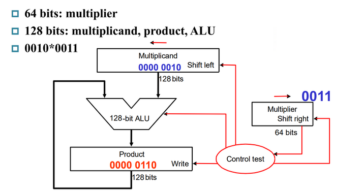
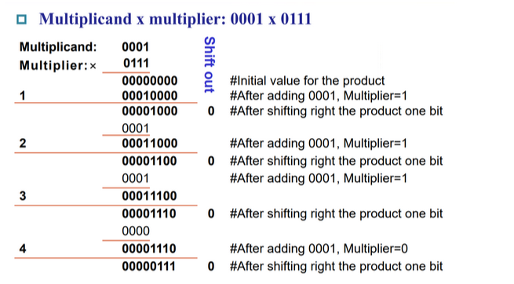

# Chap 2: Arithmetic for Computer

## Introduction

Instructions can be divided into 3 categories

* memory-reference instructions  
***e.g.*** `lw, sw`
需要 ALU 计算内存地址
* arithmetic-logical instructions  
***e.g.*** `add, sub, and, or, xor, slt`
需要 ALU 进行计算
* control flow instructions  
***e.g.*** `beq, bne, jal`
需要 ALU 进行条件判断

### Signed Number Formats
- Sign-magnitude（原码）
    - 开头第一个表示符号0正1负
- 1's Complement（反码）
    - 在原码的基础上，符号位不动，其他位取反 -- 注意，任何正数的原码=反码=补码，而负数都是通过补码表示的。
- 2's Complement（补码）
    - 在反码的基础上，运算+1 -- 注意，任何正数的原码=反码=补码，而负数一般情况下都是通过补码表示的
- Biased notation （移码）
    - 在补码的基础上，符号位取反

## Arithmetic 

* Simple ALU 
<center>{width = 45%}</center>
* CLA(Carry Lookahead Adder)
* CSA(Carry Selection Adder)

注: RISC-V 不支持 nor 指令。

### Multiplication

#### Unsigned multiplication

Product (乘积) = Multiplicand (被乘数) $\times$ Multiplier (乘数)  

假定被乘数和乘数都是 64 位的

* 如果乘数末位是 1, 加被乘数，否则加 0. 随后将被乘数左移 1 位。
    <center>{width=70%}</center>  

    需要 128+128+64 bit 的寄存器，和一个 128 bit ALU.  

* 不移被乘数，而是移积 (product). 这样 ALU 只需要 64 位。
    <center>{width=70%}</center>

    ??? Example
        <center>{width=80%}</center>

* 在第二种优化的基础上，这里积最开始只保存在左半部分，右半部分为空。而乘数也要右移，这样我们可以把两个数拼到一起，Product的左半64位初始置为0，右半64位初始置为Mutiplier，同时右移。  
    <center>{width=70%}</center>

#### Signed multiplication
比较易得的，我们想到有符号相乘可以用非常简单的思想迁移过来，只需将符号位异或，将有符号数统一转换成无符号数，再套用先前的无符号数乘法器即可

但是先前的无符号数乘法器有一点并不能让我们满意，对于64位无符号数的乘法器，总是需要迭代64次，不管对于多么简单的数，总是要做64次加法。对于有符号乘法而言，另一种选择计算方式是 Booth's Algorithm

##### Booth's Algorithm  
<center>{width=80%}</center> 

思想：把连续的1通过“高位-低位”的方式（例如01110 = 1000-10）转换，从而起到减少“1”的作用，即在实现总可以减少加法操作

{width=70%}

**实现方式**

最开始把积放在高位，被乘数放在低位。（数据保存方法同 2.1.1）默认 $bit_{-1}=0$

* Action
    * 10 - subtract multiplicand from left
    * 11 - nop
    * 01 - add multiplicand to left half
    * 00 - nop

    每个操作结束后都要移位，和 2.1.1 中类似
    
注意移位时不要改变符号位

!!! Example 
    <center>{width=70%}</center>

    被乘数 Multiplicand 是 0010,  乘数 Multiplier 是 1101.  
    最开始将积 0000 放在高四位, 1101 作为乘数放在低四位。
    最开始 10, 即执行减操作, $0000-0010=1110$. 答案依然放在高四位，随后右移，以此类推。  
    注意右移的时候是**算术右移**, $bit_{-1}$ 也可能会改变。

!!! Example "Another Example"
    

#### Faster Multiplication

32 位数乘 32 位数，可以转换为 32 个 32 位数相加。（并行加速）
<center>{width=70%}</center>

这种并行的思想可以举个例子来说明：1110 * 1010 = 0000 + 11100 + 000000 + 1110000

那这样只需要用类似二分的想法分级做加法，第一级加法器先计算 0000 + 111100；以及 000000 + 1110000；第二级加法器再计算第一级加法器得到的两个中间数。

因此不同于原本的4位数乘法器需要做4次右移，进行一次乘法也就需要4个时钟周期；这种并行的方法只需要$log_2^4 = 2$个时钟周期，但是需要更多的加法器（也就是完成第一级运算需要的加法器4/2=2个加法器）。相当于用硬件空间资源换时间的一种想法

那么对于64位乘法器而言，并行后只需要$log_2^64=6$个时钟周期；但是也需要64/2=32个加法器，硬件资源开销比较大，因此实际中不太会采取这种并行的方法。

### Division

Dividend (被除数) $\div$ Divisor (除数)   

以 64 位数 / 64 位数为例

* 将除数放到高位。从高位开始减，减完将除数右移。商也随之不断左移。如果减完之后是负数，需要还回去。
    <center>{width=70%}</center>

    ??? Example "7÷2"
        <center>{width=60%}</center> 

* 当然除法也存在优化方案    
    事实上，乘法器和除法器在结构上没有任何差别，除了多了一个“右移”的信号，原因是最后一次减法可能需要进行右移操作（感觉还是有点奇怪，课上存在一些说法不一的情况，不过貌似除法不太会考）

    32位/32位的除法器需要64位的寄存器

    可以将商和被除数统一放置在余数寄存器中，右半部分作为商，左半部分作为余数  
    <center></center>
    
    ??? Example
        === "Example 1"
            <center>{width=60%}</center>
        
        === "Example 2"
            

带符号的除法：没有类似乘法的 Booth’s Algorithm 一样的方式，可以单独处理符号位，然后要求余数和被除数符号相同即可。 

除零会产生溢出，由软件检测，不在硬件考虑范围内。

## Floating point number

> 大部分处理器可能本身并不支持浮点运算，只不过在软件层面可以将浮点运算转换为整数运算。

### IEEE 754 floating representation

我们将小数点左边只有 1 位数字的表示数的方法称为 **科学记数法, scientific notation**，而如果小数点左边的数字不是 0，我们称这个数的表示是一个 **规格化数, normalized number**。科学记数法能用来表示十进制数，当然也能用来表示二进制数。

IEEE(IE Triple) 754 规定了一种浮点数标准：我们将浮点数表示为 $(-1)^S \times F \times 2^E$ 的形式，这里的 $F \times 2^E$ 是一个规格化数，而 $(-1)^S$ 用来表示符号位：$S$ 为 0 说明该浮点数为正数，为 1 则为负数；$F$ 和 $E$ 也用若干 bits 表示，分别表示尾数和指数，我们稍后讨论。也就是说，我们将其表示为 $1.\text{xxxxx}_2\times 2^{\text{yyyy}}$ 的形式这意味着我们没法直接通过这种表达形式表示 0（为什么小数点左边是 1 呢？因为二进制只有 0 和 1，而规格化要求小数点左边不能为 0）。我们通过科学记数法调整了小数点的位置使其满足规格化的要求，因此我们称这种数的表示方法为 **浮点, floating point**。

小数点的英文是 decimal point，但是我们这种表示方法不再是 decimal 的了，因此我们起个新名字：**二进制小数点, binary point**。

IEEE 754 规定了两种精度的浮点数格式，分别是 single precision 和 double precision（分别对应 C 语言中的 `float` 和 `double` ），RISC-V 这两种都支持：

<center>{width=90%}</center>

可以看到，fraction 的位数越多，浮点数的精度就越高；而 exponent 的位数越多，浮点数能保存的范围就越大。

那么对于 $(-1)^S \times F \times 2^E$，$S$ 的二进制表示方法是显然的，仅需要一个 bit 就好了。那么 $F$ 和 $E$ 怎么表示呢？如我们之前所说，$F$ 就是 $1.\text{.xxxxx}_2$ 的形式，这个 1 是固定的，因此 $F$ 只需要保存 $\text{.xxxxx}$ 的部分就可以了（但是请注意，它的权重从左到右分别是 $2^{-1}, 2^{-2}, ...$）！那么 $E$ 怎么办呢？注意到这个指数在实际使用中可能是正整数、负整数或 0，因此我们使用一个偏移，对单精度浮点数偏移 127，双精度浮点数偏移 1023（刚好是表示范围的一半！），也就是说我们保存的  `exponent`  其实是 $E + bias$ 的二进制。也就是说，对于这样的一个表示，其值是：


$$(-1)^S\cdot (1 + \text{fraction}) \cdot 2 ^ {\text{exponent} - \text{bias}}$$

课本给出了一个例子：

<center></center>

聪明的小朋友可能会问，0 应该怎么保存呢？毕竟 0 没有前导 1。对于这样的特殊情形，IEEE 754 有特别规定，用特殊的值保存它们：

<center></center>

在上表中：

   - 第 1 条表示 0；
   - 第 2 条表示非规格化数，这种数主要是为了用来表示一些很小的数，它的取值为 $(-1)^S\cdot (\mathbf{0} + \text{fraction}) \cdot 2 ^ {- \text{bias}}$；但是并非所有机器都支持这种表示，有的机器会直接抛出一个 exception。我们不考虑非规格数的存在；
   - 第 3 条表示正常的浮点数；
   - 第 4 条表示无穷大或者无穷小，出现在 exponent overflow 或者浮点数运算中非 0 数除以 0 的情况；
   - 第 5 条表示非数，出现在 0/0, inf / inf, inf - inf, inf * 0 的情况

（如果数字过大不能表示，即 overflow，则结果置为 inf；如果数字过小不能表示，即 underflow，则结果置为 0。）

这两种表示法的范围和精度分别是多少呢？

   - 范围
      - 能表示值的 **绝对值** 的范围是 $1.0_2 \times 2^{1-\text{bias}} \sim 1.11\dots 11_2 \times 2^{11\dots 11_2-1-\text{bias}}$，即 $1\times 2^{1 - \text{bias}}\sim(2 - 2^\text{-Fra#})\times 2^{(2^\text{Exp#} - 1) - 1 - \text{bias}}$，其中 `Fra#` 和 `Exp#` 分别表示 fraction 和 exponent 的位数；
      - 单精度浮点数：$\pm 1\times 2^{-126}\sim \pm(2 - 2^{-23}) \times 2^{127}$
      - 双精度浮点数：$\pm 1\times 2^{-1022}\sim \pm(2 - 2^{-52}) \times 2^{1023}$

   - 精度
      - $2^ \text{-Fra#}$
      - 单精度浮点数：$2^{-23}$
      - 双精度浮点数：$2^{-52}$

> 有时候题目里会出不同的浮点数表示法，让你比较精度，此时一般指的是，fraction + exponent 总位数相同的情况下，fraction 更多的一般更精确，也就是说这个精度更倾向于“能表示更多的小数位”。

!!! info "18~19 Final"
    <center></center>

    ??? info "答案"
        +inf, 0xBF800000

### Addition

以 $1.000_2\times2^{-1}-1.110_2\times2^{-2}$ 为例， 浮点数的加减法分为以下几步：

1.  Alignment: 指数对齐，**将小指数对齐到大指数**：$-1.110_2\times2^{-2} = -0.111\times2^{-1}$
    
    为什么是小对大？首先，小对大的过程是在小指数的 fraction 前补 `0`，可能导致末尾数据丢失；大对小的过程是在大指数的 fraction 后补 `0`，可能导致前面的数据丢失。在计算过程中，我们保持的精确位数是有限的，而在迫不得已丢去精度的过程中，让小的那个数的末几位被丢掉的代价比大的前几位丢失要小太多了；

2.  Addiction Fraction 部分相加减：$1.000-0.111=0.001$
3.  Normalization: 将结果规格化：$0.001\times2^{-1}=1.000\times2^{-4}$；同时需要检查是否出现 overflow 或者 underflow，如果出现则触发 Exception
4.  Rounding: 将 Fraction 部分舍入到正确位数；舍入结果可能还需要规格化，此时回到步骤 3 继续运行。(类似于十进制的四舍五入，对于二进制而言，我们采用“0舍1入”法)

!!! Example
    
    
!!! example " 1.6 + 0.3 "
    ```plaintext
    (1.6)₁₀ = (0 01111111 10011001100110011001101)₂
    (0.3)₁₀ = (0 01111101 00110011001100110011010)₂
    ```
    
    1. 对阶
        0.3 的阶码小，所以 0.3 的阶码调整为 01111111，对应尾数调整为：0.01001100110011001100110 10（最后的 10 先保留起来）
    2. 尾数运算
        <center>{width=70%}</center>
    3. 规格化，本例无需规格化
    4. 舍入处理
        `1.11100110011001100110011 10` 舍入处理后为 `1.11100110011001100110100`

        所以最终尾数为：`11100110011001100110100`
    5. 溢出判断
        没有溢出，所以最终结果为：(0 01111111 11100110011001100110100)₂


### Multiplication
分别处理符号位、exponent 和 fraction：

- 将两个 Exponent 相加并 减去一个 bias，因为 bias 加了 2 次
- 将两个 (1 + Fraction) 相乘，并将其规格化；此时同样要考虑 overflow 和 underflow；然后舍入，如果还需要规格化则重复执行
- 根据两个操作数的符号决定结果的符号

!!! example "Example"
    <center></center>

### Accurate Arithmetic
和整数能够精确表示最小数和最大数之间的每个数不同，浮点数无法做到真正精确的表示，通常只能用近似值来表示。而双精度浮点数能精确表示的最多只有$2^53$个数。我们能做的就是获得和实际数字接近的浮点数表示。因此，IEEE 754 提供了几种舍入的方法，让程序员选择想要的近似值。

### Round mode
<center></center>

**IEEE754标准中的4种舍入方法**

1. 就近舍入：即十进制下的“四舍五入”，例如有效数字超出规定数位的多余数字是1001，它大于超出规定最低位的一半（即0.5），故最低位进1。如果多余数字是0111，它小于最低位的一半，则舍掉多余数字（截断尾数、截尾）即可。对于多余数字是1000、正好是最低位一半的特殊情况，最低位为0则舍掉多余位，最低位为1则进位1、使得最低位仍为0（偶数）。
   
    ??? example "Example"
        注意这里说明的数位都是指二进制数。

        举例：要求保留小数点后3位。

        对于1.0011001，舍入处理后为1.010（去掉多余的4位，加0.001）

        对于1.0010111，舍入处理后为1.001（去掉多余的4位）

        对于1.0011000，舍入处理后为1.010（去掉多余的4位，加0.001，使得最低位为0）

        对于1.1001001，舍入处理后为1.101（去掉多余的4位，加0.001）

        对于1.1000111，舍入处理后为1.100（去掉多余的4位）

        对于1.1001000，舍入处理后为1.100（去掉多余的4位，不加，因为最低位已经为0）

        对于1.01011，舍入处理后为1.011（去掉多余的2位，加0.001）

        对于1.01001，舍入处理后为1.010（去掉多余的2位）

        对于1.01010，舍入处理后为1.010（去掉多余的2位，不加）

        对于1.01111，舍入处理后为1.100（去掉多余的2位，加0.001）

        对于1.01101，舍入处理后为1.011（去掉多余的2位）

        对于1.01110，舍入处理后为1.100（去掉多余的2位，加0.001）

2. 朝0舍入：即朝数轴零点方向舍入，即直接截尾。
3. 朝正无穷舍入：对正数而言，只要多余位不全为0则向最低有效位进1；负数则直接截尾。
4. 朝负无穷舍入：对负数而言，向最低有效位进1；正数若多余位不全部为0则简单截尾。

### Extra bit
IEEE 754 在中间计算时，总是需要在右边保留两个额外的位，分别成为保护位(guard) 和舍入位(round)。

道理其实比较简单，和我们人工手算会做的事情是一样的（我们不会在中间计算过程中直接将中间数舍入到目标精确位数，而是会暂时保留）以下面的精确位数为2位的加法为例，如果我们在中间计算中不保留 guard 和 round，最后再做就近舍入计算就会得到不准确的结果

当然往往我们会遇到这样一个难题：例如将$5.01_{10} \times 10^{-1}$ 和 $2.34_{10} \times 10^2$ 相加。即使有保护位和舍入位，我们将0.0050加到2.34,也会得到和为2.3450。那么假设我们将其舍入到我们需要的精确位数小数点后2位，就会舍入为最接近的偶数2.34。但是事实上如果保留中间数的所有位，最终应该是2.34501舍入为2.35。

因此我们还需要一个粘滞位(sticky)，来允许计算机在舍入时能分辨出0.50..00和0.50...01之间的差异。用于舍入时除了保护位和舍入位之外的位，当右侧有非零位时就设为1，从而能够实现 "round to nearest even"

!!! note "ulp"
    `units in the last place(ulp)`: The number of bits in error in the least significant bits of the significant between the actual number and the number that can be represented.

    舍入的最坏情况是实际的数刚好在两个浮点表示之间，浮点的精度通常以有效位数中最低有效位的错误位数来衡量，这种衡量方式称为最后位置单位的数目，即ulp。

    如果一个数通过浮点数的方式表示后的最低有效位比实际小2，则称少了2ulp。

    在没有上溢出、下溢出或无效操作引发的例外情况下，IEEE 754标准保证计算机使用的数的误差在半个ulp以内