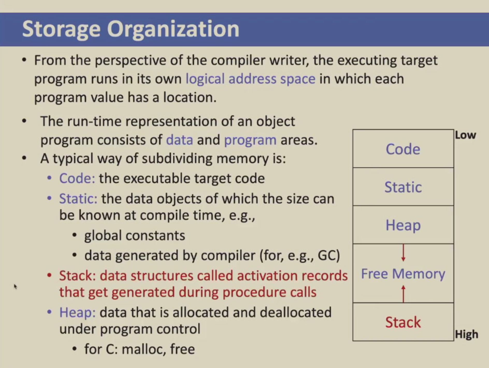
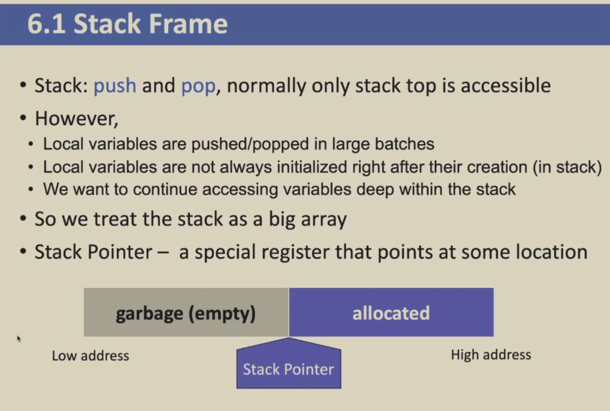
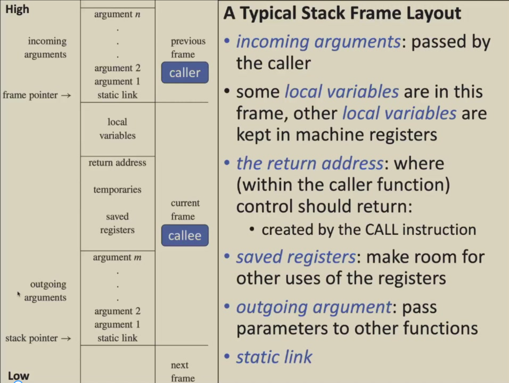
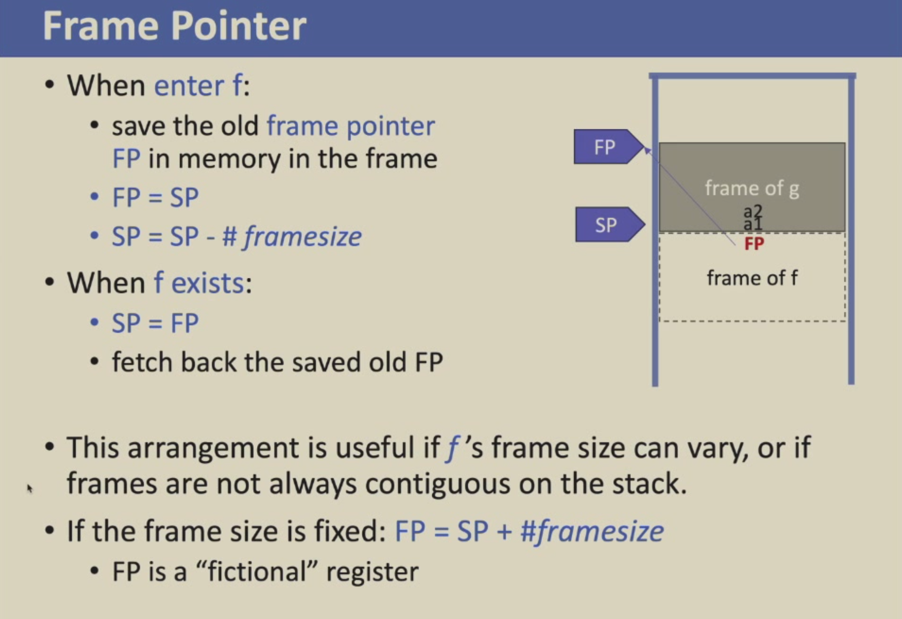
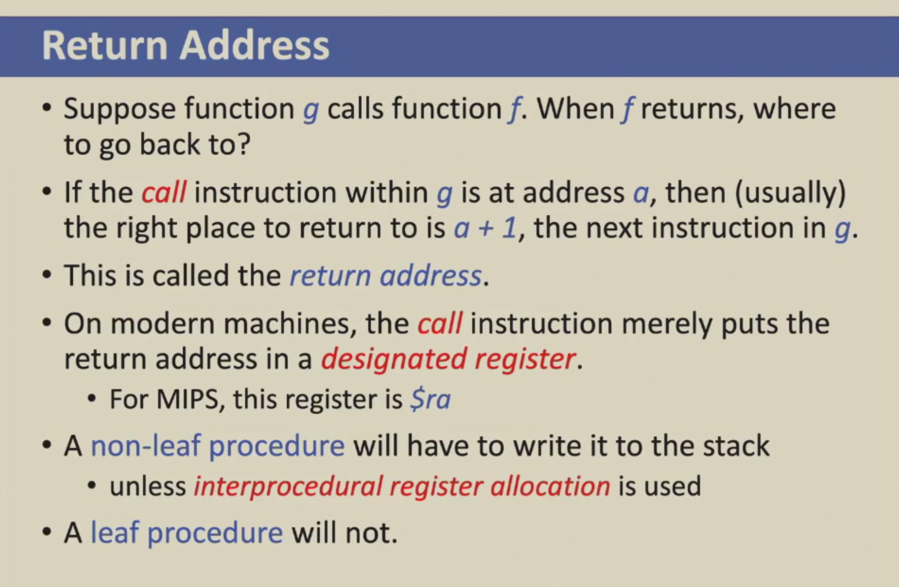
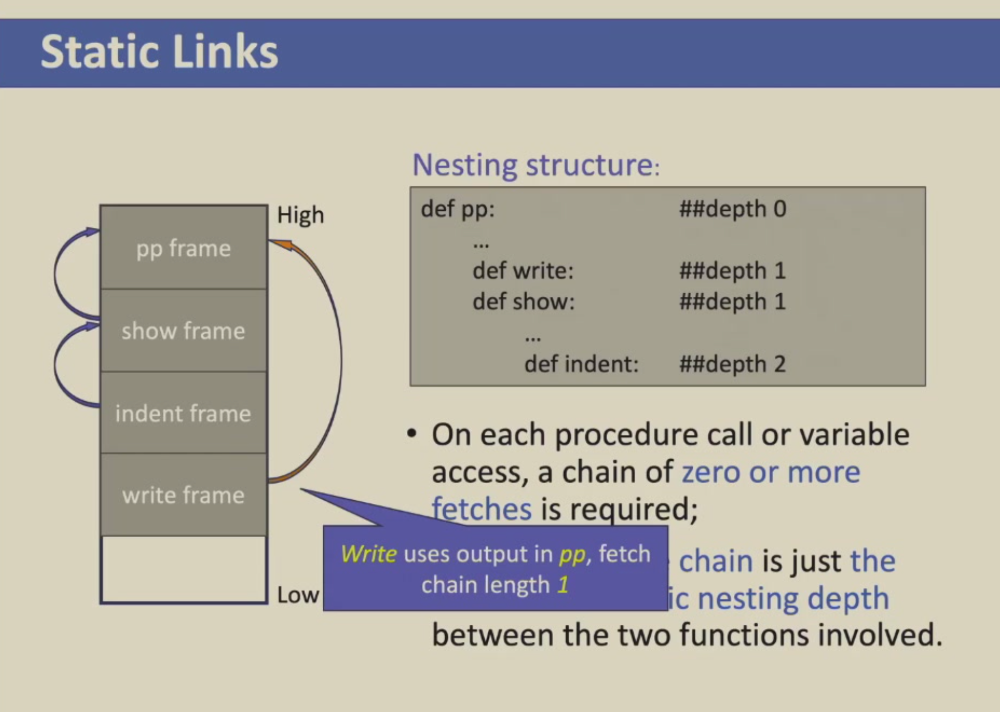

# Activation Records

!!! quote "参考笔记"

    本章可对照 HowJul 语雀笔记的 [第 6 章：活动记录](https://www.yuque.com/howjul/rt9ms6/kwds6wxm1acuygwh)，以及 Cubic Y³ 的 [Part 9: 活动记录](https://cubicy.icu/compiler-construction-principles/#Part-9-活动记录Activation-Record)。

!!! important

    

    本节课 Activation Records 主要关注的是 Stack 在函数调用时发生的变化

我们使用的 Stack Frame 结构大致如下，比较重要的是 **Stack Pointer** 这个指针：

## Overview

!!! important

    本章内容中最重要的内容，需要牢记并理解这张栈帧图（相当于把上面的栈示意图逆时针旋转了 90 度）

    

    static link 主要是用于在函数体内部声明其他函数时，例如：f call g, g 又是在 h 中声明的一个函数，可以掌握 h 的信息，所以 caller f 的 frame 中会有一个 static link 指向 h 的 frame pointer

接下来的内容会围绕这个 **Typical Stack Frame Layout** 中的每一部分是如何实现的

## Frame Pointer

- Suppose function `g(...)` calls function `f(a1, ..., an)`
    - `g`: caller
    - `f`: callee
- When `g` calls `f`:
    - The **stack pointer** points to the first argument that **g** passes to **f**
    - **f** allocates a frame of size `#framesize`

Frame Pointer 和 Stack Pointer 的变化过程如下，比较简单：

## Registers

Suppose:

- `f` is using register `r` to hold a local variable and calls procedure `g`.
- `g` also uses `r` for its own calculations
- `r` must be saved (stored into a stack frame) before `g` uses it and restored (fetched back from the frame) after `g` is finished using it.

至于将 r 保存在 f 的栈帧中还是保存在 g 的栈帧中，就需要看不同的架构实现，也就产生了 caller-saved register 和 callee-saved register 两种 register 的保存方式

## Parameter Passing

- It causes needless memory traffic and consumes more time if arguments are all passed only on the stack.

- Parameter-passing conventions for modern machines specify:
    - the **first k arguments** (for k = 4 or k = 6, typically) of a function are passed **in registers**, and the rest of the arguments are passed **in memory (stack)**
- E.g. `f(a1, ..., an)` receives parameters in `r1, ..., rn` and calls `h(z)`
    - `f` must pass `z` in `r1`
    - `f` saves the old content of `r1` in its stack frame before calling `h`
    - 可见总是通过 registers 传递也并不一定好（了解一下即可

## Return Address

也比较简单，没什么内容

## Frame-Resident Variables

这里想表达的是，虽然现代的 procedure-call conventions 会：

- pass *function parameters* in registers
- pass *the return address* in a register
- return *function result* in a register

大部分的局部变量和中间结果也会被分配到寄存器中

但是也会存在一些情况需要我们将这些 values 保存在 memory 中，例如 Escape Variables:

A variable **escapes** if:

- it is passed by reference
- its address is taken (using C's **&** operator),
- or it is accessed from a nested function (主要和 static Link 有关)

Escape Variables must be written to memory

## Static Links

> 这是本章内容的考试重点，如果要考栈帧布局，最容易考的部分就是 static links 的内容

!!! note

    **Block Structure**: In languages allowing **nested function declarations** (such as Pascal, ML and Tiger), the inner functions may use variables declared in outer functions.

我们通常使用 Static Link 的方式来解决 Block Structure 中嵌套的内层函数访问外部函数变量的问题

如下图，比较简单，主要需要知道的是 **static link 指向的是声明顺序中的上一层函数栈帧**

