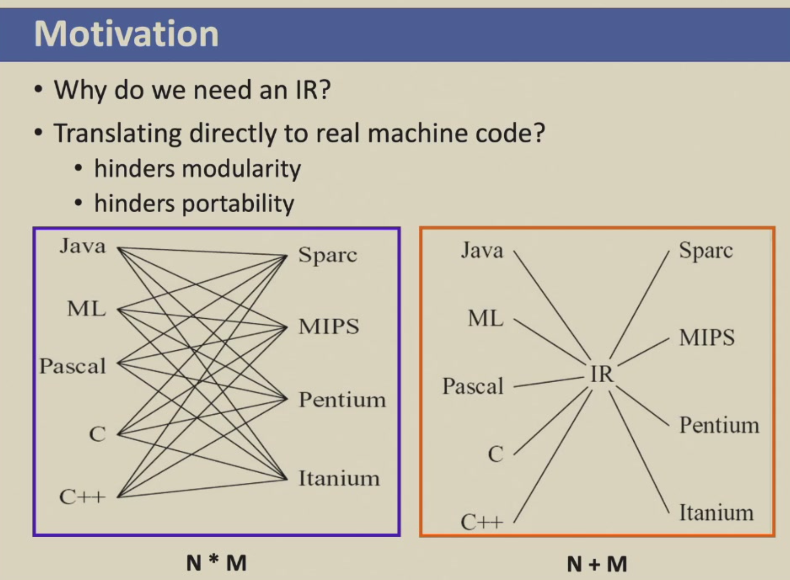
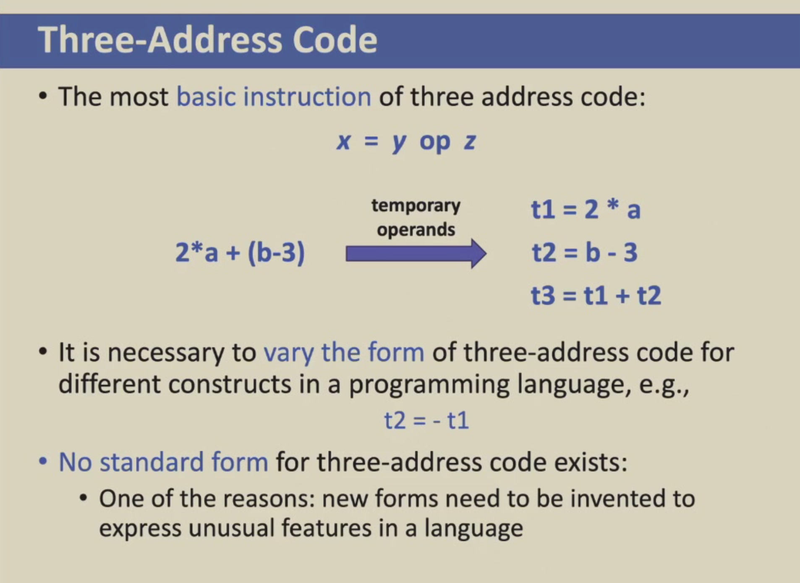
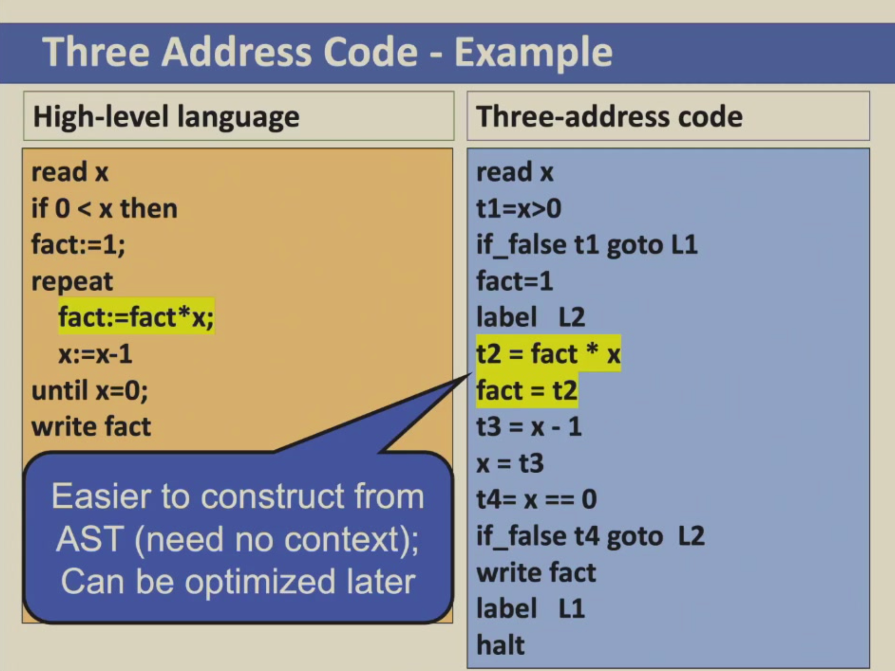
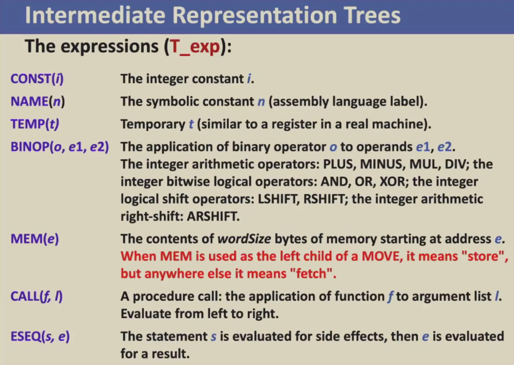
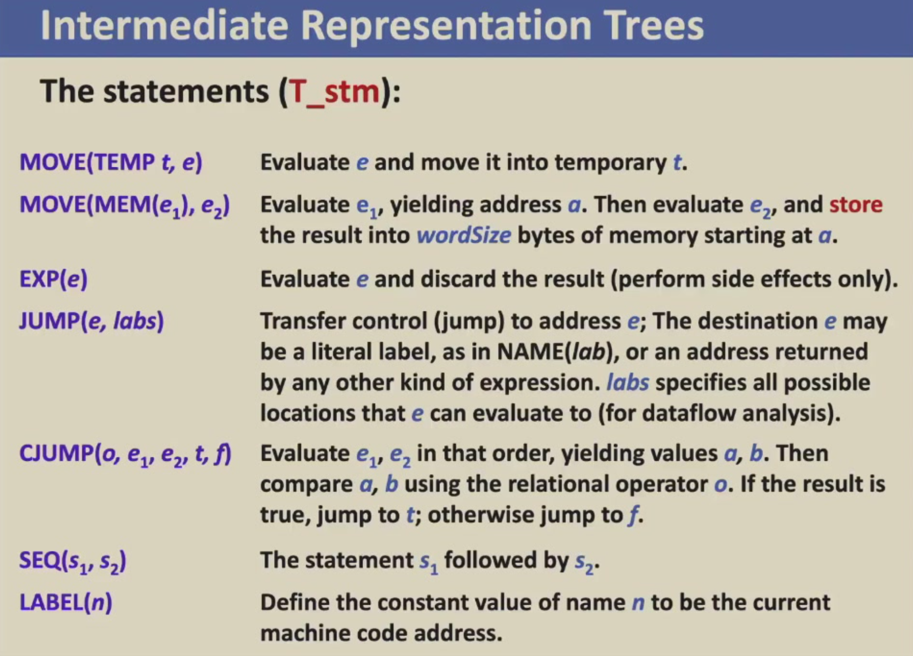
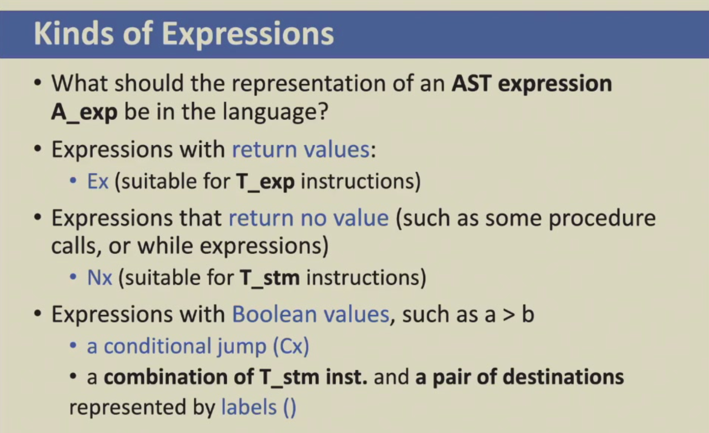
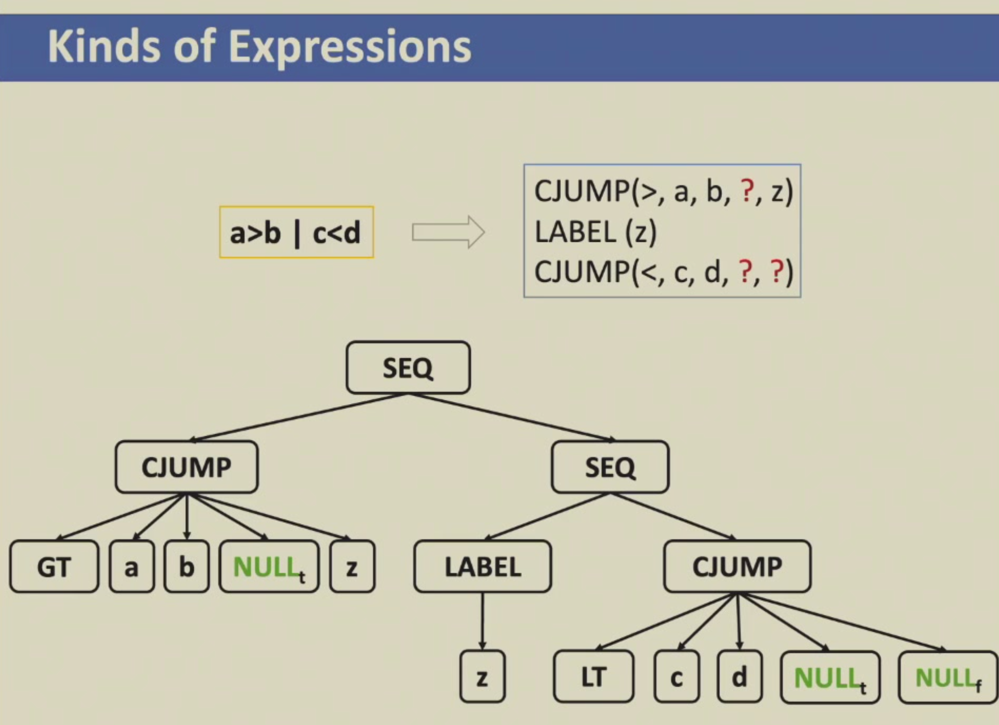
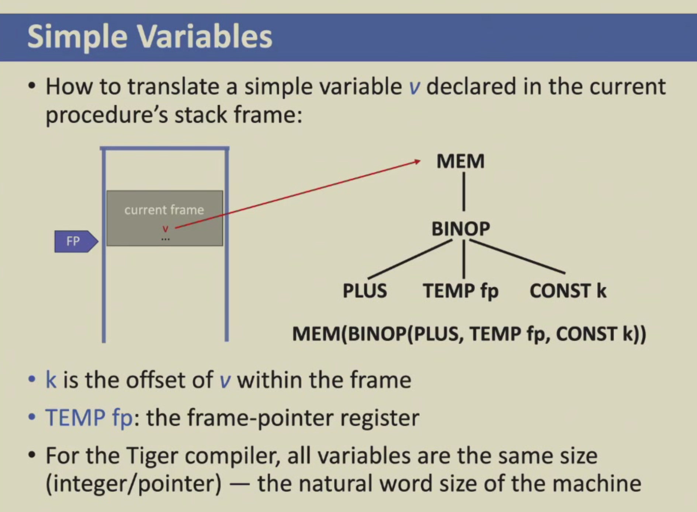
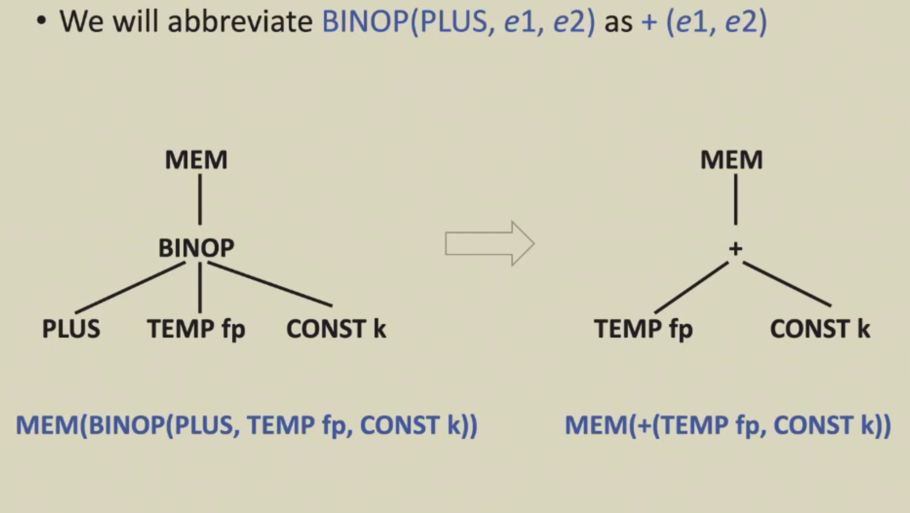

# Intermediate Code

!!! quote "参考笔记"

    本章可对照 HowJul 语雀笔记的 [第 7 章：翻译成中间代码](https://www.yuque.com/howjul/rt9ms6/nvkihvkys7eqgphq)、[中间表示树](https://www.yuque.com/howjul/rt9ms6/do355g943wkegmqr)，以及 Cubic Y³ 的 [Part 13: 中间表示(IR)](https://cubicy.icu/compiler-construction-principles/#Part-13-中间表示-IR)。

!!! note

    **What is Intermediate Representation?**

    An intermediate representation (IR) is a kind of **abstract machine language**:

    - it expresses the target-machine operations without committing to too many machine-specific details
    - It is independent of the details of the source language

    Many **different kinds of IR** are used in compilers:

    - Three-Address Code (TAC)
    - Static Single-Assignment (SSA)
    - Control Flow Graph (CFG)
    - Abstract Syntax Tree (AST) -- 在有些编译器中会把 AST 也理解为中间代码
    - **Expression Trees (IR Tree, used by Tiger Compiler)**

    

## Three-Address Code

三地址码 (Three-Address Code / TAC) 是一种比较常用的中间代码，每一条指令最多只能用三个操作数地址

!!! important

    三地址码将操作数都视为地址，所以 fact := fact \* x 会被修改成 t2 = fact \* x, fact = t2 的形式，这也是直接从 AST 中很好自然得出的转换

    

## Intermediate Representation Tree

!!! note

    好的 IR 需要满足以下条件

    - 比较方便从 AST (Semantic analysis phase) 构造
    - 比较方便翻译成 target machine language
    - 如果 AST 和 Targeted machine language 中有一些复杂的指令，IR 要能够做到将复杂指令切分成很多小模块，让 AST 的复杂指令 split 成 IR 的各个简单的模块指令，再从 IR 的各个简单模块指令 combined up 回 Assem 的复杂指令

IR Tree 的 Expressions 相关指令如下：

- IR tree 与 Tiger 及其他源语言是独立的
- 每一条 expression 都有 return value

IR Tree 的 Statements 相关指令如下：

- Statements perform side effects and control flow
- Statement 不会产生 return value，这也是和 Expression 的区别

## Translation into Trees

接下来我们具体来介绍如何把 Abstract Syntax Tree 转换为 Intermediate Representation Trees

### Expression

对于表达式的转换，我们需要针对不同的 AST expression 来做转换

AST 里的表达式 `A_exp` 在翻译成中间代码时，要根据用途分成三类：
 `Ex` 表示会产生值的表达式；
 `Nx` 表示只执行动作、不产生值的表达式；
 `Cx` 表示布尔条件，用条件跳转和真假 label 来表示

可以记成：

| 类型 | 适合表示             | 例子                | 中间代码形式                |
| ---- | -------------------- | ------------------- | --------------------------- |
| `Ex` | 有返回值             | `a + b`             | `T_exp`                     |
| `Nx` | 无返回值，只执行动作 | `while`, `print(x)` | `T_stm`                     |
| `Cx` | 布尔条件             | `a > b`             | `CJUMP + true/false labels` |

!!! note

    例如我们可以这样将 `a > b | c < d` 这样一个 Cx 转换为如下的 IR Tree：(其中 Nullt, Nullf 对应 true 和 false 具体的跳转地址，需要编译器读完后续相关代码后才能得知并填充)

    

### Simple Variables

存储在栈帧中的局部变量可以通过 MEM 指令在 FP + 偏移量的地址中取出，如下图所示：（如果存储在寄存器中，可以直接通过 TEMP 指令取出）

!!! note

     当然为了表示方便，我们可以把

    MEM(BINOP(PLUS, TEMP fp, CONST k))) 写成 MEM(+(TEMP fp, CONST k))

    

ppt 还介绍了各种 Tiger 元素翻译成 IR Tree 的方法，感觉和 lab3 的内容差不多，这里略过不表
