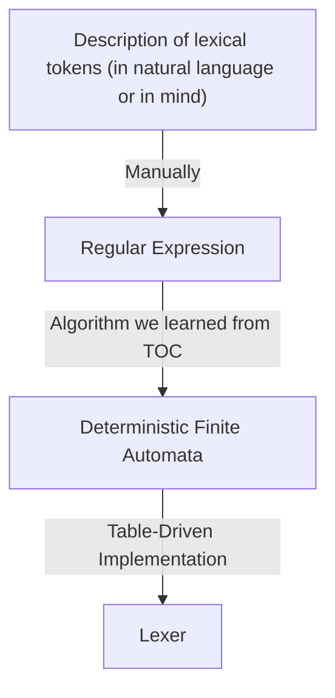
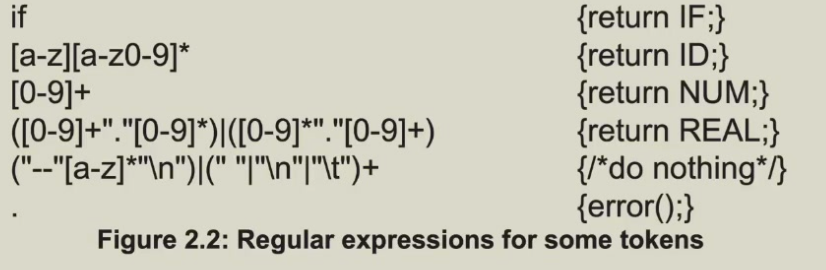
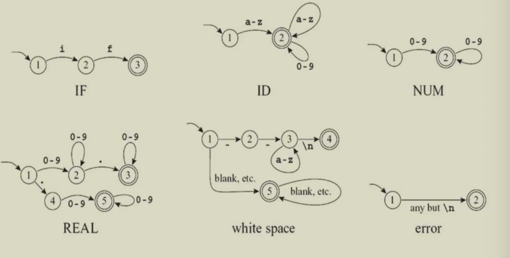
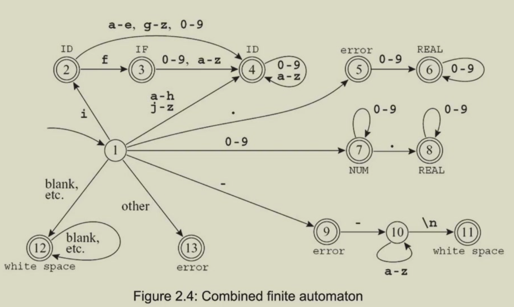
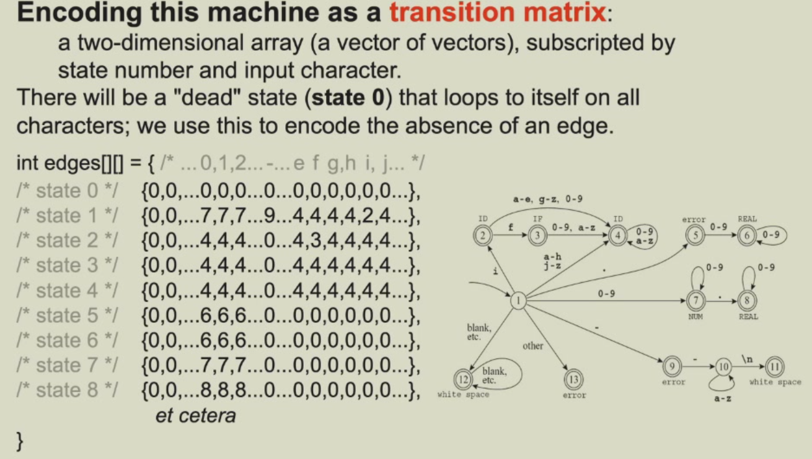
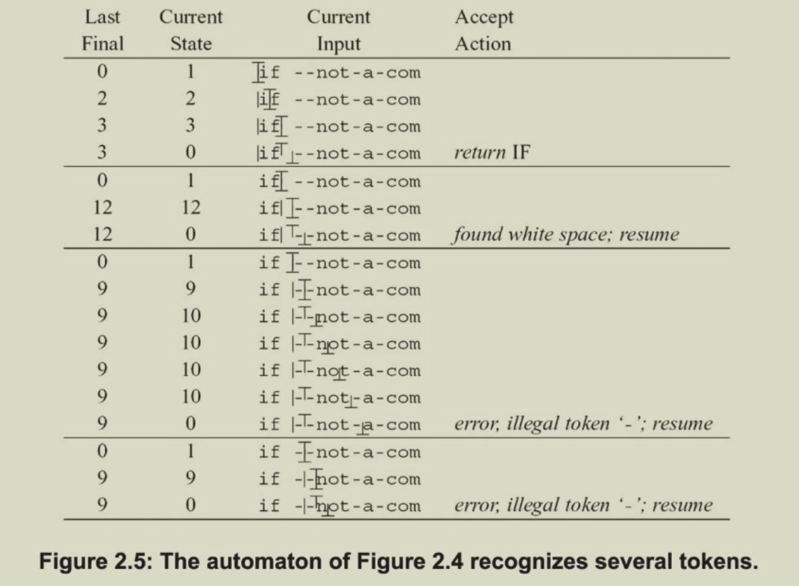
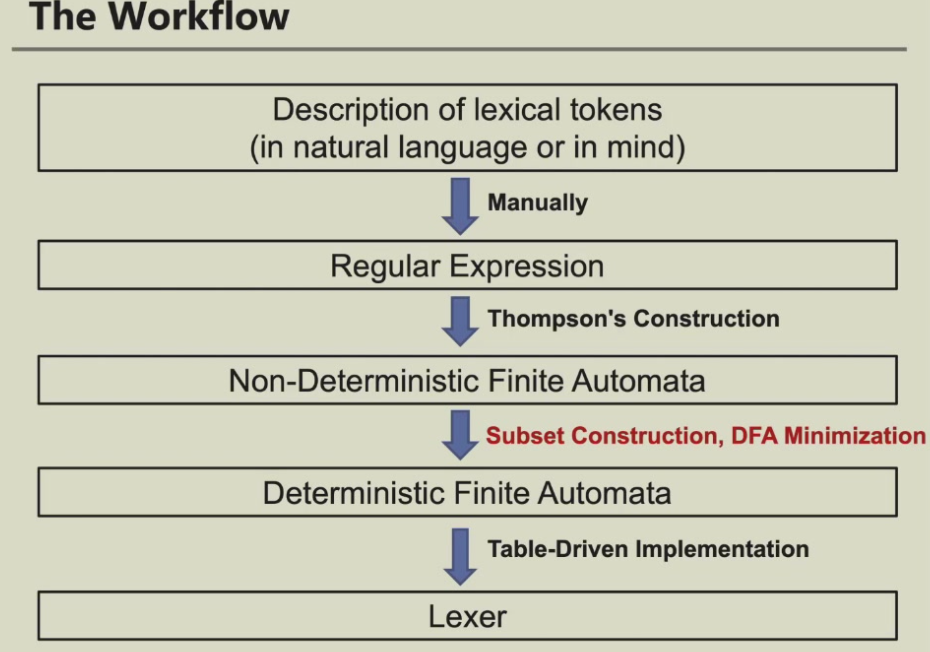
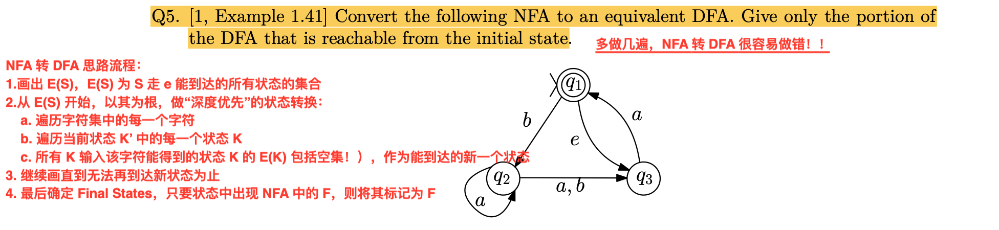
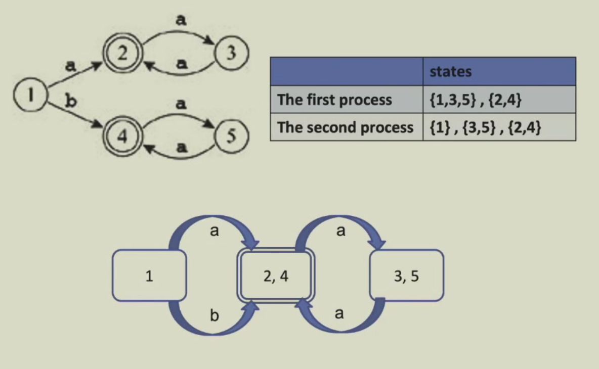

# Lexical Analysis

!!! quote "参考笔记"

    本章可对照 HowJul 语雀笔记的 [第 2 章：词法分析](https://www.yuque.com/howjul/rt9ms6/crhd9nv0svagnft7)，以及 Cubic Y³ 的 [Part 2: 词法分析](https://cubicy.icu/compiler-construction-principles/#Part-2-词法分析)。

## Overview

**词法分析**：将程序字符流分解为 Token 序列

!!! important

    ==x== : = ==a== * 2  + b ==*== (x * 3)

    ==id\<x\>== assign ==id\<a\>== times int\<2\> plus id\<b\> ==times== lparen id\<x\> times int\<3> rparen

- 删除字符串中不必要的部分（如空格、换行）
- 通常使用**正则表达式**匹配

## Workflow

Lexer 即是我们这阶段需要的词法分析器，喂给它一段程序字符流，它吐出 Token 序列

## Language

大部分内容都在计算理论中学习过了（

- A **language** is a set of strings (maybe infinite set)

- A **string** is a finite sequence of symbols

- A **symbol** is taken from a finite alphabet

!!! important

     **Not assign any meaning** to the strings; **Only** classify each string as **in the language or not**.

Some **abbreviations** for Regular Expression:

- [abcd] means (a | b | c | d)
- [b-g] means [bcdefg]
- [b-gM-Qkr] means [bcdefgMNOPQkr]
- $M?$ Means ($M \; | \; \epsilon$), and $M^+$ means($ M \cdot M^*$)

在 Lexer 中主要用到的几个 Regular Expression，以 Tiger 语言为例：

!!! important

    倒数第二行用来描述注释、空格等情况，如果前面几行都不满足，匹配到最后一行描述返回 error，说明出现了不在 lexer 预料之内的 token，lexer 会报错

但是我们可以发现上述的规则是存在歧义的，例如以下情况："if8" 可以被解释为 ID(if8)，也可以被解释为 IF + NUM(8)；

因此在常见的词法分析器中（如 Lex）， 处理同时满足两条规则的歧义情况时通常遵循两条原则：

- **Longest Match**:
    - 尽可能匹配最长的字符串作为 token
    - 例如：输入 "if8"，可以匹配 "i", "if","if8"，取最长的  "if8" 作为一个完整的 token
- **Rule Priority**
    - 当最长匹配确定后，如果多条正则表达式都能匹配这个字符串，就按规则定义的顺序，写在前面的规则优先
    - 例如：if 这个字符串，既能匹配 IF，也能匹配 ID，因为 IF 规则写在前，因此被识别为 IF 关键字

所以回到刚才的 "if8" 的歧义问题，结合两条规则，最终应该匹配为 ID(if8) 这个 token

!!! note

    Lex 是一个经典的词法分析器生成工具，1975年出现，Unix 时代的产物

    - 你写正则表达式规则 → Lex 自动生成 C 代码的 Lexer
    - 现代常用的继承者是 Flex（Fast Lex）
    - 只负责词法分析，通常和语法分析工具 Yacc/Bison 配合使用

## Finite Automata

我们可以将先前描述的词法规则的正则表达式转为有限自动机，分别为：

按照 Longest Match 和 Rule Priority 的原则，可以将这些自动机做合并

我们说 DFA 是很好被计算机表示和实现的，可以通过 table-driven-implementation 将描述词法规则的 DFA 转成 lexer

比如我们可以将这个 automaton 编码为 **transition matrix**

为了能够让 lexer 识别 Longest Match，我们还需要在它对给定程序字符流进行词法分析/查表的时候追踪 **Last-Final** (the state number of the most recent final state) 和 **Input-Position-at-Last-Final** 这两个变量，在每次达到 **dead-state** (即识别完一个 token 后)，更新这两个变量

例如下方的过程：

- $|$: input position（相当于每次识别 token 时扫描头的起始位置）
- $\bot$: automaton position（扫描头的位置）
- $\top$: last final（扫描到最近一个合法 token 的位置）

## NFA

最后我们要解决 Workflow 中 Regular Expression 到 DFA 的转换，需要用 NFA 来帮助实现

即 Regular Expression --> NFA --> DFA

中间用到的转换方法例如 Thompson's Construction 非常简单，在计算理论中基本有所涉及，其他两种方法也简单回顾一下：

!!! important

    **Subset Construction**:

    

    **DFA Minimization**:

    我们将从该状态出发能接受完全相同字符串的状态称为**等价状态**，算法的过程为：

    1. 先假设所有的 Final-States 为一个等价状态集合，所有的非 Final-States 为另一个等价状态集合
    2. 在所有状态集合中不停做 Split 操作，将非等价状态划分出去，直到每个状态集合都不能再被 Split

    一个例子如下：

    
