# Parsing

!!! quote "参考笔记"

    本章可对照 HowJul 语雀笔记的 [第 3 章：语法分析](https://www.yuque.com/howjul/rt9ms6/ml7fzh3lawlpt179)、[语法分析自顶向下](https://www.yuque.com/howjul/rt9ms6/mx1a2cmbg9ox7eti)、[语法分析自底向上](https://www.yuque.com/howjul/rt9ms6/pcgytxpizklbqgbo)，以及 Cubic Y³ 的 [Part 3-6: 语法分析](https://cubicy.icu/compiler-construction-principles/#Part-3-语法分析-CFG-Parsing)。

## Overview

- **Syntax**: the way in which words are put together to form phrases, clauses, or sentences.

- **Syntax analysis**: parsing the phrase structure of the program

The parser is constructed based on the grammar, and extracts abstract syntax from a stream of tokens


非常重要!!：**语法分析**要干==两件事==：

1. 能够根据给定的语法规则正确判断给定的词法分析器给出的 token 序列是否合法
2. 能根据 token stream 构造出一个 parse tree


!!! tip


    ```C
    int foo(int x) {
      int y;
      if ((x > 0)
          y = 1;
      else
          y = 0
      return y;
    }
    ```

    Above code segment has no lexical errors, but multiple syntax errors.


## Outline

这一章内容围绕着 How to build a parser ? 这个问题来展开，将要按照以下流程来做出一个语法分析器

- Specifying the syntax of a programming language with **Context-Free Grammar** (CFG)
- Build the parser based on the **CFG**:
    - **Top-Down Parsing**
    - **Predictive Parsing** (LL(k) Parsing)
    - **Bottom-Up Parsing**
- More about parsing:
    - Automatic Parser Generation
    - Error Recovery


## Context-Free Grammar

CFG 在计算理论中也已经学习过了，简单回顾一下：

**A CFG consists of:**

- A set of terminals $T$: symbols from the alphabet <span style="color: green">(lexical tokens)</span>
- A set of non-terminals $N$
- A start symbol $S \in N$
- A set of productions (rules)
    - X -> Y1 Y2 ... Yk <span style="color: green">(replace X with Y1 Y2 ... Yk)</span>

A string is in L(G) iff is possible to derive that string from the start symbol S.


一个简单代码的语法可以用如下的 CFG 来表示：

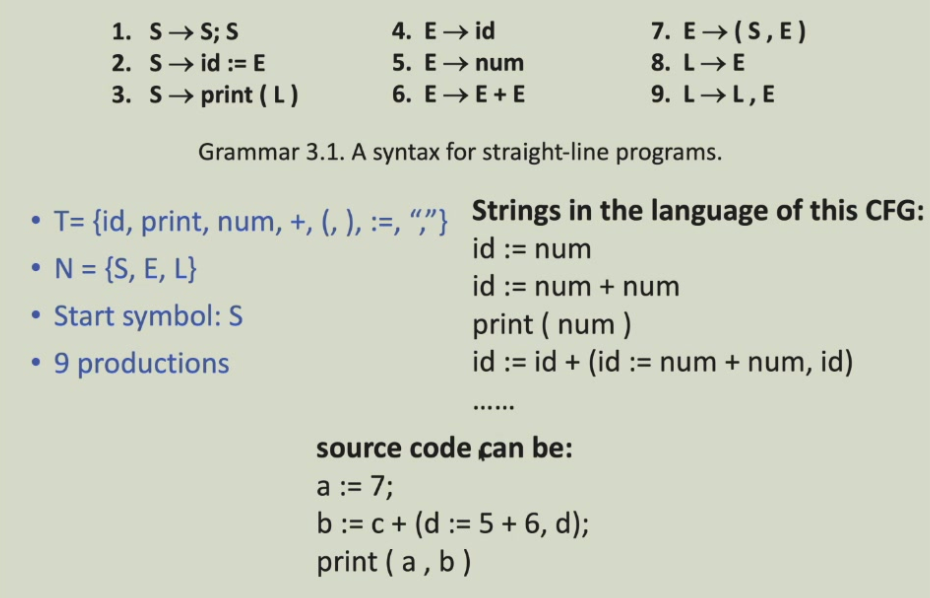


此外，我们还可以发现完整的推导 (derivation) 过程可以被描述成一颗树：

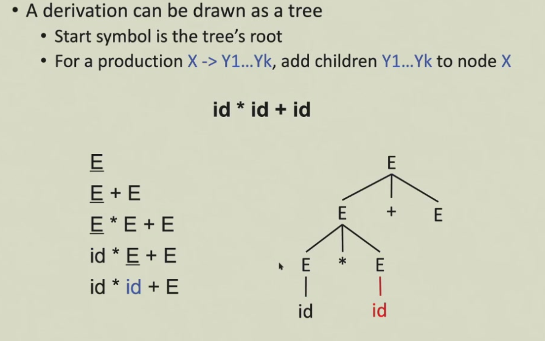

!!! note


    <u>E</u> 表示的是下一步 derivation 将从这个 Non-Terminals 开始


The above example is a **left-most derivation**

- at each step, replace the left-most non-terminal
- There is also an equivalent notion of a **right-most derivation** (也就是总是从最右边的非终结符往下推导)


!!! important


    - A parse tree has
        - Terminals at the leaves
        - Non-terminals at the interior nodes
    - An in-order traversal of the leaves is the original input
    - The parse tree shows the association of operations, the input string does not (树状结构隐含了更多信息，比如 \* 比 \+ 更深，这蕴含了运算优先级的信息；而单纯的字符串则不能看出运算优先级，包含歧义）


可以发现，CFG 可能会存在 Ambiguity（二义性）的问题，比如先前那个 CFG 在处理 id * id + id 就会出现两种不同的树

为此可以采用重写 CFG 的方式，例如下图：

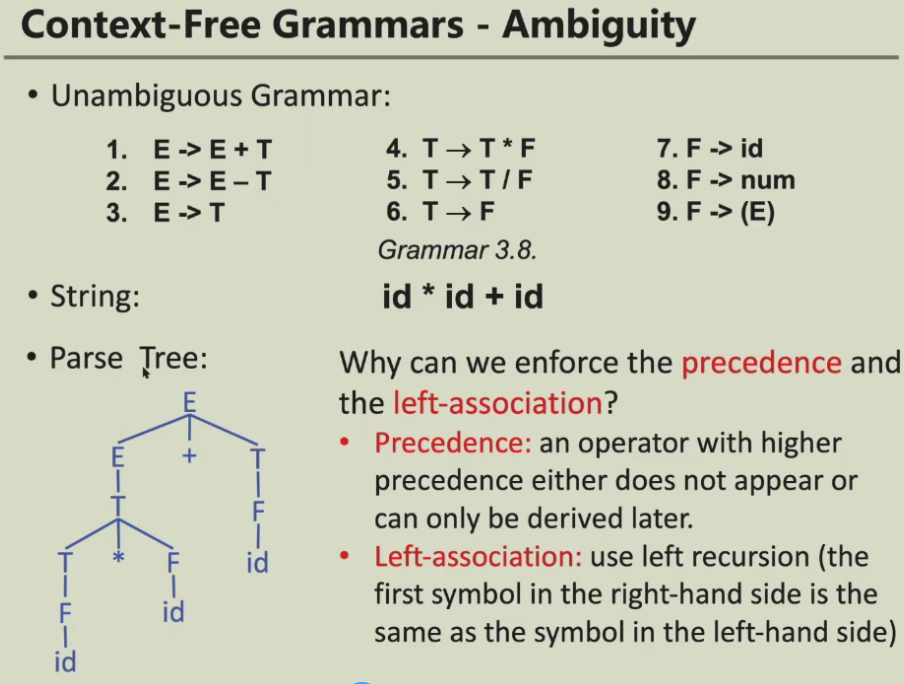

这套文法里：

- `E`：大表达式，处理加减
- `T`：中表达式，处理乘除
- `F`：最小单位，处理原子对象
- `F → (E)`：允许“一个完整表达式”被括号包起来，降级成一个最小单位

更高优先级的运算总是在更后面推导；递归推导总是将原非终结符放在最左边


!!! important


    There are some languages that have ambiguous grammars but no unambiguous grammar, **such languages may be problematic as programming languages**

    比如日常使用的口头语言，就是有二义性的，我们无法用一个没有二义性的grammar 来表示它们


最后，我们的文法规则还应该告诉语法分析器输入在什么时候终止，为此需要引入一个特殊的 `$` 标记

当我们规定 `S -> E $` 后，意思是一个合法输入必须是一个完整的表达式 + 输入结束符

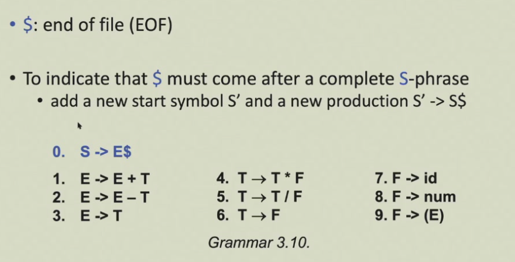


## Top-Down Parsing

给定 CFG 后，我们开始基于 CFG 构造语法分析器，存在两种构造方法：

- Top-Down Parsing
    - Predictive Parsing (LL(k) Parsing)
- Bottom-Up Parsing

我们先介绍前者 Top-Down Parsing

---

首先，programming language 属于 CFG 的一个子类，我们不需要编写一个能够解析所有 CFG 文法的 parser，只需要做一个支持特定文法的编译器即可：

- Parsing all CFGS in one compiler is **expensive**

    - algorithms for parsing all CFGs are expensive

    - sometimes 1/3 of compilation time is spent in parsing

- Compiler writers have developed **specialized algorithms** for parsing the kinds of CFGs that you need to build effective programming languages


!!! note


    ```shell
    Top-down parsing
    └── Recursive Descent Parsing
        ├── Backtracking（有回溯） ❌ 慢
        └── Predictive Parsing（无回溯） ✅ 常用（LL(1)）
    ```

我们通常采用 Recursive Descent Parsing (top-down parsing, predictive parsing) 的 parsing 范式：

- simple, can be coded by hand
- parses many, but **not all CFGs**
    - parse **LL(1)** grammars: **L**eft-to-right parse, **L**eftmost-derivation; **1** symbol lookahead


!!! important

    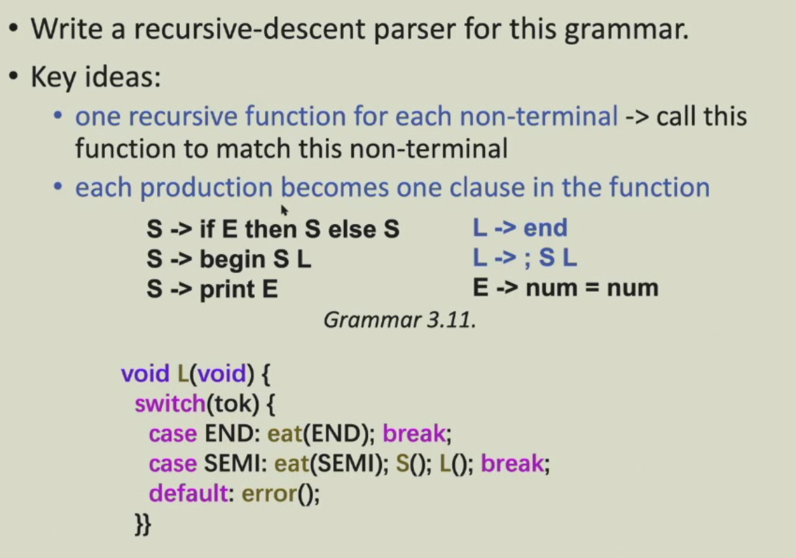

    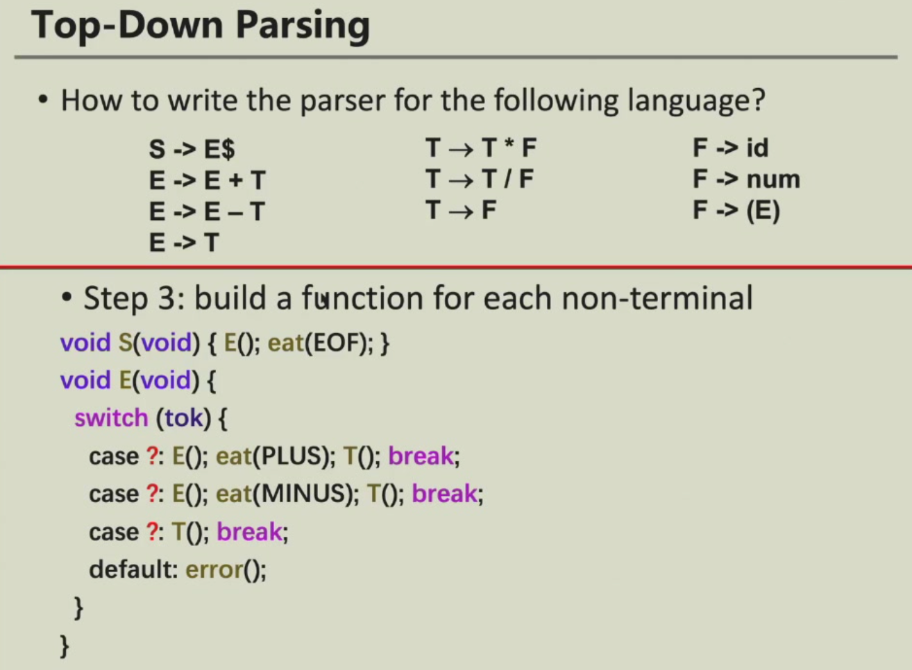

    从上方的两个例子可以看出

    - 当文法所有推导式的右侧都以终结符开头，可以非常简单的实现 top-down 的 parser：只需要对每一个 non-terminal 编写一个递归函数即可
    - 反之，当文法稍微复杂起来，就没办法写 E 的语法分析函数了，就需要做预测分析了


### Predictive Parsing

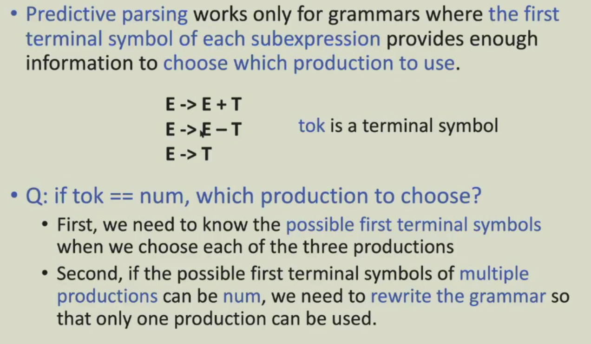

首先引入两个 Predictive Parsing 中重要的工具：

- FIRST($\gamma$): $\gamma$ 能推出的字符串中，可能出现的**第一个终结符**的集合
    - 例子：T -> F; F-> id | (E)
    - 则 FIRST(F) = { id, ( }; FIRST(T) = { id, ( }

- FOLLOW(X): 在从 S 开始的某些推导中，X 后面可能紧跟的终结符集合

简而言之

- FIRST 看的是“我自己展开后，开头会是什么？”
- FOLLOW 看的是“我在别的产生式出现时，右边可能跟的是谁？”

!!! important


    Consider non-terminal $X$, production $X \rightarrow \gamma$, possible first terminal symbol $t$ can be:

    - any token in FIRST($\gamma$)
    - any token in FOLLOW($X$) if $\gamma \rightarrow^*\epsilon$

    换句话来说：如果 token == num，我们应该选择哪条 production 呢？

    答案是：可以选择 $X \rightarrow \gamma$ 这条产生式，当

    - 情况 1：$\text{token} \in \text{FIRST}(\gamma)$ （注意：情况 1 的本质是 $\gamma$ 可以正常第一个地产生当前 token）
    - 情况 2：$\gamma \rightarrow^* \epsilon$ 且 $\text{token} \in \text{FOLLOW}(X)$ （注意：情况 2 的本质是如果 $\gamma$ 可以为空，就看当前 token 是否属于 X 后面可以出现的东西）


**First** 和 **Follow** 的计算方式如下：

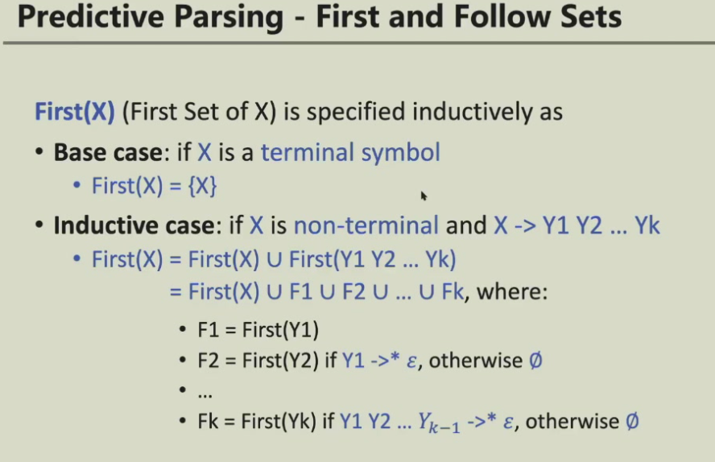

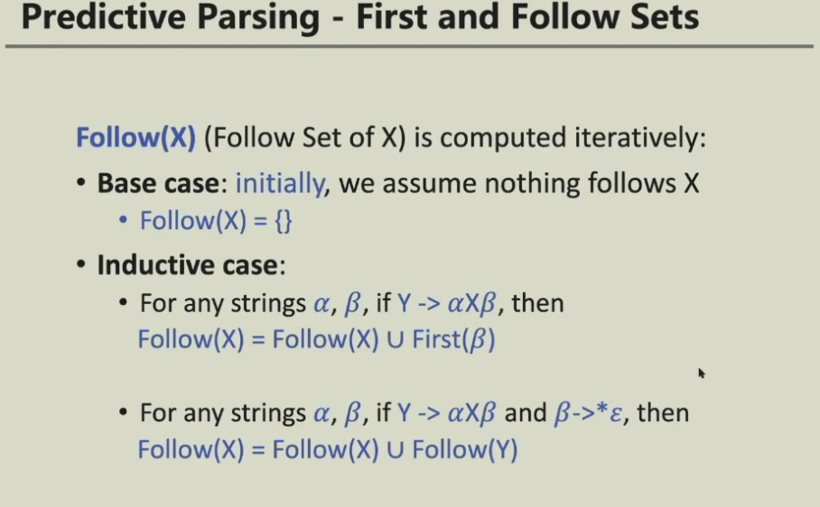

可以发现，某一个非终结符能不能推出空串，对于我们计算 Follow 和 First 非常重要。

因此我们定义一个 **Nullable** 函数：

- Nullable(X) = True if $X \rightarrow^*\epsilon$

- Algorithm:

  ```plaintext
  for each symbol X:
  repeat:
	Nullable(X) = False
  	for each production X -> Y1 Y2 ... Yk:
		if Nullable(Yi) = True for all 1<= i <=k;
  			Nullable(X) = True
  until Nullable did not change in this iteration
  ```


上面这一坨 First/Follow/Nullable 计算的东西没太看懂也不重要，==最重要的是学懂下面给出的这个例子==，非常适合拿来做考试题

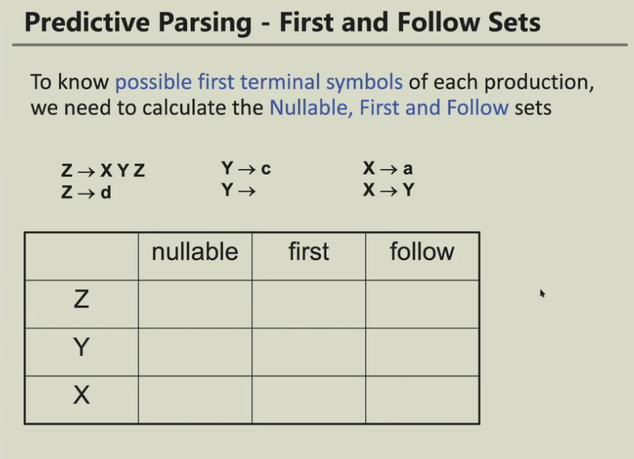

> 这里完整过程可以直接看 [2025 年的智云回放](https://interactivemeta.cmc.zju.edu.cn/#/replay?course_id=70399&sub_id=1518407&tenant_code=112)


答案如下：

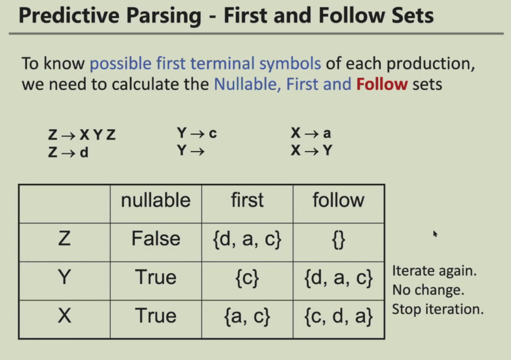

有了所有非终结符的这一张 Nullable/First/Follow Table 后，我们就可以构造语法分析所需要的一张 **Parsing Table**（语法分析表），而 Parsing Table 便能帮助计算机自动的解析一串 token 字符串，判断其是否符合语法规则，是如何通过语法生成式（CFG）生成的


!!! tip


    回顾一下，词法分析是依据词法规则（借助 DFA）给我们一堆 token 串，而语法分析是将这些 token 串根据语法规则（借助 CFG）判断 token 串是否符合语法规则并给出一个 parsing tree


接下来继续以上述的 Grammar 为例来构造 Parsing Table，下图中的 Row (Non-terminal) - Column (terminal) 中填入的是语法生成式，描述的是在语法解析过程中，当遇到某个 terminal 时，可能会用哪一条语法生成式生成它：

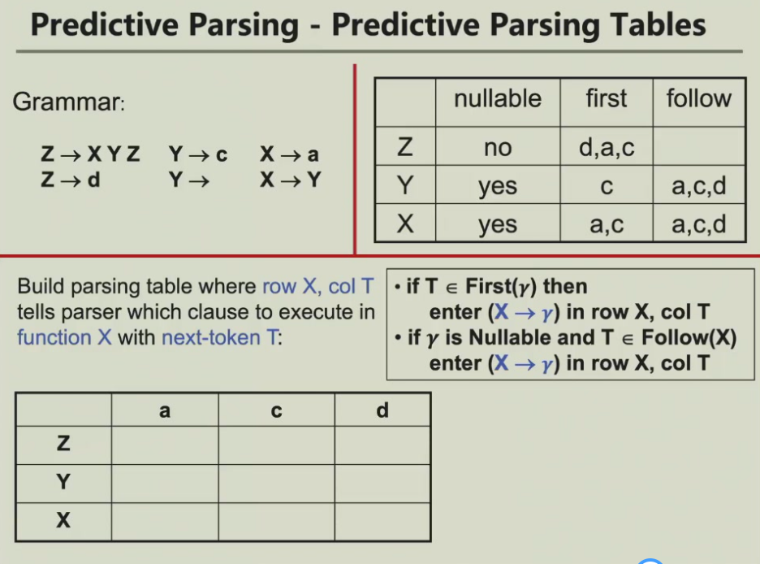

同样可以去看  [2025 年智云](https://interactivemeta.cmc.zju.edu.cn/#/replay?course_id=70399&sub_id=1518407&tenant_code=112) 来理解 Build Parsing Table 的过程，最后结果如下：

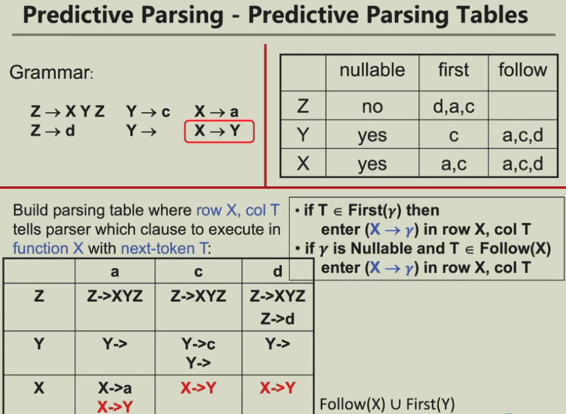

!!! important


    对于最后的 Parsing Table，我们可以思考两个问题：

    1. 如果有一个格子为空，**没有一条产生式**：意味着如果在此时遇到该 terminal 会产生语法错误
    2. 如果有一个格子存在**两条产生式**：意味着存在存在多重定义的项，对语法分析不太友好

这也就引入了接下来的 LL(1) grammar


#### LL(1) grammar

- **LL(1) grammar**: the so-obtained predictive parsing table contains no duplicate entries

    - Left-to-right parse, Left-most derivation, 1 symbol lookahead

- if not, the grammar is not LL(1)

- In LL(k) parsing tables, columns include every k-length sequence of terminals:

    | aa   | ab   | ba   | bb   | ac   | ca   | ...  |
    | ---- | ---- | ---- | ---- | ---- | ---- | ---- |
    |      |      |      |      |      |      |      |


!!! tip


     LL(k) 意思是往前看 k 个 token，就知道选哪条产生式了，因此有结论：

    ==Every LL(k) grammar is an LL(k+n) grammar, for any n>=0==（也就是 LL(1) 是 LL(2)、LL(3) 等 LL(k) 等的子集）

    所以很适合出考题：

    丢一个 grammar，问是否是 LL(3) 文法，但很有可能该文法只是一个 LL(1) 文法，构造一个 LL(1) parsing table 即可，老实构造 LL(3) table 的话可能要构造好久


有了文法分析表，很显然，我们就可以通过先前的 switch-case 的方法来递归地实现 parse，此外我们也可以通过非递归的方式借助一个 **parsing-stack** 来实现（其实就和 CFG 用栈来匹配 string 的过程是一样的）


#### Eliminate Left-Recursion

如果 grammar 存在形如这样的形式，那么在 LL(1) parsing table 中必然会引入多重定义的项

- E -> E + T
- E -> T

解决方法比较 tricky，可以在不改变 grammar 接受的 language 的情况下改变 parsing table，需要记忆一下这个 pattern 如下：

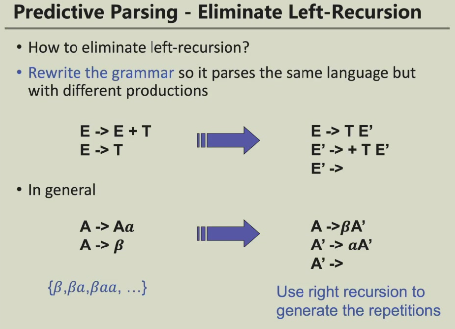

#### Left Factoring

如果有两条文法共用一个“左部”，例如

- S -> if E then S else S
- S -> if E then S

我们会发现肯定会引入多重定义的项，比如遇到 if 不知道选择哪一条 production

此时可以将 grammar 改写为：

- S -> if E then S X
- X -> else S
- X ->

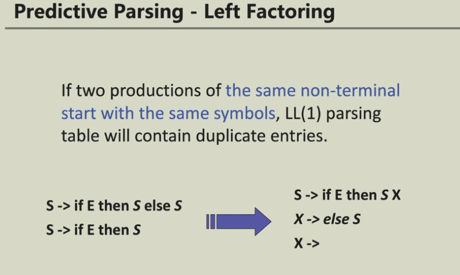

#### Error Recovery

在实际的语法分析器中，需要处理语法错误；且我们发现当存在多个语法错误时，实际编程中的这些编译器都会把所有错误都报出来，而不是一遇到语法错误就 break

大致存在两种常用方式

- inserting：文法分析器插入一个合适的 token，假设匹配对了；但假想的 token 串可能会无法 terminate，不常用
- deleting：跳过一些 tokens 直到遇到 FOLLOW set 中的 token，更安全


## Bottom-Up Parsing

- LL(k) parsing is efficient and ez to write by hand
- But such math-derived parsing is not powerful enough for certain grammar

因此我们需要 **LR(k) parsing**，这也是现代编译器更常用的 parsing 方法

- LR(k) parsing: The most prevalent type
    - Shift-Reduce Parsing
    - More powerful than LL(k) parsing: able to postpone the decision (rather than only predict using top-k tokens) until it has seen input tokens corresponding to the **entire right-hand side** of the production in question
    - LR(k): **L**eft-to-right parse; **R**ightmost derivation; **k**-token lookahead
- Variant: LALR (Look-Ahead LR) parsing:
    - basis for parsers of most modern programming languages (implemented in tools such as Yacc)

大致思想如下：

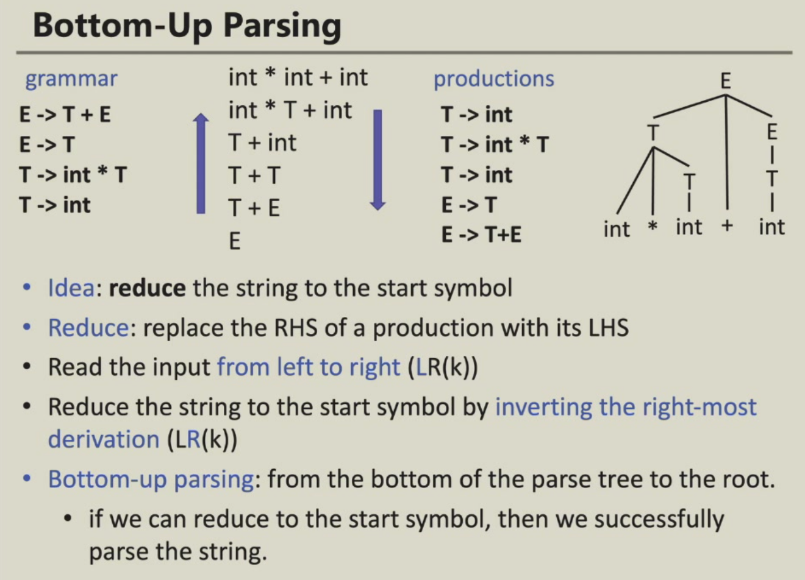

可以发现 LR Parser 如何确定什么时候做 shift，什么时候做 reduce 是很重要的（例如 int \* int + int 选择 reduce 第二个 int 为 T）

### LR(0) Parsing

LR(0) grammars are those can be parsed looking only at the stack, making shift/reduce decisions without any lookahead

对于 LR(0) 而言，如何做 shift/reduce 的决定呢？

==借助 DFA 来构造 Parsing Table==（summarize the "parsing state" and enumerate all valid parsing states and the transitions between them based on the grammar）


首先构造一个 NFA：

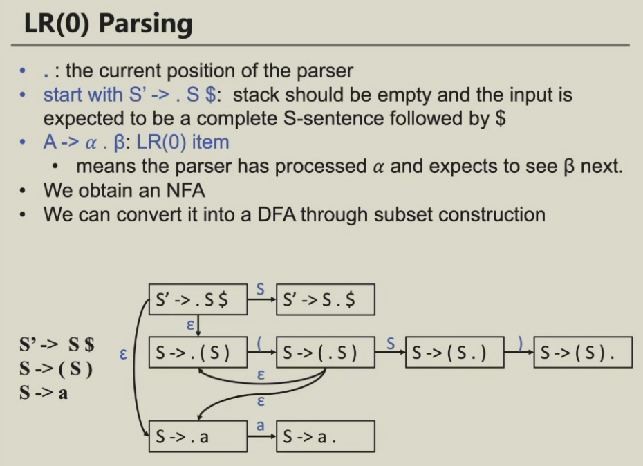

然后转换为 DFA：

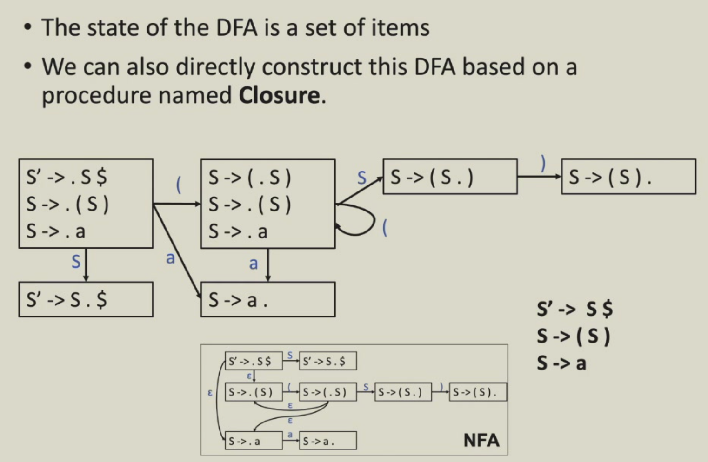

上述过程的形式化算法归纳如下（事实上可以直接按照这个算法去构造 DFA）：

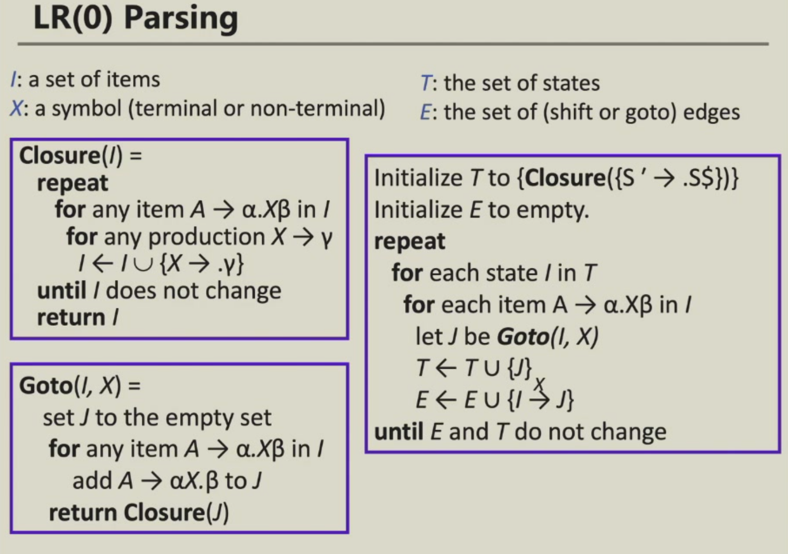

然后就可以构造 LR(0) Parsing table 如下（好难😭

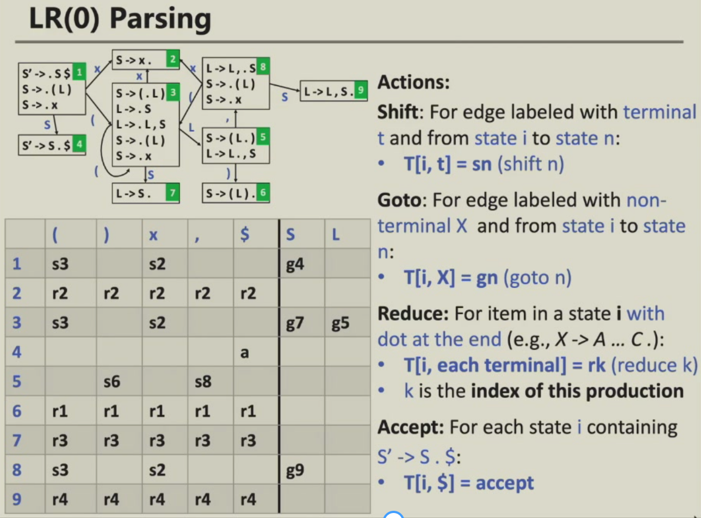

计算机只需要模拟一个栈，通过栈和这个 LR(0) table 来进行语法分析：

- 如果查到 `shift n`

    - 把当前输入符号压栈
    - 把状态 n 压栈
    - 输入指针前进一步

- 如果查到 `reduce A -> β`

    - 按 `β` 的长度弹栈

    - 看新的栈顶状态 `s`

    - 查 `GOTO[s, A]`

    - 把 `A` 和新状态压栈

    - **输入指针不动**

- 如果查到 `accept`

    - 分析成功

- 如果查到空格 / error

    - 语法错误


当然，LR(0) 解析文法的能力还不够强，有些时候填完的文法分析表里会有多重定义的项，比如在某一个状态遇到某一个 token 时，既可以选择 shift 也可以选择 reduce -- 也称为 **shift-reduce conflict**

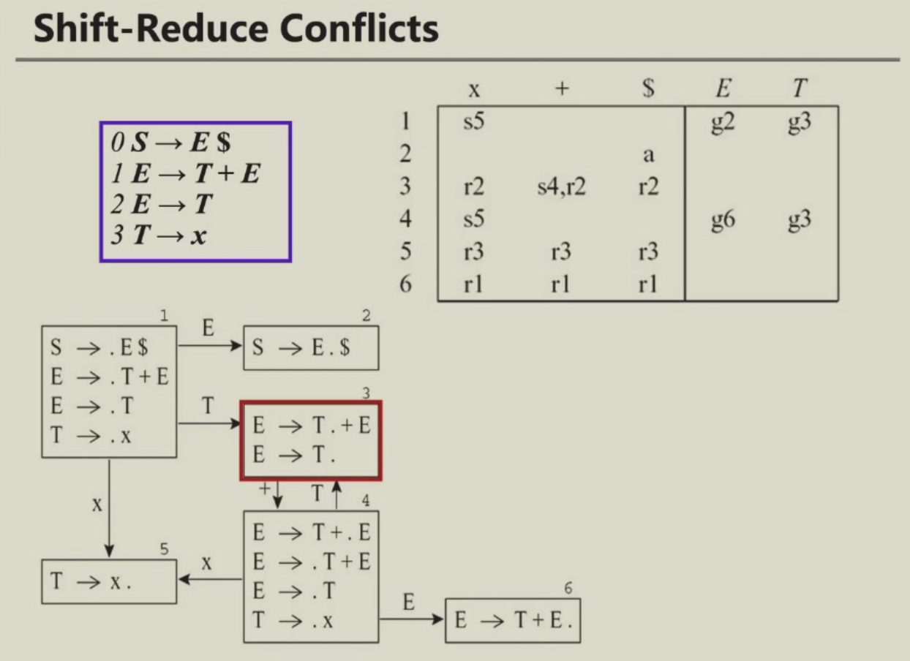

但是有些 shift-reduce conflict 是比较好解决的，比如下图中，如果在状态 3 遇到 token "+"，做 r2 reduce 把 T reduce 为 E（此时栈顶为 E），但是 Follow(E) 中只有 "\$"，也就是当把 T reduce 为 E 后，未来 E 后紧跟着的只可能是 "\$"，不可能再 match "+"

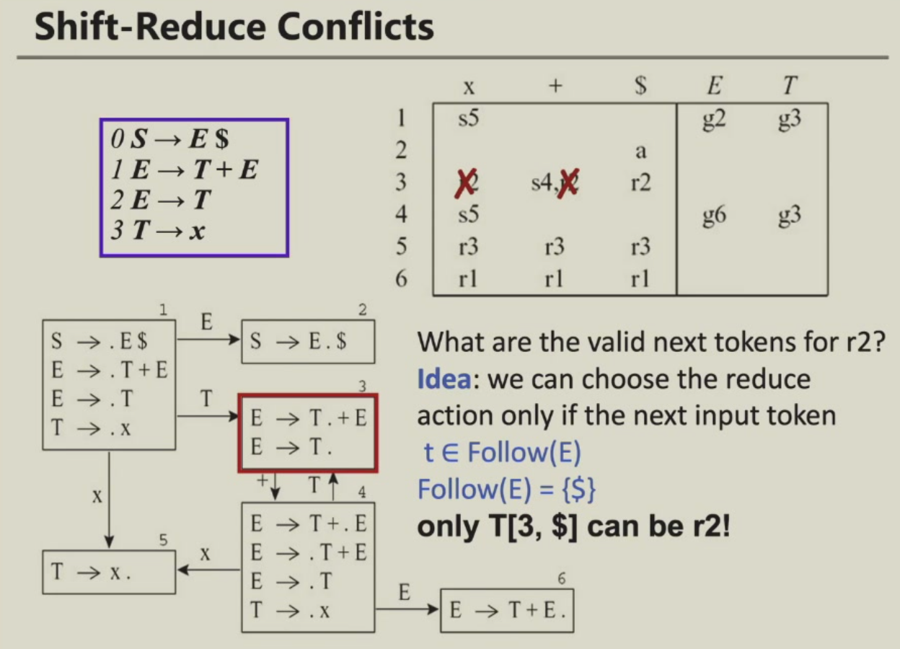

因此我们可以用这种方法减少一些实际上可以避免的 shift-reduce 冲突，为此我们引入了 **SLR Parsing**

### SLR Parsing

**SLR Parsing: Simple LR Parsing**

-  Put reduce actions into the table only where indicated by the FOLLOW set

- 简而言之就是填 reduce 的操作时注意一下 reduce 回的 Non-Terminals 的 FOLLOW 集合是否包含当前遇到的 token


### LR(1) Parsing

当然 SLR Parsing 解析文法的能力还不够强，为此又引入了 LR(1) Parsing

- Idea: add more information into the state of DFA so that we can resolve the conflicts!
- An LR(1) item consists of a production, a right-hand-side position (represented by the dot), and a **lookahead symbol**

与 LR(0) 不同的是，Closure/Goto/Reduce 变化如下：

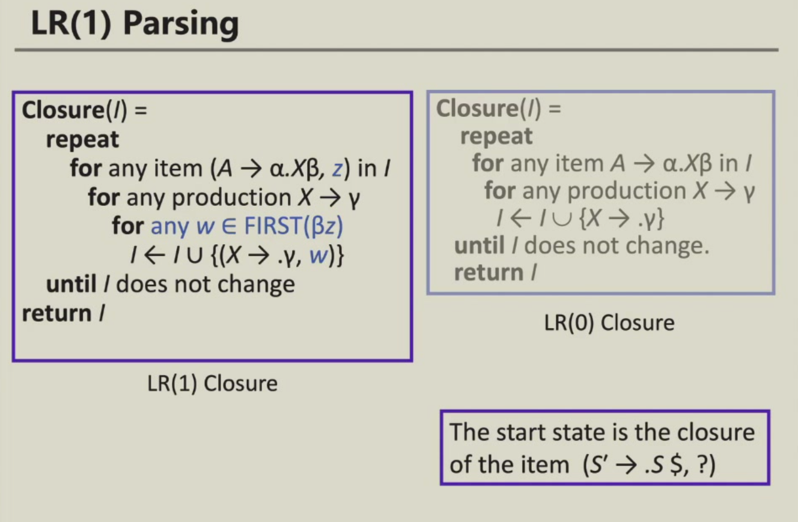

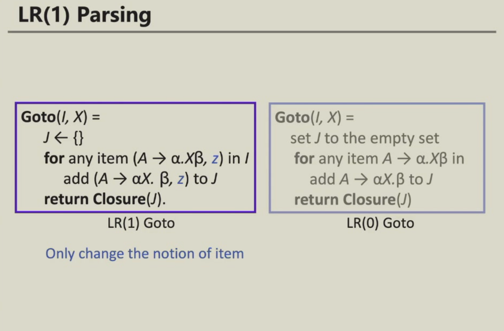

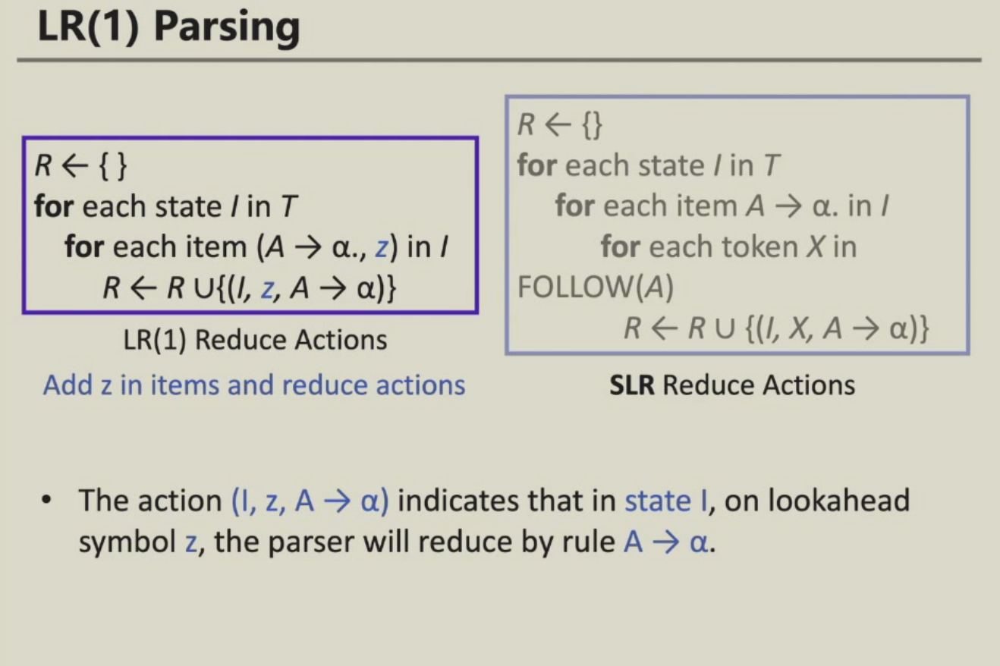

LR(1) Parsing 初始的 Closure 如下：

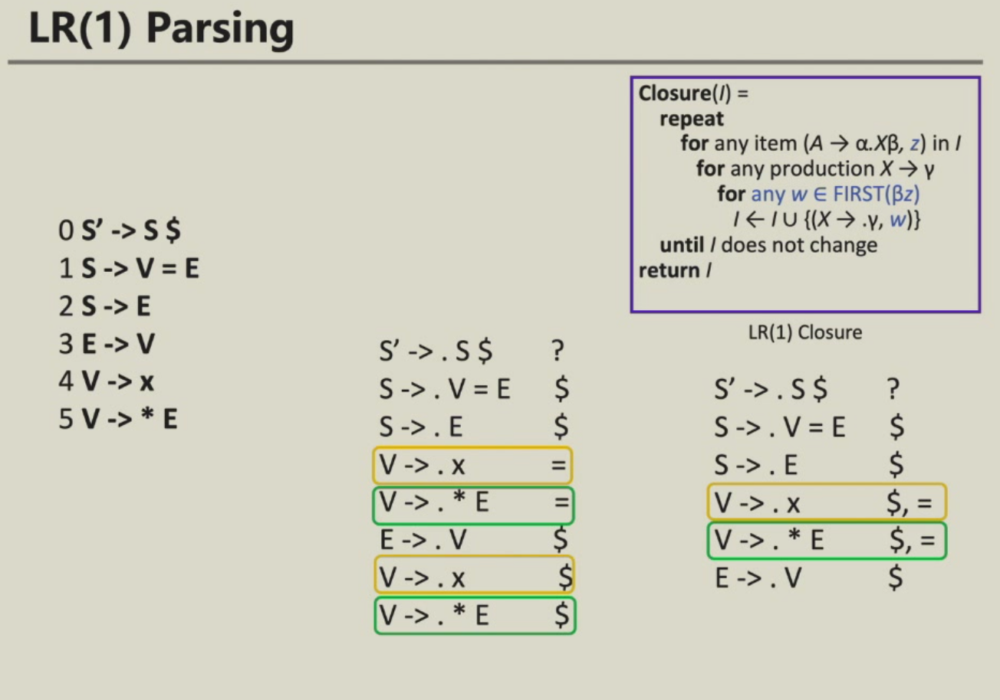

该例子构造的 DFA 如下：

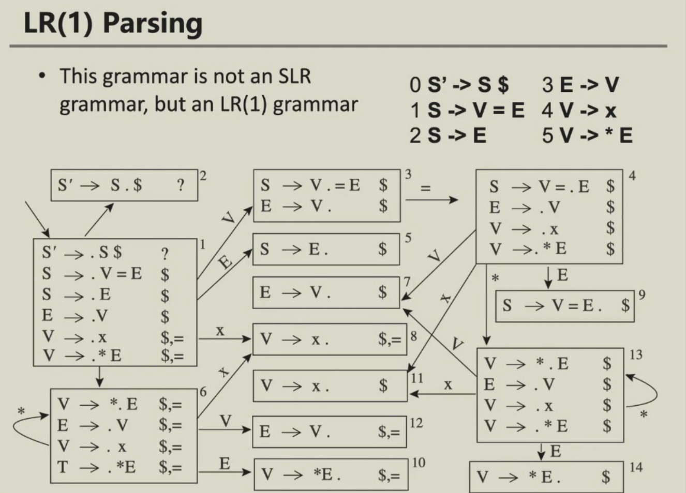

Parsing Table 如下：

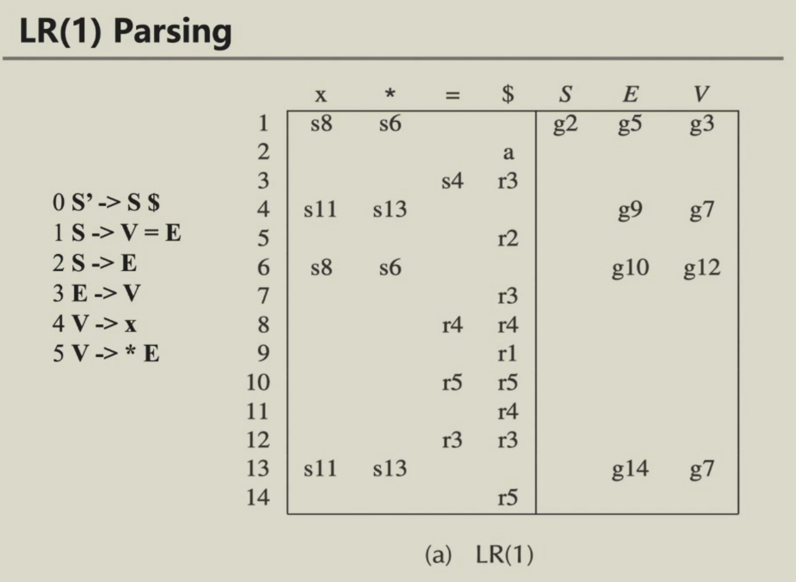

!!! note


    LALR(1) 将 LR(1) 中生成式相同，lookahead 不同的状态合并，能力更弱，但状态数更少，实际使用中更常用，例如 YACC

### Hierarchy of Grammar Classes

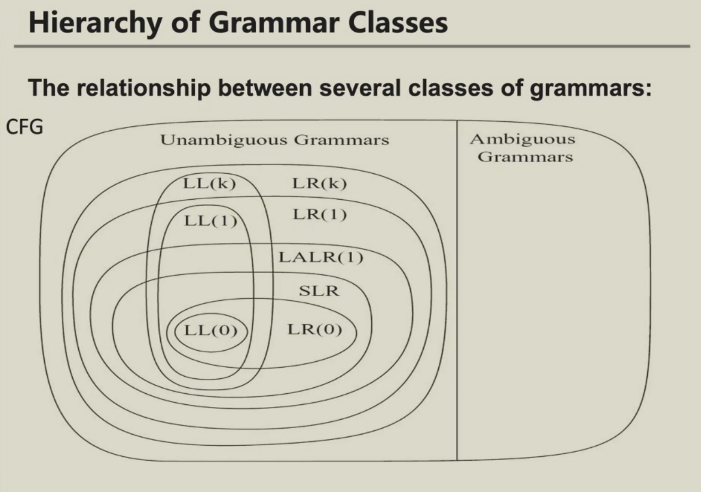


## Parser Implementation

We can implement a parser in two ways:

- Write a parser from scratc
- **Use a parser generator**

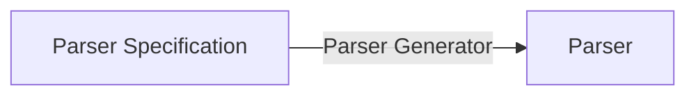
```mermaid
graph LR
A[Parser Specification] -- Parser Generator --> B[Parser]
```

!!! note


    Yacc: Yet another compiler-compiler

    - Input: A specification file (usually with a suffix .y)
    - Output: An output file consisting of C source code for the parser (usuallly with a suffix tab.c -- referred to the LALR Parsing Table)


## Error Recovery

> 略

- Local Error Recovery
- Global Error Recovery
