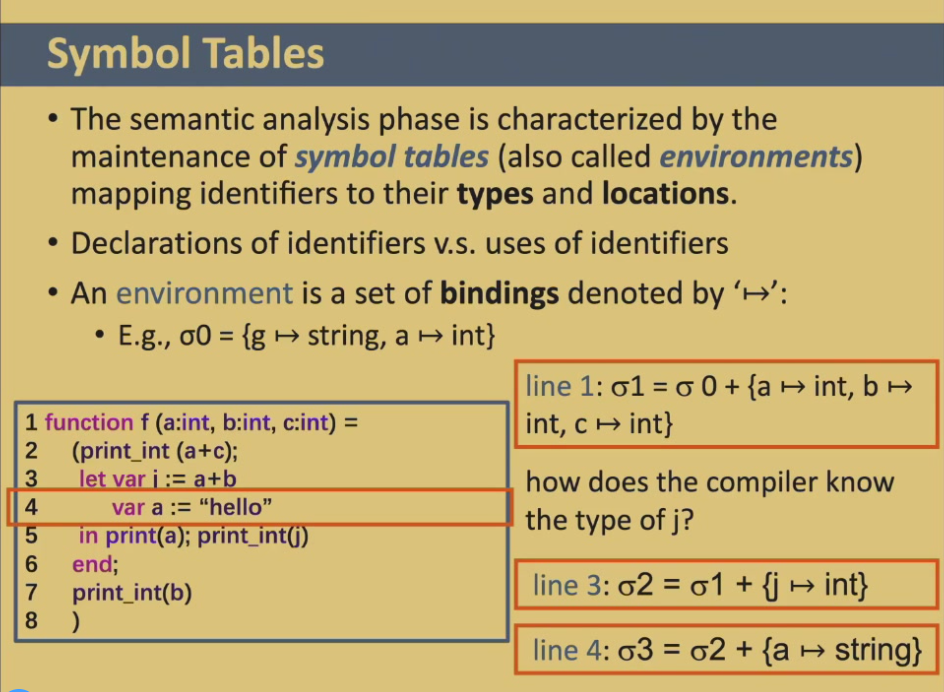
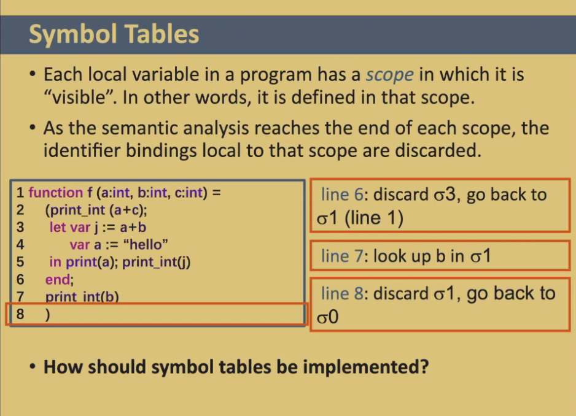
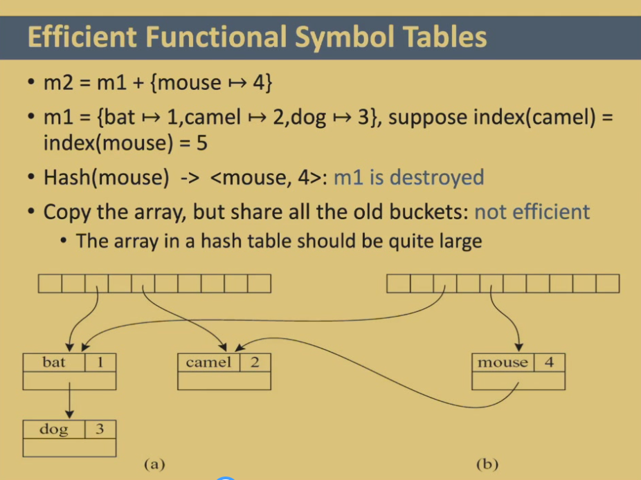
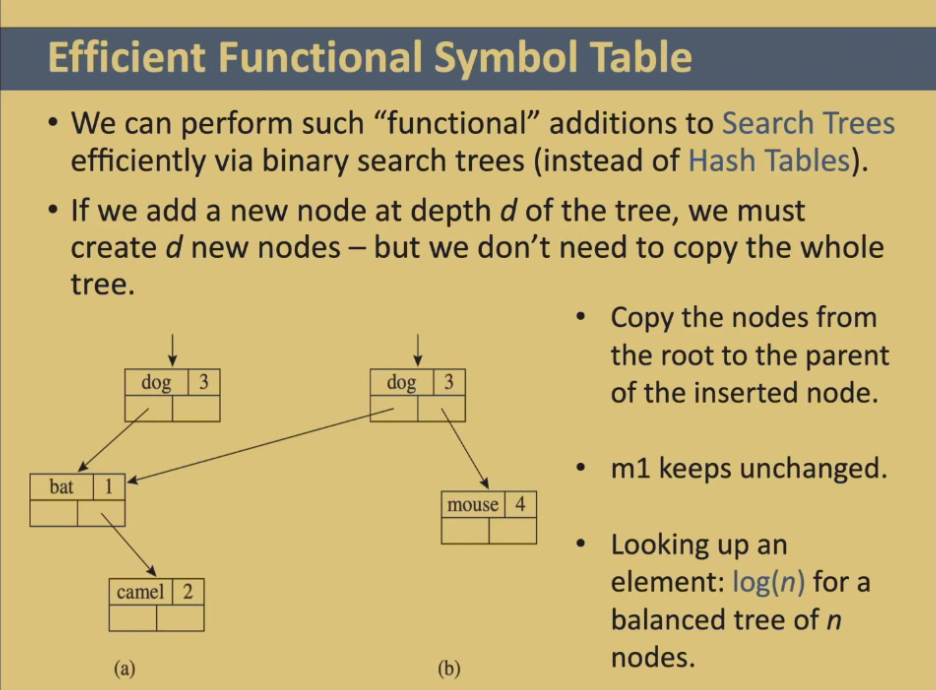
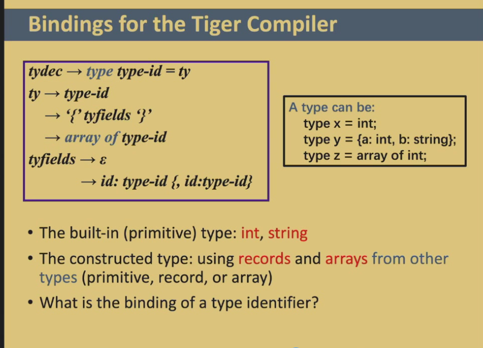
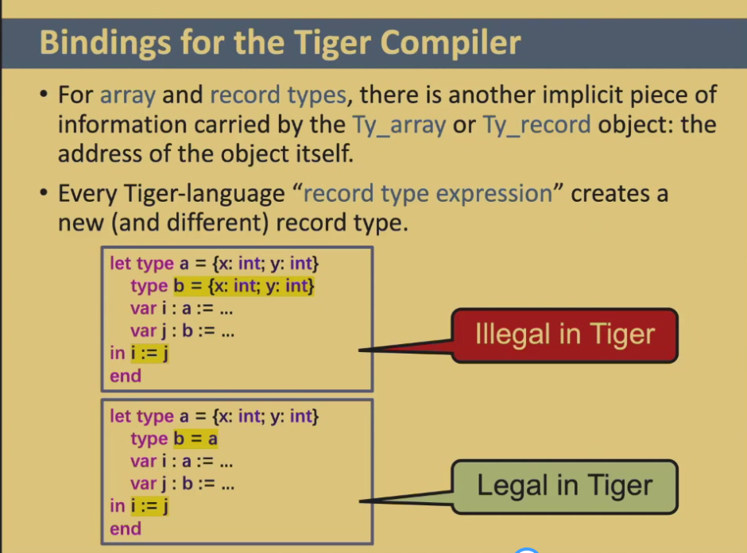
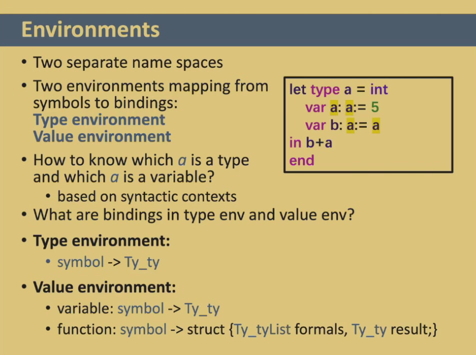

# Semantic Analysis

!!! quote "参考笔记"

    本章可对照 HowJul 语雀笔记的 [第 5 章：语义分析](https://www.yuque.com/howjul/rt9ms6/hagrqzv1mu2tqrhp)，以及 Cubic Y³ 的 [Part 8: 语义分析](https://cubicy.icu/compiler-construction-principles/#Part-8-语义分析)。

The **semantic analysis** phase of a compiler:

- connects variable definitions to their uses -- **Symbol Table** (符号表)
- checks that each expression has a correct type --  **Type-Checking**


## Symbol Tables

实现 Symbol Tables 主要有两种思想：

- Functional Style (函数式)：就是下图演示的思想，在创建新符号表时，维护先前的符号表，这样就可以在退出 scope 内时轻松的回退到 scope 外的符号表
- Imperative Style (命令式)：相反，总是在同一个符号表上做 modify，退出 scope 时需要做 undo 回滚到改动前的符号表



显然右边的 binding 会覆盖掉同名变量的 binding，例如 line4



接下来我们要思考用什么数据结构实现 Symbol Tables 呢？


### Implementation

由于 Symbol Tables 需要支持大量的查找和删除，因此需要采用能够提高查找速度和删除速度的数据结构，通常使用 **Hash Table**

- 这个 hash table 是一个数组，每个数组元素维护一个栈
- 查找 binding 的时候通过 hash function index 到数组位置，数组元素存的栈顶便是要找的 binding
- 新增 binding 的时候通过 hash function index 到数组位置，并在栈顶 push
- 删除 binding 的时候同理在栈顶 pop 即可


!!! note


    可以发现，采用 Hash Table 的数据结构，对于命令式的 Symbol Table 非常契合，但是对于函数式的 Symbol Table 就无法很好的保留原先的 Symbol Table，一种比较好的保存方式是只 copy hash array，但 share all the old buckets

    

    但是其实并不是很好，因为实际应用中变量可能是很多的，hash array 的大小比较大，对存储的开销会比较大


其实我们可以通过 Search Tree 的数据结构来实现 functional style 的 Symbol Table，如下图所示：



当存在 dog, bat, camel 后，插入 mouse 的 binding 后，我们只需要复制 mouse 所在 depth (和 bat 同一层) 往上的那些节点就可以了 (在该例子中只需要 copy dog)，存储开销明显会小很多 (不过查找效率会降低?)


## Bindings for the Tiger Compiler

Tiger has two separate name spaces (symbol tables):

- Type Environment (for Types)
- Value Environment (for Functions and Variables)


!!! important


    因此在 tiger 中：

    ```tiger
    let
    	type a = int
    	var a:= 1
    in
    	...
    end
    ```

    两个都叫 a 的 type 和 var 不会冲突，它们分别存在 Type Environment 和 Value Environment 中

    但是：

    ```tiger
    let
    	function a(b:int) = ...
    	var a:= 1
    in
     ...
    end
    ```

    这里的 `function a` 和 `var a` 都属于 Value Environment，在同一个命名空间中，后面的变量 a 会覆盖函数名 a，产生冲突


!!! note


    

    

    


## Type-Checking

**Type-Checking** (类型检查) 也是语义分析中要做的重要的一件事情

Type-check 要做的事其实就是根据 Type Environment 和 Value Environment 的符号表对语法分析后传进来的 abstract tree 结构进行分析，判断是否合法


> PPT 中主要介绍的是一些 tiger 代码对 type-checking 的实现，略去不表
