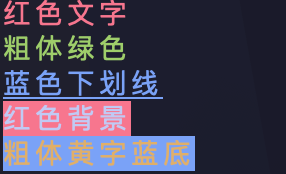

# ANSI Sequence

## ANSI sequence

ANSI 转义序列是一种在终端里控制文字样式的特殊字符串，可以让终端输出带颜色、加粗、下划线等效果

### 基本格式

**基本格式**为：

```
\033[  +  样式代码  +  m
```

- `\033` 是 ESC 字符（也可以写成 `\e` 或 `\x1b`），告诉终端"接下来是控制指令"
- `[` 是固定的起始符
- `m` 是固定的结束符
- 中间是样式代码，多个代码用 `;` 分隔

### 样式代码

**文字样式**：

```
0   重置所有样式
1   粗体
4   下划线
```

**前景色（文字颜色）**:

```
30  黑    31  红    32  绿    33  黄
34  蓝    35  紫    36  青    37  白
```

**背景色**：

```
40  黑    41  红    42  绿    43  黄
44  蓝    45  紫    46  青    47  白
```

***Example***:

```c
int main() {
  printf("\033[31m红色文字\033[0m\n");
  printf("\033[1;32m粗体绿色\033[0m\n");
  printf("\033[4;34m蓝色下划线\033[0m\n");
  printf("\033[41m红色背景\033[0m\n");
  printf("\033[1;33;44m粗体黄字蓝底\033[0m\n");  // 多个样式叠加
}
```


