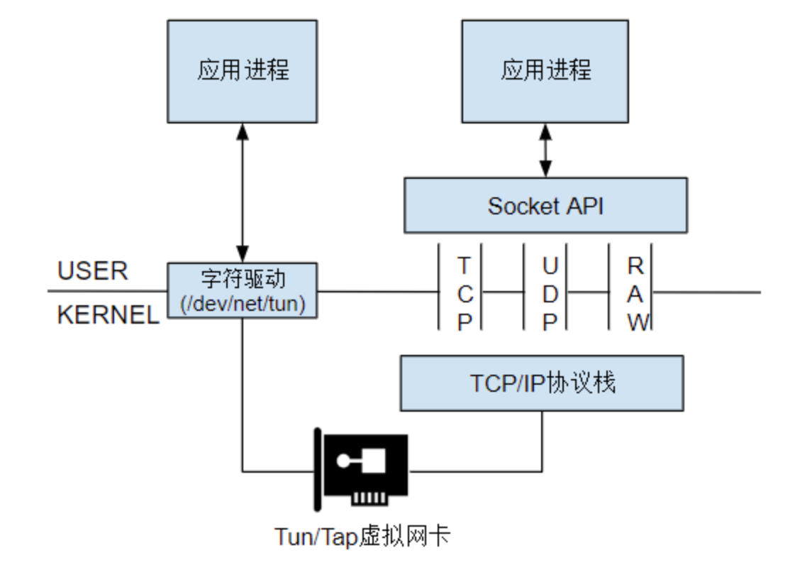
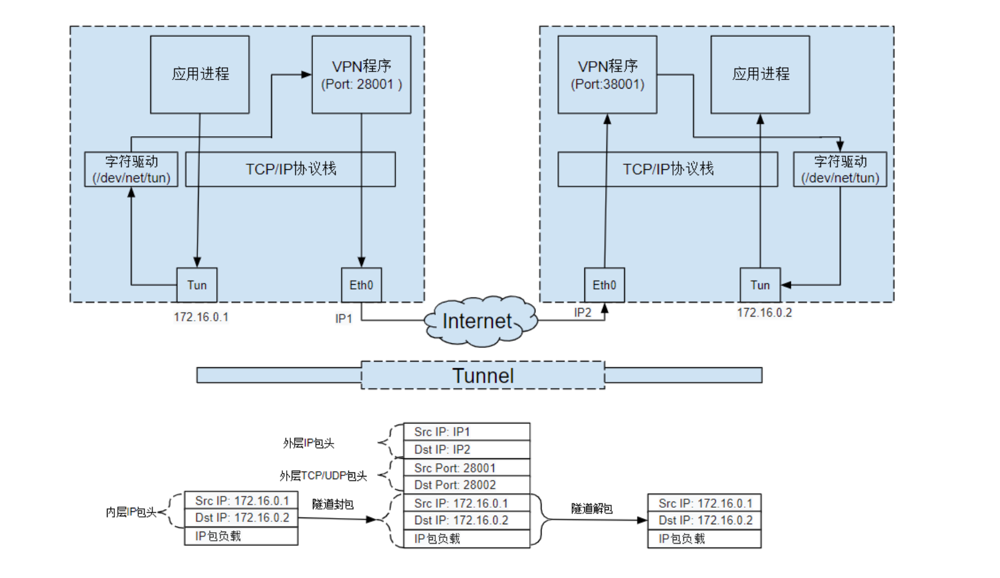
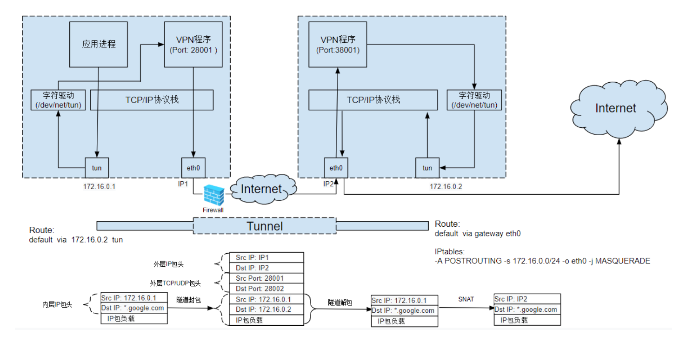

# TUN/TAP

## Overview

> Linux Kernel Virtual Network Devices

TUN 和 TAP 是 Linux 内核提供的 **虚拟网络设备**，它们完全由软件实现，没有物理硬件对应。它们是打通 **操作系统内核空间 (Kernel Space)** 和 **用户空间 (User Space)** 的秘密通道。

- **本质**：对于操作系统内核来说，它们是**网络接口** (Interface)；对于用户程序来说，它们是**文件** (File)。
- **核心作用**：允许用户态程序（如 VPN 客户端、虚拟机软件）直接读取和写入内核网络栈的数据包，从而实现对网络流量的拦截、封装和修改。

!!! success
    如果说物理网卡是连接“电脑”和“网线”的桥梁，那么 TUN/TAP 就是连接“操作系统内核”和“用户程序”的 U 型管道

下图描述了 TUN/TAP 的工作原理：

## TUN vs TAP

虽然两者都是虚拟网络设备，但它们模拟的网络层级不同：

| 特性          | TUN (Tunnel)                            | TAP (Network Tap)                     |
| :------------ | :-------------------------------------- | :------------------------------------ |
| **模拟层级**  | **L3 网络层** (IP)                      | **L2 数据链路层** (Ethernet)          |
| **数据单元**  | **IP 数据报** (无 MAC 头)               | **以太网帧** (有 MAC 头)              |
| **MAC 地址**  | 不需要                                  | **有** (虚拟 MAC 地址)                |
| **ARP 协议**  | 不处理 (点对点)                         | **处理** (响应 ARP 请求)              |
| **广播/多播** | 不支持以太网广播                        | **支持**                              |
| **连接方式**  | 路由 (Routing)                          | 桥接 (Bridging)                       |
| **典型应用**  | VPN (Tailscale, WireGuard, OpenVPN tun) | 虚拟机网络 (QEMU/KVM, VMWare), L2 VPN |

- **选 TUN**：如果你只需要打通网络（Ping 通 IP），做 VPN，不需要广播机制。效率更高，开销更小。
- **选 TAP**：如果你需要运行虚拟机并让它像真实电脑一样获取局域网 IP，或者需要传输非 IP 协议（如 IPX），或者需要抓取二层头（VLAN 标签）。

## Packet Flow Example

以 VPN（TUN 模式）访问 Google 为例，数据包经历了一次 **“俄罗斯套娃”** 式的封装：

**场景**：

- 物理网卡 IP：`192.168.1.5`
- TUN 接口 IP：`10.0.0.1`
- 目标：Google (`8.8.8.8`)

**流程拆解**：

1. **原始包产生**：浏览器请求 `8.8.8.8`。
2. **路由决策**：内核查路由表，默认路由指向 `tun0`。
3. **掉入陷阱**：内核将 **[原始 IP 包]** (Src: 10.0.0.1 -> Dst: 8.8.8.8) 扔进 `tun0`。
4. **用户态捕获**：VPN 程序从字符设备读出 **[原始 IP 包]**。
5. **隧道封装**：VPN 程序为了传输，构建一个新的 **[外层 IP 包]**：
    - 载荷：**加密后的 [原始 IP 包]**
    - 头部：Src: 192.168.1.5 -> Dst: VPN_Server_IP
6. **物理发送**：内核将 **[外层 IP 包]** 通过物理网卡 `eth0` 发送出去。

类似地，根据这个原理，我们可以使用 TUN/TAP 创建点对点隧道，如下图：

也可以使用 TUN/TAP 隧道绕过防火墙，这也是科学上网的原理：

## Proxy Modes Comparison

在科学上网或网络调试中，常遇到两种代理配置方式：

### System Proxy (Environment Variables)

> export http_proxy=http://127.0.0.1:7890

- **原理**：**应用层 (L7) 协议**。属于“君子协定”，告诉应用程序请主动连接该代理地址。
- **特点**：
    - 依赖应用程序自觉读取环境变量。
    - 通常只支持 TCP (HTTP/SOCKS5)。
    - `git`, `curl`, 浏览器通常支持；但 `ping`, 游戏, 许多终端工具不支持。
- **数据流**：App -> Localhost:7890 -> Proxy App (绕过 TUN 接口，走 Loopback)。

### TUN Mode

> VPN 软件开启 "Enhanced Mode" 或 "TUN Mode"

- **原理**：**网络层 (L3) 接管**。通过修改系统路由表，强制将流量引流到 TUN 接口。
- **特点**：
    - **强制性**：无论 App 是否支持代理，只要发 IP 包就会被捕获。
    - **全协议**：支持 TCP, UDP (游戏), ICMP (Ping)。
    - **真·全局代理**。
- **数据流**：App -> Kernel Routing -> **TUN Interface** -> Proxy App -> Physical Interface。

!!! success
    优先级规则：通常情况下，如果同时配置了系统代理（环境变量）和 TUN 模式，听话的应用程序会优先使用系统代理（走 SOCKS5/HTTP），从而绕过 TUN 接口的开销。

## Reference
- [Linux Tun/Tap 介绍](https://www.zhaohuabing.com/post/2020-02-24-linux-taptun/)
