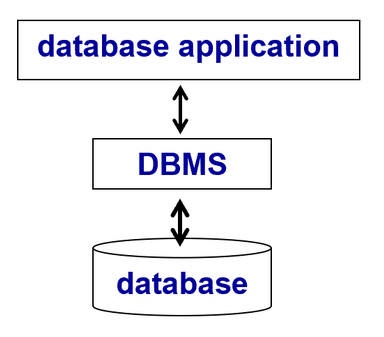
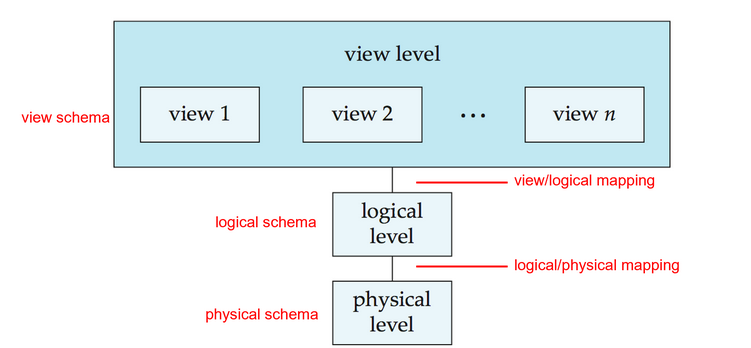
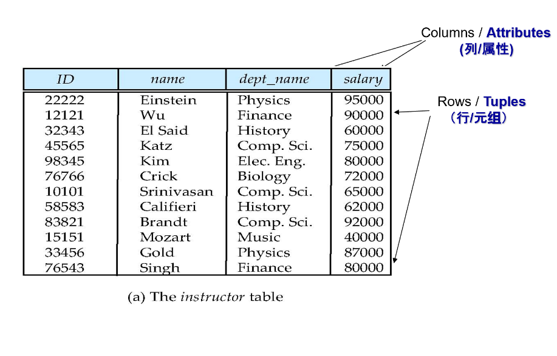
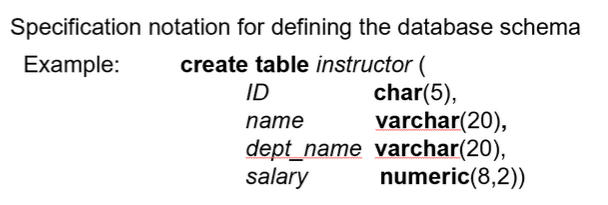
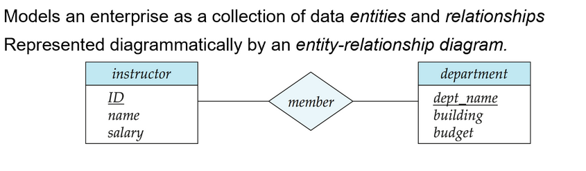
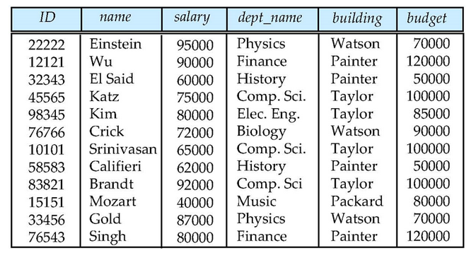
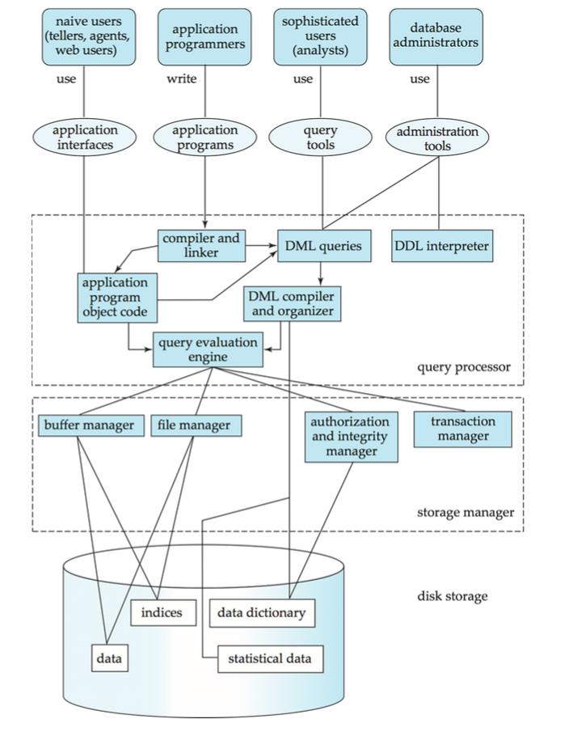
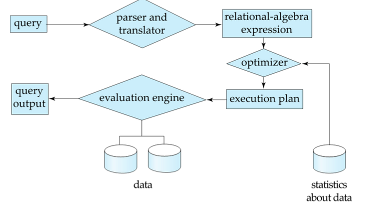
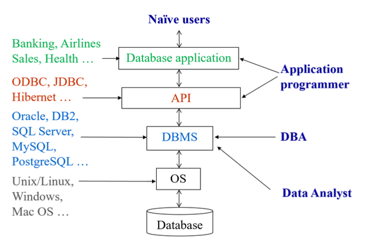

# Chap 1:Introduction

## Database Systems


## Purpose of Database Systems
Database systems offer solutions to all the below problems

- Data redundancy and inconsistency
    - Multiple file formats, duplication of informaiton in differenct files
- Data isolation
    - Multiple files and formats
- Difficulty in accessing data
    - 最初的功能，“库”翻译的直接由来
- Integrity problems
    - 完整的约束条件被藏在数据和代码中，而不是显式地声明。***e.g.*** "account balance $\bge$ 1"
- Atomicity problems
    - Failures may leave databse in an inconsistent state with partial updates carried out ***e.g.*** 从 A 账户转账到 B，我们必须保证 A 转出 B 转入这两件事情同时进行，不能被打断。
- Concurrent access anomalies
    - Uncontrolled concurrent accesses can lead to inconsistencies
- Security problems
    - Authenticatoin, Priviledge, Audit

??? note "Audit：审计"
    数据库管理员进行操作会留下审计记录，并且管理员没有权限对审计记录进行修改；审计记录需要受数据库安全员管理和监督

## Characteristics of Databases
- Data persistence
- Convenience in accessing data
- Dat integrity
- Concurrenc control for multiple user
- Failure recovery
- Security control

## View of Data
Three-level abstraction of databases



- physical level: 物理中如何保存、实现（如磁盘）
- logical level: 数据库中存储什么数据？数据之间的关系？
- view level: 不同人看到不同的他们所需要的数据

??? question "Advantages"
    - Hide the complexities
    - Enhance the adaptation to changes
        - 硬件环境变化（physical level），可以通过调整逻辑关系和映射来适应新的硬件环境。
        - 逻辑环境变化（logic level），可以通过 view 和 logic 的映射使得view 尽量少变化。

### Schema and Instance
Similar to types/class and variables/objects in programming languages.

- Schema(模式) - the logical structure of the database(physical/logical)
- Instance(实例) - the acutal content of the database at a particular point in time

### Data Independence
- **Physical Data Independence**(物理数据独立性) - the ability to modify the physical schema without changing the logical schema
- **Logical Data Independence**(逻辑数据独立性) - the ability to modify the logical schema without changing the user view schema

本质是映射修改，但不用修改 schema.

## Data Models
**Data models** is a collection of tools for describing data, data relationships, data semantics, data contraints.

- **Relational model(关系模型)**
    （表格）数据库系统层面
- Entity-Relationship(实体-联系) data model
    需求分析层面
- Object-based data models
    - Object-oriented（面向对象数据模型）
    - Object-relational（对象-关系模型模型）
- Semistructured data model（XML）（半结构化数据模型）
- Other older models:
    - Network model（网状数据模型）
    - Hierarchical model（层次数据模型）

!!! info "Relational Model"
    

    关系数据模型通俗来讲就是一张一张表格

## Database Languages
### Data Definition Language(DDL)
!!! Example "Example"
    

C 语言里的 struct 经过编译后全部变为了代码（有一张符号表）但数据库里不会。

Data dictionary contains **metadata**（元数据，**i.e.** data about data）

### Data Manipulation Language(DML)
DML also known as **query** language

Two classes of languages:

- Procedural (过程式) – user specifies what data is required and how to get those data e.g. C
- Declarative (nonprocedural，陈述式，非过程式) – user specifies what data is required without specifying how to get those data e.g. SQL

!!! example "实现从数据库中获取年龄大于18岁的用户"
    1. C language
        ```C
        // 伪代码示例
        void getAdults() {
        // 1. 打开数据库连接
        connectDB();
        // 2. 遍历所有用户
        while (user = nextUser()) {
        // 3. 检查年龄是否符合条件
        if (user.age > 18) {
            // 4. 将结果保存到列表
            addToList(result, user);
            }
        }
        // 5. 关闭数据库连接
        closeDB();
        return result;
        }
        ```

    2. SQL
        ```SQL
        SELECT * FROM users WHERE age > 18;
        ```

### Database Access from Application Program
- Application programs generally access databases through one of
    - Language extensions to allow embedded SQL
    - API（Application program interface） (e.g., ODBC/JDBC) which allow SQL queries to be sent to a database

两种方式本质区别在于**如何将SQL查询与应用程序代码集成**

## Database Design
- Entity Relationship Model（实体-联系模型）

    一对一/一对多/多对一/多对多
    
    !!! Example "Example"
        Models an enterprise as a collection of dat entities and relationships 
        
        

        属于多对多的 Entity Relationship Model

- Normalizaiton Theory（规范化理论）
    用来判断一个关系模式是否比较好

    !!! Example "Example"
        

        显然这个表存在冗余，department 有重复，可以拆分为两个表（前四列和后三列）

## Database Engine
{width=60%}</center>

### Storage Manager
数据库里放的是

- data files 真正的数据
- data dictionary 放的是 metadata
- statistical data 用于数据库的查询处理
- indices

### Query Processor
The query processor components include:

- DDL interpreter -- interprets DDL statements and records the definitions in the data dictionary.
- DML compiler -- translates DML statements in a query language into an evaluation plan consisting of low-level instructions that the query evaluation engine understands.
    - The DML compiler performs query optimization (查询优化); that is, it picks the lowest cost evaluation plan from among the various alternatives.
    
    执行计划会根据统计数据的改变而改变。

- Query evaluation engine -- executes low-level instructions generated by the DML compiler.

    {width=60%}

- Parsing and translation
- Optimization
- Evaluation

### Transaction Management
- Recover Manager
    
    ensures that the database remains in a consistent (correct) state despite system failures (e.g. power failures and operating system crashes) and transaction failures.
    
    日志，防止写回数据库时出现断电或者崩溃。

- Concurrency-control manager
    
    controls the interaction among the concurrent transactions, to ensure the consistency of the database.

## Database User
<center>{width=70%}</center>

- Database Administrator (DBA) 数据库管理员，要做定义模式，数据库调谐，故障时恢复（备份）等工作。

## History
- 1973 Turing Award: **Charles W. Bachman**
    
    **father of databases**

- 1981 Turing Award: Edgar F. Codd
- 1998 Turing Award: Jim Gray
- 2014 Turing Award: Michael Stonebraker

