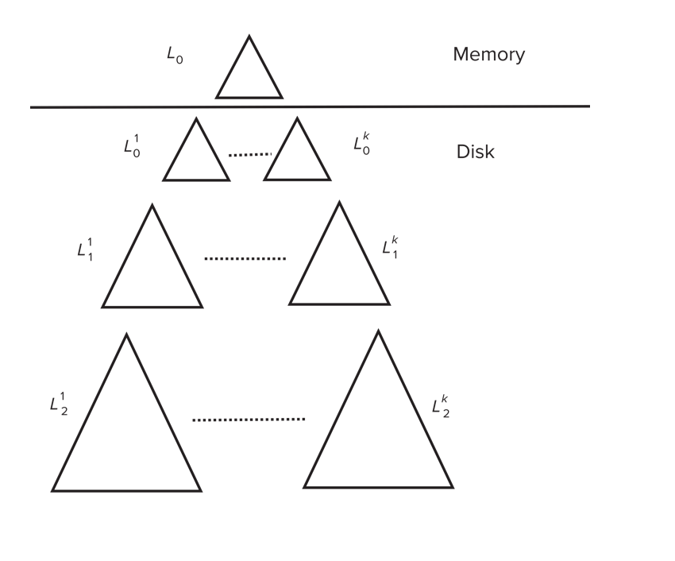
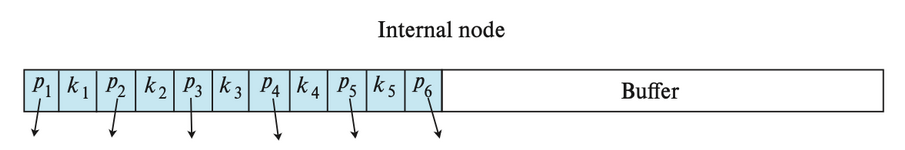
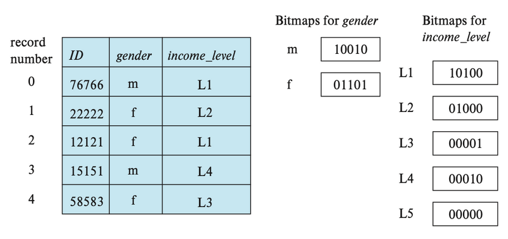

# Chap 10: Indexing

## Basic Concepts

**Indexing** mechanisms used to *speed up access* to desired data.  
索引用来加速查找。  

**Search Key** - attribute to set of attributes used to look up records in a file.  
An **index file** consists of records (called index entries) of the form.  
索引文件通常是有顺序的

### Index Evaluation Metrics

* Access types supported efficiently
    * **Point query**: records with a specified value in the attribute.  
    点查询
    * **Range query**: records with an attribute value falling in a specified range of values.  
    范围查询
* Access time
* Insertion time
* Deletion time
* Space overhead

### Ordered Indices

* **Primary index（主索引）**: in a sequentially ordered file, the index whose search key specifies the sequential order of the file.  
    * Also called clustering index（聚集索引）
    * The search key of a primary index is usually but not necessarily the primary key.
* **Secondary index（辅助索引）**: an index whose search key specifies an order different from the sequential order of the file.  Also called non-clustering index.

??? Example
    <div align=center>  </div>

    主索引和数据内的顺序是一样的。点查和范围查都是比较高效的。
    <div align=center>  </div>

    如果 key 不是一个主键，那可能会对应多个记录。

Primary index 是很宝贵的，只能有一个，其他都是辅助索引。    

* **Dense index(稠密索引)** — Index record appears for every search-key value in the file.   
所有 search-key 都要出现在索引文件里。  
* **Sparse Index（稀疏索引）**:  contains index records for only some search-key values.

??? Example
    <div align=center>  </div>
    <div align=center>  </div>

Good tradeoff: sparse index with an index entry for every block in file, corresponding to least search-key value in the block.
<div align=center>  </div>

### Multilevel Index

If primary index does not fit in memory, access becomes expensive.  
可以对索引文件本身再建立一次索引。

## B+ Tree Index

* All paths from root to leaf are of the same length
* Inner node(not a root or a leaf): between $\lceil n/2\rceil$ and $n$ children.
* Leaf node: between $\lceil (n–1)/2\rceil$ and $n–1$ values
* Special cases: 
    * If the root is not a leaf:  
    at least 2 children.
    * If the root is a leaf :  
    between 0 and (n–1)values.

一般一个节点就是一个块的大小, 4K.  
B+ 树的叉是非常大的。
<div align=center>  </div>

### Observations about B+ Trees

Since the inter-node connections are done by pointers, “logically” close blocks need not be “physically” close.
如果有很多文件一次性建立 B+ 树，我们可以从叶子节点开始建立。

如果有 K 个索引项，则树高度不会超过 $\lceil \log_{\lceil n/2 \rceil}(K/2)\rceil + 1$.  
高度最小为 $\log_n(K)$

!!! Example "Examples of Insert on B+ Tree"
    <div align=center>  </div>
    <div align=center>  </div>

    注意内点的 split 和叶子的不一样。要把中间的节点 move 上去。

!!! Example "Examples of Delete on B+ Tree"
    <div align=center>  </div>

    中间点如果不够，从另外一边借一个过来。但是不能直接借，需要把它顶上去。
    <div align=center>  </div>
    <div align=center>  </div>

    注意考虑和兄弟合并。

### B+- tree : height and size estimation

<div align=center>  </div>
<div align=center>  </div>

全满的时候节点最少  
注意这里的向上/向下取整问题  
浅层节点个数少，我们可以把第一层和第二层的节点都放到内存中 pin 住。

### B+ Tree File Organization

文件组织  
B+ Tree File Organization:

* Leaf nodes in a B+ Tree file organization store records, instead of pointers  
叶子节点不再放索引项，放记录本身。 
* Helps keep data records clustered even when there are insertions/deletions/updates  
<div align=center>  </div>

我们可以改变半满的要求以提高空间利用率。

### Other Issues in Indexing

* **Record relocation and secondary indices**  
If a record moves, all secondary indices that store record pointers have to be updated   
Node splits in B+ Tree file organizations become very expensive  
Solution: use primary-index search key instead of record pointer in secondary index
* **Variable length strings as keys**  
Variable fanout  
* **Prefix compression**  
Key values at internal nodes can be prefixes of full key  
Keep enough characters to distinguish entries in the subtrees separated by the key value

### Multiple-Key Access

**Composite search keys** are search keys containing more than one attribute  
***e.g.*** `(dept_name, salary)`  

**Lexicographic ordering**: $(a_1, a_2) < (b_1, b_2)$ if either $a_1 < b_1$, or $a_1=b_1$ and $a_2 < b_2$.  

单个 key, 不同 key 之间组合都可以建立 B+ 树。这样会有很多组合，可以在频繁出现的查询属性上建立 B+ 树。

### Non-unique Search Keys

我们可以在 B+ 树叶子节点不直接指向磁盘里的数据，而是指向一个块。  
也可以在索引上加上去一个索引，使它对应的记录唯一。  
可以通过范围查找

## Bulk Loading and Bottom-Up Build

Inserting entries one-at-a-time into a B+ Tree requires $\geq 1$ IO per entry   

如果我们一次性插入很多索引项

* Efficient alternative 1: Insert in sorted order  
局部性较好，减少 I/O. 
* Efficient alternative 2: **Bottom-up B+ Tree construction**
    * First sort index entries 
    * Then create B+ Tree layer-by-layer, starting with leaf level
    * The built B+ Tree is written to disk using sequential I/O operations

!!! Example
    <div align=center>  </div>

    如果要排序的内容较大，无法放下内存，可以使用外部排序。  
    fanout 可以计算出来。  
    可以用 level-order 写到磁盘里，便于顺序访问所有索引，此时块是连续的。（便于顺序访问所有数据项）   
    这里的代价就是建好后，一次 seek 后全部写出去 (9 blocks)  

Bulk insert index entries   

!!! Example 
    <div align=center>  </div>

    把刚刚那棵 B+ 树叶子节点（即遍历所有数据）需要 1seek+6blocks. 随后和上面的数据合并后，写回磁盘时需要 1seek+13blocks. 

Merge two existing two B+ Trees , to create a new B+ Tree using the Bottom-UP Build algorithm, as in LSM-tree Index  
假设有两棵这样生成的 B+ 树，将他们合并在一起。首先把叶子节点拿出来排序。  

## Indexing in Main Memory

<div align=center>  </div>

cache 按 cache line 传输, 只有 64B. 

* Random access in memory  
    * Much cheaper than on disk/flash, but still expensive compared to cache read
    * Binary search for a key value within a large B+ Tree node results in many cache misses  
    二分查找可能带来很多 cache miss.  
    * Data structures that make best use of cache preferable – **cache conscious**  

B+- trees with *small nodes* that fit in cache line are preferable to reduce cache misses  

并且由于顺着树往下查时只需要用到 search key，所以 search key 和 pointer 在 node 中可以分开放。

Key idea:  

* use large node size to optimize disk access, 
* but structure data within a node using a tree with small node size, instead of using an array, to optimize cache access.

<div align=center>  </div>

## Indexing on Flash

Flash 里不是即时修改，而是先擦掉再写。同时擦的次数是有限制的。因此最好的方法是从底构建，然后顺序写入。

* Random I/O cost much lower on flash  
20 to 100 microseconds for read/write
* Writes are not in-place, and (eventually) require a more expensive erase
Optimum page size therefore much smaller
* Bulk-loading still useful since it minimizes page erases
* Write-optimized tree structures (i.e., LSM-tree, buffer tree) have been adapted to minimize page writes for flash-optimized search trees  

下面介绍一些写优化索引结构

### Log Structured Merge (LSM) Tree

<div align=center>  </div>

* Records inserted first into in-memory tree ($L_0$ tree)  
* When in-memory tree is full, records moved to disk ($L_1$ tree)  
B+ Tree constructed using *bottom-up build* by merging existing $L_1$ tree with records from $L_0$ tree  
内存里的 B+ 树如果满了，就马上写到磁盘里去（可以连续写）  
* When $L_1$ tree exceeds some threshold, merge into $L_2$ tree  
And so on for more levels  
Size threshold for $L_{i+1}$ tree is $k$ times size threshold for $L_i$ tree 

这样我们把随机写变为了顺序写。但此时查找一个索引，就要遍历所有 B+ 树。

* Benefits of LSM approach
    * Inserts are done using only **sequential I/O** operations
    * **Leaves are full**, avoiding space wastage
    * Reduced number of I/O operations per record inserted as compared to normal B+ Tree (up to some size)
* Drawback of LSM approach
    * Queries have to search multiple trees
    * Entire content of each level copied multiple times

**Stepped Merge Index**  
原先的结构中，Merge 操作太多，我们可以一次性合并。
磁盘上每层有 k 棵树，当 k 个索引处于同一层时，合并它们并得到一棵层数 $+1$ 的树，写回。    
$L_1$ 有大小限制，达到后会生成另一个 B+ 树，依次为 k 倍。   

<center>{width=60%}</center>

- Reduces write cost compared to LSM tree
- But queries are even more expensive since many trees need to be queries

**Optimization for point lookups**
- Compute Bloom filter for each tree and store in-memory
- Query a tree only if Bloom filter returns a positive result

??? info "Bloom filter"
    布隆过滤器 (Bloom filter) 是一种空间效率极高的 概率型数据结构，用于快速判断某个元素是否 可能存在于集合中，或 肯定不存在于集合中。在数据库中常用于加速查询，减少不必要的磁盘访问。
    
    - 核心思想
        - 位数组 + 哈希函数：
            - 初始化一个长度为 m 的二进制位数组（全 0）。
            - 使用 k 个哈希函数将元素映射到位数组的 k 个位置。
        - 插入元素：将元素哈希后的 k 个位置置 1。
        - 查询元素：检查元素哈希后的 k 个位置是否全为 1：
            - 若全为 1，元素 可能存在（可能误判）；
            - 若有任一位置为 0，元素 一定不存在。

    - 在数据库中的应用
        - LSM树查询优化：
            - 每个 SSTable 关联一个布隆过滤器。
            - 查询时先检查布隆过滤器，若返回“不存在”，直接跳过该文件，避免无效磁盘 I/O。

LSM 的删除和更新如下

- Deletion handled by adding special “delete” entries
    - Lookups will find both original entry and the delete entry, and must return only those entries that do not have matching delete entry
    - When trees are merged, if we find a delete entry matching an original entry, both are dropped.
- Update handled using insert+delete
- LSM trees were introduced for disk-based indices
    - But useful to minimize erases with flash-based indices
    - The stepped-merge variant of LSM trees is used in many BigData storage systems
    - Google BigTable, Apache Cassandra, MongoDB
    - And more recently in SQLite4, LevelDB, and MyRocks storage engine of MySQL 

### Buffer tree
> sjl 上课没讲过，但是说上次期末考了这个东西，让我们自学

<center>{width=60%}</center>

- Key idea: each internal node of B+ tree has a buffer to store inserts
    - Inserts are moved to lower levels when buffer is full
    - With a large buffer, many records are moved to lower level each time
    - Per record I/O decreases correspondingly 
- Benefits
    - Less overhead on queries
    - Can be used with any tree index structure
    - Used in PostgreSQL Generalized Search Tree (GiST) indices
- Drawback: more random I/O than LSM tree

简要来说就是每插入一条记录，不会遍历节点到叶子节点中插入，而是直接插入在根节点的缓冲区中，直到缓冲区满再逐级向下搬

总体而言，读操作相比 LSM 树更快，写操作相比 LSM 树更慢。

## Bitmap indices
> 这里上课也没讲过，但是小测和ppt中都有涉及

- Bitmap indices are a special type of index designed for efficient **querying on multiple keys**
- Applicable on attributes that take on a relatively small number of distinct values
    - E.g., gender, country, state, …
    - E.g., income-level (income broken up into a small number of  levels such as 0-9999, 10000-19999, 20000-50000, 50000- infinity)
- A bitmap is simply an array of bits

位图索引(bitmap indices) 是一类适用于对**多个键做简单查询**的索引。在使用位图索引前，需要为关系中的每条记录标号（从 0 开始）。如果记录的大小固定，且被分配在某个文件内的连续块上，这一操作还是很容易的，此时记录编号就可以被转换为块编号。

位图(bitmap) 就是一组位，对于关系 $r$ 的属性 $A$，位图索引包含了 $A$ 可取的每个值，而位的数量对应记录的数量。对于某个值 $v_j$​ 的位图，如果编号为 $i$ 的记录的属性值为 $v_j$​，那么该位图的第 $i$ 位置 1，否则置 0。

下面就是一个位图索引的例子：

<center>{width=60%}</center>

对于以下查询：

```sql
SELECT *
FROM instructor_info
WHERE gender = 'f' AND income_level = 'L2';
```

我们找到 gender 属性值为 f，以及 income_levelincome_level 属性值为 L2 的位图，然后对这两个位图进行交(intersection) 运算（实际上是一个逻辑与的运算）。根据上图，gender = f 对应的位图为(01101)，income_level = L2 对应的位图为(01000)，交运算后的位图是 01000，也就是说，编号为 1 的记录就是我们要查询的记录。

