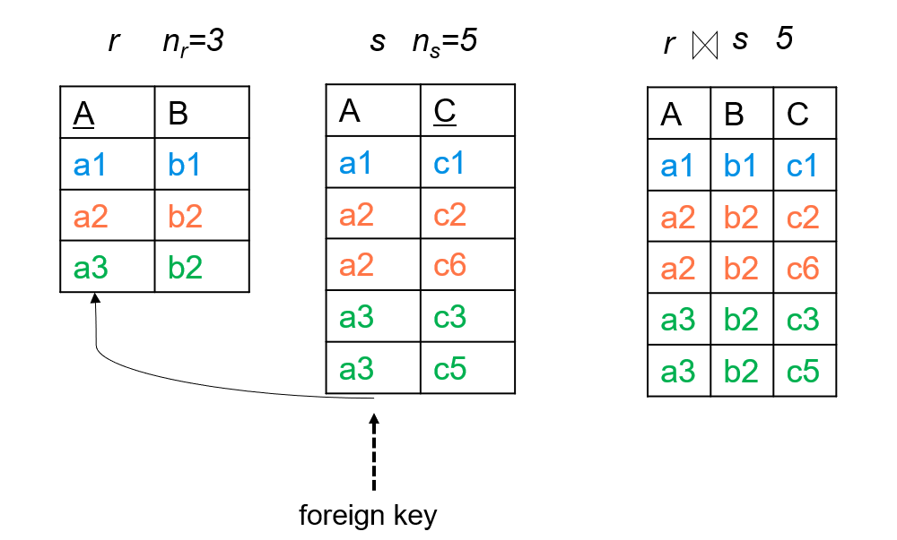
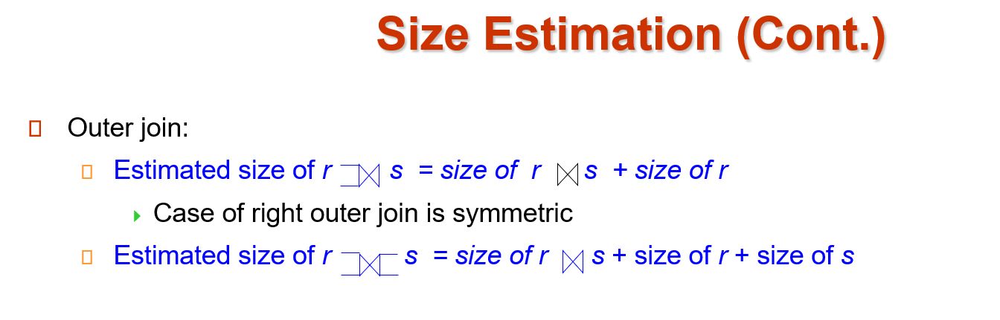

# Chap 12: Query Optimization

??? Abstract
    * Introduction 
    * Transformation of Relational Expressions
    * Statistical Information for Cost Estimation
    * Cost-based Optimization
    * Dynamic Programming for Choosing Evaluation Plans
    * Nested Subqueries
    * Materialized Views 
    * Advanced Topics in Query Optimization

## Introduction

<div align=center>  </div>

Alternative ways of evaluating a given query

* Equivalent expressions  
逻辑优化：关系代数表达式（尽量先做选择，投影）
* Different algorithms for each operation  
物理层面：每个算子选择不同的算法

??? Example
    <div align=center>  </div>
    <div align=center>  </div>

Estimation of plan cost based on:

* *Statistical information about relations*. Examples:
number of tuples, number of distinct values for an attribute
* *Statistics estimation for intermediate results*（Cardinality Estimation）
to compute cost of complex expressions  
估计中间结果的大小  
现在有基于深度学习的估计方法
* *Cost formulae for algorithms*, computed using statistics

关系数据库里可以用查看执行计划。
<div align=center>  </div>

## Generating Equivalent Expressions

Two relational algebra expressions are said to be **equivalent** if the two expressions generate the same set of tuples on every legal database instance  
形式上不一样，但是结果（输出）是一样的，产生了相同的集合。  

### Equivalence Rules

* selection
    <div align=center>  </div>

    1. 可以把算子拆分  
    如果某些属性有索引，那么可以先拆分，在索引 select 之后再执行其他算子，否则不如不拆分。
    2. 算子可交换  
    先执行有索引的算子。  
    3. 投影的属性可以只保留最后一次的  
    4. 选择算子可以和合并结合  

* join  
    <div align=center>  </div>
    
    自然连接是结合的（先连接中间结果小的）  
    <div align=center>  </div>

    如果选择算子只和一个关系有关，那么我们可以先执行选择。（选择算子要早进行，推到叶子上）  

* projection
    <div align=center>  </div>

    同理投影也要早做。  
    如果连接要用到投影后不保留的属性，我们在第一次投影时要把连接用的属性也保留下来。

* set operation
    <div align=center>  </div>
    
    这里的减法，减数关系就不用做选择了（减去多的总是没问题的）对交集也适用

* other
    <div align=center>  </div>

### Enumeration of Equivalent Expressions

* Repeat
    * apply all applicable *equivalence rules* on every subexpression of every equivalent expression found so far
    * add newly generated expressions to the set of equivalent expressions 
* Until no new equivalent expressions are generated above

可以这样找到所有的等价表达式。

但是实际中我们基于一些经验规则进行启发式的优化

## Statistics for Cost Estimation

代价估算需要统计信息

* $n_r$: number of tuples in a relation r.
* $b_r$: number of blocks containing tuples of r.
* $l_r$: size of a tuple of r.
* $f_r$: blocking factor of r — i.e., the number of tuples of r that fit into one block.  
一个块可以放多少个元组
* $V(A, r)$: number of *distinct* values that appear in r for attribute A; same as the size of $\Pi(r)$.
* If tuples of r are stored together physically in a file, then: $b_r = \lceil \dfrac{n_r}{f_r}\rceil$
* Histograms

??? Example "attribute age of relation person"
    <div align=center>  </div>

### Selection Size Estimation

中间结果

* $\sigma_{A=v}(r)$  
$n_r / V(A,r)$ : number of records that will satisfy the selection.   
这样的估算基于值是平均分布的  
如果要找的是一个 key, 那么 size estimate=1
* $\sigma_{A\leq v}(r)$   
    * Let $c$ denote the estimated number of tuples satisfying the condition.   
    * $c = 0$ if $v < \min(A,r)$  
    v 比属性 A 的最小值还要小
    * $c = n_r\cdot \dfrac{v-\min(A,r)}{\max(A,r) - \min(A,r)}$  
    * In absence of statistical information c is assumed to be $n_r / 2$ (没有最大、最小统计信息时).

<div align=center>  </div>

概率论。  
注意这些公式的要求是条件是相互独立的。

### Joins

The Cartesian product $r  \times s$ contains $n_r\cdot n_s$ tuples; each tuple occupies $s_r + s_s$ bytes.

* $R \cap S = \emptyset$  
没有公共属性，等价于 $r\times s$
* $R \cap S$ is a key for $R$, then a tuple of $s$ will join with at most one tuple from $r$
    
    ??? Example
        <div align=center>  </div>

* If $R \cap S$ in S is a foreign key in S referencing R, then the number of tuples in $r\bowtie s$ = the number of tuples in s.

    ??? Example
        <center>{width=70%}</center>

* If $R \cap S = \{A\}$ is not a key for R or S.  
$n_r * \dfrac{n_s}{V(A,s)}, n_s * \dfrac{n_r}{V(A,r)}$.     
以第二个为例子，站在 s 的角度，每一个 s 可以和这么多个元素连接。  
**通常我们取二者中的较小值**。  
当然这里只是一种估算    

    ??? Example
        <div align=center>  </div>

### Size Estimation for Other Operations

<div align=center>  </div>

!!! info "Size Estimation for Outer Join"
    <center>{width=60%}</center>

    外部连接 r, s 认为是 r s 自然连接的结果加上 r 的大小。

### Estimation of Number of Distinct Values

估算 V(A,r).  

Selections $\sigma_\theta(r)$, estimate $V(A,\sigma_\theta(r))$

* If $\theta$ forces A to take a specified value, $V(A,\sigma_\theta(r))=1$  
    - ***e.g.***, A = 3
* If $\theta$ forces A to take on one of a specified set of values: $V(A,\sigma_\theta(r))=$ number of specified values
    - 选择条件θ要求A等于多个特定值之一(如A=1 ∨ A=3 ∨ A=4)
    - ***e.g.***, (A = 1 V A = 3 V A = 4)
* If the selection condition $\theta$ is of the form A op v, $V(A,\sigma_\theta(r))=V(A,r)*s$  
    - ***e.g.***，选择条件是A与某个值的比较(如A>5, A≤10等)
    - 利用选择率 s 计算
* In all the other cases, use approximate estimate: $V(A,\sigma_\theta(r))=\min(V(A,r), n_{\sigma_\theta(r)})$
    - 不同值数量不会超过原始关系的不同值数量，也不会超过结果中的元组数量
    - 取两者中较小的值作为保守估计

??? Example

    joins $r\bowtie s$, estimate $V(A,r\bowtie s)$

    * If all attributes in A are from r, the estimated $V(A,r\bowtie s)=\min(V(A,r), n_{r\bowtie s})$
    * If A contains attributes A1 from r and A2 from s, then estimated $V(A,r\bowtie s)=\min(V(A1,r)*V(A2-A1,s), V(A1-A2,r)*V(A2,s), n_{r\bowtie s})$

## Choice of Evaluation Plans

Must consider the *interaction* of evaluation techniques when choosing evaluation plans

choosing the cheapest algorithm for each operation independently may not yield best overall algorithm    
***e.g.*** merge-join may be costlier than hash-join, but may provide a sorted output which reduces the cost for an outer level aggregation.  
Mergejoin 代价高，但是有个好处是 join 后是有次序的，对上层操作有利。

如果要找最优的执行计划，可能需要很长时间。通常按照经验规则。  
我们主要考虑连接操作的优化。

### Cost-Based Join-Order Selection

Consider finding the best join-order for $r_1\bowtie r_2\bowtie \ldots r_n$.  
There are $(2(n - 1))!/(n - 1)!$ different join orders for above expression.

!!! question "Different Join Orders"
    实际上，通过使用卡塔兰数可以更精确地理解这一计算：

    $C_{n-1} = \frac{1}{n}\binom{2(n-1)}{n-1}$ 是第$(n-1)$个卡塔兰数，表示可能的满（国际定义）二叉树结构数量

    对于$n$个关系的连接顺序总数：
    $T(n) = C_{n-1} \times n! = \frac{(2(n-1))!}{(n-1)!}$

    其中：

    - $C_{n-1}$：表示不同的连接树形结构的数量
    - $n!$：表示关系在叶节点上的不同排列方式
    - 结果等价于$(2(n-1))!/(n-1)!$，这是一个组合问题的解

Using dynamic programming, the least-cost join order for any subset of $\{r_1, r_2, \ldots r_n\}$ is computed only once and stored for future use. 

Join Order Optimization Algorithm
<div align=center>  </div>

先分解成两个小的集合 $S_1, S-S_1$. 递归地细分。  
递归到最底层就变为了对单个表的选择方法。
<div align=center>  </div>

#### Left Deep Join Trees

In left-deep join trees, the right-hand-side input for each join is a relation, not the result of an intermediate join.
<div align=center>  </div>

左边可以是中间结果，右边必须是一个关系。

Left-deep trees 只是所有可能连接树的一个子集，可能错过某些更优的 bushy join plans，导致无法找到全局最优的连接顺序

但这是数据库系统在**优化效率**和**执行效率**之间做出的权衡。

#### Cost of Optimization

* With dynamic programming 
    * time complexity of optimization with bushy trees is $O(3^n)$.  
    * Space complexity is $O(2^n)$ 
* left-deep join tree 
    * Time complexity of finding best join order is $O(n 2^n)$
    * Space complexity remains at $O(2^n)$ 

### Heuristic Optimization

Cost-based optimization is expensive.  
可以用启发式优化

Heuristic optimization transforms the query-tree by using a set of rules that typically (but not in all cases) improve execution performance:

* Perform *selection* early (reduces the number of tuples)
* Perform *projection* early (reduces the number of attributes)
* Perform most restrictive selection and join operations (**i.e**. with smallest result size) before other similar operations.
* Perform left-deep join order

## Additional Optimization Techniques

### Nested Subqueries

Nested query example:
``` SQL
select name from instructor 
where exists 
    (select * from teaches
    where instructor.ID = teaches.ID and teaches.year = 2022)
```
找出 2022 开课的老师的名字。

两重循环，但是低效。

Parameters are variables from outer level query that are used in the  nested subquery; such variables are called **correlation variables（相关变量）**  
即来自外循环的变量。如果没有相关变量，我们可以先执行内部，然后再执行外部。

把刚刚那个例子改为一个 select 语句，例如：

```sql
select name from instructor, teaches
where instructor.ID = teaches.ID and teaches.year = 2022
```

转换为关系代数相当于    
$\Pi_{name}(instructor \bowtie_{instructor.ID=teaches.ID \wedge teaches.year=2022} teaches)$

那么一个老师如果开了很多门课就会出现很多个重复的名字。但是加上 `distinct` 关键词后又无法区分同名情况。我们通过采取**半连接**(semijoin)来解决这个问题。

半连接 $r ⋉_\theta s$，检验 r 是否满足某个关系。  

If a tuple $r_i$ appears n times in r, it appears n times in  the result of $r ⋉_\theta s$ , if there is at least one tuple $s_i$ in s matching with $r_i$.

??? Example
    <div align=center>  </div>

<div align=center>  </div>

The process of replacing a nested query by a query with a join/semijoin (possibly with a temporary relation) is called **decorrelation(去除相关)**

Decorrelation of scalar aggregate subqueries can be done using groupby/aggregation in some cases

??? Example
    <div align=center>  </div>

### Materialized Views

A **materialized view** is a view whose contents are computed and stored.  

有些数据库里把 view 实例化了，真正存储在内部的临时表。

``` SQL
create view department_total_salary(dept_name, total_salary) 
as select dept_name, sum(salary) from instructor group by dept_name
```

Saves the effort of finding multiple tuples and adding up their amounts.  
但是需要时刻保持这个视图和原表一致。

use **incremental view maintenance(增量视图维护)**  
The changes (inserts and deletes) to a relation or expressions are referred to as its **differential(差分)**

* join: $V^{new}=V^{old}\cup (i_r\bowtie s), V^{new} = V^{old}-(d_r\bowtie s)$
    
    ??? Example "join"
        <div align=center>  </div>
    
* select: $V^{new}=V^{old}\cup \sigma_\theta(i_r), V^{new} = V^{old}-\sigma_\theta(d_r)$
* projection:  
For each tuple in a projection $\Pi_A(r)$, we will keep a count of how many times it was derived.  
    * On *insert* of a tuple to r, if the resultant tuple is already in $\Pi_A(r)$ we increment its count, else we add a new tuple with count = 1
    * On *delete* of a tuple from r, we decrement the count of the corresponding tuple in $\Pi_A(r)$ 
    if the count becomes 0, we delete the tuple from $\Pi_A(r)$

    ??? Example "Projection"
        <div align=center>  </div>

* count $v= _{A}g_{count(B)}$
    * insert: For each tuple r in $i_r$, if the corresponding group is already present in v, we increment its count, else we add a new tuple with count = 1
    * delete: for each tuple t in $i_r$.we look for the group t.A in v, and subtract 1 from the count for the group.   
    If the count becomes 0, we delete from v the tuple for the group t.A

* sum $v= _{A}g_{sum(B)}$
* min, max

怎么利用这些 view? 

* Rewriting queries to use materialized views:

    ??? Example
        <div align=center>  </div>

* Replacing a use of a materialized view by the view definition

Materialized View Selection  
有哪些查询？各种查询的比例？