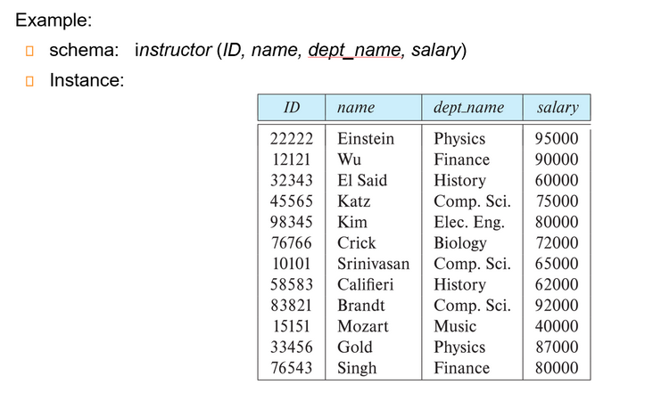
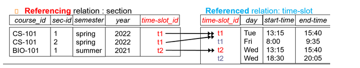
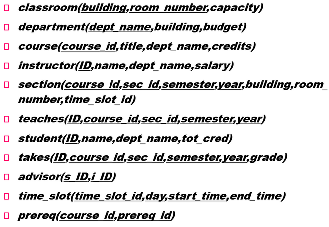
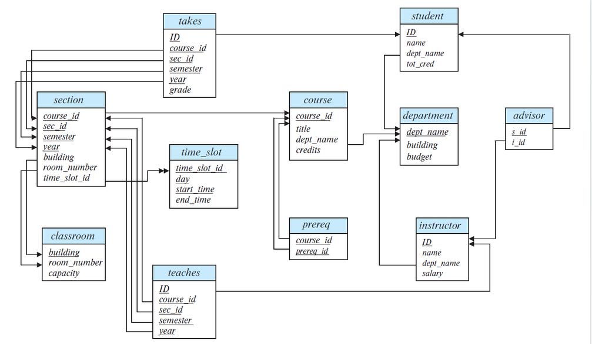
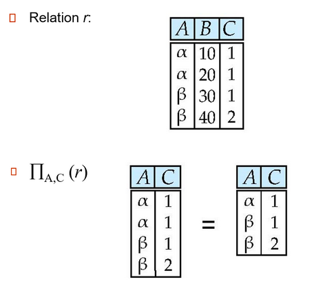
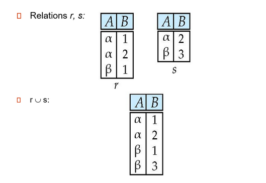
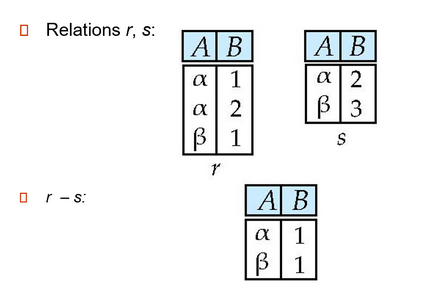
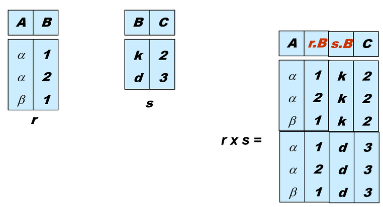
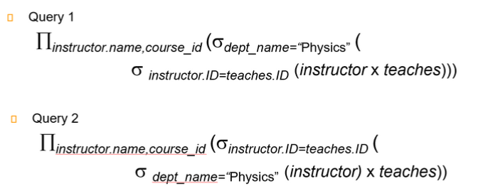

# Chap 2: Relational Model

## Structure of Relational Databases

- **关系型数据库**(relational database)：一组由单个或多个基于关系模型的**关系**构成的容器
- **关系模型**(relational model)
    - 特点：简单而优雅
    - 主要优势：简单的数据表示，容易表达复杂的查询（得益于 SQL）

- **关系**(relations)：有行有列的**表格**。关系的数学定义为：对于给定的集合 $D_1, D_2, \dots, D_n(D_i = a_{ij}|_{j=1 \dots k})$，**关系**$r$ 为笛卡尔积 $D_1 \times D_2 \times \dots \times D_n$ 的子集。
    - 笛卡尔积可以用一张二维表表示
    - 关系是一个由 n 元组(n-tuples) $(a_{1j}, a_{2j}, \dots, a_{nj})$ 构成的集合，其中 $a_{ij} \in D_i$
    - **属性**(attributes)
        - 关系内的每个属性都有一个名称
        - 每个属性的允许值的集合被称为属性的**域**(domain)
        - 属性值（通常）要求具备**原子性**(atomic)，即不可分割(indivisible)（满足第一范式(1st NF)）
        - 特殊值 **null** 是所有域的成员，它使得很多运算的定义变得复杂，因此在实践中我们希望尽可能地消除它

    - 关系是**无序的**(unordered)
        - 元组的顺序没有意义，可按任意顺序被存储
        - 因为关系的本质是一个集合，因此同一个关系内，不能存在重复的元组

- **联系**(relationship)：多个**实体**之间的关联

## Database Schema

关系的两大概念：

- **关系模式**(relation schema)：描述关系的结构，包含了一系列的属性及其对应的域
    - **假如有属性 $A_1, A_2, \dots, A_n$，那么 $R = (A_1, A_2, \dots, A_n)$ 就是关系模式，而 $r(R)$ 就是在关系模式 $R$ 上的一个关系**
    - 关系模式基本上不太会变化
- **关系实例**(relation instance)：在某个时刻上，对关系内的数据的快照(snapshot)
    - 关系上的当前值（即关系实例）会在表格中具体指明，且会随着关系的更新而改变
    - 关系 $r$ 的元素 $t$ 是一个**元组**，在表格上就是一**行**的记录；可用 $t[name]$ 表示 $t$ 在 $name$ 属性上的值

!!! example "Database schema vs Database instance"
    

## Keys

**键**(keys)：令 $K \subseteq R$，有以下几类键：

- **超键**(superkey)：对于每个可能的关系 $r(R)$，$K$ 能识别出唯一的元组。也就是说，对于元组 $t_1, t_2 \in r$ 且 $t_1 \ne t_2$，那么 $t_1.K \ne t_2.K$
- **候选键**(candidate key)：最小数量的超键，也就是说候选键的子集无法构成超键
- **主键**(primary key)：是一种候选键，且由数据库设计者显式选择的键（通常用下划线标出）
    - 主键也被称为**主键约束**(primary key constraints)
    - 被选中作为主键的属性的值不能或者很少发生改变
- **外键**(foreign key)：假设存在关系 $r(A, B, C), s(B, D)$，关系 $r$ 的属性 $B$ 是参照 $s$ 的外键，其中 $r$ 是**参照关系**(referencing relation)，$s$ 是**被参照关系**(referenced relation)
    - 参照关系中外键的值必须在被参照关系中实际存在或为 null
    - 在外键约束中，被参照的属性必须是被参照关系的主键

!!! warning "注意"

    上述这些键都有可能包含多个属性，不要以为主键一定只包含一个属性！

- Referential integrity(参照完整性)

    !!! Example 
        

        这里的`time-slot_id`不是关系$r_2$的主键，所以这里不是外键限制。

## Schema Diagrams

???+ example "例子：大学数据库的模式图"

    数据库内包含以下关系：

    
{width=60%}

    模式图：

    
{width=80%}

在模式图中，

- **主键**用下划线表示出来
- **外键约束**用一根从参照关系指向被参照关系的箭头表示
- **参照完整性约束**用一根双头箭头表示

## Relational Algebra

**关系代数**(relational algebra)包含了一组运算，这些运算接受一个或两个关系作为输入，产生一个新的关系作为结果。

**Six basic operators**

- select: $\sigma$
- project： $\pi$
- union: $\cup$
- set difference: $\setminus$
- catesian product: $\times$
- rename: $\rho$

### Select

- 选择运算记作：$\sigma_p(r) = \{t\ |\ t \in r \text{ and } p(t)\}$
- 其中 $p$ 称为**选择谓词**(selection predicate)，可通过连接符(connectives) 与（$\wedge$）、或（$\vee$）、非 $\neg$ 包含多个谓词
- 每个**项**的格式为：<attribute\> op <attribute\>/<constant\>，其中 op 是比较运算符（$=, \ne, >, \ge, <, \le$中的其中一种）
- 执行选择时，选择条件必须是针对同一元组中相应属性值代入进行比较

??? example "例子"

    

### Project

- 投影运算记作：$\prod_{A_1, A_2, \dots, A_k}(r)$，其中 $A_1, \dots, A_k$ 是属性名称
- 运算结果为包含指定的 $k$ 列关系，那些没有指定的列会被排除在外
- 由于返回的也是关系，所以投影结果中重复行会被自动删除

??? example "例子"
    

    容易忽略的地方是需要删除重复行

### Union
- 并运算记作：$r \cup s = \{t\ |\ t \in r \text{ or } t \in s\}$
- 上述运算的合法条件为：两个关系必须是可兼容的，具体指
    - $r$ and $s$ must have the same **arity（元数）**(same number of attributes)
    - The attribute domains must be **compatible**

??? example "例子"
    
{width=80%}

### Set Difference
- 差运算记作：$r - s = \{t\ |\ t \in r \text{ and } t \notin s\}$

同理， Set differences must be taken between compatible relations

??? example "例子"
    
{width=80%}

### Cartesian Product

- 笛卡尔积记作：$r \times s = \{\{t, q\}\ | \ t \in r \text{ and } q \in s\}$
- 若 $r, s$ 分别有 $n_1, n_2$ 的元组，那么它们的笛卡尔积有 $n_1 \cdot n_2$ 个元组 
- 若两个关系存在**同名**属性，那么需要将它们区分开来，可行的方法有：
    - 在名称前加上 `关系名.` 的前缀
    - 重命名（下面将会介绍）

??? example "例子"
    
{width=80%}

### Rename
- 命名运算记作：$\rho_X(E)$ 返回在名称 $X$ 下的表达式 $E$

!!! Composition of Operations 1
    Find the names of all instructors in the Physics department, along with the course_id of all courses they have taught.

    

    这两条语句含义一样，但第二条我们先进行了一次 select, 条目少了更高效。 

!!! Composition of Operations 2
    Find the largest salary in the university.

    - Find instructor salaries that are less than some other instrucotr salary (i.e. not maximum) using a copy of instructor under a new name $d$

        $\prod_{instrucor.salary}(\sigma_{instructor.salary < d.salary}(instructor \times \rho_d(instructor)))$
    
    - Find the largest salary
        $\prod_{instructor.salary} - \prod_{instructor.salary}(\sigma_{instructor.salary < d.salary}(instructor \times \rho)d(instructor))$
    
    我们第一步将两个关系拼起来之后，限定 instructor 的工资小于 d, 随后投影我们就可以获得所有不是最大值的薪水。（因为任何不是最大值的薪水都会在笛卡尔积 select 后至少存在一个元组，这样投影之后仍会存在。但最大值就不会有元组存在），最后用全集减掉即可。

### Additional Operations
- Set intersection: $r \cap s$
- Natural join: $r \bowtie s$
- Assignment: $\leftarrow$
- Outer join : $r \rtimes       s$,  $r  \ltimes    s$, $r$⟗$s$
- Division: $r \div s$

#### Set-Intersection

The **set-intersection** operation allows us to find tuples that are in both the input relations.  
$r\cap s=\{t| t\in r\ and\ t\in s\}$  

* $r, s$ have the same arity 
* attributes of $r$ and s are compatible

??? Example "Set-Intersection Operation Example"
    
  
 

#### Natural-Join Operation

Let r and s be relations on schemas R and S respectively.  Then,  $r\bowtie     s$ is a relation on schema $R \cup S$ obtained as follows:

* Consider each pair of tuples $t_r$ from $r$ and $t_s$ from $s$.  
* If $t_r$ and $t_s$ have the same value on each of the attributes in $R \cap S$, add a tuple $t$ to the result, where
    * $t$ has the same value as $t_r$ on $r$
    * $t$ has the same value as $t_s$ on $s$

即共同属性要有相同的值，才能在拼接后的结果中保留。  
对乘法的扩展，相当于先 $\times$ 再 select, 最后 project.  

??? Example "Natural Join Example"
    
  
 

* **Theta Join**  
$r\bowtie_\theta s=\sigma_\theta (r\times s)$  
条件连接

#### Outer Join

Computes the join and then adds tuples form one relation that does not match tuples in the other relation to the result of the join.   

Uses *null values*:  

* **null** signifies that the value is unknown or does not exist 
* All comparisons involving null are (roughly speaking) false by definition

Outer join can be expressed using basic operations.  

* $r\rtimes s=(r\bowtie s)\cup (r-\cap_R(r\bowtie s)\times \{null,\ldots,null\})$
* $r\ltimes s=(r\bowtie s)\cup \{null,\ldots,null\}\times (s-\cap_R(r\bowtie s))$
* $r$⟗$s$ $=(r\bowtie s)\cup (r-\cap_R(r\bowtie  s))\times \{(null, \ldots)\}\cup\{(null,\ldots,null)\}\times (s-\cap_s(r\bowtie s))$

??? Example "Outer Join Example"
    
  
 
    
  
  

#### Semijoin  

$r\ltimes_\theta s$ 保留 $r$ 中能与 $s$ 相连的元组。

??? Example "Semijoin Example"
    
  
 

#### Division

Given relations $r(R)$ and $s(S)$, such that $S \subset R$, $r\div s$ is the largest relation $t(R-S)$ such that $t\times s \subsetneqq  r$  

We can write $r\div s$ as  

$$
\begin{align*}
    temp1 & \leftarrow \Pi_{R-S}(r)\\
    temp2 & \leftarrow \Pi_{R-S}((temp1 \times s)- \Pi_{R-S,S}(r))\\
    result & = temp1 - temp2
\end{align*}
$$

??? Example "Division Example"
    
  
 
    
  
 

??? note "应用实例"
    1. Find all the students who have taken all courses given by the Computer Science department.
    2. Find all the teachers who have taught all fundamental computer science courses

### Aggregate Functions and Operations

* **Aggregation function**（聚合函数）takes a collection of values and returns a single value as a result.  
    * *avg*: average value
    * *min*: minimum value
    * *max*: maximum value
    * *sum*: sum of values
    * *count*: number of values

* **Aggregate operation** in relational algebra $G_1,G_2,\ldots,G_n \mathcal{G}_{F_1(A_1),\ldots F_n(A_n)}(E)$  

!!! Example "Aggregate Operation Example"
    
  
 

分组结果没有名字，可以用 rename 或者 as 进行改名。  
***e.g.*** `dept_name G avg(salary) as avg_sal (instructor)`

### Multiset Relational Algebra

关系代数中，我们要求关系要是一个严格的集合（即满足不可重复性）
但实际数据库中并不是，而是一个多重集，允许有重复元素存在。  
因为一些操作的中间结果会带来重复元素，要保持集合特性开销很大，因此实际操作中不会去重 

## SQL and Relational Algebra

* `select A1, A2, ... An from r1, r2, ... rm where P` is equivalent to $\Pi_{A_1,\ldots, A_n}(\sigma_P(r_1\times r_2\ldots r_m))$ 
* `select A1, A2, sum(A3) from r1, r2, ... rm where P group by A1, A2` is equivalent to $A_1, A_2 \mathcal{G} sum(A_3)(\sigma_P(r_1\times r_2\times\ldots r_m))$  
这里按 $A_1,A_2$ 分组，那么结果的表中会有 $A_1,A_2,sum(A_3)$ 三列（分组依据+分组后的聚合结果），这里我们需要的就是这三列，所以分组即可。但是假设我们只需要 $A_1, sumA3$ 那么最后还需要投影。
 