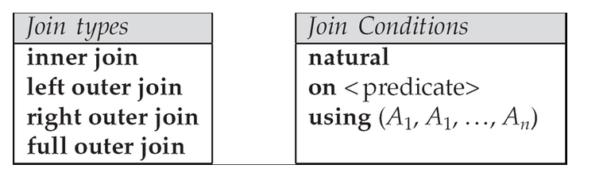
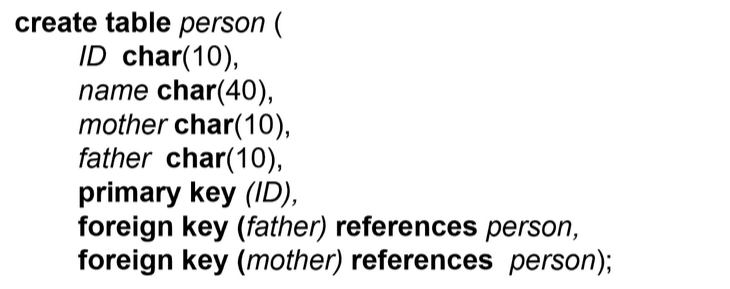
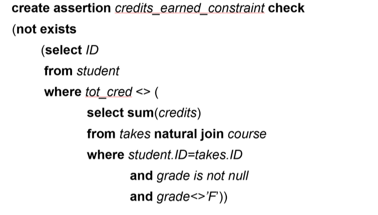
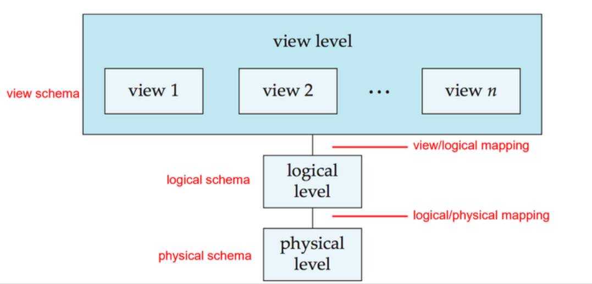
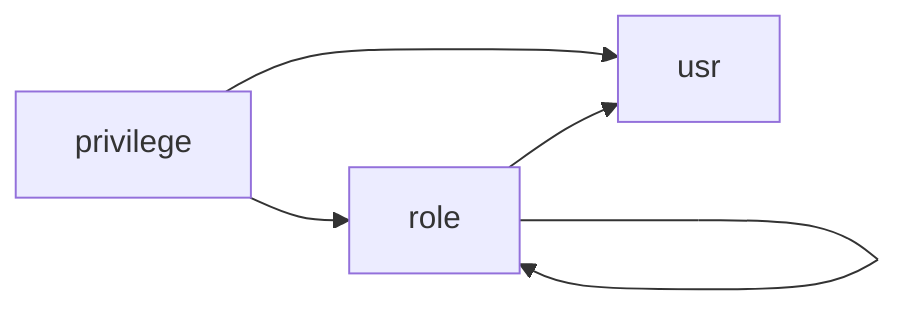

# Chap 4:Intermediate SQL

!!! Abstract
    - Joined Relation
    - SQL Data Types
    - Integrity Constraints
    - Views
    - Indexs
    - Transactions
    - Autorization

## Joined Relations
- 关系的连接(Join)是关系代数中最重要的操作之一
- 连接操作的结果是一个新的关系，它包含了两个关系中所有的元组



- 连接类型
    - **内连接**(inner join)：只保留两个关系中相同属性的值相等的元组
        - 例如：`R1 INNER JOIN R2 ON R1.A = R2.B`
    - **外连接**(outer join)：保留所有的元组，包括那些没有匹配的元组
        - 例如：`R1 LEFT OUTER JOIN R2 ON R1.A = R2.B`
        - left outer join：保留左表中所有的元组
        - right outer join：保留右表中所有的元组
        - full outer join：保留两个表中所有的元组
    - **交叉连接**(cross join)：笛卡尔积，保留所有的元组
        - 例如：`R1 JOIN R2`
- 连接条件
    - natural join
        - natural join 是一种特殊的内连接(inner join)
        - natural join 会自动识别两个关系中相同属性的值相等的元组
        - 例如：`R1 NATURAL JOIN R2`
    - using 子句
        - using 子句用于指定连接条件中使用的属性
        - using 子句可以简化连接条件的书写
        - 例如：`R1 JOIN R2 USING (A, B)`
    - on 子句
        - on 子句用于指定连接条件中使用的属性
        - on 子句可以包含任意的逻辑表达式
        - 例如：`R1 JOIN R2 ON R1.A = R2.B AND R1.C > R2.D`

??? info "ON 子句和 WHERE 子句的区别"
    - ON 子句
        - 作用：专门用于连接表时指定关联条件（如 JOIN 操作），定义表之间的匹配规则。
        - 适用场景：所有类型的连接（INNER JOIN、LEFT JOIN、RIGHT JOIN、FULL JOIN）中，指定表间关联的列或条件。
        - 示例：
            ```SQL
            SELECT * FROM A 
            LEFT JOIN B ON A.id = B.id AND B.status = 1;  -- ON 包含连接条件和附加筛选
            ```
    - WHERE 子句
        - 作用：在生成临时表后对结果进行过滤，筛选最终返回的数据。
        适用场景：所有查询，用于全局过滤符合条件的行。
        - 示例：
            ```SQL
            SELECT * FROM A 
            LEFT JOIN B ON A.id = B.id 
            WHERE B.status = 1;  -- WHERE 过滤最终结果
            ```

!!! example "Outer Join 的应用"
    ```sql
    Select instructor.id, count(course_id),count(takes.id)
    From (instructor natural left outer join teaches)
        left outer join takes using(course_id,sec_id,semester,year)
    Group by instructor.id;
    ```

    含义：提取每位教师教授的课程数以及每位教师教授的课程总的选修人数

## SQL Data Types and Schemas
### Built-in Data Types in SQL
- **data**: Containing year, month and date
    - Example: data '2005-7-27'
- **time**: Time of day, in hours, minutes and seconds.
    - Example: time '09:00:30'
- **timestamp**: data plus time of day
    - Example: timestamp '2005-7-27 09:00:30.75'
- **interval**: period of time
    - Example: interval '1' day
    - Substracting a data/time/timestamp value from another gives an interval value
    - Interval values can be added to date/time/timestamp values
- **data, time functions:**
    - current_data(), current_time()
    - year(x), month(x), day(x), hour(x), minute(x), second(x)

### User-Defined Types
- 用户定义类型是 SQL 中的一种数据类型
- 用户定义类型可以是基本数据类型的组合
- 我们通过 `create type` 语句来创建用户定义类型

!!! Example
    ```sql
    create type Dollars as numeric(12,2)

    create table department
        (dept_name varchar(20),
        building varchar(15),
        budget Dollars);
    ```

    - 这里的 `Dollars` 就是一个用户定义类型
    - `Dollars` 是一个 numeric 类型，精度为 12，标度为 2
    - `Dollars` 可以作为属性用于定义表中的列

用户定义类型的好处是：

- 可以更加灵活的定义类型
- 可以支持强类型检查
    - 例如：虽然美元和欧元都是货币类型，可以用基本类型 numeric 来表示，但实际上他们是不同的类型，存在汇率转换，因此不能直接相加。通过用户定义类型分别定义这两种钱币，可以避免出现如200美元+300人民币得到500元的错误

### Domains
- 类似于 User-Defined Types， Domain是 SQL-92中的一种用户自定义数据类型
- 但是 Domains 可以拥有 constraints， 例如 **not null**: `create domain person_name char(20) not null`

!!! Example "Example"
    ```sql
    create domain degree_level varchar(10)
    constraint degree_level_test
    check (value in ('Bachelors', 'Masters', 'Doctorate'));
    ```

### Large-Object Types
Large objects(photos videos, CAD files, etc.) are stored as a large object.

- **blob**: binary large object -- object is a large collection of uninterpreted binary date(whose interpretation is left to an application outside of the database system)
- **MYSQL BLOB** datatypes:
    - **TinyBlob**: 0-255 bytes
    - **Blob**: 0-64K bytes
    - **MediumBlob**: 0-16M bytes
    - **LargeBLob**: 0-4G bytes
- **clob**: character large object -- object is a large collection of character data
- When a query returns a large object, usually a pointer is returned rather than the large object itself

### Integrity Constraints
- `not null`
- `primary key`
- `foreign key`
- `unique`
    `unique(A1, A2, ..., Am)`: The unique specification states that the attributes `A1, A2, ..., Am` from a **super key**(不一定是 candidate key)

    比如学生个人信息，我们知道ID是主键，但是实际上邮箱、电话号码等也不能是相同的，所以我们要通过语句告诉数据库，数据库会为我们维护这些完整性约束条件

- `check(P)`，where P is a predicate
    - `check` 约束条件是一个布尔表达式，只有当表达式为真时，才允许插入或更新数据
    - 例如
        ```sql
        create table section(
            course_id varchar(8),
            sec_id varchar(8),
            semester varchar(6),
            year numeric(4,0),
            building varchar(15),
            room_number varchar(7),
            time_slot+id varchar(4),
            primary key (course_id, sec_id, semester, year),
            check (semester in ('Fall', 'Winter', 'Spring', 'Summer'))
        );
        ```

!!! info "Integrity COnstraint Violation During Transactions"
    交易期间违反了完整性，例如：

    <center>{width=60%}</center>

    在一个人的父母还没插入时，无法插入这个人，以此类推。

    可以规定，在这个事务结束时在检查完整性约束条件，中间状态可以不满足。

- `asserstion`

`create assertion <assertion-name> check <predicate>;`

!!! Exmample
    验证一个学生获得的总学分，要等于获得的每门课的学分的总和。

    <center>{width=60%}</center>

    但是用`aassert`后，每个元组的每次状态更新都要进行检查，开销过大，数据库一般不支持。

## View
A **view** provides a mechanism to hide certain data from the view of certain users.

### View Definition
视图是使用具有以下形式的创建视图语句定义的：`create view v as < query expression >

例如 A view of instructors without their salary

```sql
create view faculty as 
    select ID, name, dept_name
    from instructor
```

view 可以理解为：是一种可以隐去一些用户不需要知道/无权限知道的细节，也可以另外加上一些统计数据的虚表。我们可以把 view 当作表进行查询，所有语法基本相同

并且不仅可以通过真实表来定义视图，也可以通过视图来定义视图

例如：

```sql
    create view physics_fall_2009 as
        select course.course_id,sec_id,building,room_number
        from course, section
        where course.course_id = section.course_id
            and course.dept_name = 'Physics'
            and section.semseter = 'Fall'
            and section.year = '2009'
    
    create view physics_fall_2009_watson as 
        select course_id, room_number
        from physics_fall_2009
        where building = 'Watson';
```

!!! info "view 的好处"
    - 隐藏不必要的细节，简化用户视野
    - 方便查询书写
    - 有利于进行权限控制（如学生可以看到教师的个人信息，但是不能看到教师的工资，不然不利于团结）
    - 区别于真实表，有独立性，使得数据库应用具有较强的适应性

### Update of a view
对于一个 view 进行修改，相当于通过这个窗口对原表继续修改

例如：(Add a new tuple to faculty view which we defined earlier)

```sql
create view faculty as 
    select ID, name, dept_name
    from instructor

Insert into faculty values('30765','Green', 'Music');
```

插入后，原表也会有这条数据，对于插入的values中缺少的`salary`属性，数据库会自动设定为`NULL`

!!! warning "不可更改的情况"
    就上面的例子而言，显然我们可以发现，当原表定义时的`salary`属性约束为`not NULL`时，会造成矛盾，所以我们无法执行这次插入，系统会报错。

    另外，当视图中涉及原表中没有的属性（例如统计的属性列），那么更改视图也可能无法对原表造成修改。

### View and Logical Data Independence
有些时候，关系表属性列过多，导致关系过大，我们希望将其分裂成两个子关系，而让子关系通过一些约束建立联系。

那么如果关系$S(a,b,c)$被分裂成两个子关系$S_1(a,b)$和$S_2(a,c)$，我们如何实现逻辑数据独立？


- `create table S1...`; `create table S2...`;
- `create table S1...`; `create table S2...`;
- `insert into S1 select a, b from S`; `insert into S2 select a, c from S`;
- `drop table S`;
- `create view S(a, b, c) as select a, b, c from S1 natural join S2`;

`select * from S where...` 实际上是在做 `select * from S1 natural join S2 where ...` （系统会帮我这样做，程序不用改，只是执行改变了） `insert into S values (1,2,3)` 实际上是在做 `insert into S1 values (1,2)` 和 `insert into S2 values (1,3)`

回到 [Chap1 view-if-data](ch1.md#view-of-data) 的这张图上

<center>{width=80%}</center>

View 的定位其实是面向用户的接口层，定义用户课件的数据组织形式，不产生真实的物理数据，是一张“虚表”

而在实际运作时，将对 view 操作的语句通过 view-logical mapping 映射到 logical 层，再对 logical 以及 physical 上存在的真实表进行操作

### \*Materialized Views
Materializing a view: create a **physical** table containing all the tuples in the result of the query defining the view.

本来的视图是一个虚的表，为了查询执行效率，我们可以把 view 定义为 Materializing view, 即生成一张临时表与其对应。（不然总是会将 view 映射成类似 `select.... from.... where....`的 sql 子句，使得查询语句可能出现较多的嵌套。

然而缺点是：

- 如果查询中使用的关系被更新，则物化视图结果就会变得过时。
- 因此需要时常维护视图，当底层关系更新时，通过更新视图来维护视图

这也体现了数据库中的一个比较核心的思想：**查询效率和维护频率往往不能兼有，查询效率的提升通常意味着维护频次的提升**

## Indexes
索引是用于加速访问具有索引属性的指定值的记录的数据结构

Index 相当于在数据上建立了 B+ 树索引（物理层面）

!!! Example
    ```sql
    create table student    
    (   ID varchar (5),
        name varchar (20) not null,
            dept_name varchar (20),
                tot_cred numeric (3,0) default 0,
                    primary key (ID) )
    create index studentID_index on student(ID)
    ```
    
    `select * from student where ID = '12345' 在数据库内不同的物理实现有不同的查找方法

    如果没有定义索引，只能顺序查找。如果有索引，系统内会利用索引进行查找。

## Transactions
- Transactions begin Implicitly
    - But can be manually ended by `commit work`/`commit` or `rollback work`/`roolback`
- By default on most databases: each SQL statement commits automatically 
    - Can turn off auto commit for a session ***e.g.*** in MYSQL, `SET AUTOCOMMIT = 0;`

!!! Example
    ```sql
    SET AUTOCOMMIT=0

    UPDATE account SET balance=balance-100 WHERE ano=‘1001’;
    UPDATE account SETbalance=balance+100 WHERE ano=‘1002’;
    COMMIT;

    UPDATE account SET balance=balance -200 WHERE ano=‘1003’;
    UPDATE account SET balance=balance+200 WHERE ano=‘1004’;      COMMIT;

    UPDATE account SET balance=balance+balance*2.5%;
    COMMIT;
    ```

### ACID Properties
A transaction is a unit of program execution that accesses and possibly updates various data items.To preserve the integrity of data the database system must ensure: **ACID**

- Atomacity（原子性）：事务的所有操作要么都正确地反映在数据库中，要么都不反映
- Consistency（一致性）：事务执行前后，数据都是正确的，不存在矛盾
- Isolation（隔离性）：尽管多个事务可以并发执行，但是每个事务不能知道其他并发执行的事务，多个事务之间需要隔离，事务的中间结果需要对其他事务隐藏。
- Durability（持久性）：事务完成后，即使系统出现故障（如断电等），它对数据库所做的更改仍然会保留下来

## Authorization
- Forms of authorization on parts of the database

    数据层面，即表已经存在我们可以对其进行的操作

    - Select - allows reading, but not modification of data.
    - Insert - allows insertion of new data, but not modification of existing data.
    - Update - allows modification, but not deletion of data.
    - Delete - allows deletion of data.

- Forms of authorization to modify the database schema

    能否定义表，索引等

    - Index - allows creation and deletion of indices.
    - Resources - allows creation of new relations.
    - Alteration - allows addition or deletion of attributes in a relation.
    - Drop - allows deletion of relations.

### Authorization Specificaton in SQL
sql 通过 grant 语句 `grant <privilege list> on <relation name or view name> to <user list>`

把某个表或者视图上的权限授权给用户

其中`<user list>` 可以是:

- a user-id
- public, which allows all valid users the privilege granted
- A role (more on this later)

!!! Example 
    ```sql
    grant select on instructor to U1, U2, U3,
    grant select on department to public
    grant update(budget) on department to U1, U2
    grant all privileges on department to U1
    ```

    可见，其中 `update` 可以细化到具体对表或视图中的哪一列做修改

### Revoking Authorization in SQL
The revoke(收回) statement is used to revoke authorization

`revoke <privilege list> on <relation name or view name> from <user list>`

### Roles
Previleges can also be granted to **Roles**

roles（角色）介于 user list 和 privilege list 之间，本质是一组权限的**集合**，而通常它也会被授权给特定的人群，代表了数据库权限中的一种角色

我们可以通过`create role <role-name>`创造角色，随后可以把权限授予给他

<center>

</center>

!!! Example
    ```sql
    create role instructor;
    grant select on takes to instructor;
    grant instructor to Amit;

    create role teaching_assistant;
    grant instructor to teaching_assistant;
    ```

    这里我们创建了一个角色 instructor，授予了他对表 takes 的查询权限，并且将这个角色授予了用户 Amit

    另外我们还创建了一个角色 teaching_assistant，并将 instructor 的权限授予了 teaching_assistant

### Other Authorization Features


