# Chap 6: Entity-Relationship Model

!!! note "概述"
    实体关系模型（Entity-Rellioship Model，简称ER模型）是数据库设计中的核心工具，主要用于概念设计阶段，以图形化方式描述现实世界的数据结构、约束和关联关系。其核心作用包括以下方面：

    1. 描述数据逻辑结构
        ER模型通过实体（现实世界中的对象）、属性（实体的特征）和关系（实体间的联系）三要素，抽象化地表示业务场景中的数据需求。例如，学生、课程、选课等实体及其关联关系可以通过ER图直观表达
    2. 支持数据完整性
        ER模型通过主键、外键和参与约束（如完全参与、基数约束）等机制，确保数据的一致性和完整性。例如，学生选课记录必须依赖学生和课程的存在，避免孤立数据
    3. 促进沟通与协作
        ER图作为一种图形化工具，为非技术人员（如业务方）与数据库设计者提供了共同语言，便于需求分析和方案验证 
    4. 指导数据库实现
        ER模型是后续逻辑设计的基础，可转换为关系模式（即数据库表结构），并进一步优化为物理存储方案。例如，多对多关系需通过中间表实现
    5. 适应复杂场景
        ER模型支持递归关系（如员工之间的上下级关系）、三元关系（如供应商-零件-项目）及继承关系（如学生作为员工的子类）等复杂数据建模

!!! tip "Design diagram"
    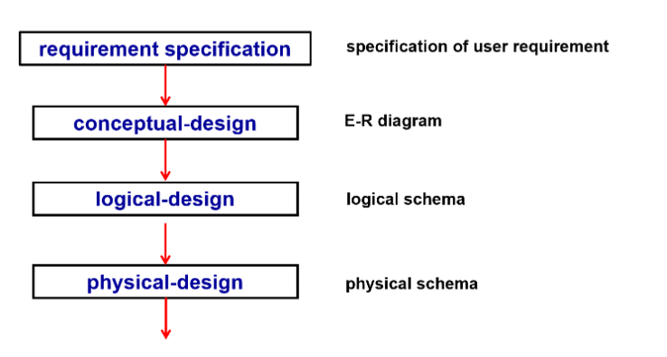

## E-R diagram
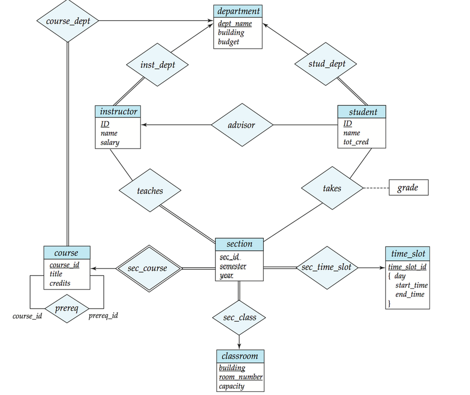

- 一个方形框代表一个实体的集合，在下方列出它的属性
- 一个菱形框表示实体与实体之间存在的关系
    - 一对一(<->)
    - 一对多(<-)
    - 多对一(->)
- 每个实体直接转换为关系模式。 关系转换为元组，元素为两个表的 primary key
- 双横线表示每个对象都必须参与关系，单横线则表示对象可以不参与关系
- 弱实体依赖于另一个实体存在（？还是不太理解什么时候需要设置为弱实体）表示依赖关系的菱形有两条框线
    
    例如：section 不足以唯一确定元组，称为弱实体，依赖于另一个实体（如 OOP、DB 都可以有同样年份学期的 1 班）。因为课程号 course_id 放在 section 会有冗余，因此没有这个属性，导致形成了一个弱实体。 sec_course 表示联系的是弱实体（双框），section 不能离开 course 存在。

- 关系上可以带有属性，如`takes`上的`grade`
- 关系双方可以是相同的实体集合。

    例如：course 这里的 prereq 是多对多，表示一门课可以有多门预修课，一门课也可以是多门课的预修课

- 实体的属性可以是复合属性，`{}`里面是多个值，表示复合属性。这里表示`time_slot_id`实际上可以由这三个属性复合而成

---

接下来对实体关系模型图中的各概念进行一个详细的介绍

## Database Modeling
A database can be modeled as:

- a collection of entities,
- relationship among entities.

### Entities
- An **entity** is an object that exists and is **distinguishable** from other objects.
    - ***e.g.*** specific person, company, event, plant Entities have **attributes**
    - ***e.g.*** people have names and addresses

- An entity set is a set of entities of the same type that share the same properties.
    - ***e.g.*** set of all persons, companies, trees, holidays

Entity sets can be represented graphically as follows:

- Rectangles represent entity sets.
- Attributes listed inside entity rectangle
- Underline indicates primary key attributes

!!! Example
    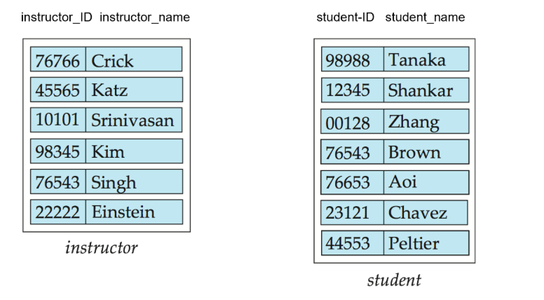

### Relationship Sets
- A relationship is an association among several entites.
- A relationship set is a mathematical relaiton among entity set.

本质上是一个集合，包含了所有的关系元组，元组中的元素通常而言是所连接的实体的主键。

!!! Example
    

- An attribute can also be property of a relationship set.

***e.g.*** The advisor realationship has an attribute since when, which indicates the date when the advisor started advising the student.

!!! Example
    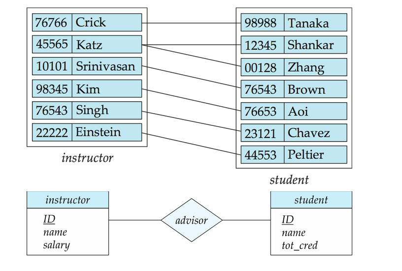

- Entity sets of a relationship need not to be distinct.

- Each occurrence of an entity set plays a "role" in the relationship.

- The labels `course_id` and `prereq_id` indicate the roles played by the entity set `course` in the relationship set `prereq`.

!!! Example 
    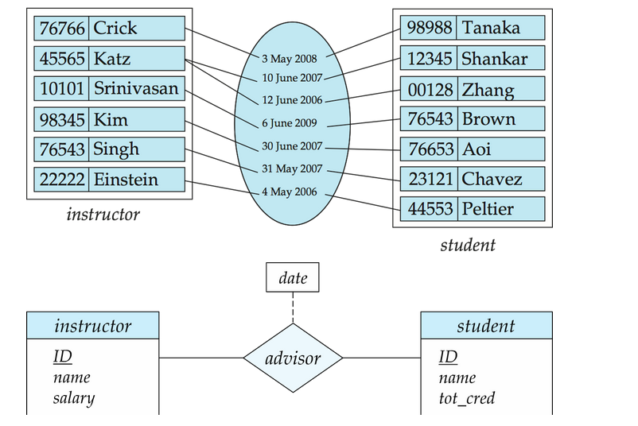

- Relationship set has **degree**, which is the number of entity sets that participate in the relationship set.
- A relationship set with degree 2 is called a **binary relationship**.

尽量不使用多元联系，因为二元联系比较清晰。而且任何的多元联系都可以通过引入中介实体转化为二元联系。在[下文](#binary-vs-non-binary-relationships)会有详细阐述

!!! Example
    

    例如我们可以这样把上述图中`proj_guide`的三元联系转换为二元联系：新增一个 entity `proj_guide`，该实体包含老师、学生、工程的 `id`，随后这个实体与另外三个实体各有一个二元联系。

### Attributes
An entity is represented by a set of attributes, that is decriptive properties possessed by all members of the entity set.

**Attribute types:**

- Simple and composite attributes
- Single-valued and multi-valued attributes
    - ***e.g.*** multivalued attribute: `phone_numbers`
- Derived attributes
    - Can be computed from other attributes
    - ***e.g.*** `age` can be derived from `date_of_birth`

!!! Example
    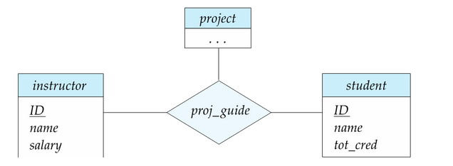

### Mapping Cardinality Constraints
- one to one
- one to many
- many to one
- many to many

我们通过绘制有向线 -> 或无向线 —— ，表示联系集与实体集之间的“多”。

### Total and Partial Participation
- Total participation: every entity in the entity set must participate in the relationship set.
- Partial participation: some entities in the entity set may not participate in the relationship set.

其中 Total participation 用双线表示，Partial participation 用单线表示。

### Notation for Expressing More Complex Constraints
> E-R diagram 并没有一个确切统一的标准，下面这种方式也可以表达实体的参与情况，可以完全替代有向线和双线的表达。

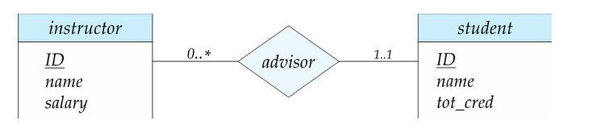

- 一行包含了最小和最大的基数
- 最小值 1 表示一个实体最少参与一个关系
- 最大值 1 表示一个实体最多参与一个关系
- 最大值 * 表示没有限制

那么上图表示的就是： 一个 instructor 可以不参与对 student 的指导，但是可以指导无上限个学生；每个 student 必须有一个 instructor 指导，且最多只能有一个 instructor 指导。

### Primary Key
For realtionship sets, primary key is a set of attributes that can be used to uniquely identify a relationship in a relationship set.

通常情况下，关系集的主键是两个实体的主键的组合（注意这里所说的“组合”并不等同于关系集的主键就是两个实体的主键）例如：上图中的 `advisor` 关系集的主键是 `student_id` 和 `instructor_id` 的组合。

由于 `instructor` 和 `student` 是一对多的，因此关系集的主键为 `instructor_id`；当然若为多对多，则关系集主键为 `instructor_id` 和 `student_id`；若为多对一，则关系集主键为 `student_id`

### Weak Entity Sets
- A weak entity set is an entity set that does not have a primary key.
- A weak entity set is always associated with a strong entity set, which is called the owner of the weak entity set or **identifying entity set**.

弱实体集的**discriminator**(**partial key**)是用来区分弱实体集内所有实体的属性集。

我们用虚线来标出弱实体集的鉴别符（部分键）/dicriminator(partial key)，用双菱形来表示弱实体与其强实体(identifying entity set)的标识性联系(Identifying relationship)

!!! Example
    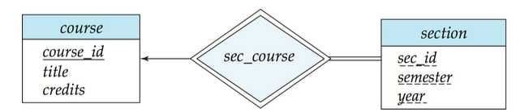

!!! info "冗余属性"
    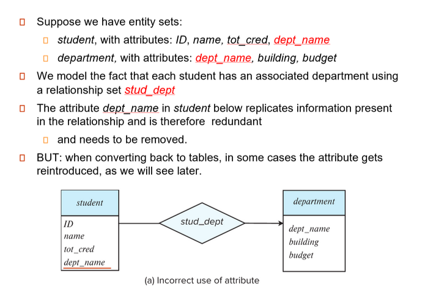

## Reduction to Realtional Schemas
!!! info "ER model vs. Relational Schemas"
    - 实体关系模型（ER model）是数据库概念设计的核心工具，用于抽象数据要求、确保逻辑完整性并指导数据库实现
    - 关系模式（Relational Schemas）是关系数据库中对表结构的定义，描述属性、约束及表间关联、是ER模型向物理存储转换的关键中间层。两者的结合为高效、可靠的数据库设计提供了方法论基础。
    - ER 模型到关系模式的转换
        - 实体转换：每个实体类型转换为一个关系模式，例如学生实体映射为`Student(Sno,Sname,...)`
        - 联系转换：根据联系类型（1：1，1：N，N:N）调整外键设计。例如，多对多联系“学生选课”可以创建中间表`Enrollemnt(Sno,Cno, Grader)`

一个 ER 图可以被转换(reduced)为多种模式（图数据库、面向对象、关系模式等）

对于 ER -> 关系模式的转换而言：

- 强实体集转换为具有相同属性的关系模式
    - ***e.g.*** `course(course_id, title, credits)`
- 弱实体集转换为具有相同属性的关系模式，并添加一个外键属性，指向其标识性实体集。即标识实体集的主键加上弱实体集的部分键
    - ***e.g.*** `section(course_id, sec_id, semester, year)`
    - 对应的标识性联系（Identifying relationship）往往直接忽略，不再需要做相应的转换
    - 因此往往 E-R 图中，由弱实体集而非其标识性实体集参与关系。如 [University E-R Diagram](#e-r-diagram) 中的 `section` 关系集
- 多对多的关系集必须被转换为具有两个实体的主键以及关系集自带属性的关系模式
    
    !!! Example
        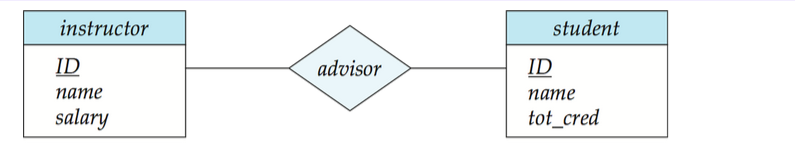
    
        `advisor` 被转换为 `advisor(instructor_id, student_id)`，其中 `instructor_id` 和 `student_id` 分别是两个实体的主键

    !!! question "为什么多对多的关系一定要转换成一个关系模式？"
        1. 在对多对的关系中，我们无法仅通过在一个表中添加一个引用另一个表主键的外键来实现
        2. 如果我们有两个实体，例如学生和课程。一个学生可以选多门课，一门课可以被多个学生选。在这种情况下，我们无法只添加一个字段在学生表或者课程表中来呈现出这种关系

- 多对一和一对多的关系集可以不需要转换成一个关系模式，另一种方式是只需在“多”一方的关系模式中添加一个指向“一”一方的主键的外键约束以及关系集附带的属性即可。
    
    !!! Example
        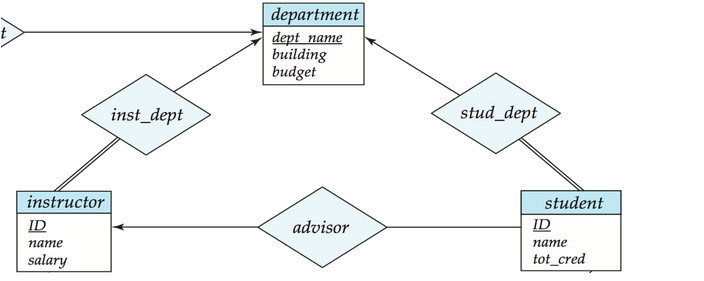

        一种方式是将关系集转换成一个关系模式
        
        ```sql
        department(dept_name, building, budget)
        instructor(ID, name, dept_name, salary)
        inst_dept(ID,dept_name)
        ```

        另一种方式是在“多”的一方的关系模式中添加一个指向“一”的一方的主键的外键约束，减少了表的数量
        
        ```sql
        department(dept_name, building, budget)
        instructor(ID, name, dept_name, salary)
        ```

        这两种方法是等价的，选择不同方法需要考虑 trade-off：第一种写法可能会过于冗杂，第二种写法将表合并在一起，可能使得表过大，不利于管理
- 一对一关系集可以将任一方视为"多"的一方，按照一对多和多对一的关系集进行转换

### Composite and Multivalued Attributes
如果一个实体集中存在复合属性或者多值属性，我们又应该如何将其转换为关系模型呢？

<center>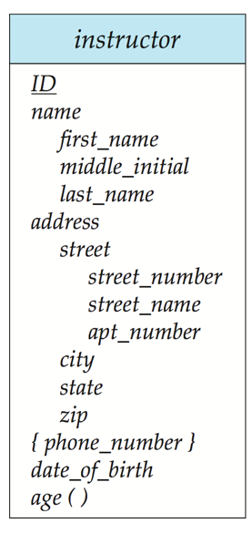{width=30%}</center>

- 对于复合属性，只需将其铺平
    - ***e.g.***
        ```sql
        instructor(ID, 
        first_name, middle_initial, last_name,      
        street_number, street_name, apt_number, 
        city, state, zip_code, date_of_birth, age)
        ```
- 对于多值属性，我们看到`phone_number`并没有出现在上面 `instructor`的关系模式中：
    - 实体 E 的多值属性 M 需要一个单独的关系模式 EM 表示
    - 模式 EM 具有与 E 的主键相对应的属性以及与多值属性 M 相对应的属性

    !!! Example
        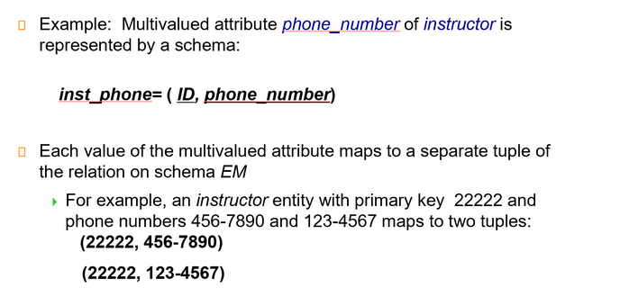

!!! question "讨论"
    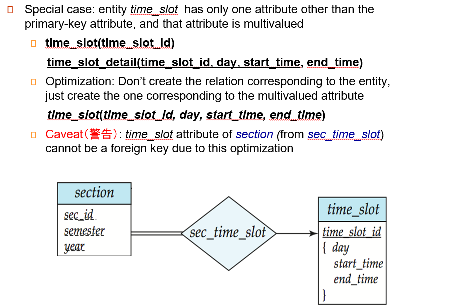{width=70%}

    对于上面的 E-R 图，按照我们前面所述的转换规则，应该将 `time_slot`
    转换为 `time_slot(time_slot_id)`和`time_slot_detail(time_slot_id, day, start_time, end_time)`这两个关系模式

    但是实际上，某些时候会做这样的优化，删除掉`time_slot(time_slot_id)`这个关系模式

    当然这也是一种 **trade-off**，虽然减少了表的数量，但是`section`对应的关系模式中就不能定义`time_slot_id`的外键约束，因为`time_slot_id`并不是`time_slot`的主键，因此此时外键约束可能需要通过触发器实现。

---

## Design Issues
前面我们介绍了 E-R 图的基本概念以及 E-R 图设计向关系模式的转换

我们不难感觉到 E-R 图的设计是千变万化的，每个人都可能设计出不同的 E-R 图，也可能在不同应用场景下，存在不同的疏漏以及带优化的地方。

下面我们关注对 E-R 图设计的评估

### Common Mistakes in E-R Diagrams

- 信息冗余

student 的 dept_name 应该去掉 

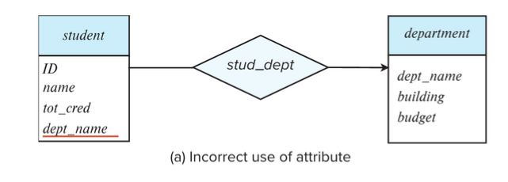

- 关系属性使用不当

这里一门课可能有很多次作业，不能只用一个实体。 

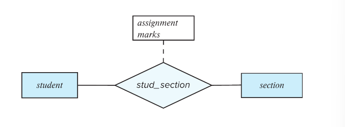

正确的 E-R 图设计可能为：

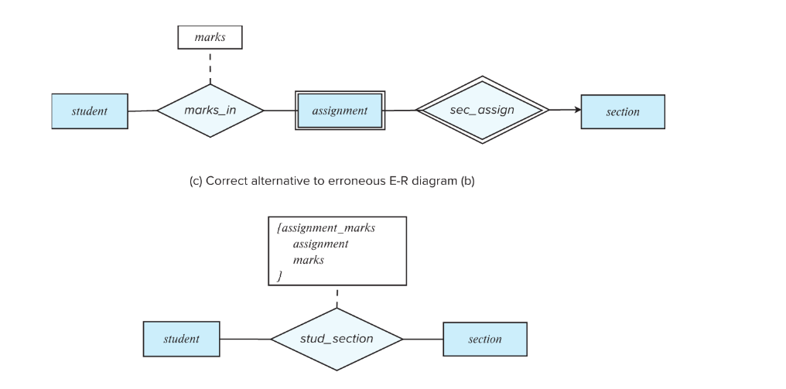

### Use of entity sets vs. attributes
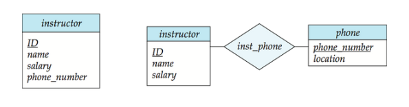

- 在上图的第一种方法中，明确一个 instructor 放一个电话号码
- 第二种方法，电话号码可以附属更多属性，一个电话号码可以多人共享。（例如办公室的公用电话）

### Use of entity sets vs. relationship sets
可能的一个指导方针是：我们指定一个关系集来描述实体之间发生的动作、

这样可以便于实体与其他实体之间建立联系，例如下图

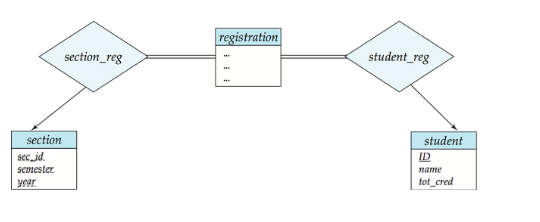

### Placement of realtionship attributes
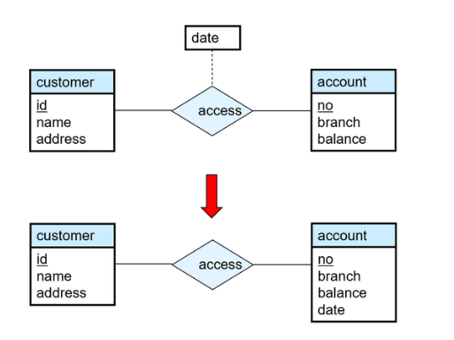

- 第一种方法，可以记录每次访问的访问日期。
- 第二种方法，只能记录用户最近一次访问日期，不完整。

### Binary vs. Non-Binary Relationships
- 虽然可以用任何非二元关系集可以由多个不同的二元关系集组成，但是 n 元关系集可以更清楚地显示多个实体参与单个关系
- 但是在实现时，通常会将 n 元关系集简化地转换为多个二元关系集。

!!! info "Converting Non-Binary Realtionships"
    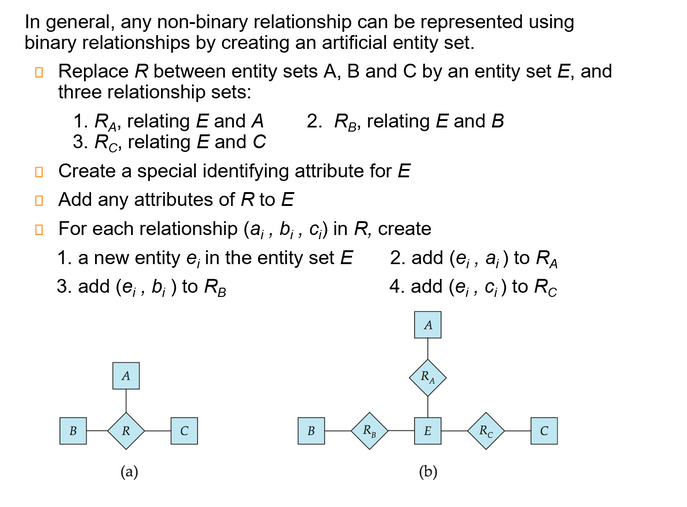

!!! info "总结: E-R Design Decisions"
    - The use of an attribute or entity set to represent an object.
    - Whether a real-world concept is best expressed by an entity set or a relationship set.
    - The use of a ternary（三元） relationship or binary relationships.
    - The use of a strong or weak entity set.

## Extended ER Features
- Specialization（特化）
    - Top-down design process: we designate subgroupings within an entity set that are distincitve from other entities in the set.
    - Attribute inheritance: a lower-level entity set inherits all the attributes and realtionship participation of the higer-level entity set to which it is linked.
    
    !!! Example "Specialization Example"
        <center>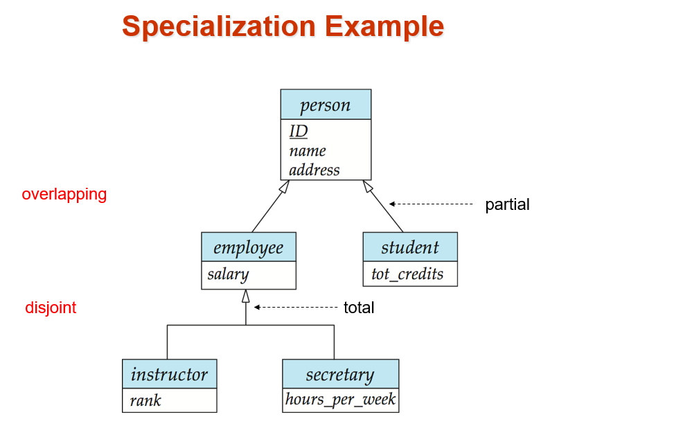{width=80%}</center>

- Generalizaiton（概化）
    - A bottom-up design process - combine a number of entity sets that share the same features into a higher-level entity set.